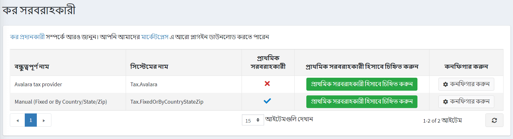
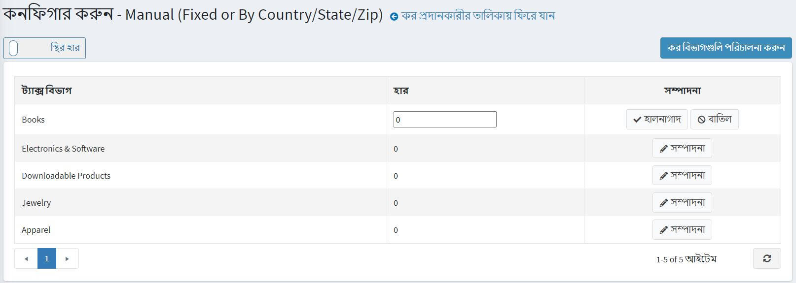
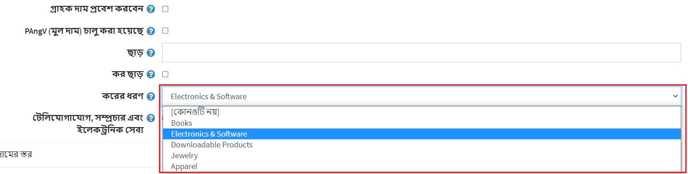
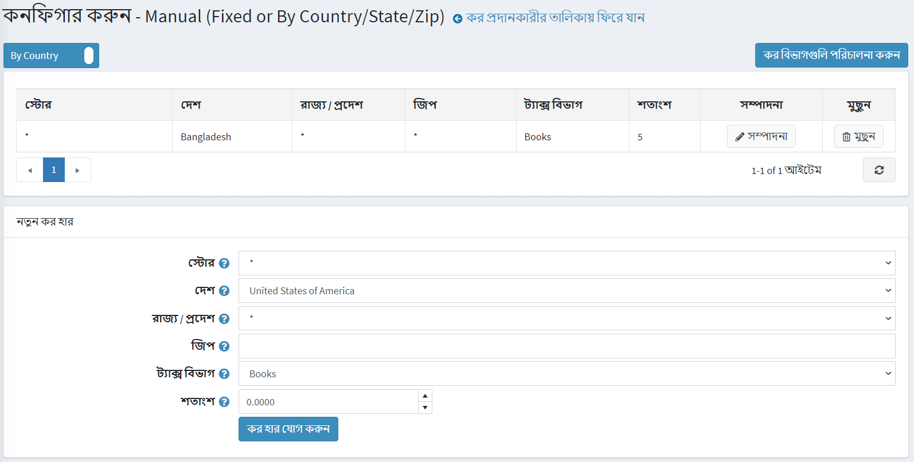
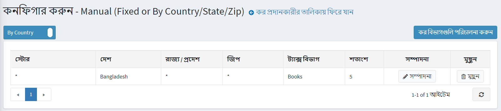
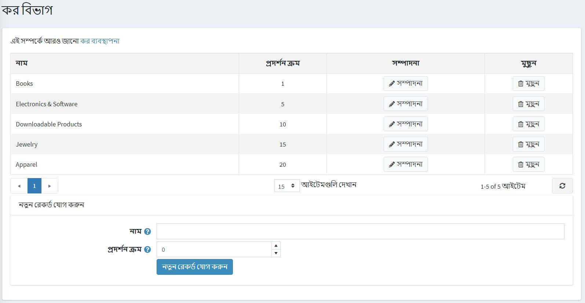

# ম্যানুয়াল (স্থির বা দেশ/রাজ্য/জিপ দ্বারা)

ম্যানুয়াল কনফিগার করতে (নির্দিষ্ট বা দেশ/রাজ্য/জিপ দ্বারা) কর প্রদানকারী যান **কনফিগারেশন → কর প্রদানকারী**।

**ম্যানুয়াল (নির্দিষ্ট বা দেশ/রাজ্য/জিপ দ্বারা)** প্রদানকারীর লাইনে **কনফিগার করুন** ক্লিক করুন
আপনি উপরের বাম দিকের উপযুক্ত বোতামে ক্লিক করে *স্থির হার* ট্যাক্স গণনা *দেশ/রাজ্য/জিপ* ট্যাক্স গণনায় পরিবর্তন করতে পারেন।
কর বিভাগগুলি পরিচালনা করতে উপরের ডানদিকে **কর বিভাগগুলি পরিচালনা করুন** বোতামে ক্লিক করুন।

## নির্ধারিত দাম

পৃষ্ঠার শীর্ষে সুইচার ব্যবহার করে **স্থির হার** কনফিগারেশন চয়ন করুন।

এই পৃষ্ঠায় আপনি প্রাক-তৈরি কর বিভাগগুলি দেখতে পারেন। প্রতিটি বিভাগের পাশে **সম্পাদনা করুন** ক্লিক করুন এবং শতাংশ হার লিখুন। তারপর **আপডেট** বাটনে ক্লিক করুন।

নিশ্চিত করুন যে আপনার পণ্যগুলি তাদের [পণ্যের পৃষ্ঠাগুলি](xref:bn/running-your-store/catalog/products/add-products) তে তাদের জন্য একটি কর শ্রেণী বরাদ্দ করেছে।

> [!NOTE]
>
> এই বিভাগ শুধুমাত্র প্রাক-তৈরি কর বিভাগ দেখায়। **কর বিভাগ সম্পাদনা করতে** ট্যাক্স বিভাগগুলি পরিচালনা করুন বা এখানে কর বিভাগগুলি কীভাবে পরিচালনা করবেন তা পড়ুন: [কর বিভাগগুলি কনফিগার করুন] (#configure-tax-categories)।

## দেশ অনুযায়ী

পৃষ্ঠার শীর্ষে সুইচার ব্যবহার করে **দেশ অনুযায়ী** কনফিগারেশন চয়ন করুন।

নতুন কর হার নির্ধারণ করুন, নিম্নরূপ:

* **স্টোর** নির্বাচন করুন যার জন্য হার নির্ধারণ করা হয়েছে। সব দোকানে এই হার প্রয়োগ করার জন্য একটি * নির্বাচন করুন।
* **দেশ** নির্বাচন করুন যার জন্য করের হার নির্ধারণ করা হয়েছে।
* **রাজ্য/প্রদেশ** নির্বাচন করুন যার জন্য করের হার নির্ধারণ করা হয়েছে। যদি একটি তারকাচিহ্ন (*) নির্বাচন করা হয়, এই করের হার রাজ্য নির্বিশেষে নির্বাচিত দেশের সকল গ্রাহকদের জন্য প্রযোজ্য হবে।
* একটি এলাকার **জিপ** কোড লিখুন যার জন্য করের হার নির্ধারণ করা হয়েছে। যদি এই ক্ষেত্রটি খালি থাকে, তাহলে এই কর হার নির্বাচিত দেশ বা রাজ্যের সমস্ত গ্রাহকদের জন্য প্রযোজ্য হবে, জিপ কোড নির্বিশেষে।
* করের হার প্রয়োগ করার জন্য **ট্যাক্স বিভাগ** নির্বাচন করুন।
* **পারসেন্টেজ** ফিল্ডে, প্রয়োজনীয় শতাংশ লিখুন।

**ট্যাক্স রেট যোগ করুন** ক্লিক করুন। নতুন কর হার নিম্নরূপ প্রদর্শিত হয়:

> [!NOTE]
>
> এই বিভাগ শুধুমাত্র প্রাক-তৈরি কর বিভাগ দেখায়। **কর বিভাগ সম্পাদনা করতে** ট্যাক্স বিভাগগুলি পরিচালনা করুন বা এখানে কর বিভাগগুলি কীভাবে পরিচালনা করবেন তা পড়ুন: [কর বিভাগগুলি কনফিগার করুন](#configure-tax-categories)।

## কর বিভাগগুলি কনফিগার করুন

কর বিভাগ নির্ধারণ করতে **কনফিগারেশন → ট্যাক্স বিভাগ** এ যান। *ট্যাক্স বিভাগ* উইন্ডো প্রদর্শিত হয়:

একটি নতুন ট্যাক্স ক্যাটাগরি যোগ করার জন্য, প্যানেলের নীচে এই ক্যাটাগরিটির **নাম** এবং **ডিসপ্লে অর্ডার** লিখুন। **ডিসপ্লে অর্ডার** ফিল্ডে, ১ এর মান তালিকার শীর্ষে প্রতিনিধিত্ব করে। তারপর নতুন কর বিভাগ সংরক্ষণ করতে **নতুন রেকর্ড যোগ করুন** ক্লিক করুন।
