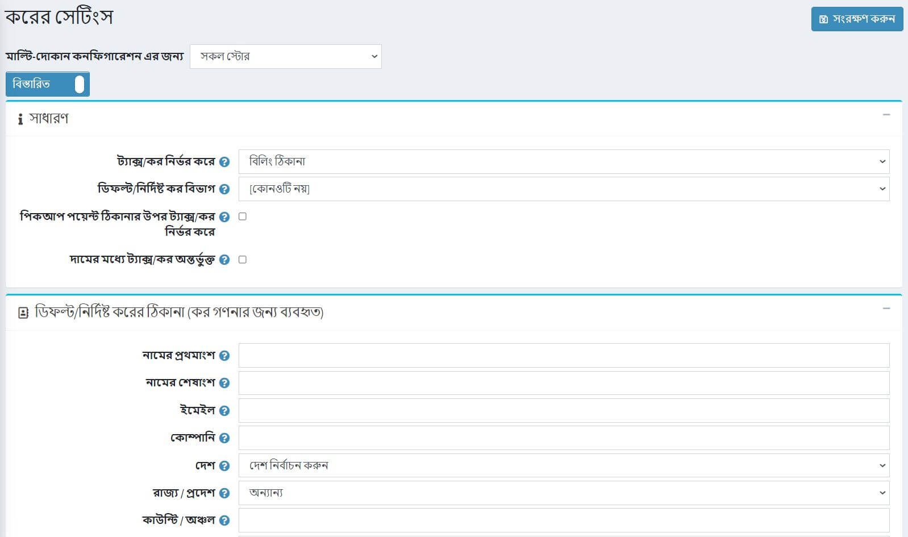

# ট্যাক্স সেটিংস

এই বিভাগটি আপনার স্টোর ট্যাক্স সেটিংস বর্ণনা করে, উদাহরণস্বরূপ, ট্যাক্স সহ বা বাদে মূল্য নির্ধারণ, ট্যাক্স ডিসপ্লে টাইপ এবং আরও অনেক কিছু নির্ধারণ করে।

আপনার ট্যাক্স সেটিংস পরিচালনা করতে, **কনফিগারেশন → সেটিংস → ট্যাক্স সেটিংস** এ যান।

প্রথমত **সাধারণ** ট্যাক্স সেটিংস সংজ্ঞায়িত করুন:

**ড্রপডাউন তালিকাভুক্ত** ট্যাক্স থেকে, প্রয়োজনীয় বিকল্পটি নির্বাচন করুন যার উপর কর ভিত্তিক, নিম্নরূপ:

* **বিলিং ঠিকানা** যখন এই বিকল্পটি নির্বাচন করা হয়, তখন গ্রাহকের বিলিং ঠিকানার উপর ভিত্তি করে কর নির্ধারণ করা হয়। যদি বিলিং ঠিকানাটি অজানা থাকে, ডিফল্ট ঠিকানা ব্যবহার করা হয় (নীচে প্রবেশ করা হয়েছে)।
* **প্রেরণের ঠিকানা**. যখন এই বিকল্পটি নির্বাচিত হয়, তখন কর গ্রাহকের শিপিং ঠিকানার উপর নির্ভর করে। যদি শিপিং ঠিকানা অজানা থাকে, ডিফল্ট ঠিকানা ব্যবহার করা হয় (নীচে প্রবেশ করা হয়েছে)।
* **ডিফল্ট ঠিকানা**. যখন এই বিকল্পটি নির্বাচন করা হয়, তখন করটি ডিফল্ট ঠিকানার উপর ভিত্তি করে দেওয়া হয় যা নীচে প্রবেশ করা হয়।
* পণ্যের জন্য **ডিফল্ট ট্যাক্স বিভাগ** বেছে নিন। এটি *নতুন পণ্য যোগ করুন* পৃষ্ঠায় আগে থেকে নির্বাচিত হবে।
* **পিকআপ পয়েন্ট ঠিকানার উপর ভিত্তি করে কর** চেকবক্স নির্ধারণ করে যে পিকআপ পয়েন্ট নির্বাচন করা হলে কর গণনার জন্য পিকআপ পয়েন্ট ঠিকানা ব্যবহার করা উচিত কিনা।
* টিক করুন **মূল্য অন্তর্ভুক্ত কর** চেকবক্স নির্দেশ করে প্রবেশকৃত দামে কর অন্তর্ভুক্ত কিনা।

তারপর **ডিফল্ট কর ঠিকানা (কর হিসাবের জন্য ব্যবহৃত)** সংজ্ঞায়িত করুন, নিম্নরূপ:

* **দেশ** নির্বাচন করুন।
* **রাজ্য/প্রদেশ** নির্বাচন করুন।
* **কাউন্টি/অঞ্চল** সংজ্ঞায়িত করুন।
* **শহর** সংজ্ঞায়িত করুন।
* **ঠিকানা ১** সংজ্ঞায়িত করুন।
* **জিপ/পোস্টাল কোড লিখুন**।

**ট্যাক্স প্রদর্শন** প্যানেলে আপনি সেট করতে পারেন কিভাবে গ্রাহকদের জন্য ট্যাক্স প্রদর্শিত হবে:

* গ্রাহকদের ট্যাক্স ডিসপ্লে টাইপ নির্বাচন করার অনুমতি আছে কিনা তা নির্দেশ করতে **গ্রাহকদের ট্যাক্স ডিসপ্লে টাইপ** চেকবক্স নির্বাচন করতে দিন।
* **ট্যাক্স ডিসপ্লে টাইপ** ড্রপডাউন তালিকাটি আনকিক করা হলে:
* **কর বাদে**: কর বাদে প্রয়োগ করতে নির্বাচন করুন।
* **কর সহ**: কর সহ প্রয়োগ করার জন্য নির্বাচন করুন।
* ট্যাক্স প্রত্যয় প্রদর্শন সহ **ডিসপ্লে ট্যাক্স প্রত্যয়** চেকবক্সে টিক দিন (কর -বাদে কর)।
* শপিং কার্ট পৃষ্ঠায় একটি পৃথক লাইনে সমস্ত প্রযোজ্য করের হার প্রদর্শনের জন্য **সমস্ত প্রযোজ্য করের হার** চেকবক্সে টিক দিন।
* অর্ডার সারসংক্ষেপে শূন্য কর মান লুকানোর জন্য **হাইড জিরো ট্যাক্স** চেকবক্সে টিক দিন।
* **অর্ডার সারাংশে কর লুকান** চেকবক্সে টিক চিহ্ন দিন, যখন মূল্যগুলি কর সহ অন্তর্ভুক্ত দেখানো হয় তখন অর্ডারের সারাংশে করের মূল্য লুকান।
* অর্ডার সাবটোটাল **চেকবক্স থেকে** কর বর্জনকে জোর করুন, সর্বদা অর্ডার সাবটোটাল থেকে কর বাদ দিতে (নির্বাচিত ট্যাক্স ডিসপ্লে টাইপের সাথে অপ্রাসঙ্গিক)। এই চেকবক্স শুধুমাত্র সেই পৃষ্ঠাগুলিকেই প্রভাবিত করে যেখানে অর্ডার টোটাল প্রদর্শিত হয়।

* *শিপিং* প্যানেলে, **শিপিং করযোগ্য** চেকবক্সে টিক দিন যাতে বোঝা যায় যে শিপিং করযোগ্য। নিম্নলিখিত ক্ষেত্রগুলি প্রদর্শিত হয়:
* **শিপিং মূল্যে কর অন্তর্ভুক্ত**: শিপিং মূল্যে কর অন্তর্ভুক্ত রয়েছে তা নির্দেশ করতে নির্বাচন করুন।
* **শিপিং ট্যাক্স ক্যাটাগরি**: শিপিং ট্যাক্স গণনার জন্য ব্যবহৃত প্রয়োজনীয় ট্যাক্স ক্যাটাগরি নির্বাচন করুন।

* পেমেন্ট*প্যানেলে টিক দিন **পেমেন্ট পদ্ধতি অতিরিক্ত ফি করযোগ্য** চেকবক্স পেমেন্ট পদ্ধতি নির্দেশ করতে অতিরিক্ত ফি করযোগ্য। নিম্নলিখিত বিকল্পগুলি প্রদর্শিত হয়:
* **পেমেন্ট পদ্ধতি অতিরিক্ত ফি ট্যাক্স অন্তর্ভুক্ত**: নির্দেশ করুন যে পেমেন্ট পদ্ধতি অতিরিক্ত ফি করযোগ্য।
* **পেমেন্ট পদ্ধতি অতিরিক্ত ফি ট্যাক্স বিভাগ**: ড্রপডাউন তালিকা থেকে, পেমেন্ট পদ্ধতির অতিরিক্ত ফি কর গণনার জন্য প্রয়োজনীয় কর বিভাগ নির্বাচন করুন।

তারপর *ভ্যাট* প্যানেলে ভ্যাট সেট করুন:

* **ইইউ ভ্যাট সক্ষম** চেকবক্সে টিক দিন, ইঙ্গিত করতে যে ইউরোপীয় ইউনিয়ন মূল্য সংযোজন কর সক্ষম। এই বিকল্পটি নির্বাচিত হলে, গ্রাহকদের নিবন্ধনের সময় *গ্রাহক অ্যাকাউন্টের বিবরণ পৃষ্ঠায়* *কোম্পানি ভ্যাট নম্বর* অনুরোধ করা হবে। এই ভ্যাট নম্বরটি একটি ওয়েব পরিষেবার মাধ্যমে স্বয়ংক্রিয়ভাবে যাচাই করা যেতে পারে, যদি **ব্যবহার করুন ওয়েব পরিষেবা** চেকবক্সটি টিক দেওয়া হয়, অথবা স্টোর মালিক কর্তৃক প্রশাসনিক এলাকায় গ্রাহকের বিবরণ পৃষ্ঠায় ম্যানুয়ালি।
* **আপনার দোকানের দেশ**: ড্রপডাউন তালিকা থেকে, আপনার দোকান যেখানে অবস্থিত সেই দেশটি নির্বাচন করুন।
* *মূসক অব্যাহতির অনুমতি দিন** যোগ্য ভ্যাট নিবন্ধিত গ্রাহকদের ভ্যাট থেকে অব্যাহতি দিতে এই চেকবক্সটিতে টিক দিন।
* **ভ্যাট সর্বদা বৈধ অনুমান করুন**: ভ্যাট বৈধতা এড়াতে এই চেকবক্সটিতে টিক দিন। প্রবেশ করা ভ্যাট নম্বর সর্বদা বৈধ থাকবে। বর্তমান ভ্যাট নম্বর প্রদান করা ক্লায়েন্টের দায়িত্ব।
* **ওয়েব পরিষেবা ব্যবহার করুন:** ভ্যাট নম্বর যাচাই করতে ওয়েব পরিষেবাটি ব্যবহার করতে এই চেকবক্সটিতে টিক দিন।
* **নতুন ভ্যাট নম্বর জমা দিলে অ্যাডমিনকে অবহিত করুন**: একটি নতুন ভ্যাট নম্বর জমা দিলে ইমেলের মাধ্যমে বিজ্ঞপ্তি পেতে এই চেকবক্সটিতে টিক দিন।

> [!NOTE]
>
> যদি ভ্যাট চালু থাকে, তাহলে এটি ইউরোপীয় ইউনিয়নের বাইরে শিপিংয়ের জন্য ০% কর এবং ০% যারা তাদের বৈধ এবং অনুমোদিত ভ্যাট নম্বর সরবরাহ করেছে এবং ইইউ -এর মধ্যে কিন্তু দোকানের দেশের বাইরে শিপিং করছে তাদের জন্য ০% কর ধার্য করে। ইইউ ভ্যাট সম্পর্কে আরও তথ্যের জন্য একটি নিবন্ধ পড়ুন।
> [!TIP]
>
> ইইউ ভ্যাট কিভাবে সেট করবেন তা এখানে পড়ুন: [ইইউ ভ্যাট কনফিগারেশন গাইড](xref:bn/getting-start/configure-tax/index#eu-vat-configuration-guide)।

**সেভ** ক্লিক করুন।

## টিউটোরিয়াল

* [ট্যাক্স সেটিংস ম্যানেজ করা](https://www.youtube.com/watch?v=8iF5nQvIoLs&feature=youtu.be)
