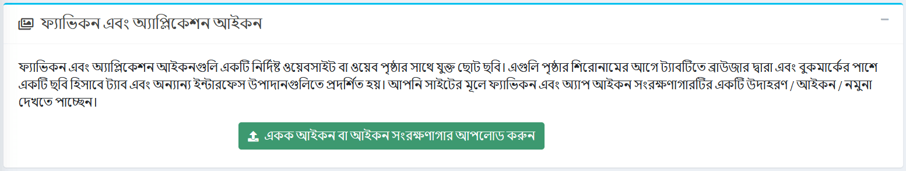
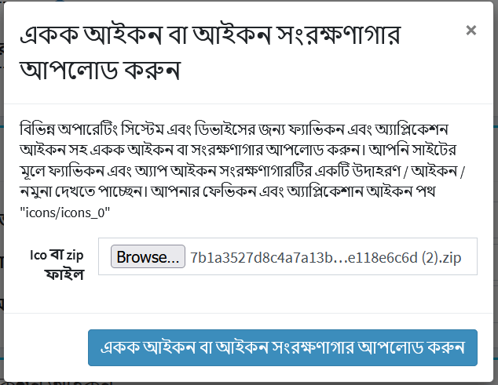
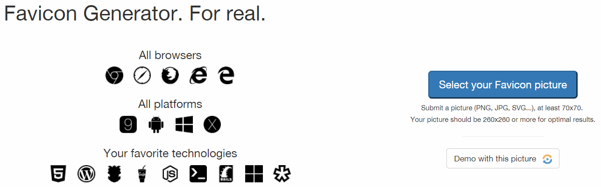
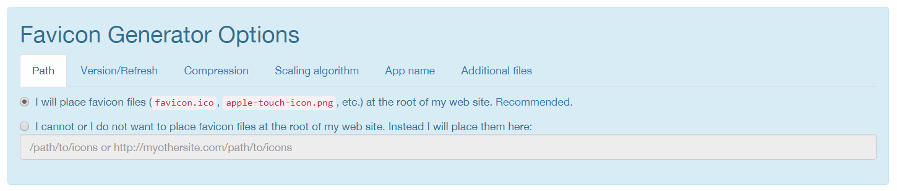
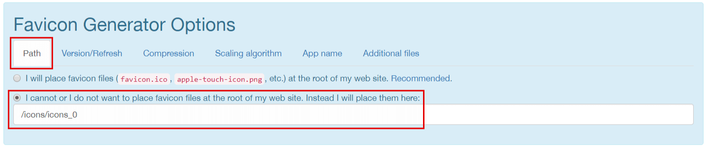
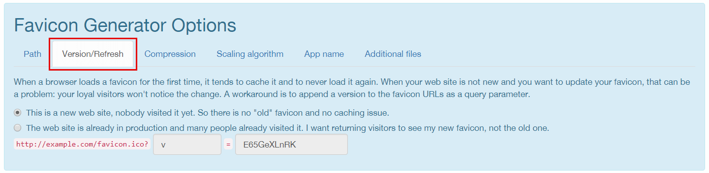
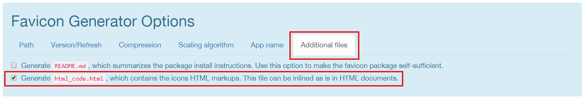
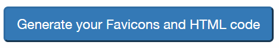
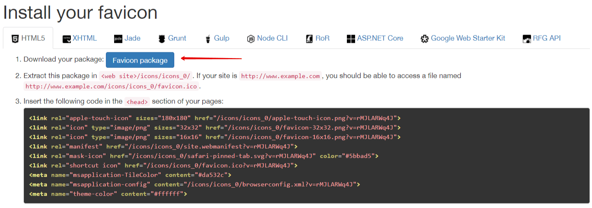
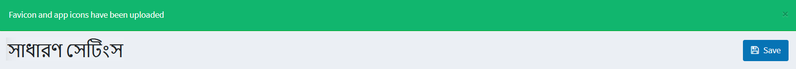

---
title: একটি ফেভিকন যোগ করুন
uid: bn/getting-started/design-your-store/adding-a-favicon
author: git.RomanovM
contributors: git.AfiaKhanom
---

# ফেভিকন আপলোড করা

সংস্করণ ৪.২০ থেকে আপনি স্বয়ংক্রিয়ভাবে অ্যাডমিন এলাকার মাধ্যমে ফেভিকন আপলোড করতে পারেন।

> [!NOTE]
> 
> মাল্টিস্টোর ক্ষেত্রে আপনাকে প্রতিটি দোকানের জন্য এই আপলোড পদ্ধতি পুনরাবৃত্তি করতে হবে।

১. ফেভিকন আপলোড করতে **কনফিগারেশন → সেটিংস → সাধারণ সেটিংস** এ যান।  ফেভিকন এবং অ্যাপ *আইকন* প্যানেল প্রদর্শিত হয়:

২. সবুজ বোতামে ক্লিক করুন **একক আইকন বা আইকন সংরক্ষণাগার আপলোড করুন**, ফাইল নির্বাচন ডায়ালগ খোলা হবে:  এখানে আপনাকে আপনার আইকনগুলির পথটি অনুলিপি করতে হবে (এটি স্টোর এবং ভার্চুয়াল ডিরেক্টরির উপর নির্ভর করে পরিবর্তিত হয়)। উদাহরণ স্বরূপ: `/icons/icons_0`।

৩. বিভিন্ন ডিভাইসের জন্য আপনার সাইট ফেভিকন কতটা বন্ধুত্বপূর্ণ হওয়া উচিত তার উপর নির্ভর করে কি আপলোড করতে হবে তার জন্য বেশ কয়েকটি বিকল্প রয়েছে:

   - সবচেয়ে সম্পূর্ণ বিকল্প হল ফেভিকন জেনারেটর ব্যবহার করা। এই ম্যানুয়ালটিতে, আমরা ব্যবহারের একটি উদাহরণ দেখাব [RealFaviconGenerator](https://realfavicongenerator.net/)। এই পরিষেবাটির জন্য ধন্যবাদ, সম্পূর্ণ ফেভিকন প্যাকেজ আপলোড করা কয়েক ক্লিকে সম্পন্ন করা হবে।

      * এই জেনারেটরের প্রধান পৃষ্ঠায় যান যেখানে আপনাকে ফেভিকনের জন্য একটি ছবি চয়ন করার জন্য আমন্ত্রণ জানানো হবে
      

      * একটি ছবি নির্বাচন করে এবং **এই ছবি দিয়ে চালিয়ে যান** ক্লিক করার পর, আপনাকে পরবর্তী পৃষ্ঠায় পুননির্দেশিত করা হবে। এখানে আপনি নির্দিষ্ট ডিভাইস এবং অ্যাপ্লিকেশনের জন্য ফেভিকনের ডিসপ্লে সেটিংস সামঞ্জস্য করতে পারেন - iOS ওয়েব ক্লিপ, অ্যান্ড্রয়েড ক্রোম, উইন্ডোজ মেট্রো, ম্যাকোস সাফারি ইত্যাদি। পরিষেবাটি স্বয়ংক্রিয়ভাবে প্রদর্শনের উদাহরণ দেখাবে। আপনি সেগুলি আপনার প্রয়োজন অনুসারে কাস্টমাইজ করতে পারেন বা ডিফল্টগুলি ছেড়ে দিতে পারেন।

      * একই পৃষ্ঠার নীচে আপনি **ফেভিকন জেনারেটর বিকল্প** প্যানেল খুঁজে পেতে পারেন।
      

         - এই বিভাগে, আপনাকে অবশ্যই নির্দিষ্ট সেটিংস সেট করতে হবে। **পথ** ট্যাবে, 'আমি পারি না বা আমি আমার ওয়েব সাইটের মূলে ফেভিকন ফাইল স্থাপন করতে চাই না' বিকল্পটি নির্বাচন করুন। পরিবর্তে আমি তাদের এখানে রাখব এবং ধাপ 2 থেকে পথটি নির্দিষ্ট করব। 

         - **সংস্করণ/রিফ্রেশ** ট্যাবে, আপনার সাইট ইতিমধ্যে উৎপাদনে আছে কিনা তার উপর নির্ভর করে বিকল্পটি নির্বাচন করুন। সেটিং বিবরণ আপনাকে এটিতে সাহায্য করবে। 

         - **অতিরিক্ত ফাইল** ট্যাবে প্যাকেজে একটি এইচটিএমএল ফাইল তৈরি করার বিকল্পটি পরীক্ষা করা প্রয়োজন। 

      * এখন সমস্ত সেটিংস সেট করা হয়েছে, জেনারেট করতে বোতামে ক্লিক করুন। 

      * আপনার ফেভিকন প্যাকেজ পান। 

   - সবচেয়ে সহজ বিকল্প হল শুধুমাত্র **favicon.ico** ফাইলটি ব্যবহার করা, যেটি বিভিন্ন সাইটে বিভিন্ন স্ক্রিন রেজোলিউশনের ডিভাইস উপস্থিত না হওয়া পর্যন্ত দীর্ঘদিন ধরে সফলভাবে ব্যবহার করা হয়েছে।

      * একটি নমুনা ফেভিকন প্যাকেজ খুঁজুন যা `wwwroot/icons/sample/` ডিরেক্টরিতে অবস্থিত এবং এটি অনুলিপি করুন।

      * নতুন প্যাকেজে **favicon.ico** এবং **html_code.html** বাদে সব ফাইল মুছে দিন।

      * এই প্যাকেজে আপনার নতুন ফেভিকন দিয়ে **favicon.ico** ফাইলটি প্রতিস্থাপন করুন।

      * **html_code.html** ফাইল সম্পাদনা করুন। সেখানে শুধু একটি লাইন ছেড়ে দিন: `<link rel =" shortcut icon "href ="/icons/icons_0/favicon.ico ">`, ধরে নিচ্ছি যে `/icons/icons_0` ধাপ 2 থেকে পথ।

      * এই দুটি ফাইল একটি প্যাকেজে সংরক্ষণ করুন। আপনার ফেভিকন প্যাকেজ প্রস্তুত।

   - একটি মধ্যবর্তী বিকল্প একটি জেনারেটর ছাড়া সম্পূর্ণ ফেভিকন প্যাকেজ ব্যবহার করা হয়।

      ১. একটি নমুনা ফেভিকন প্যাকেজ খুঁজুন যা `wwwroot/icons/sample/` ডিরেক্টরিতে অবস্থিত এবং এটি অনুলিপি করুন।

      ২. নতুন প্যাকেজে আপনার নিজের ছবিগুলি মূল আকারগুলি বিবেচনা করে প্রতিস্থাপন করুন।

      ৩. ফাইলটি সম্পাদনা **html_code.html** করুন, `/icons/icons_0` এর সমস্ত এন্ট্রিগুলি ২য় ধাপে সংরক্ষিত পথের সাথে প্রতিস্থাপন করুন।

      ৪. এই প্যাকেজটি সংরক্ষণ করুন। আপনার ফেভিকন প্যাকেজ প্রস্তুত।

৪. আপলোড করার জন্য প্রস্তুত ফ্যাভিকন প্যাকেজ সহ প্রশাসক এলাকায় ফিরে আসুন। পছন্দসই ফাইল নির্বাচন করুন এবং **আপলোড আইকন আর্কাইভ** ক্লিক করুন। 

৫. আপনার প্যাকেজ সফলভাবে আপলোড করা হয়েছে তা নিশ্চিত করুন। 

৬. সাইটে নতুন ফেভিকন দেখতে আপনার অ্যাডমিন এলাকায় এবং ব্রাউজারে ক্যাশে সাফ করা উচিত তারপর পৃষ্ঠাটি পুনরায় লোড করুন।

> [!TIP]
> 
> একটি ফেভিকন প্যাকেজ তৈরি করতে, আপনি যেকোনো জেনারেটর, তৃতীয় পক্ষের পরিষেবা ব্যবহার করতে পারেন, অথবা নিজে নিজে করতে পারেন। একমাত্র প্রয়োজনীয়তা হল এইচটিএমএল কোড সহ **html_code.html** ফাইলের অস্তিত্ব, যা সাইট পৃষ্ঠার `<head>` উপাদানটিতে স্থাপন করা হবে।
