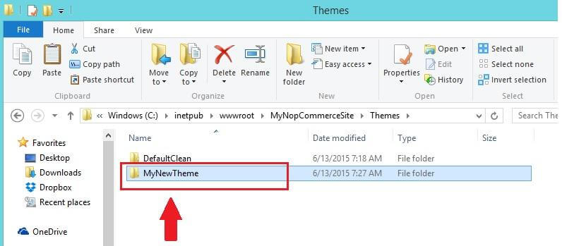
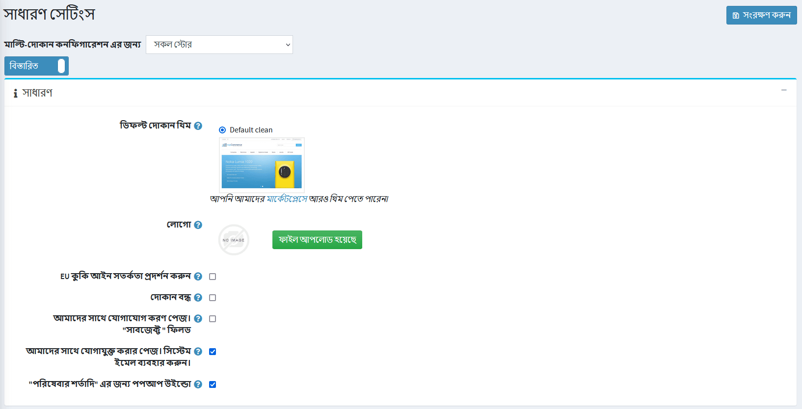

# একটি থিম নির্বাচন করুন এবং ইনস্টল করুন

একটি জিপ ফাইলে থাকা একটি নতুন থিম ডাউনলোড করার পরে, আপনার জিপ ফাইলের বিষয়বস্তুগুলি বের করুন এবং এটি নীচের ছবিতে দেখানো মত **থিমস** ফোল্ডারে অনুলিপি করুন:

১. **অ্যাডমিন প্যানেল → কনফিগারেশন → সেটিংস → সাধারণ সেটিংস** এ যান।

    

২. **ডিফল্ট স্টোর থিম** ফিল্ডে আপনার নতুন থিম নির্বাচন করুন এবং **সংরক্ষণ করুন** ক্লিক করুন।

৩. পাবলিক স্টোরে যান। আপনি আপনার দোকানে প্রয়োগ করা নতুন থিম দেখতে সক্ষম হওয়া উচিত।
