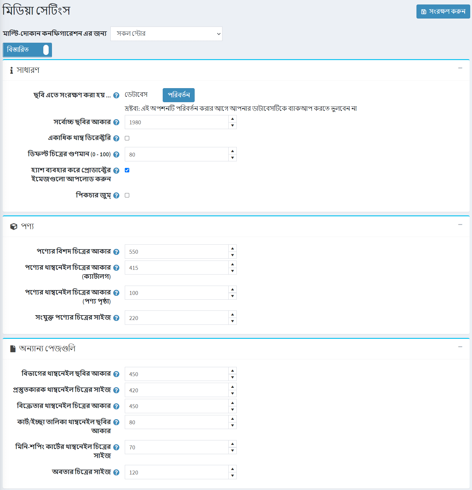

# মিডিয়া সেটিংস

এই বিভাগটি বর্ণনা করে কিভাবে আপনার দোকানের মিডিয়া বিবরণ সেট করা যায়। এর মধ্যে রয়েছে প্রোডাক্ট, রূপ এবং অবতার ছবির মাপ এবং আরও অনেক কিছু নির্ধারণ করা।

মিডিয়া সেটিংস সংজ্ঞায়িত করতে **কনফিগারেশন → সেটিংস → মিডিয়া সেটিংস** এ যান। *মিডিয়া সেটিংস* উইন্ডো প্রদর্শিত হয়:

*সাধারণ* প্যানেলে সেটিংস সংজ্ঞায়িত করুন, নিম্নরূপ:
- উপরের **পরিবর্তন** বাটনে ক্লিক করুন **ছবিগুলো ডাটাবেস বা ফাইল সিস্টেমের মধ্যে বেছে নিতে** অপশনে সংরক্ষণ করা হয়।

  > [!NOTE]
  > 
  > **পরিবর্তন** বাটনে ক্লিক করার আগে ডাটাবেসের ব্যাকআপ করার পরামর্শ দেওয়া হচ্ছে।

- **সর্বোচ্চ ছবির আকার** ফিল্ডে, ইমেজ আপলোডের জন্য অনুমোদিত সর্বাধিক ইমেজ সাইজ (অর্থাত্ দীর্ঘতম দিক) লিখুন (পিক্সেলে)।
- একাধিক থাম্ব ডাইরেক্টরি থাকতে **একাধিক থাম্ব ডিরেক্টরি** টিক করুন। এটি দরকারী যখন আপনার হোস্টিং কোম্পানির প্রতি ডিরেক্টরি ফাইলের পরিমাণ সীমাবদ্ধতা আছে।
- **ডিফল্ট চিত্রের গুণমান (0 - 100)** আপলোড করা ছবির কোয়ালিটি লিখুন। একবার পরিবর্তিত হলে আপনাকে ম্যানুয়ালি মুছে ফেলতে হবে ইতিমধ্যেই উৎপন্ন সমস্ত থাম্বনেইল।
- আপলোড করা পণ্যের সাথে ছবি তুলনা করতে হ্যাশবাইট ব্যবহার করতে **হ্যাশ ব্যবহার করে প্রোডাক্টের ইমেজগুলো আপলোড করুন**। দয়া করে মনে রাখবেন যে এই কার্যকারিতা কিছু ডেটাবেস দ্বারা সমর্থিত নয়।
- পণ্যের বিবরণ পৃষ্ঠায় ছবি জুম সক্ষম করতে **ছবি জুম** টিক দিন।

*পণ্য* প্যানেলে সেটিংস সংজ্ঞায়িত করুন, নিম্নরূপ:
- **পণ্যের বিশদ চিত্রের আকার** ফিল্ডে, পিক্সেলে প্রোডাক্ট ডিটেইলস ইমেজের জন্য ডিফল্ট সাইজ লিখুন।
- **পণ্যের থাম্বনেইল চিত্রের আকার (ক্যাটালগ)** ফিল্ডে, পিক্সেলে ক্যাটাগরি বা ম্যানুফ্যাকচারার পেজে প্রদর্শিত প্রোডাক্ট থাম্বনেইল ইমেজের জন্য ডিফল্ট সাইজ লিখুন।
- **পণ্যের থাম্বনেইল চিত্রের আকার (পণ্য পৃষ্ঠা)** ফিল্ডে, প্রোডাক্টের বিস্তারিত পৃষ্ঠায় প্রদর্শিত প্রোডাক্ট থাম্বনেইল ইমেজ (পিক্সেলে) এর জন্য ডিফল্ট সাইজ লিখুন (যখন আপনার একাধিক প্রোডাক্ট ইমেজ থাকে তখন ব্যবহার করা হয়)।
- **সংযুক্ত পণ্যের চিত্রের সাইজ** ফিল্ডে, সংশ্লিষ্ট প্রোডাক্ট ইমেজের পিক্সেলে ডিফল্ট সাইজ লিখুন। সংশ্লিষ্ট পণ্যগুলি গ্রুপযুক্ত পণ্যের অংশ।

*অন্যান্য পেজগুলি* প্যানেলে সেটিংস সংজ্ঞায়িত করে, নিম্নরূপ:
- **বিভাগের থাম্বনেইল ছবির আকার** ফিল্ডে, পিক্সেলের ক্যাটাগরির পেজে প্রোডাক্ট থাম্বনেইল ইমেজের জন্য ডিফল্ট সাইজ লিখুন।
- **প্রস্তুতকারক থাম্বনেইল চিত্রের সাইজ** ফিল্ডে, প্রোডাক্ট থাম্বনেইল ইমেজগুলির জন্য ডিফল্ট সাইজ পিক্সেলে প্রস্তুতকারক পৃষ্ঠায় লিখুন।
- **বিক্রেতার থাম্বনেইল চিত্রের আকার** ক্ষেত্রের মধ্যে, বিক্রেতার পৃষ্ঠায় পণ্যের থাম্বনেইল ছবির জন্য ডিফল্ট আকারটি পিক্সেলে প্রবেশ করান।
- **কার্ট/ইচ্ছা তালিকা থাম্বনেইল ছবির আকার** ফিল্ডে, শপিং কার্টে প্রোডাক্ট থাম্বনেইল ইমেজের জন্য ডিফল্ট সাইজ এবং পিক্সেলে উইশলিস্ট লিখুন।
- **মিনি-শপিং কার্টের থাম্বনেইল চিত্রের সাইজ** এর ক্ষেত্রে, মিনি-শপিং কার্ট ব্লকে প্রদর্শিত পণ্যের থাম্বনেইল ছবির ডিফল্ট আকার (পিক্সেলে) লিখুন।
- **অ্যাভাটার ইমেজ সাইজ ** ফিল্ডে, অ্যাভাটার ইমেজের জন্য ডিফল্ট সাইজ লিখুন।

এই পৃষ্ঠাটি **মাল্টি-দোকান কনফিগারেশন এর জন্য** সক্ষম করে, এর মানে হল যে একই সেটিংস সব স্টোরের জন্য সংজ্ঞায়িত করা যেতে পারে, অথবা স্টোর থেকে স্টোর থেকে আলাদা হতে পারে। আপনি যদি একটি নির্দিষ্ট দোকানের জন্য সেটিংস পরিচালনা করতে চান, তাহলে *মাল্টি-দোকান কনফিগারেশন এর জন্য ড্রপ-ডাউন* তালিকা থেকে তার নামটি চয়ন করুন এবং তাদের জন্য কাস্টম মান নির্ধারণ করতে বাম পাশে সমস্ত প্রয়োজনীয় চেকবক্সে টিক দিন।

## টিউটোরিয়াল

- [মিডিয়া সেটিংস পরিচালনা](https://www.youtube.com/watch?v=3JS4Zj4TBwQ)
