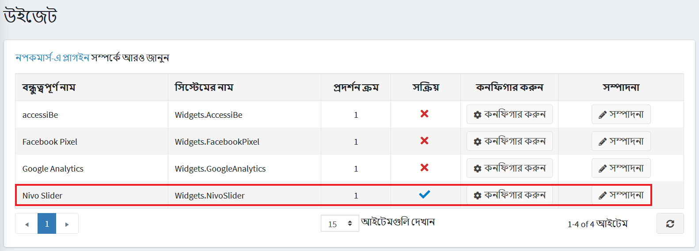
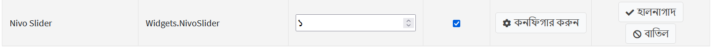
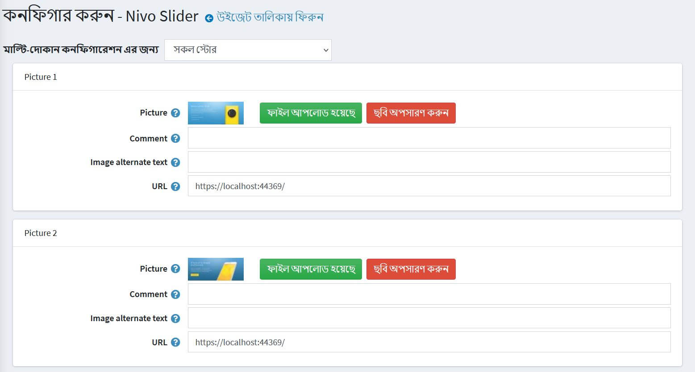
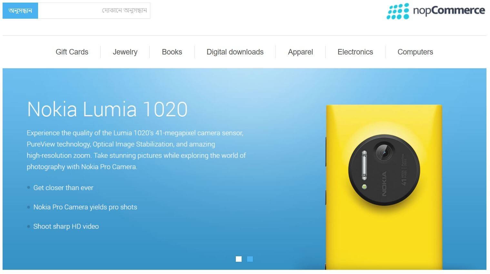

---
title: নিভো স্লাইডার
uid: bn/getting-started/design-your-store/nivo-slider
author: git.AndreiMaz
contributors: git.AfiaKhanom
---

# নিভো স্লাইডার প্লাগইন

নিভো স্লাইডার উইজেট প্লাগইন আপনাকে আপনার দোকানের হোমপেজে একটি স্লাইডার প্রদর্শন করতে দেয়।

## নিভো স্লাইডার প্লাগইন কনফিগার করুন

**কনফিগারেশন → উইজেটস** এ যান। *উইজেট* উইন্ডো প্রদর্শিত হয়:

নিভো স্লাইডার প্লাগইন এর পাশে **সম্পাদনা** এ ক্লিক করুন। উইন্ডোটি প্রসারিত করা হয়েছে, নিম্নরূপ:

প্লাগইনটি সক্ষম করতে **সক্রিয়** চেকবক্সে টিক দিন।

**কনফিগার** ক্লিক করুন। *কনফিগার - নিভো স্লাইডার* উইন্ডোটি নিম্নরূপ প্রদর্শিত হবে:

আপনি যে স্লাইডটি আপলোড করতে চান তার জন্য নিম্নলিখিতগুলি সম্পাদন করুন:

* **ছবি** ফিল্ডে, প্রয়োজনীয় ছবি আপলোড করতে **একটি ফাইল আপলোড করুন** ক্লিক করুন। বিদ্যমান ছবিটি সরানোর জন্য **ছবি সরান** ক্লিক করুন।
* **মন্তব্য** ক্ষেত্রের মধ্যে, ছবির জন্য একটি মন্তব্য লিখুন বা কোনও পাঠ্য প্রদর্শন না করার জন্য খালি ছেড়ে দিন।
* **ইমেজ অল্টারনেটিভ টেক্সট** ফিল্ডে, বিকল্প টেক্সট লিখুন যা ছবিতে যোগ করা হবে।
* **ইউআরএল** ফিল্ডে, প্রয়োজনীয় ইউআরএল লিখুন অথবা যদি আপনি ছবিটি ক্লিকযোগ্য করতে না চান তবে খালি রাখুন।

**সংরক্ষণ করুন** ক্লিক করুন।

এখন আপনি আপনার পাবলিক স্টোরের হোমপেজে এবং আপডেটেড ইমেজ স্লাইডারে যেতে পারেন:

