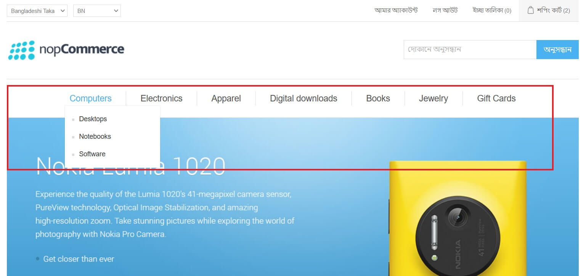
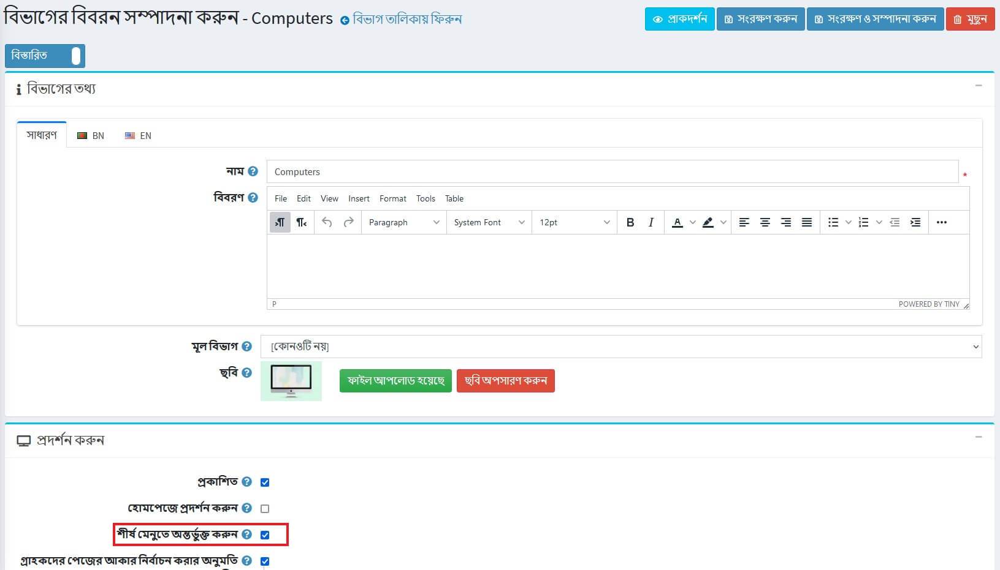
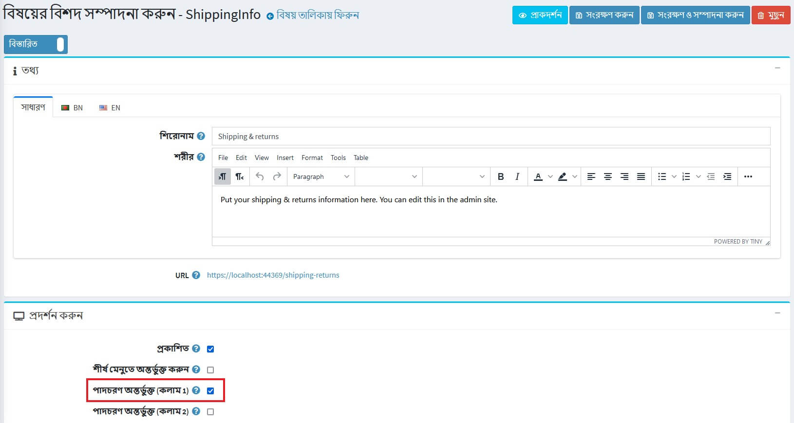
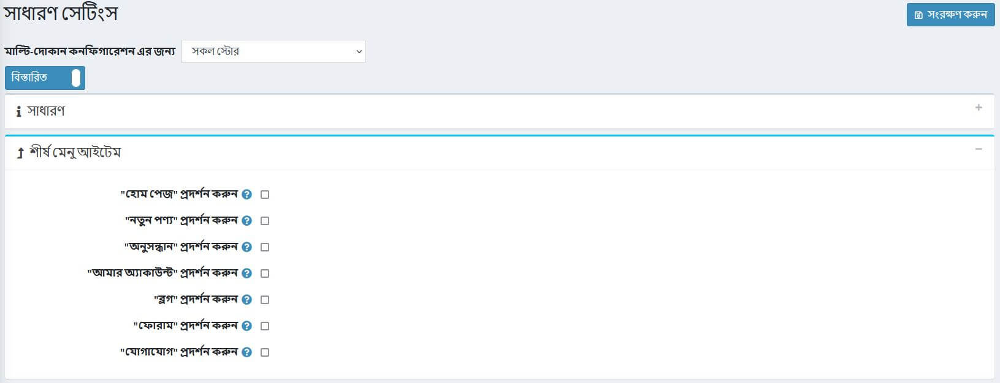
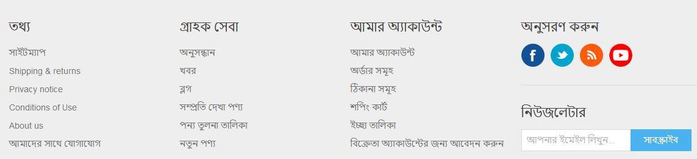
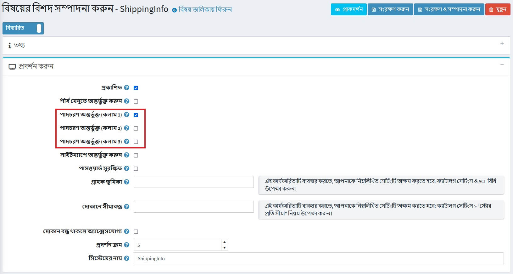
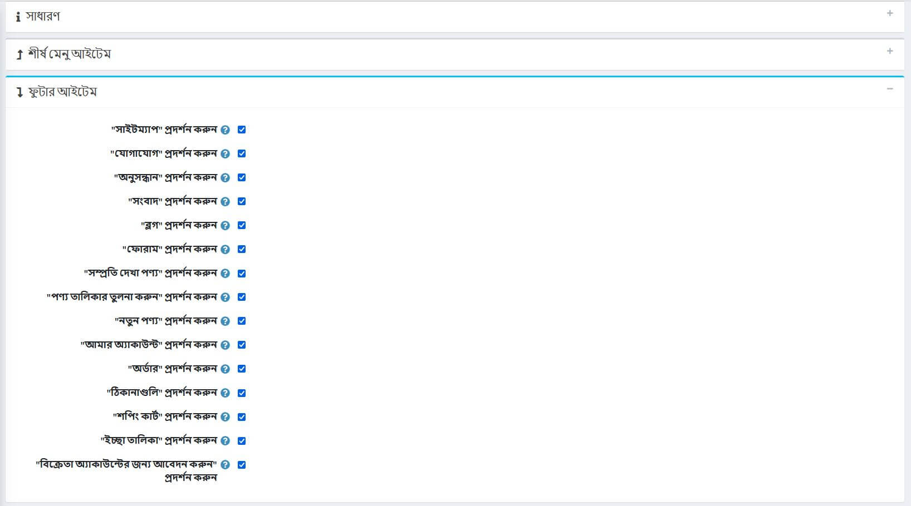
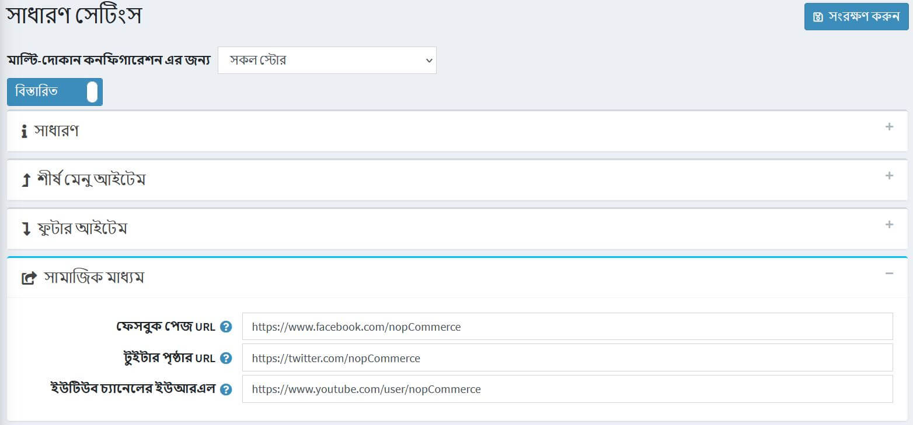
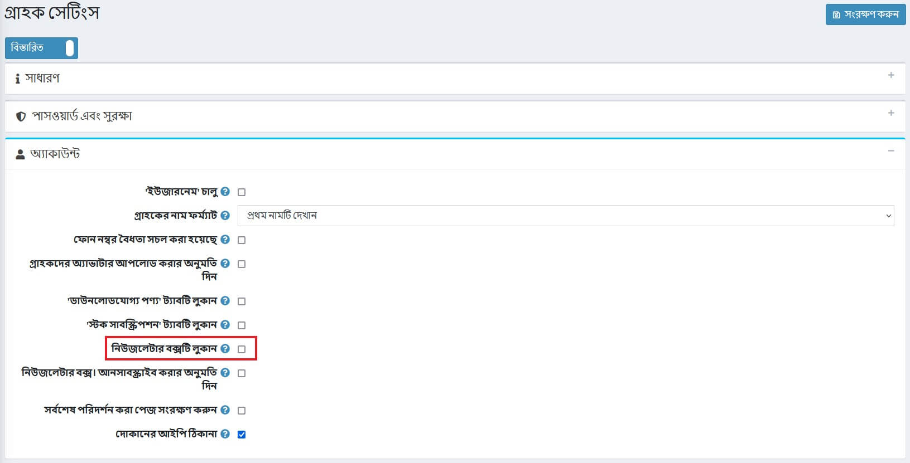

---
title: শীর্ষ মেনু এবং পাদলেখ
uid: bn/getting-started/design-your-store/top-menu-and-footer
author: git.AfiaKhanom
---

# শীর্ষ মেনু এবং পাদলেখ

নপকমার্সে আপনি কিভাবে উপরের মেনু এবং পাদলেখ প্রদর্শিত হবে তা চয়ন করতে পারেন। আপনি আরো গ্রাহকদের আকৃষ্ট করতে এবং শীর্ষস্থানীয় মেনুতে সবচেয়ে গুরুত্বপূর্ণ এবং আকর্ষণীয় লিঙ্কগুলি অন্তর্ভুক্ত করতে পারেন এবং আপনার ক্লায়েন্টদের প্রকৃত দোকানের তথ্য প্রদান করতে পাদলেখের পরিষেবা লিঙ্ক যোগ করতে পারেন।

## শীর্ষ মেনু

ডিফল্ট ক্লিন থিমের শীর্ষ মেনুটি নিম্নরূপ দেখায়:

আপনি দোকানের বিভাগগুলি প্রদর্শন করতে পারেন। অনুগ্রহ করে মনে রাখবেন, যদি আপনি শীর্ষ মেনুতে একটি বিভাগ প্রদর্শন করতে চান তবে আপনাকে বিভাগ সম্পাদনা পৃষ্ঠায় **শীর্ষ মেনুতে অন্তর্ভুক্ত** চেকবক্স টিক দেওয়া উচিত। আরো বিস্তারিত জানার জন্য, নীচে পড়ুন।

আপনি উপরের মেনুতে নিম্নলিখিত আইটেমগুলি অন্তর্ভুক্ত করতে পারেন:
- বিভাগ
- বিষয়সমূহ (পৃষ্ঠা)
- সাইট বিভাগের লিঙ্ক

এই আইটেমগুলির প্রতিটি কীভাবে যুক্ত করবেন তা নীচে দেখুন।

### বিভাগ

শীর্ষ মেনুতে একটি বিভাগ অন্তর্ভুক্ত করার জন্য, প্রশাসক এলাকায় বিভাগ সম্পাদনা পৃষ্ঠায় যান: **ক্যাটালগ → বিভাগ** নির্বাচন করুন। তারপর ক্যাটাগরির পাশে **সম্পাদনা** বাটনে ক্লিক করুন। *বিভাগের বিবরন সম্পাদনা করুন* উইন্ডো প্রদর্শিত হবে:

**শীর্ষ মেনুতে অন্তর্ভুক্ত** চেকবক্সে টিক দিন এবং **সংরক্ষণ** ক্লিক করুন।

> [!NOTE]
>
> যদি এই বিভাগটি একটি উপশ্রেণী হয়, তাহলে নিশ্চিত করুন যে তার মূল শ্রেণীতেও এই সম্পত্তি সক্ষম রয়েছে।

### বিষয়সমূহ (পৃষ্ঠা)

শীর্ষ মেনুতে একটি বিষয় অন্তর্ভুক্ত করার জন্য, প্রশাসক এলাকায় বিষয় সম্পাদনা পৃষ্ঠায় যান: **কনটেন্ট ম্যানেজমেন্ট  → বিষয়সমূহ (পৃষ্ঠা)** নির্বাচন করুন। তারপর টপিকের পাশে **সম্পাদনা** বাটনে ক্লিক করুন। *বিষয়ের বিশদ সম্পাদনা করুন* উইন্ডো প্রদর্শিত হবে:

**শীর্ষ মেনুতে অন্তর্ভুক্ত** চেকবক্সে টিক দিন এবং **সংরক্ষণ** ক্লিক করুন।

### সাইট বিভাগের লিঙ্ক

উপরের মেনুতে সাইটের কিছু অংশ অন্তর্ভুক্ত করতে, **কনফিগারেশন → সেটিংস → সাধারণ সেটিংস** এ যান। *শীর্ষ মেনু আইটেম* প্যানেলে এগিয়ে যান:

নিচের তালিকা থেকে আপনি উপরের মেনুতে যে আইটেমগুলি প্রদর্শন করতে চান তা চয়ন করুন:

* **"হোম পেজ" প্রদর্শন করুন**
* **"নতুন পণ্য" প্রদর্শন করুন**
* **"অনুসন্ধান" প্রদর্শন করুন**
* **"আমার অ্যাকাউন্ট" প্রদর্শন করুন**
* **"ব্লগ" প্রদর্শন করুন**
* **"ফোরাম" প্রদর্শন করুন**
* **"যোগাযোগ" প্রদর্শন করুন**

তারপর **সংরক্ষণ** ক্লিক করুন।

> [!NOTE]
>
> "নতুন পণ্য" মেনু আইটেমটি শুধুমাত্র তখনই প্রদর্শিত হবে যখন "নতুন পণ্য" পৃষ্ঠাটি **কনফিগারেশন → সেটিংস → ক্যাটালগ সেটিংস** পৃষ্ঠায় সক্ষম হবে (*অতিরিক্ত বিভাগ*প্যানেল)।

## পাদলেখ

ডিফল্ট ক্লিন থিমের মধ্যে পাদলেখটি নিম্নরূপ দেখায়:

ডিফল্টরূপে, এটি সাইট বিভাগের লিঙ্কগুলিকে তিনটি প্রকারের গ্রুপে দেখায়: *তথ্য, গ্রাহক সেবা, আমার অ্যাকাউন্ট*। আপনি প্রদর্শিত যে কোন লিঙ্ক অপসারণ করতে পারেন অথবা নতুন যোগ করতে পারেন।

আপনি পাদলেখনে নিম্নলিখিত আইটেমগুলি অন্তর্ভুক্ত করতে পারেন: 
- বিষয়সমূহ (পৃষ্ঠা)
- সাইট বিভাগের লিঙ্ক

এই আইটেমগুলির প্রতিটি কীভাবে যুক্ত করবেন তা নীচে দেখুন।

### বিষয়সমূহ (পৃষ্ঠা)

পাদলেখ মেনুতে একটি বিষয় অন্তর্ভুক্ত করার জন্য, প্রশাসক এলাকায় বিষয় সম্পাদনা পৃষ্ঠায় যান: **কনটেন্ট ম্যানেজমেন্ট  → বিষয়সমূহ (পৃষ্ঠা)** নির্বাচন করুন। তারপর টপিকের পাশে **সম্পাদনা** বাটনে ক্লিক করুন। *বিষয়ের বিশদ সম্পাদনা করুন* উইন্ডো প্রদর্শিত হবে:

আপনি যেখানে বিষয় লিংকটি প্রদর্শন করতে চান তা চয়ন করুন। আপনি এক বা একাধিক চেকবক্সে টিক দিতে পারেন:
* **পাদচরণ অন্তর্ভুক্ত (কলাম 1)**
* **পাদচরণ অন্তর্ভুক্ত (কলাম 2)**
* **পাদচরণ অন্তর্ভুক্ত (কলাম 3)**

উদাহরণস্বরূপ, যদি আপনি **পাদচরণ অন্তর্ভুক্ত (কালাম 1)** নির্বাচন করেন তবে লিঙ্কটি *তথ্য* কলামে প্রদর্শিত হবে।

তারপর **সংরক্ষণ** ক্লিক করুন।

### সাইট বিভাগের লিঙ্ক

উপরের মেনুতে সাইটের কিছু অংশ অন্তর্ভুক্ত করতে, **কনফিগারেশন → সেটিংস → সাধারণ সেটিংস** এ যান। *পাদলেখ আইটেম* প্যানেলে এগিয়ে যান:

নিচের তালিকা থেকে আপনি পাদলেখের মধ্যে যে আইটেমগুলি প্রদর্শন করতে চান তা চয়ন করুন:

* **"সাইটম্যাপ" প্রদর্শন করুন**
	> [!NOTE]
	>
	> "সাইটম্যাপ" মেনু আইটেমটি তখনই প্রদর্শিত হবে যখন **সাইটম্যাপ চালু** চেকবক্সটি **কনফিগারেশন → সেটিংস → সাধারণ সেটিংস** পৃষ্ঠায় (*সাইটম্যাপ*প্যানেল) টিক দেওয়া হবে।

* **"যোগাযোগ" প্রদর্শন করুন**
* **"অনুসন্ধান" প্রদর্শন করুন**
* **"সংবাদ" প্রদর্শন করুন**
* **"ব্লগ" প্রদর্শন করুন**
* **"ফোরাম" প্রদর্শন করুন"**
* **"সম্প্রতি দেখা পণ্য" প্রদর্শন করুন**
	> [!NOTE]
	>
	> "সম্প্রতি দেখা পণ্য" মেনু আইটেম শুধুমাত্র তখনই প্রদর্শিত হবে যখন **কনফিগারেশন → সেটিংস → ক্যাটালগ সেটিংস** পৃষ্ঠা (*অতিরিক্ত বিভাগ*প্যানেল) "সম্প্রতি দেখা পণ্য" পৃষ্ঠা সক্রিয় করা হবে।

* **"পণ্য তালিকার তুলনা করুন" প্রদর্শন করুন**
	> [!NOTE]
	>
	> "পণ্যগুলির তুলনা করুন" মেনু আইটেমটি তখনই প্রদর্শিত হবে যখন **কনফিগারেশন → সেটিংস → ক্যাটালগ সেটিংস** পৃষ্ঠায় "পণ্যগুলির তুলনা করুন"কার্যকারিতা সক্ষম হবে (*পণ্যগুলির তুলনা করুন*প্যানেল)।

* **"নতুন পণ্য" প্রদর্শন করুন**
	> [!NOTE]
	>
	> "নতুন পণ্য" মেনু আইটেমটি শুধুমাত্র তখনই প্রদর্শিত হবে যখন "নতুন পণ্য" পৃষ্ঠাটি **কনফিগারেশন → সেটিংস → ক্যাটালগ সেটিংস** পৃষ্ঠায় সক্ষম হবে (*অতিরিক্ত বিভাগ*প্যানেল)।

* **"আমার অ্যাকাউন্ট" প্রদর্শন করুন**
* **"অর্ডার" প্রদর্শন করুন**
* **"ঠিকানাগুলি" প্রদর্শন করুন**
* **"শপিং কার্ট" প্রদর্শন করুন**
	> [!NOTE]
	>
	> "শপিং কার্ট" মেনু আইটেম শুধুমাত্র একটি নির্দিষ্ট গ্রাহকের কাছে প্রদর্শিত হবে যখন "পাবলিক দোকান। শপিং কার্ট চালু করুন" অনুমতিটি গ্রাহকের ভূমিকার জন্য সক্ষম করা হবে। অনুমতিগুলি পরিচালনা করতে **কনফিগারেশন → অ্যাক্সেস নিয়ন্ত্রণ তালিকা** পৃষ্ঠায় যান। অথবা [অ্যাক্সেস কন্ট্রোল লিস্ট](xref:bn/running-your-store/customer-management/access-control-list) বিভাগে অনুমতি সম্পর্কে আরও পড়ুন।
 
* **"ইচ্ছা তালিকা" প্রদর্শন করুন"**
	> [!NOTE]
	>
	> "ইচ্ছা তালিকা" মেনু আইটেম শুধুমাত্র একটি নির্দিষ্ট গ্রাহকের কাছে প্রদর্শিত হবে যখন "পাবলিক দোকান। শইচ্ছা তালিকা চালু করুন" অনুমতিটি গ্রাহকের ভূমিকার জন্য সক্ষম করা হবে। অনুমতিগুলি পরিচালনা করতে **কনফিগারেশন → অ্যাক্সেস নিয়ন্ত্রণ তালিকা** পৃষ্ঠায় যান। অথবা [অ্যাক্সেস কন্ট্রোল লিস্ট](xref:bn/running-your-store/customer-management/access-control-list) বিভাগে অনুমতি সম্পর্কে আরও পড়ুন।

* **"বিক্রেতা অ্যাকাউন্টের জন্য আবেদন করুন" প্রদর্শন করুন**
	> [!NOTE]
	>
	> "বিক্রেতা অ্যাকাউন্টের জন্য আবেদন করুন" মেনু আইটেমটি তখনই প্রদর্শিত হবে যখন **গ্রাহকদের বিক্রেতা অ্যাকাউন্টের জন্য আবেদন করার অনুমতি দিন** চেকবক্স টিক দেওয়া হয় **কনফিগারেশন → সেটিংস → বিক্রেতা সেটিংস** পৃষ্ঠায় (*সাধারণ*প্যানেল)।

পরিবর্তনগুলি সংরক্ষণ করতে **সংরক্ষণ** ক্লিক করুন।

### আমাদের অনুসরণ করো

কাস্টমাইজ করতে **আমাদের অনুসরণ করুন** পাদলেখের ব্লক **কনফিগারেশন → সেটিংস → সাধারণ সেটিংস** এ যান। নিম্নরূপ *সামাজিক মিডিয়া* প্যানেলে এগিয়ে যান:

আপনার সামাজিক মিডিয়া লিঙ্কগুলি প্রবেশ করুন:

- **ফেসবুক পেজ ইউআরএল**
- **টুইটার পৃষ্ঠার ইউআরএল**
- **ইউটিউব চ্যানেলের ইউআরএল** 

আপনি যদি পাদলেখের মধ্যে আরএসএস লিঙ্কটি সক্ষম/নিষ্ক্রিয় করতে চান তাহলে আপনাকে **কনফিগারেশন → সেটিংস → নিউজ সেটিংস** পৃষ্ঠায় (*সাধারণ* প্যানেল) অনুসারে সংবাদ সক্ষম/অক্ষম করতে হবে।

### নিউজলেটার

নিউজলেটার ব্লক ডিফল্টরূপে পাদলেখ প্রদর্শিত হয়। এই ব্লকটি আড়াল করতে **কনফিগারেশন → সেটিংস → গ্রাহক সেটিংস** এ যান। *অ্যাকাউন্ট* প্যানেলে এগিয়ে যান এবং **নিউজলেটার বাক্স লুকান** চেকবক্স টিকুন, নিম্নরূপ

পরিবর্তনগুলি সংরক্ষণ করতে **সংরক্ষণ** ক্লিক করুন। ফুটার সেই অনুযায়ী আপডেট করা হবে।

### Powered by nopCommerce

নপকমার্স লাইসেন্সের শর্তাবলী অনুযায়ী, *কপিরাইট অপসারণ কী *না কিনে:

- আপনি নপকমার্স দ্বারা চালিত ওয়েবসাইটের মধ্যে প্রতিটি পৃষ্ঠার নীচে প্রদর্শিত "Powered by nopCommerce" বিবৃতিটি অপসারণ বা লুকিয়ে রাখতে পারবেন না
- যখন ব্যবহারকারীরা "Powered by nopCommerce" পাঠ্যে ক্লিক করেন তখন এটি তাদের অবশ্যই https://www.nopcommerce.com এ পাঠাতে হবে। "Powered by nopCommerce" লিঙ্কটি অবশ্যই একই ফর্ম্যাটে, অপ্রকাশিত, প্রোগ্রাম সোর্স কোডে বিতরণ করা হবে। এই বাধ্যবাধকতা কোন কপি বা ডেরিভেটিভ রচনার ক্ষেত্রেও প্রযোজ্য হবে!
- আপনার দোকান (ওয়েবসাইট) এর পাদলেখের কপিরাইট বিজ্ঞপ্তি অক্ষত, অপ্রশিক্ষিত এবং স্পষ্টভাবে দৃশ্যমান থাকতে হবে। অনুগ্রহ করে কপিরাইট নোটিশ সম্পাদনা, অপসারণ বা লুকানোর চেষ্টা করবেন না।

একটি "কপিরাইট অপসারণ কী" কেনার পরে আপনাকে "পাওয়ার্ড বাই নপকমার্স" বিবৃতিটি সরানোর অনুমতি দেওয়া হয়।
কপিরাইট লঙ্ঘন অবৈধ - দয়া করে পরামর্শ দিন।

আরও তথ্যের জন্য অনুগ্রহ করে দেখুন [নপকমার্স কপিরাইট অপসারণ কী](https://nopcommerce.com/nopcommerce-copyright-removal-key?utm_source=documentation&utm_medium=link&utm_campaign=powered_by_nopcommerce&utm_content=topmenu_footer) পৃষ্ঠা।