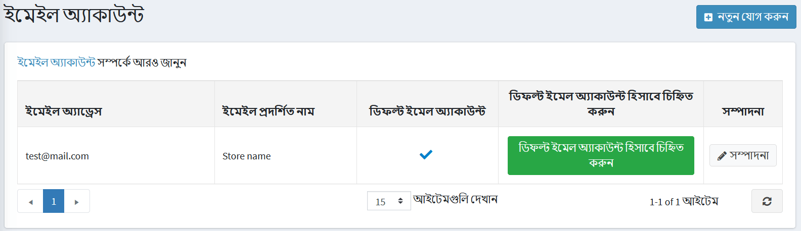
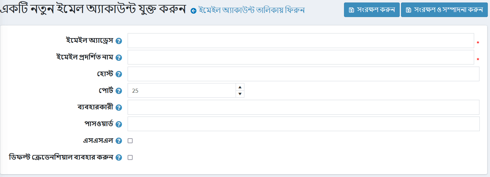
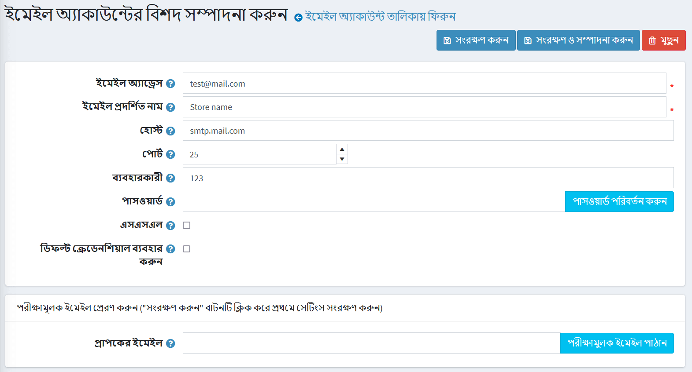

---
title:ইমেইল একাউন্ট
uid: bn/getting-started/email-accounts
author: git.AndreiMaz
contributors: git.AfiaKhanom
---

# ইমেইল একাউন্ট

এই অধ্যায়ে বর্ণনা করা হয়েছে কিভাবে আপনার দোকানের সাথে সম্পর্কিত ইমেইল অ্যাকাউন্ট সেট আপ করতে হয়: একটি সাধারণ যোগাযোগের ইমেইল, একটি বিক্রয় প্রতিনিধি ইমেল, একটি গ্রাহক সহায়তা ইমেল এবং আরও অনেক কিছু।

ইমেল অ্যাকাউন্ট পরিচালনা করতে, **কনফিগারেশন → ইমেইল একাউন্ট** এ যান। *ইমেইল একাউন্ট* উইন্ডোটি দোকানের মালিকের ইমেইল অ্যাকাউন্ট প্রদর্শন করে, যেমনটি নিচে দেখানো হয়েছে। ইমেইল অ্যাকাউন্টগুলি কনফিগার করার পর, দোকান মালিক বার্তা টেমপ্লেট বিবরণ পৃষ্ঠায় প্রয়োজনীয় ইমেল অ্যাকাউন্ট নির্বাচন করতে পারেন, যেমন [বার্তা টেমপ্লেট](xref:en/running-your-store/content-management/message-templates) অধ্যায়।

## একটি নতুন ইমেল অ্যাকাউন্ট যোগ করা

একটি নতুন ইমেইল অ্যাকাউন্ট যোগ করতে **নতুন যোগ করুন** ক্লিক করুন। *একটি নতুন ইমেল অ্যাকাউন্ট যোগ করা* উইন্ডো প্রদর্শিত হয়:

নিম্নলিখিত ইমেল অ্যাকাউন্ট তথ্য সংজ্ঞায়িত করুন:

* **ইমেল ঠিকানা** ক্ষেত্রের মধ্যে আপনার দোকানের সমস্ত বহির্গামী ইমেলের জন্য ইমেল ঠিকানা থেকে প্রবেশ করুন। উদাহরণ, `sales@yourstore.com`।
* **ইমেল ডিসপ্লে নাম** ফিল্ডে, আপনার দোকানের বহির্গামী ইমেলের জন্য প্রদর্শিত নাম লিখুন। উদাহরণ, "আপনার দোকান বিক্রয় বিভাগ"।
* **হোস্ট** ফিল্ডে, আপনার ইমেল সার্ভারের আইপি ঠিকানার হোস্ট নাম লিখুন।
* **পোর্ট** ফিল্ডে, আপনার ইমেইল সার্ভারের SMTP পোর্ট লিখুন।
* **ব্যবহারকারী** ক্ষেত্রে, আপনার ইমেল সার্ভারের ব্যবহারকারীর নাম লিখুন।
* **পাসওয়ার্ড** ফিল্ডে, আপনার ইমেইল সার্ভারের পাসওয়ার্ড লিখুন।
* এসএমটিপি সংযোগ এনক্রিপ্ট করার জন্য সিকিউরিটি সকেট লেয়ার ব্যবহার করতে **এসএসএল** চেকবক্স নির্বাচন করুন।
* সংযোগের জন্য ডিফল্ট শংসাপত্র ব্যবহার করতে **ডিফল্ট শংসাপত্র ব্যবহার করুন** চেকবক্স ব্যবহার করুন।

**সেভ** ক্লিক করুন। উইন্ডোটি প্রসারিত করা হয়েছে, নিম্নরূপ:

**ইমেল পাঠান** ফিল্ডে, পরীক্ষার ইমেইলের জন্য ইমেল ঠিকানা লিখুন এবং **পরীক্ষার ইমেইল পাঠান** ক্লিক করুন।
