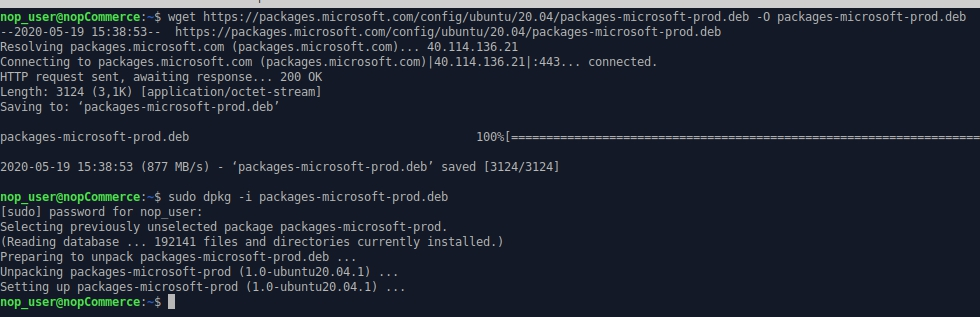
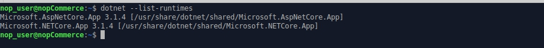
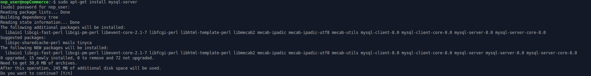
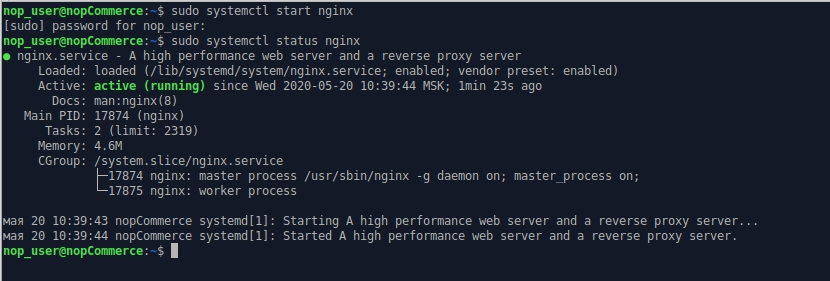
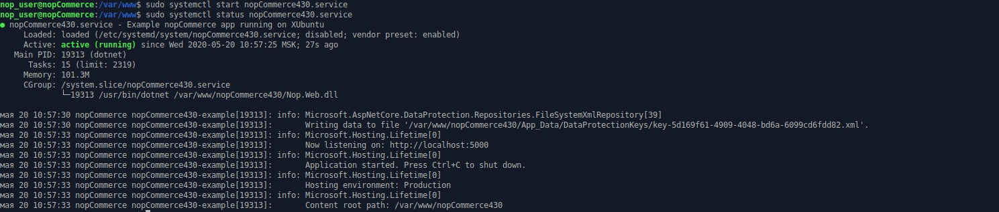

# লিনাক্সে ইনস্টল করা

এই অধ্যায় এক্সউবুন্টু ২০.০০ এর উদাহরণে লিনাক্স সিস্টেমে নপকমার্স সফটওয়্যার কিভাবে ইনস্টল করতে হয় তা বর্ণনা করে:

১. [সফ্টওয়্যার ইনস্টল এবং কনফিগার](#install-and-configure-software)

২. [নপকমার্স পান](#get-nopcommerce)

৩. [নপকমার্স ওয়েব পরিষেবা তৈরি এবং কনফিগার করা](#create-the-nopcommerce-service)

৪. [ইনস্টলেশন প্রক্রিয়া](#installation-process)

৫. [সমস্যা সমাধান](#troubleshooting)

## সফ্টওয়্যার ইনস্টল এবং কনফিগার

ডটনেট কোর ইনস্টল করার আগে, আমাদের মাইক্রোসফট কী নিবন্ধন করতে হবে এবং প্রয়োজনীয় নির্ভরতাগুলি ইনস্টল করতে হবে। এটি প্রতি মেশিনে একবার করা দরকার।

### মাইক্রোসফট কী এবং ফিড নিবন্ধন

একটি টার্মিনাল খুলুন এবং নিম্নলিখিত কমান্ডগুলি চালান:

`wget https://packages.microsoft.com/config/ubuntu/20.04/packages-microsoft-prod.deb -O packages-microsoft-prod.deb`

`sudo dpkg -i packages-microsoft-prod.deb`



### ডটনেট কোর রানটাইম ইনস্টল করুন

ইনস্টলেশনের জন্য উপলব্ধ পণ্য আপডেট করুন, তারপর ডটনেট রানটাইম ইনস্টল করুন:

`sudo apt-get update`

`sudo apt-get install apt-transport-https aspnetcore-runtime-3.1`


> [!NOTE]
> 
> যদি আপনার কোন ত্রুটি থাকে তবে বিস্তারিত তথ্য দেখুন https://docs.microsoft.com/en-us/dotnet/core/install/linux-package-manager-ubuntu-2004#troubleshoot-the-package-manager page.

আপনি নিম্নলিখিত কমান্ড দ্বারা সমস্ত ইনস্টল করা। ডটনেট কোর রানটাইম দেখতে পারেন:

`dotnet --list-runtimes`



### মাইএসকিউএল সার্ভার ইনস্টল করা

মাইএসকিউএল সার্ভার ৮.০ সংস্করণ ইনস্টল করা

`sudo apt-get install mysql-server`



ডিফল্টরূপে, রুট পাসওয়ার্ড খালি, আসুন এটি সেট করি

`sudo /usr/bin/mysql_secure_installation`


> [!NOTE]
> 
> আপনার মাইএসকিউএল সার্ভারে রুট পাসওয়ার্ড কনফিগার করতে আপনার যদি কিছু সমস্যা হয় তবে দয়া করে নিম্নলিখিত নিবন্ধগুলি পড়ুন:
> https://dev.mysql.com/doc/refman/8.0/en/resetting-permissions.html and
https://stackoverflow.com/questions/41645309/mysql-error-access-denied-for-user-rootlocalhost.

### এনজিনিক্স ইনস্টল করা

এনজিনিক্স প্যাকেজ ইনস্টল করা:

`sudo apt-get install nginx`


এনজিনিক্স পরিষেবা চালান:

`sudo systemctl start nginx`

এবং এর অবস্থা পরীক্ষা করুন:

`sudo systemctl status nginx`



আপনার  এএসপি ডটনেট কোর অ্যাপে অনুরোধ ফরওয়ার্ড করার জন্য এনজিনিক্স কে রিভার্স প্রক্সি হিসাবে কনফিগার করতে,/etc/nginx/sites-available/default পরিবর্তন করুন। এটি একটি টেক্সট এডিটরে খুলুন এবং বিষয়বস্তুগুলি নিম্নলিখিতগুলির সাথে প্রতিস্থাপন করুন:

```
# ডিফল্ট সার্ভার কনফিগারেশন
#
server {
    listen 80 default_server;
    listen [::]:80 default_server;

    server_name   nopCommerce-430.com;

    location / {
    proxy_pass         http://localhost:5000;
    proxy_http_version 1.1;
    proxy_set_header   Upgrade $http_upgrade;
    proxy_set_header   Connection keep-alive;
    proxy_set_header   Host $host;
    proxy_cache_bypass $http_upgrade;
    proxy_set_header   X-Forwarded-For $proxy_add_x_forwarded_for;
    proxy_set_header   X-Forwarded-Proto $scheme;
    }

    # SSL configuration
    #
    # listen 443 ssl default_server;
    # listen [::]:443 ssl default_server;
    #
    # Note: You should disable gzip for SSL traffic.
    # See: https://bugs.debian.org/773332
    #
    # Read up on ssl_ciphers to ensure a secure configuration.
    # See: https://bugs.debian.org/765782
    #
    # Self signed certs generated by the ssl-cert package
    # Don't use them in a production server!
    #
    # include snippets/snakeoil.conf;
}
```

## নপকমার্স পান

একটি ডিরেক্টরি তৈরি করুন

`mkdir /var/www/nopCommerce440`

নপকমার্স ডাউনলোড এবং আনপ্যাক করুন:

`cd /var/www/nopCommerce440`

`sudo wget https://github.com/nopSolutions/nopCommerce/releases/download/release-4.40.3/nopCommerce_4.40.3_NoSource_linux_x64.zip`

`sudo apt-get install unzip`

`sudo unzip nopCommerce_4.40.3_NoSource_linux_x64.zip`

নপকমার্স চালানোর জন্য যুগ্ম ডিরেক্টরি তৈরি করুন:

`sudo mkdir bin`

`sudo mkdir logs`

ফাইলের অনুমতি পরিবর্তন করুন

`cd ..`

`sudo chgrp -R www-data nopCommerce440/`

`sudo chown -R www-data nopCommerce440/`

## নপকমার্স পরিষেবা তৈরি করুন

নিম্নলিখিত বিষয়বস্তু সহ /etc/systemd/system/nopCommerce440.service ফাইল তৈরি করুন:

```
[Unit]
Description=Example nopCommerce app running on XUbuntu

[Service]
WorkingDirectory=/var/www/nopCommerce440
ExecStart=/usr/bin/dotnet /var/www/nopCommerce440/Nop.Web.dll
Restart=always
# Restart service after 10 seconds if the dotnet service crashes:
RestartSec=10
KillSignal=SIGINT
SyslogIdentifier=nopCommerce440-example
User=www-data
Environment=ASPNETCORE_ENVIRONMENT=Production
Environment=DOTNET_PRINT_TELEMETRY_MESSAGE=false

[Install]
WantedBy=multi-user.target
```

পরিষেবা শুরু করুন

`sudo systemctl start nopCommerce440.service`

নপকমার্স পরিষেবার অবস্থা পরীক্ষা করুন

`sudo systemctl status nopCommerce440.service`



এনজিনিক্স সার্ভার পুনরায় চালু করুন

`sudo systemctl restart nginx`

**এখন সবকিছু প্রস্তুত, আপনি স্টোর ইনস্টল এবং কনফিগার করতে এগিয়ে যেতে পারেন**

## ইনস্টলেশন প্রসেস

নপকমার্স এর জন্য আরও ইনস্টলেশন প্রক্রিয়া এটি উইন্ডোজের ইনস্টলেশন প্রক্রিয়া থেকে আলাদা নয়, আপনি নির্দেশটি দেখতে পারেন [এই লিঙ্ক](xref:bn/installation-and-upgrading/installing-nopcommerce/installing-on-windows#install-nopcommerce)

## মস্যা সমাধান

### জিডিপ

*রিচটেক্স বক্সে ছবি লোড করতে আপনার যদি সমস্যা হয় ('Gdip' এর টাইপ ইনিশিয়ালাইজার একটি এক্সেপশন ছুঁড়ে ফেলে) শুধু libgdiplus লাইব্রেরি ইনস্টল করুন*:

*`sudo apt-get install libgdiplus`*

### এসএসএল

*আপনি যদি আপনার সাইটে SSL ব্যবহার করতে চান তাহলে **appsettings.json** ফাইলে `UseHttpXForwardedProto` সেটিংটি `true` সেট করতে ভুলবেন না।*
