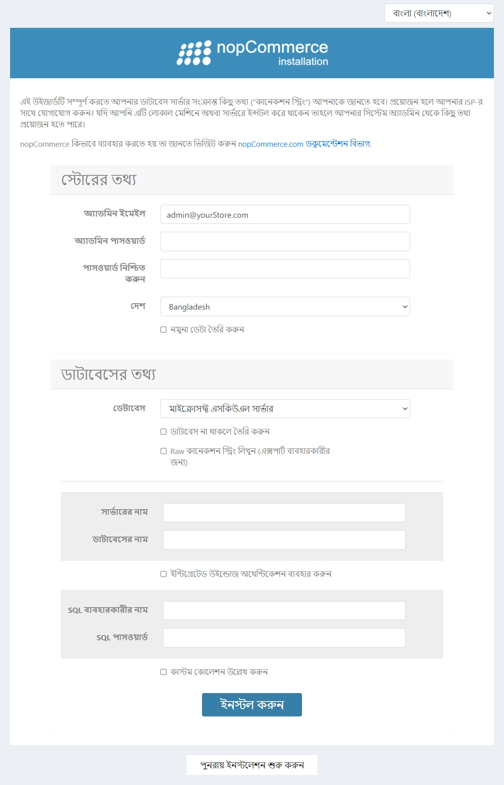

# উইন্ডোজে ইনস্টল করা

এই অধ্যায়ে বর্ণনা করা হয়েছে কিভাবে নপকমার্স সফটওয়্যার ডাউনলোড করতে হয়, আপনার সার্ভারে আপলোড করে ইনস্টল করতে হয়। আপনি আমাদের [ইউটিউব চ্যানেল](https://www.youtube.com/watch?v=L7NGodeB9sQ) এ নপকমার্স ইনস্টলেশন সম্পর্কে স্ক্রিনকাস্ট দেখতে পারেন।

আপনি ইনস্টল শুরু করার আগে, নিশ্চিত করুন যে আপনার ওয়েব হোস্টের [নপকমার্স চালানোর ন্যূনতম প্রয়োজনীয়তা](xref:bn/installation-and-upgrade/technology-and-system-requirements) আছে।
> [!NOTE]
> হোস্টিং নির্বাচন নির্দেশিকা সম্পর্কে আরও তথ্যের জন্য, পরিদর্শন করুন [এই পৃষ্ঠা](xref:bn/installation-and-upgrading/installing-nopcommerce/choose-a-hosting-company).

## নপকমার্স ডাউনলোড করুন

উইন্ডোজ এ নপকমার্স ইনস্টল করার জন্য আপনাকে প্রথমে এটি ডাউনলোড করতে হবে। [ডাউনলোড পৃষ্ঠা](https://www.nopcommerce.com/download-nopcommerce) এ যান এবং উইন্ডোজের জন্য **সোর্স কোড ছাড়া প্যাকেজ** সংস্করণ নির্বাচন করুন। এটি নপকমার্স এর একটি প্রাক-সংকলিত সংস্করণ যা কেবল আপনার হোস্টিং প্রদানকারীর কাছে আপলোড করা যায় এবং অবিলম্বে ব্যবহার করা যায়।

## নপকমার্স ফাইল আপলোড করুন

পরবর্তী ধাপ হল আপনার সার্ভারে নপকমার্স ফাইল আপলোড করা। এটি করার জন্য আপনাকে একটি এফটিপি সংযোগ ব্যবহার করতে হবে যা কম্পিউটারের মধ্যে ফাইল স্থানান্তর করার অনুমতি দেয়। এটি সেট আপ করার জন্য পরবর্তী পদক্ষেপগুলি অনুসরণ করুন:

১. এফটিপি ক্লায়েন্ট অ্যাপ্লিকেশনগুলির মধ্যে একটি বেছে নিন এবং ডাউনলোড করুন যা আপনি ফাইল স্থানান্তরের জন্য ব্যবহার করবেন।

২. আপনার এফটিপি শংসাপত্রগুলি আপনার হোস্টিং কন্ট্রোল প্যানেলে খুঁজুন।

৩. আপনার এফটিপি ক্লায়েন্ট অ্যাপ্লিকেশনে, আগের ধাপে আপনার পাওয়া এফটিপি শংসাপত্রগুলি ব্যবহার করে আপনার কম্পিউটার এবং সার্ভারের মধ্যে সংযোগ স্থাপন করুন।

৪. সার্ভারে নপকমার্স ফাইল আপলোড করুন।

## একটি ডাটাবেস তৈরি করুন

নপকমার্স চালানোর আগে আপনার হোস্টিং কন্ট্রোল প্যানেলে একটি নতুন ডাটাবেস ইনস্ট্যান্স তৈরি করুন। এই ডাটাবেসটি আপনার ওয়েবসাইটের ডেটা সংরক্ষণের জন্য ব্যবহার করা হবে।

> [!NOTE]
>
> ডাটাবেস তৈরির সময় অনুরোধ করা হলে এমএস এসকিউএল সার্ভার সংস্করণ *২০১২* অথবা *উপরে* নির্বাচন করুন।

আমরা পরে ইনস্টলেশন প্রক্রিয়ার সময় আপনার ডাটাবেসের নাম, সার্ভারের নাম (বা আইপি, ইউআরএল), ব্যবহারকারীর লগইন এবং পাসওয়ার্ড ব্যবহার করব। ডাটাবেস সংযোগের জন্য এই শংসাপত্রগুলি প্রয়োজন।

## একটি নতুন ওয়েবসাইট তৈরি করুন

আপনার হোস্টিং কন্ট্রোল প্যানেলে একটি নতুন ওয়েবসাইট তৈরি করুন। তারপরে একটি ইউআরএল খুঁজুন যা আপনাকে এই সাইটে প্রবেশ করতে দেয়।

## নপকমার্স ইনস্টল করুন

পূর্ববর্তী ধাপের ইউআরএল ব্যবহার করে আপনার ব্রাউজার থেকে ওয়েবসাইটে প্রবেশ করুন।
একবার আপনি প্রথমবার সাইটটি খুললে, আপনাকে ইনস্টলেশন পৃষ্ঠায় রেডিরেক্টেড করা হবে, নিম্নরূপ:

*স্টোর তথ্য* প্যানেলে নিম্নলিখিত বিবরণ পূরণ করুন:

- **অ্যাডমিন ব্যবহারকারীর ইমেল**: এটি সাইটের প্রথম অ্যাডমিনের ইমেল ঠিকানা।
- **অ্যাডমিন ব্যবহারকারীর পাসওয়ার্ড**: আপনাকে অ্যাডমিন অ্যাকাউন্টের জন্য একটি পাসওয়ার্ড সরবরাহ করতে হবে।
- **পাসওয়ার্ড নিশ্চিত করুন**: অ্যাডমিন ব্যবহারকারীর পাসওয়ার্ড নিশ্চিত করুন।
- **দেশ**: ড্রপডাউন তালিকা থেকে দেশ নির্বাচন করুন। এটি আপনার নির্বাচিত দেশের উপর ভিত্তি করে আপনার দোকানকে পূর্বে কনফিগার করার অনুমতি দেয়। উদাহরণ স্বরূপ:
  - অফিসিয়াল সাইট থেকে একটি ভাষা প্যাক ডাউনলোড এবং প্রাক-ইনস্টল করুন
  - কিছু সেটিংস প্রি-কনফিগার করুন (উদা জার্মানির জন্য প্যাংভি বা "ডিসপ্লে ট্যাক্স/শিপিং ইনফো" সেটিংস)
  - কিছু শিপিং বিবরণ, ভ্যাট সেটিংস, মুদ্রা, পরিমাপ ইত্যাদি প্রাক-কনফিগার করুন
- **নমুনা ডেটা তৈরি করুন**: যদি আপনি নমুনা পণ্য তৈরি করতে চান তবে এই চেকবক্সটি চেক করুন। এটি সুপারিশ করা হয়েছে যাতে আপনি আপনার নিজের পণ্যগুলি যোগ করার আগে আপনার সাইটের সাথে কাজ শুরু করতে পারেন। আপনি সর্বদা এই আইটেমগুলি পরে মুছে ফেলতে পারেন, অথবা এগুলি অপ্রকাশিত করতে পারেন যাতে সেগুলি আর আপনার সাইটে উপস্থিত না হয়

*ডাটাবেস তথ্য* প্যানেলে আপনাকে নিম্নলিখিত তথ্য প্রবেশ করতে হবে:

- **ডাটাবেস**: এখানে আপনি মাইক্রোসফট এসকিউএল সার্ভার অথবা মাইএসকিউএল নির্বাচন করতে পারেন। আপনি যদি উইন্ডোজ এ নপকমার্স ইনস্টল করেন তাহলে প্রথমটি বেছে নিন।
- **যদি এটি বিদ্যমান না থাকে তবে ডাটাবেস তৈরি করুন**: একটি সফল ইনস্টলেশন নিশ্চিত করার জন্য আপনার ডাটাবেস এবং ডাটাবেস ব্যবহারকারীকে আগে থেকেই তৈরি করার পরামর্শ দেওয়া হচ্ছে। কেবল একটি ডাটাবেস উদাহরণ তৈরি করুন এবং এতে ডাটাবেস ব্যবহারকারী যুক্ত করুন। ইনস্টলেশন প্রক্রিয়াটি সমস্ত টেবিল, সঞ্চিত পদ্ধতি ইত্যাদি তৈরি করবে।
- **কাঁচা সংযোগ স্ট্রিং লিখুন (উন্নত)**: সংযোগ ক্ষেত্রগুলি পূরণ করার পরিবর্তে যদি আপনি একটি **সংযোগের স্ট্রিং** লিখতে চান তবে এই চেকবক্সটি চেক করুন।
- **সার্ভারের নাম**: এটি আপনার ডাটাবেসের আইপি, ইউআরএল বা সার্ভারের নাম। হোস্টিং কন্ট্রোল প্যানেল থেকে আপনার সার্ভারের নাম পান।
- **ডাটাবেসের নাম**: এটি নপকমার্স দ্বারা ব্যবহৃত ডাটাবেসের নাম। যদি আপনি সময়ের আগে আপনার ডাটাবেস তৈরি করতে পছন্দ করেন, তাহলে আপনি আপনার ডাটাবেস যে নামটি দিয়েছেন তা এখানে ব্যবহার করুন।
- **ইন্টিগ্রেটেড উইন্ডোজ প্রমাণীকরণ ব্যবহার করুন**: যদি আপনি একটি হোস্টিং প্রদানকারীতে ইনস্টল করছেন, তাহলে আপনাকে এই বিকল্পটি ব্যবহার করার দরকার নেই।
- **এসকিউএল ব্যবহারকারীর নাম**: আপনার ডাটাবেস ব্যবহারকারী লগইন লিখুন।
- **এসকিউএল পাসওয়ার্ড**: আপনার ডাটাবেস ব্যবহারকারীর পাসওয়ার্ডকে শক্তিশালী করুন।
- **কাস্টম কোলেশন নির্দিষ্ট করুন**: এটি একটি উন্নত সেটিং এবং এটিকে অনির্বাচিত রেখে দেওয়া উচিত।

ইনস্টলেশন প্রক্রিয়া শুরু করার জন্য **ইনস্টল করুন** ক্লিক করুন। সেটআপ প্রক্রিয়া সম্পন্ন হলে, আপনার নতুন সাইটের হোম পেজ প্রদর্শিত হবে।

> [!NOTE]
> ইনস্টলেশন পৃষ্ঠার নীচে অবস্থিত **পুনরায় চালু করুন** বোতামটি আপনাকে কিছু ভুল হলে ইনস্টলেশন প্রক্রিয়াটি পুনরায় চালু করতে সক্ষম করে।

> [!NOTE]
> আপনি যদি একটি নপকমার্স সাইটকে সম্পূর্ণরূপে তার ডিফল্ট সেটিংসে রিসেট করতে চান, তাহলে আপনি `App_Data` ডিরেক্টরি থেকে `dataSettings.json` ফাইলটি মুছে ফেলতে পারেন।
