# ক্যাটালগ সেটিংস

ক্যাটালগ সেটিংসের মধ্যে রয়েছে পণ্য সাজানোর বিকল্পগুলি সক্রিয় করা, ভিউ মোড পরিবর্তন করা, পণ্যের তুলনা করা এবং আরও অনেক কিছু।

ক্যাটালগ সেটিংস নির্ধারণ করতে, **কনফিগারেশন → সেটিংস → ক্যাটালগ সেটিংস** এ যান। ক্যাটালগ সেটিংস পৃষ্ঠাটি *উন্নত* এবং *মৌলিক* মোডে (ডিফল্টরূপে উন্নত মোডে) পাওয়া যায়।

এই পৃষ্ঠাটি মাল্টি-স্টোর কনফিগারেশন সক্ষম করে, এর মানে হল যে একই স্টোরিং সকল স্টোরের জন্য সংজ্ঞায়িত করা যেতে পারে, অথবা স্টোর থেকে স্টোরে আলাদা হতে পারে। আপনি যদি একটি নির্দিষ্ট দোকানের জন্য সেটিংস পরিচালনা করতে চান, মাল্টি-স্টোর কনফিগারেশন ড্রপ-ডাউন তালিকা থেকে তার নামটি চয়ন করুন এবং তাদের জন্য কাস্টম মান নির্ধারণ করতে বাম পাশে সমস্ত প্রয়োজনীয় চেকবক্সে টিক দিন। আরও তথ্যের জন্য [মাল্টি-স্টোর] (xref: bn/getting-start/advanced-configuration/multi-store) পড়ুন।

## সার্চ সেট করুন

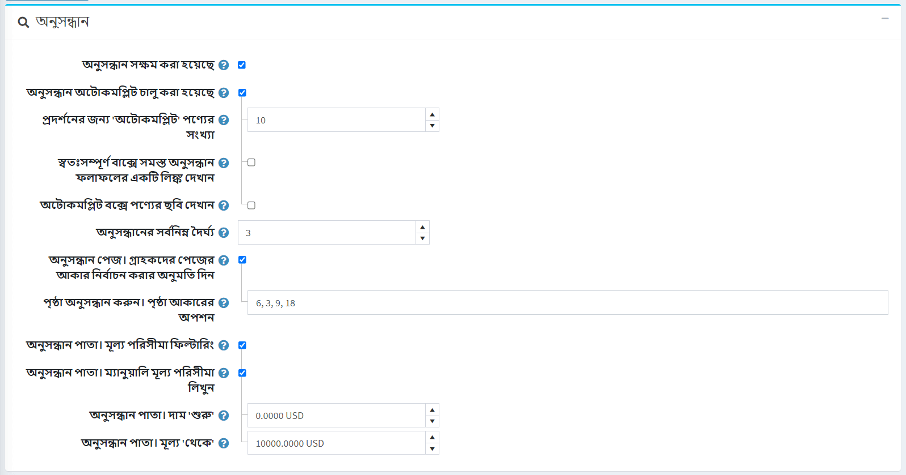

পৃষ্ঠার শীর্ষ প্যানেল *অনুসন্ধান* সেট আপ করে:

- আপনি যদি সার্চ ফাংশনালিটি পাবলিক স্টোরে সক্ষম করতে চান তাহলে **সার্চ সক্ষম** চেকবক্স চেক করুন।
- পাবলিক স্টোরে স্বয়ংসম্পূর্ণ অনুসন্ধান বাক্সটি প্রদর্শনের জন্য **সার্চ স্বয়ংসম্পূর্ণ সক্ষম** চেকবক্সে টিক দিন, নিম্নরূপ:

  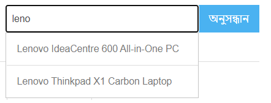

  যখন এই বিকল্পটি সক্ষম করা হয় তখন নিম্নলিখিত অতিরিক্ত ক্ষেত্রগুলি প্রদর্শিত হয়:

  - **প্রদর্শনের জন্য 'স্বয়ংসম্পূর্ণ' পণ্যের সংখ্যা** পাবলিক স্টোরে সার্চ বক্সের স্বয়ংসম্পূর্ণ ড্রপডাউন তালিকায় দৃশ্যমান ফলাফলের সংখ্যা সেট করে।
  - **স্বয়ংসম্পূর্ণ বাক্সে সমস্ত অনুসন্ধান ফলাফলের একটি লিঙ্ক দেখান স্বয়ংসম্পূর্ণ বাক্সে প্রদর্শিত পরিমাণের চেয়ে পাওয়া আইটেমের সংখ্যা বেশি হলে প্রদর্শিত হয়।
  - **স্বয়ংসম্পূর্ণ বাক্সে পণ্যের ছবি দেখান** স্বয়ংসম্পূর্ণ অনুসন্ধান বাক্সে পণ্যের ছবি প্রদর্শন করতে সক্ষম করুন।

- **অনুসন্ধান শব্দ সর্বনিম্ন দৈর্ঘ্য** অনুসন্ধানের জন্য প্রয়োজনীয় সর্বনিম্ন অক্ষর।
- **সার্চ পেজে টিক দিন। গ্রাহকদের পৃষ্ঠার আকার** চেকবক্স নির্বাচন করার অনুমতি দিন যদি আপনি গ্রাহকদের বিকল্পের পূর্বনির্ধারিত তালিকা থেকে পৃষ্ঠার আকার নির্বাচন করার অনুমতি দিতে চান।
  - **অনুসন্ধান পৃষ্ঠায়। পৃষ্ঠা আকারের বিকল্প** ক্ষেত্রটি গ্রাহকদের জন্য পৃষ্ঠা আকারের বিকল্পগুলির একটি কমা দ্বারা পৃথক করা তালিকা প্রবেশ করান, অথবা অনুসন্ধান পণ্য পৃষ্ঠায় আপনি যে পণ্যগুলি প্রদর্শন করতে চান তার সংখ্যা লিখুন।
  - যদি **সার্চ পেজ। গ্রাহকদের পৃষ্ঠার আকার নির্বাচন করার অনুমতি দিন** সেটিং নিষ্ক্রিয় করা হয়েছে **অনুসন্ধান পৃষ্ঠা। প্রতি পৃষ্ঠায় পণ্য** ক্ষেত্র প্রদর্শিত হয়। এই ক্ষেত্রে, অনুসন্ধান পৃষ্ঠায় আপনি যে পণ্যগুলি প্রদর্শন করতে চান তার সংখ্যা লিখুন।
- **সার্চ পেজে টিক দিন। মূল্য পরিসীমা ফিল্টারিং** চেকবক্স যদি আপনি মূল্য পরিসীমা দ্বারা ফিল্টারিং সক্ষম করতে চান।
  - যদি আপনি মূল্য পরিসীমা প্রবেশ করতে চান তবে **অনুসন্ধান পৃষ্ঠায় টিক দিন। ম্যানুয়ালি মূল্য পরিসীমা লিখুন** চেকবক্স।
    - যদি উপরের সেটিংটি সক্ষম থাকে তবে **অনুসন্ধান পৃষ্ঠায় প্রবেশ করুন। দাম শুরু'**.
    - পাশাপাশি **অনুসন্ধান পৃষ্ঠা। দাম 'থেকে'**।

## পণ্য রিভিউ

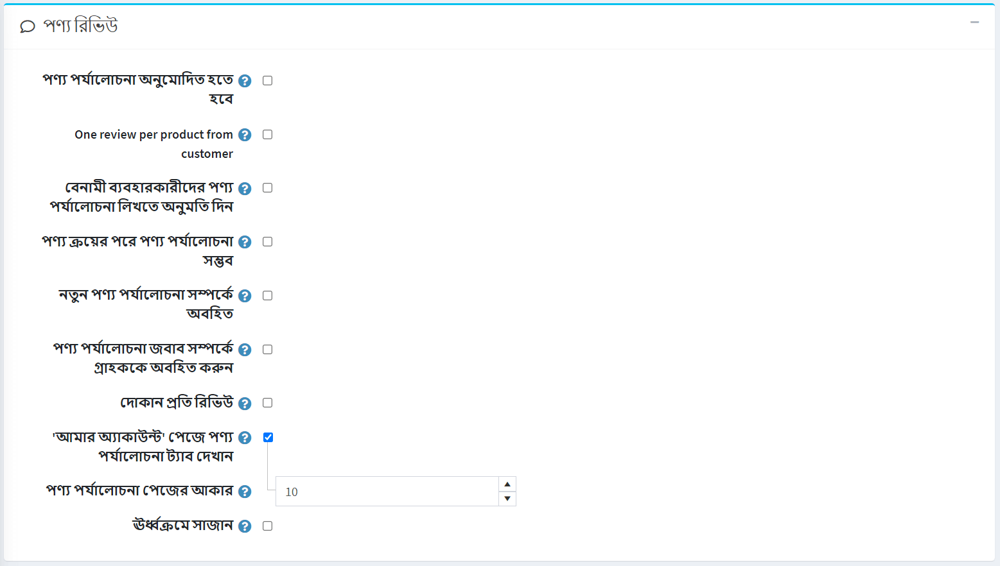

দ্বিতীয় প্যানেল সেট আপ *পণ্য পর্যালোচনা*। নিম্নলিখিত সংজ্ঞায়িত করুন:

- **পণ্যের পর্যালোচনাগুলি অনুমোদিত হতে হবে**, প্রকাশের পূর্বে একটি দোকান প্রশাসক কর্তৃক অনুমোদিত পণ্যের পর্যালোচনাগুলি কার্যকর করতে।
- **গ্রাহক থেকে প্রতি পণ্য একটি পর্যালোচ**, গ্রাহককে প্রতি পণ্য মাত্র 1 টি পর্যালোচনা যোগ করতে সীমাবদ্ধ করা।
- **বেনামী ব্যবহারকারীদের পণ্য পর্যালোচনা লেখার অনুমতি দিন**, বেনামী ব্যবহারকারীদের পণ্য পর্যালোচনা লেখার অনুমতি দিতে।
- **প্রোডাক্ট রিভিউ শুধুমাত্র প্রোডাক্ট কেনার পরেই সম্ভব**, শুধুমাত্র সেই ক্রেতাদের দ্বারা প্রোডাক্ট রিভিউ করার অনুমতি দেওয়া হবে যারা ইতিমধ্যেই অর্ডার করেছে।
- **নতুন পণ্য পর্যালোচনা সম্পর্কে অবহিত করুন**, নতুন পাবলিক পর্যালোচনা সম্পর্কে দোকান মালিককে অবহিত করতে।
- **পণ্য পর্যালোচনার উত্তর সম্পর্কে গ্রাহককে অবহিত করুন**, পণ্য পর্যালোচনার উত্তর সম্পর্কে গ্রাহককে অবহিত করতে।
- **প্রতি স্টোর রিভিউ**, বর্তমান স্টোরের শুধুমাত্র রিভিউ প্রদর্শনের অনুমতি দেয় (পণ্যের বিবরণ পৃষ্ঠায়)। আপনি যদি আপনার গ্রাহকরা আপনার সমস্ত দোকানে পণ্যের পর্যালোচনাগুলি দেখতে চান তবে এই চেকবক্সটি আনটিক করুন।
- **'আমার অ্যাকাউন্ট' পৃষ্ঠায় পণ্যের পর্যালোচনা ট্যাব দেখান**, যাতে গ্রাহকরা 'আমার অ্যাকাউন্ট' পৃষ্ঠায় তাদের সমস্ত পর্যালোচনা দেখতে পারেন।
- **প্রোডাক্ট রিভিউ পেজ সাইজ** হল প্রতি পেজ রিভিউ এর পরিমান।
- **আরোহী অনুসারে সাজান**, উত্থানের তারিখ অনুসারে পণ্যের পর্যালোচনাগুলি সাজান।

## পর্যালোচনার ধরন

পরবর্তী ব্লক *পর্যালোচনার ধরন* সেট আপ করে। আপনি যদি মনে করেন যে একটি মৌলিক পর্যালোচনা যথেষ্ট নয় তাহলে আপনি পর্যালোচনার ধরনগুলির একটি তালিকা কনফিগার করতে পারেন।

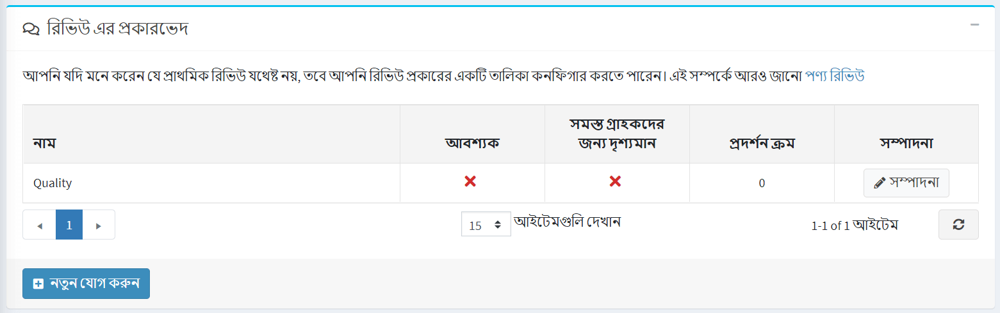

একটি নতুন পর্যালোচনার ধরন তৈরি করতে **নতুন বোতাম যোগ করুন** ক্লিক করুন।

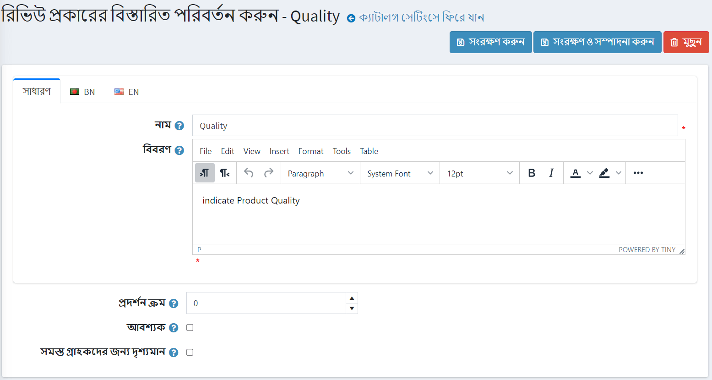

নিম্নলিখিত সংজ্ঞায়িত করুন:

- আপনার পর্যালোচনার ধরন লিখুন **নাম**।
- পর্যালোচনার ধরন লিখুন **বর্ণনা**
- **ডিসপ্লে অর্ডার** সংজ্ঞায়িত করুন।
- যখন **প্রয়োজনীয়** গ্রাহকদের অবিরত করার আগে একটি উপযুক্ত রেটিং মান নির্বাচন করতে হবে।
- **সকল গ্রাহকদের জন্য দৃশ্যমান** সকল গ্রাহকদের জন্য পর্যালোচনার ধরন দৃশ্যমান করে।

একটি নতুন পর্যালোচনার ধরন যোগ করতে **সংরক্ষণ করুন** বাটনে ক্লিক করুন।

এখন পাবলিক স্টোরে গ্রাহকরা পণ্য পর্যালোচনা পৃষ্ঠায় অতিরিক্ত রেটিং পূরণ করতে পারবেন।

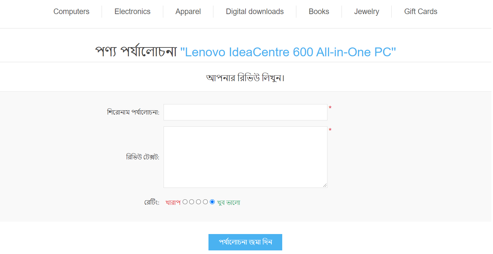

এছাড়াও এই পৃষ্ঠায় আপনি সমস্ত গ্রাহকদের বাম প্রতিক্রিয়া দেখতে পারেন (যদি এই সেটিংটি সক্রিয় থাকে)। গ্রাহকের ব্যক্তিগত অ্যাকাউন্ট পৃষ্ঠায় পণ্যগুলিতে থাকা সমস্ত পর্যালোচনা দেখার সুযোগ রয়েছে।

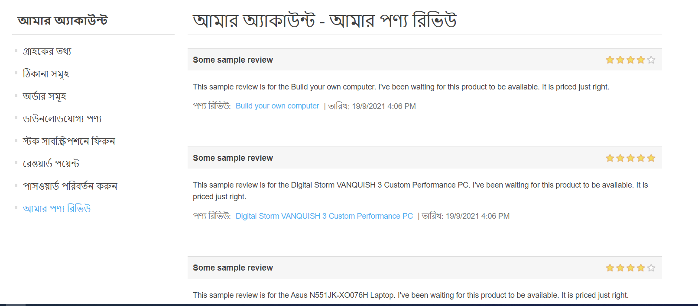

## কর্মক্ষমতা

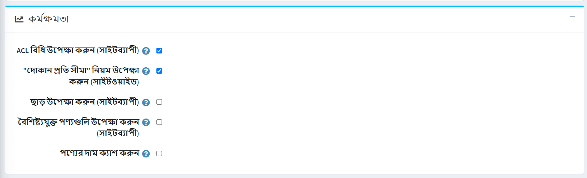

পরবর্তী প্যানেল *পারফরমেন্স* সেট আপ করে। নিম্নলিখিত সেটিংস সক্ষম করা স্টোরের কার্যকারিতা উল্লেখযোগ্যভাবে উন্নত করতে পারে:

- **এসিএল নিয়ম উপেক্ষা করুন (সাইটওয়াইড)** সত্তাগুলির জন্য কনফিগার করা [এসিএল নিয়ম](xref:bn/running-your-store/customer-management/access-control-list) বন্ধ করে দেয়।
- **প্রতি স্টোর সীমা উপেক্ষা করুন (সাইটওয়াইড)** সত্তাগুলির জন্য কনফিগার করা প্রতি স্টোরের নিয়ম সীমা উপেক্ষা করার অনুমতি দেয়। আপনার যদি শুধুমাত্র একটি দোকান থাকে বা দোকান-নির্দিষ্ট সীমাবদ্ধতা না থাকে তবে এই সেটিংটি সক্ষম করার পরামর্শ দেওয়া হয়। [মাল্টি-স্টোর](xref:bn/getting-start/advanced-configuration/multi-store) বিভাগে মাল্টি-স্টোর সম্পর্কে আরও পড়ুন।
- **ডিসকাউন্ট উপেক্ষা করুন (সাইটওয়াইড)**।
- **বৈশিষ্ট্যযুক্ত পণ্য উপেক্ষা করুন (সাইটওয়াইড)**।
- **ক্যাশে পণ্যের দাম**। আপনি যদি কিছু জটিল ডিসকাউন্ট, ডিসকাউন্টের প্রয়োজনীয়তা নিয়ম, বা কুপন কোড ব্যবহার করেন তবে আপনার এটি সক্রিয় করা উচিত নয়।

## শেয়ার করুন

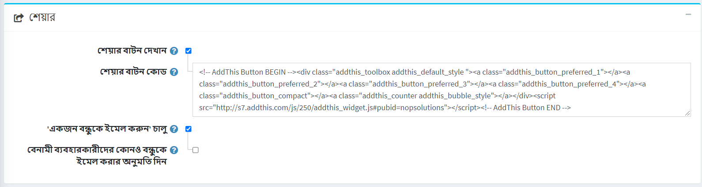

*শেয়ার* প্যানেল থেকে শেয়ার করার বিকল্পগুলি ক্রেতাদের তাদের সোশ্যাল মিডিয়া নেটওয়ার্কে পণ্য শেয়ার করার সুযোগ তৈরি করতে দেয়। বিকল্পগুলি পণ্য পৃষ্ঠায় ছোট আইকন হিসাবে উপস্থিত হবে। ভাগ করার বিকল্পগুলি সেট আপ করতে:

- পণ্যের বিবরণ পৃষ্ঠায় একটি শেয়ার বাটন প্রদর্শন করতে **একটি শেয়ার বাটন দেখান** টিক দিন। যখন এই ক্ষেত্রটি নির্বাচন করা হয় তখন **শেয়ার বোতাম কোড** ক্ষেত্র প্রদর্শিত হয়।
- **শেয়ার বাটন কোড** ক্ষেত্র পৃষ্ঠা বোতাম কোড প্রদর্শন করে।

  > [!TIP]
  >
  > ডিফল্টরূপে, এই পরিষেবা যোগ করুন ব্যবহার করা হয় ([http://www.addthis.com/](http://www.addthis.com/)).

এইভাবে শেয়ার লিঙ্কগুলি দেখতে:

- **'বন্ধুকে ইমেল করুন' সক্ষম** চেকবক্সে টিক দিন যাতে গ্রাহকরা "বন্ধুকে ইমেল করুন" বিকল্পটি ব্যবহার করতে পারেন।
- **বেনামী ব্যবহারকারীদের বন্ধুকে ইমেল করার অনুমতি দিন** যদি প্রয়োজন হয়।

## পন্যের তুলনা করা

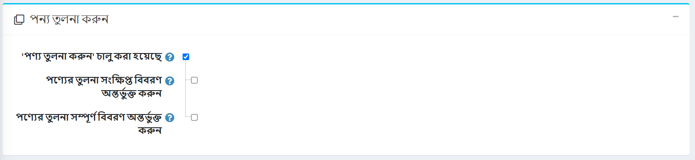

তুলনা পণ্য বিকল্প গ্রাহকদের তাদের বৈশিষ্ট্য এবং মূল্যের উপর ভিত্তি করে বিভিন্ন অফার তুলনা করতে সক্ষম করে যাতে তারা সেরা কেনাকাটার সিদ্ধান্ত নিতে পারে। নিম্নরূপ *পণ্য তুলনা করুন* ব্লক সেট আপ করুন:

- ক্রেতাদের আপনার পাবলিক স্টোরে পণ্যের বিকল্পের তুলনা করতে সক্ষম করতে **'পণ্যগুলির তুলনা করুন' সক্ষম** চেকবক্সে টিক দিন। পণ্যের পাতায় *তুলনা তালিকায় যোগ করুন* বোতামটি প্রদর্শিত হবে।
- তুলনা পণ্যের **সংক্ষিপ্ত বিবরণ অন্তর্ভুক্ত করুন** চেকবক্স, তুলনা পণ্য পৃষ্ঠায় সংক্ষিপ্ত পণ্যের বিবরণ প্রদর্শন করতে।
- তুলনা পণ্য পৃষ্ঠায় সম্পূর্ণ পণ্যের বিবরণ প্রদর্শন করতে **তুলনা পণ্য** চেকবক্সে সম্পূর্ণ বিবরণ অন্তর্ভুক্ত করুন।

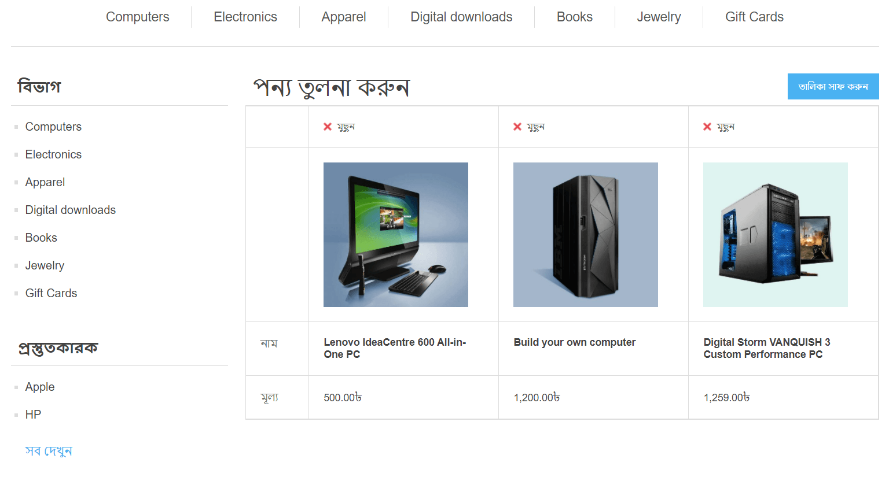

## Additional sections

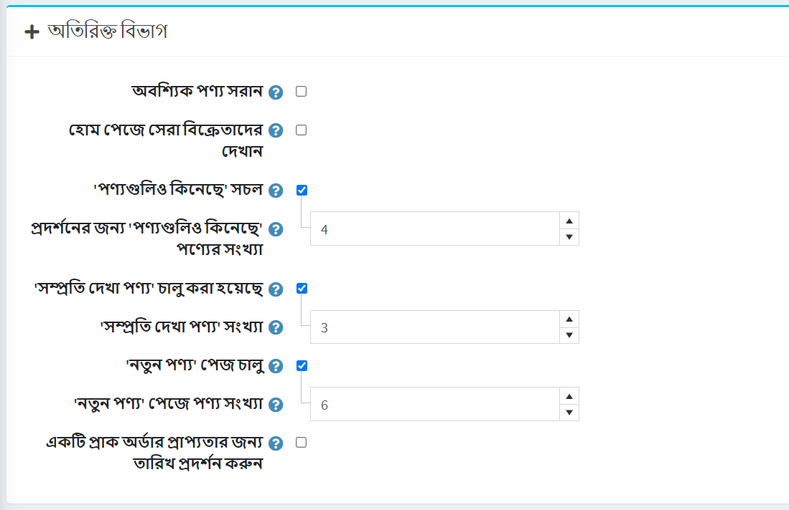

*অতিরিক্ত বিভাগ* প্যানেল আপনাকে নিম্নলিখিত বিকল্পগুলি সেট করতে দেয়:

- মূল পণ্য সরানো হলে কার্ট থেকে প্রয়োজনীয় পণ্য স্বয়ংক্রিয়ভাবে সরানোর জন্য **প্রয়োজনীয় পণ্যগুলি সরান** চেকবক্স চেক করুন।
- **হোম পেজে সেরা বিক্রেতাদের দেখান** আপনাকে হোম পেজে সেরা বিক্রেতা দেখাতে দেয়।
- যদি আগের চেকবক্সে টিক দেওয়া থাকে তবে আপনি হোম পেজে **সেরা বিক্রেতার সংখ্যা** লিখতে পারবেন।
- **'পণ্যও কেনা হয়েছে' সক্ষম** চেকবক্স চেক করুন, যাতে গ্রাহকরা উপরের ক্রয়কৃত অন্যদের দ্বারা কেনা পণ্যের তালিকা দেখতে সক্ষম হন।
- যখন পূর্ববর্তী বিকল্পটি সক্ষম করা হয়,**প্রদর্শিত করার জন্য ক্রয়কৃত পণ্যের সংখ্যা** ক্ষেত্র প্রদর্শিত হয়, যেখানে দোকানের মালিক প্রদর্শিত পণ্যের সংখ্যা নির্ধারণ করতে পারে।
- আপনার দোকানে সম্প্রতি দেখা পণ্যগুলি দেখতে গ্রাহকদের সক্ষম করতে **'সম্প্রতি দেখা পণ্য' সক্ষম** চেকবক্স চেক করুন।
- **'সম্প্রতি দেখা পণ্যের সংখ্যা'** ক্ষেত্রটিতে, পূর্বের চেকবক্সে টিক দিলে প্রদর্শিত হওয়ার জন্য সম্প্রতি দেখা পণ্যের সংখ্যা লিখুন।
- **নতুন পণ্য পৃষ্ঠা সক্রিয়** চেকবক্স চেক করুন যদি আপনি 'নতুন পণ্য' পৃষ্ঠাটি দোকানে সক্ষম করতে চান।
- 'নতুন পণ্য' পৃষ্ঠায় **পণ্যের সংখ্যা** ক্ষেত্রটিতে,*'নতুন পণ্য' পৃষ্ঠা সক্ষম* চেক করা হলে প্রদর্শনের জন্য সম্প্রতি যোগ করা পণ্যের সংখ্যা লিখুন।
- প্রয়োজনে **প্রি-অর্ডার প্রাপ্যতার তারিখ প্রদর্শন করুন** চেকবক্সে টিক দিন।

## পণ্যের ক্ষেত্র

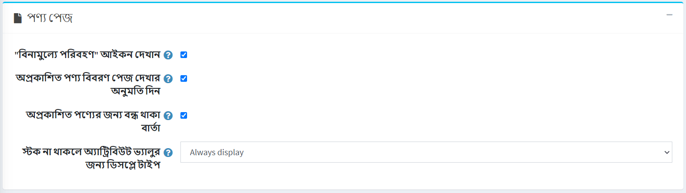

*পণ্য ক্ষেত্র* প্যানেলে আপনি নিম্নলিখিত বিকল্পগুলি সেট করতে পারেন:

- **পণ্যের বিবরণ পৃষ্ঠায় এসকেইউ দেখান**।
- ক্যাটালগ পৃষ্ঠায় **এসকেইউ দেখান**।
- পাবলিক স্টোরে **জিটিআইএন দেখান**
- পাবলিক স্টোরে **প্রস্তুতকারকের অংশ নম্বর দেখান**।

## পণ্য পাতা

*পণ্য পৃষ্ঠা* প্যানেলে আপনি নিম্নলিখিত বিকল্পগুলি সেট করতে পারেন:

- এই বিকল্পটি সক্ষম করা পণ্যের জন্য **ফ্রি শিপিং "আইকন** দেখান।
- থেকে **অপ্রকাশিত পণ্যের বিবরণ পৃষ্ঠা দেখার অনুমতি দিন**। এই ক্ষেত্রে, এসইও প্রভাবিত হবে না, এবং সার্চ ক্রলার পৃষ্ঠাটি সূচী করবে, যদিও একটি পণ্য সাময়িকভাবে অপ্রকাশিত এবং গ্রাহকদের জন্য অদৃশ্য। মনে রাখবেন যে একটি দোকানের মালিকের সর্বদা অপ্রকাশিত পণ্যগুলিতে অ্যাক্সেস থাকে।
- যখন অপ্রকাশিত পণ্যের বিবরণ পৃষ্ঠাগুলি অ্যাক্সেস করার চেষ্টা করে তখন "একটি পণ্য বন্ধ হয়ে গেছে" বার্তাটি প্রদর্শনের জন্য **অপ্রকাশিত পণ্যের জন্য** চেকবক্সে টিক চিহ্ন দিন।
**স্টক না থাকলে অ্যাট্রিবিউট ভ্যালুর জন্য** ডিসপ্লে টাইপ নির্বাচন করুন। অ্যাট্রিবিউট কম্বিনেশন যদি স্টকের বাইরে থাকে তবে আপনি এটিকে অক্ষম বা স্বাভাবিক হিসাবে দেখাতে পারেন।

  > [!NOTE]
  >
  > মনে রাখবেন যে একটি পণ্যের জন্য **শুধুমাত্র বিদ্যমান বৈশিষ্ট্য সমন্বয় অনুমোদন করুন** বিকল্পটি সক্ষম করা উচিত।

## ক্যাটালগ পাতা

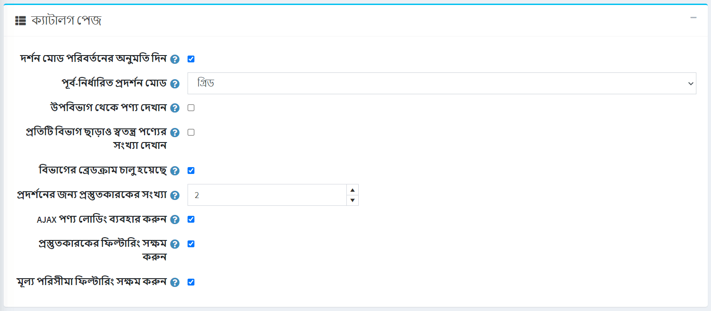

*ক্যাটালগ পৃষ্ঠা* প্যানেল আপনাকে সেট করতে সক্ষম করে:

- **বিভাগ এবং নির্মাতাদের**পৃষ্ঠায় ভিউ মোড পরিবর্তনের অনুমতি দিন।
- **ডিফল্ট ভিউ মোড** থেকে *গ্রিড* অথবা *তালিকা*।
- **উপশ্রেণী থেকে পণ্য অন্তর্ভুক্ত করুন** যখন একটি বিভাগ বিশদ পৃষ্ঠা দেখুন।
- পাবলিক স্টোরের বাম কলামে অবস্থিত ক্যাটাগরি নেভিগেশন এলাকায় প্রতিটি ক্যাটাগরির পাশে আলাদা আলাদা পণ্যের সংখ্যা দেখান।
- **ক্যাটাগরি ব্রেডক্রাম্ব সক্ষম**। ক্যাটাগরি পাথ (ব্রেডক্রাম্ব) সক্ষম করতে নির্বাচন করুন। এটি স্ক্রিনের শীর্ষে থাকা বার যা নির্দেশ করে যে পণ্যটির পৃষ্ঠাগুলিতে কোন বিভাগ এবং উপশ্রেণীগুলি দেখা হয়েছিল। বারের প্রতিটি উপ-উপাদান একটি পৃথক হাইপারলিঙ্ক।
- **নির্মাতার ন্যাভিগেশন ব্লকে প্রদর্শিত নির্মাতাদের সংখ্যা**।
- **এজাক্স পণ্য লোডিং ব্যবহার করুন** ক্যাটালগ পৃষ্ঠায় অযৌক্তিকভাবে ('পেজিং', 'ফিল্টারিং', 'ভিউ মোড' প্রযোজ্য) পণ্য লোড করতে।
- **প্রস্তুতকারকের ফিল্টারিং সক্ষম করুন** ক্যাটালগ পৃষ্ঠায় প্রস্তুতকারকের ফিল্টারিং সক্ষম করতে।
- **মূল্য পরিসীমা ফিল্টারিং সক্ষম করুন** ক্যাটালগ পৃষ্ঠায় মূল্য পরিসীমা ফিল্টারিং সক্ষম করতে।

## ট্যাগ

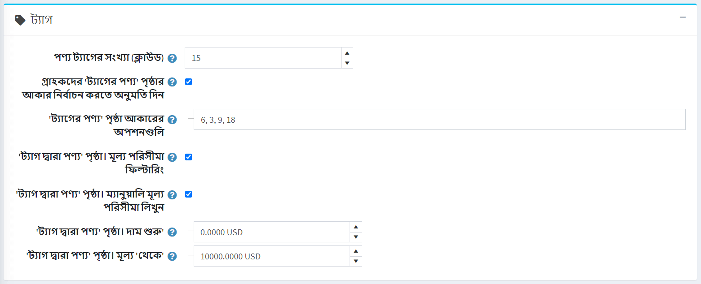

*ট্যাগস* প্যানেলে আপনি সংজ্ঞায়িত করতে পারেন:

- **পণ্যের ট্যাগের সংখ্যা (ক্লাউড)** - ট্যাগ ক্লাউডে প্রদর্শিত ট্যাগের সংখ্যা।
- স্টোরের মালিক দ্বারা নির্ধারিত বিকল্পগুলির পূর্বনির্ধারিত তালিকা থেকে পণ্যের ট্যাগ পৃষ্ঠায় **গ্রাহকদের 'ট্যাগ দ্বারা পণ্য' পৃষ্ঠার আকার** নির্বাচন করার অনুমতি দিন। অক্ষম হলে, গ্রাহকরা একটি পৃষ্ঠার আকার নির্বাচন করতে পারবেন না এবং দোকানের মালিক এতে প্রবেশ করবে।
- যদি পূর্ববর্তী বিকল্পটি চেক করা হয়, **'পণ্য দ্বারা ট্যাগ' পৃষ্ঠা আকারের বিকল্প** ক্ষেত্র দৃশ্যমান হয়। আপনি মান ব্যবহার করতে পারেন যা দোকান ব্যবহারকারীদের দ্বারা নির্বাচিত হতে পারে। সংখ্যাগুলি কমা দিয়ে আলাদা করা উচিত। প্রথম মান ডিফল্ট হবে।
- যদি **গ্রাহকদের 'ট্যাগ দ্বারা পণ্য' পৃষ্ঠার আকার নির্বাচন করার অনুমতি দেয়** সেটিং অক্ষম করা হয় **'ট্যাগ দ্বারা পণ্য' পৃষ্ঠা। প্রতি পৃষ্ঠায় পণ্য** ক্ষেত্র প্রদর্শিত হয়। এই ক্ষেত্রে, অনুসন্ধান পৃষ্ঠায় আপনি যে পণ্যগুলি প্রদর্শন করতে চান তার সংখ্যা লিখুন।
- **'ট্যাগ দ্বারা পণ্য' পৃষ্ঠায় টিক দিন। মূল্য পরিসীমা ফিল্টারিং** চেকবক্স যদি আপনি মূল্য পরিসীমা দ্বারা ফিল্টারিং সক্ষম করতে চান।
- যদি আপনি দাম সীমা ম্যানুয়ালি প্রবেশ করতে চান তবে **'ট্যাগ দ্বারা পণ্য' পৃষ্ঠায় টিক দিন। ম্যানুয়ালি মূল্য পরিসীমা লিখুন** চেকবক্স।
- যদি উপরের সেটিং সক্ষম করা থাকে তাহলে **'ট্যাগ দ্বারা পণ্য' পৃষ্ঠায় প্রবেশ করুন। দাম শুরু'**.
- পাশাপাশি **'ট্যাগ দ্বারা পণ্য' পৃষ্ঠা। দাম 'থেকে'**।

## কর

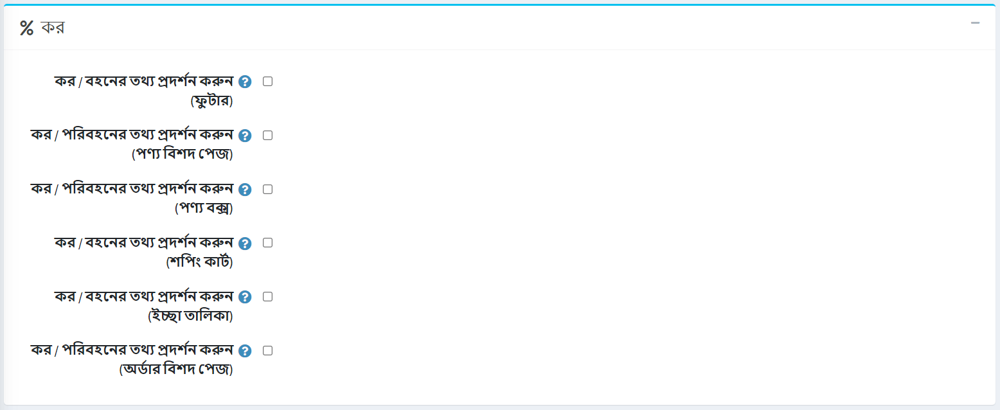

জার্মানির জন্য নির্দিষ্ট কিছু কর/শিপিং তথ্য বিকল্পগুলি *ট্যাক্স* প্যানেলে উপলব্ধ:

- **ডিসপ্লে ট্যাক্স/শিপিং ইনফো (ফুটার)**।
- **প্রদর্শন কর/শিপিং তথ্য (পণ্যের বিবরণ পৃষ্ঠা)**।
- **প্রদর্শন কর/শিপিং তথ্য (পণ্য বাক্স)**।
- **প্রদর্শন কর/শিপিং তথ্য (শপিং কার্ট)**।
- **ডিসপ্লে কর/শিপিং তথ্য (ইচ্ছা তালিকা)**।
- **প্রদর্শন কর/শিপিং তথ্য (অর্ডারের বিবরণ পৃষ্ঠা)**।

## আমদানী রপ্তানি

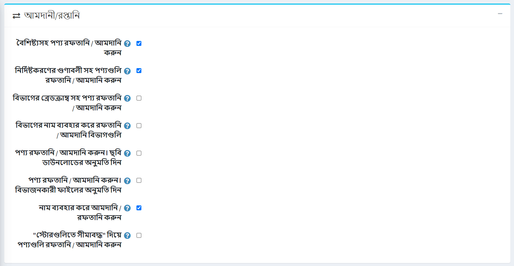

*রপ্তানি/আমদানি* প্যানেলে আপনি সংজ্ঞায়িত করতে পারেন:

- যখনই আপনি পণ্য রপ্তানি/আমদানি করেন তখন রপ্তানি/আমদানি করার জন্য পণ্যের বৈশিষ্ট্যগুলি রপ্তানি/আমদানির প্রয়োজন হলে বৈশিষ্ট্যগুলির সাথে **পণ্য রপ্তানি/আমদানি করুন** চেকবক্সে টিক দিন।
- স্পেসিফিকেশন অ্যাট্রিবিউট সহ **এক্সপোর্ট/ইম্পোর্ট প্রোডাক্টস** চেকবক্স টিক করুন
- **রপ্তানি/আমদানি পণ্য ক্যাটাগরির ব্রেডক্রাম্ব** চেকবক্সে টিক চিহ্ন দিন যদি পণ্যগুলি তার সমস্ত পিতামাতার নাম সহ একটি সম্পূর্ণ শ্রেণীর নাম সহ রপ্তানি/আমদানি করা উচিত।
- ক্যাটাগরির নাম ব্যবহার করে রপ্তানি/আমদানি করা উচিত হলে ক্যাটাগরির নাম ব্যবহার করে **রপ্তানি/আমদানি বিভাগগুলিতে টিক দিন** চেকবক্স।
- **রপ্তানি/আমদানি পণ্যগুলিতে টিক দিন। প্রোডাক্ট এক্সপোর্ট** করার সময় রিমোট সার্ভার থেকে ছবি ডাউনলোড করা গেলে চেকবক্স ডাউনলোড করার অনুমতি দিন।
- **রপ্তানি/আমদানি পণ্যগুলিতে টিক দিন। বিভক্ত ফাইল** চেকবক্সের অনুমতি দিন যদি আপনি অনুকূল আকারের পৃথক ফাইল থেকে পণ্যগুলি আমদানি করতে চান, যা প্রধান ফাইল থেকে স্বয়ংক্রিয়ভাবে তৈরি হয়েছিল। এই ফাংশনটি আপনাকে ছোট বিলম্বের সাথে প্রচুর পরিমাণে ডেটা আমদানি করতে সহায়তা করবে।
- নাম ব্যবহার করে **রপ্তানি/আমদানি সম্পর্কিত সত্তা** চেকবক্সে টিক দিন যদি সংশ্লিষ্ট সত্তা নাম ব্যবহার করে রপ্তানি/আমদানি করা হয়।
- "সীমিত দোকানে" **পণ্যগুলি রপ্তানি/আমদানি করা উচিত যদি "সীমিত দোকানে" সম্পত্তির সাথে পণ্য রপ্তানি/আমদানি করা হয়** চেকবক্সে টিক চিহ্ন দিন।

## পণ্য বাছাই

*পণ্য সাজানোর* প্যানেলে আপনি সংজ্ঞায়িত করতে পারেন:

- বিভাগ এবং নির্মাতাদের পৃষ্ঠায় পণ্য সাজানোর বিকল্পটি সক্ষম করতে **পণ্য সাজানোর অনুমতি দিন** চেকবক্সে টিক দিন। আপনি *অবস্থান*, *নাম *, *মূল্য* এবং *সৃষ্টির তারিখ* দ্বারা সাজানো সক্রিয়/নিষ্ক্রিয় করতে পারেন।

  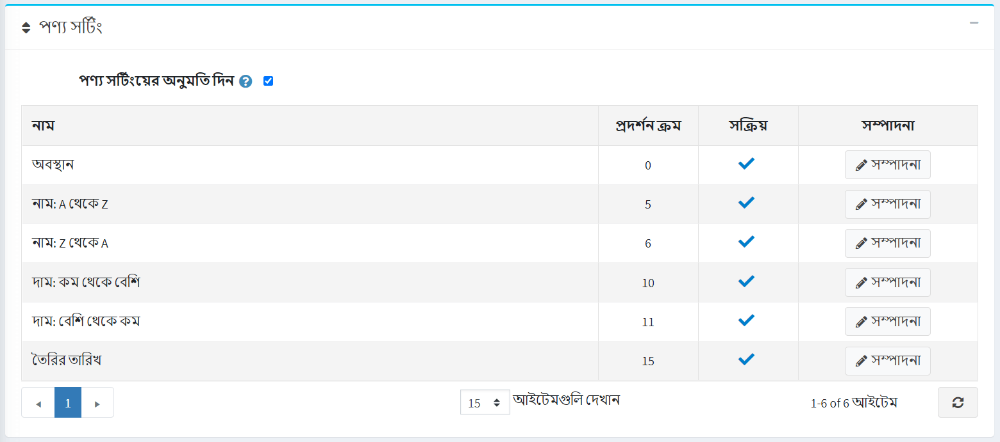

  আপনি **সম্পাদনা** বাটনে ক্লিক করে **ডিসপ্লে অর্ডার** এবং **সক্রিয়** প্রতিটি বিকল্পের বৈশিষ্ট্য সম্পাদনা করতে পারেন।
