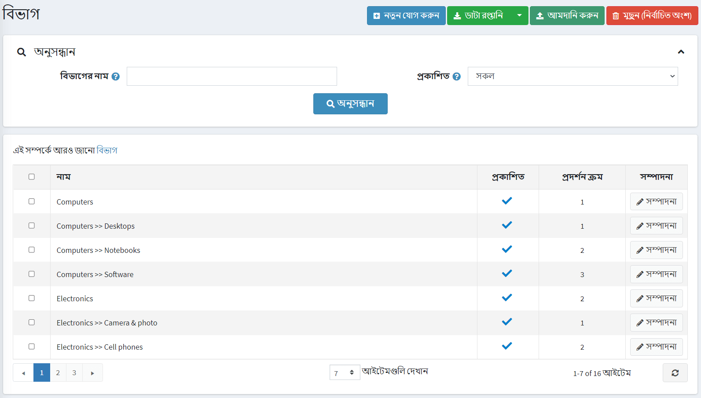
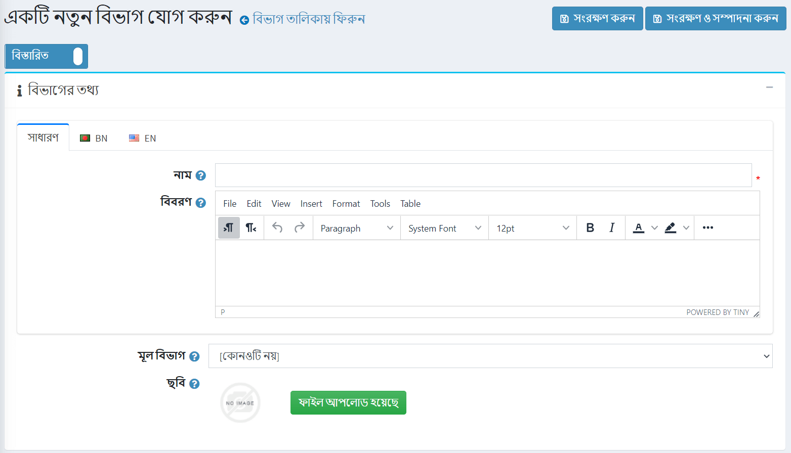
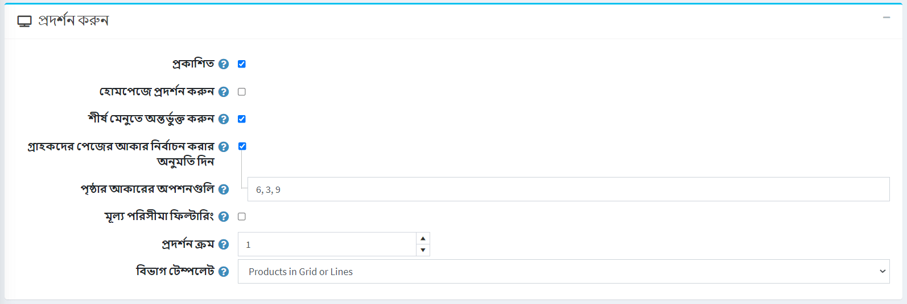
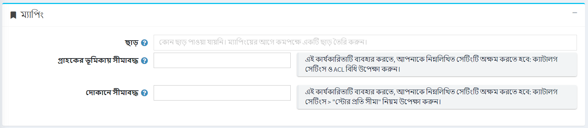
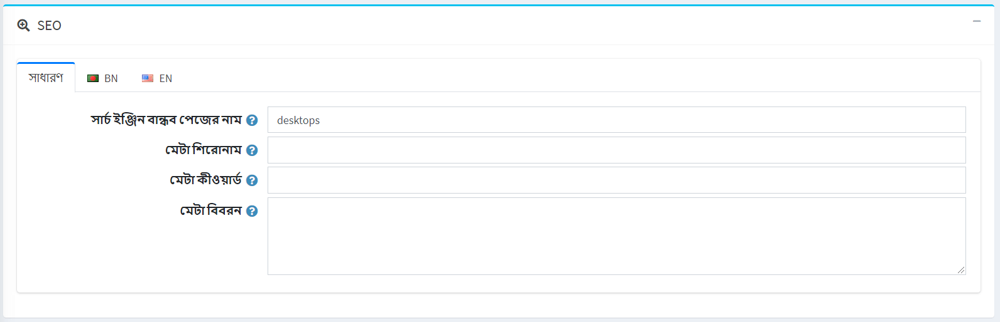
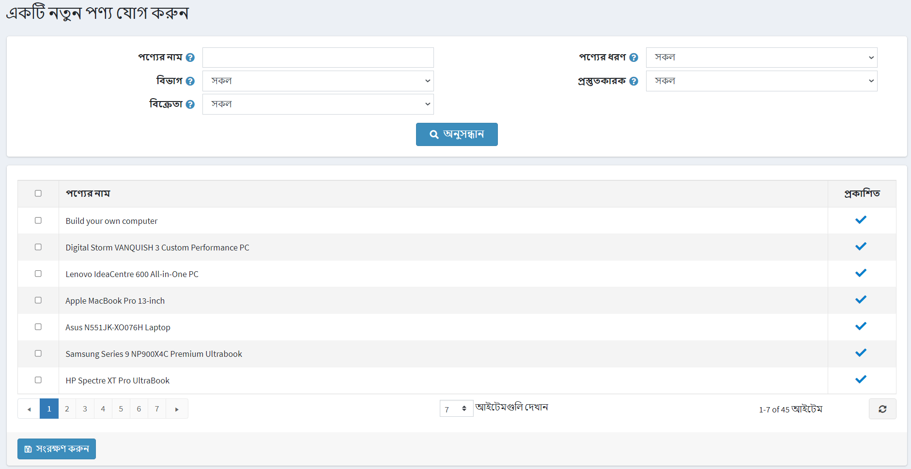
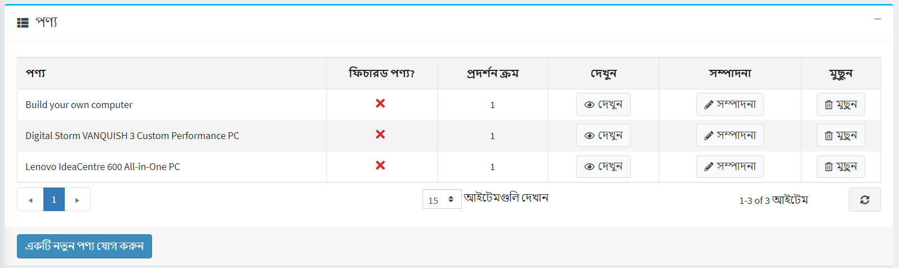

# ক্যাটাগরি

নতুন পণ্য যোগ করার আগে, একটি স্টোর ম্যানেজারের উচিত ক্যাটাগরি তৈরি করা, যেখানে পণ্যগুলি পরে বরাদ্দ করা হবে। বিভাগগুলি পরিচালনা করতে, **ক্যাটালগ → বিভাগগুলি** এ যান।



**শ্রেণী নাম** অথবা নামের একটি অংশ, **প্রকাশিত** সম্পত্তি দ্বারা অথবা নির্দিষ্ট **স্টোরের সকল বিভাগের মধ্যে (যদি বেশি হয় তবে)** *অনুসন্ধান* প্যানেলে একটি ক্যাটাগরি অনুসন্ধান করুন (যদি একাধিক স্টোর সক্রিয় হয় তবে)।

> [!NOTE]
>
> তালিকা থেকে বিভাগগুলি সরাতে, মুছে ফেলা আইটেমগুলি নির্বাচন করুন এবং **মুছুন (নির্বাচিত)** বাটনে ক্লিক করুন।
আপনি **রপ্তানি** বাটনে ক্লিক করে ব্যাকআপের উদ্দেশ্যে একটি বহিরাগত ফাইলে বিভাগগুলি রপ্তানি করতে পারেন। **রপ্তানি** বাটনে ক্লিক করার পর আপনি ড্রপডাউন মেনু দেখতে পাবেন যা আপনাকে **এক্সএমএল** অথবা **এক্সেল** রপ্তানি করতে সক্ষম করে।

## একটি নতুন ক্যাটাগরি যোগ করা

একটি নতুন ক্যাটাগরি যোগ করার জন্য পৃষ্ঠার শীর্ষে **নতুন যোগ করুন** বাটনে ক্লিক করুন। *একটি নতুন ক্যাটাগরি যোগ করুন* উইন্ডো প্রদর্শিত হবে।



এই পৃষ্ঠাটি দুটি মোডে উপলব্ধ: **উন্নত** এবং **মৌলিক**। মৌলিক মোডে স্যুইচ করুন যা শুধুমাত্র প্রধান ক্ষেত্র প্রদর্শন করে অথবা সমস্ত উপলব্ধ ক্ষেত্র প্রদর্শন করে উন্নত মোড ব্যবহার করে।

### বিভাগের তথ্য

*ক্যাটাগরির তথ্য* প্যানেলে, নিম্নলিখিত বিভাগের তথ্য সংজ্ঞায়িত করুন:

- **নাম** - এটি ক্যাটালগে প্রদর্শিত বিভাগের নাম।
- **বর্ণনা** - বিভাগের একটি বিবরণ। বিন্যাস এবং ফন্টের জন্য সম্পাদক ব্যবহার করুন।
- যদি এই বিভাগটি একটি উপশ্রেণী হবে, ড্রপ-ডাউন তালিকা থেকে একটি **অভিভাবক শ্রেণী** নির্বাচন করুন। পাবলিক স্টোরে এই ক্যাটাগরির অধীনে নতুন ক্যাটাগরি রাখা হবে।
- **ছবি** - বিভাগকে উপস্থাপনকারী একটি চিত্র। আপনার ডিভাইস থেকে ছবিটি আপলোড করুন।

### প্রদর্শন



*ডিসপ্লে* প্যানেলে, নিম্নলিখিত বিভাগের তথ্য সংজ্ঞায়িত করুন:

- পাবলিক স্টোরে বিভাগটি দৃশ্যমান করতে **প্রকাশিত** চেকবক্স নির্বাচন করুন।
- হোম পেজে বিভাগ প্রদর্শন করতে **হোম পেজে দেখান** চেকবক্স নির্বাচন করুন।
- হোম পেজের উপরের মেনুতে ক্যাটাগরি অন্তর্ভুক্ত করতে **শীর্ষ মেনুতে অন্তর্ভুক্ত** চেকবক্স নির্বাচন করুন।
- গ্রাহকদের একটি পৃষ্ঠার আকার নির্বাচন করতে সক্ষম করার জন্য **গ্রাহকদের পৃষ্ঠার আকার নির্বাচন করার অনুমতি দি** চেকবক্স নির্বাচন করুন, যেমন বিভাগ বিবরণ পৃষ্ঠায় প্রদর্শিত পণ্যের সংখ্যা। **পৃষ্ঠার আকারের বিকল্প** ক্ষেত্রের মধ্যে দোকানের মালিক কর্তৃক প্রবেশ করা পৃষ্ঠা আকারের তালিকা থেকে গ্রাহকদের দ্বারা পৃষ্ঠার আকার নির্বাচন করা যেতে পারে।
  - পূর্ববর্তী চেকবক্সে **পৃষ্ঠা আকারের বিকল্পগুলি** প্রদর্শিত হয়। পৃষ্ঠা আকারের বিকল্পগুলির একটি কমা দ্বারা বিচ্ছিন্ন তালিকা লিখুন (যেমন ১০, ৫, ১৫, ২০)। প্রথম বিকল্পটি হল ডিফল্ট পৃষ্ঠার আকার যদি কেউ নির্বাচিত না হয়।
  - **পেজ সাইজ** অপশন প্রদর্শিত হয় যদি **গ্রাহকদের পেজ সাইজ সিলেক্ট করার অনুমতি দেয়** চেকবক্সটি অনির্বাচিত হয়। এটি এই শ্রেণীর পণ্যগুলির জন্য পৃষ্ঠার আকার নির্ধারণ করে যেমন প্রতি পৃষ্ঠায় '৪' পণ্য।
  > [!TIP]
  >
  > উদাহরণস্বরূপ, যখন আপনি একটি বিভাগে সাতটি পণ্য যোগ করেন এবং আপনি তার পৃষ্ঠার আকার তিনটিতে সেট করেন। পাবলিক স্টোরে এই বিভাগের বিবরণ পাতায় প্রতি পৃষ্ঠায় তিনটি পণ্য প্রদর্শিত হবে এবং মোট পৃষ্ঠার পরিমাণ হবে তিনটি।

- যদি আপনি মূল্য পরিসীমা দ্বারা ফিল্টারিং সক্ষম করতে চান তবে **মূল্য পরিসীমা ফিল্টারিং** চেকবক্সে টিক দিন।
  - যদি আপনি মূল্য পরিসীমা ম্যানুয়ালি প্রবেশ করতে চান তাহলে **দাম মূল্য পরিসরে লিখুন** চেকবক্সে টিক দিন।
    - যদি উপরের সেটিং সক্ষম করা থাকে তবে তা থেকে 'মূল্য' লিখুন।
    - পাশাপাশি **মূল্য 'থেকে'**।
- **ডিসপ্লে অর্ডার** - বিভাগ প্রদর্শনের জন্য অর্ডার নম্বর। এই ডিসপ্লে নম্বরটি পাবলিক স্টোরে ক্যাটাগরি সাজানোর জন্য ব্যবহার করা হয় (আরোহী)। ডিসপ্লে অর্ডার ১ সহ ক্যাটাগরি তালিকার শীর্ষে থাকবে।
- **সিস্টেম → টেমপ্লেট** পৃষ্ঠায় যদি কোন কাস্টম ক্যাটাগরির টেমপ্লেট ইনস্টল করা থাকে তাহলে দায়ের করা **ক্যাটাগরি টেমপ্লেট** দৃশ্যমান। এই টেমপ্লেটটি নির্ধারণ করে কিভাবে এই বিভাগ (এবং এর পণ্য) প্রদর্শিত হবে।

### ম্যাপিং



*ম্যাপিংস* প্যানেলে, নিম্নলিখিত বিভাগের তথ্য সংজ্ঞায়িত করুন:

- **ডিসকাউন্ট** - এই বিভাগের সাথে যুক্ত ডিসকাউন্ট নির্বাচন করুন। আপনি **প্রচার → ছাড়** পৃষ্ঠাতে ছাড় তৈরি করতে পারেন। [ডিসকাউন্ট](xref:bn/running-your-store/promotional-tools/discount) অধ্যায়ে ছাড় সম্পর্কে আরও পড়ুন।

    > [!NOTE]
    >
    > নোট করুন যে শুধুমাত্র *ক্যাটাগরির জন্য নির্ধারিত* ধরনের ডিসকাউন্ট এখানে দৃশ্যমান। ক্যাটাগরিতে ডিসকাউন্ট ম্যাপ করার পরে, সেগুলি এই ক্যাটাগরির সব পণ্যে প্রয়োগ করা হয়।
    > [!NOTE]
    >
    > যদি আপনি ছাড় ব্যবহার করতে চান তবে নিশ্চিত করুন যে **কনফিগারেশন → সেটিংস → ক্যাটালগ সেটিংস → পারফরম্যান্স** প্যানেলে **ডিসকাউন্ট উপেক্ষা করুন (সাইটওয়াইড)** সেটিং অক্ষম করা আছে।

- **সীমিত গ্রাহকের ভূমিকায়** ক্ষেত্রটিতে গ্রাহকের ভূমিকা নির্বাচন করুন যা ক্যাটালগের বিভাগ দেখতে পারবে। এই বিকল্পটি প্রয়োজন না হলে এই ক্ষেত্রটি খালি রাখুন এবং বিভাগটি প্রত্যেকেই দেখতে পাবে।
    > [!NOTE]
    >
    > এই কার্যকারিতাটি ব্যবহার করার জন্য আপনাকে নিম্নলিখিত সেটিংটি অক্ষম করতে হবে: **কনফিগারেশন → ক্যাটালগ সেটিংস-এ এসিএল নিয়ম (সাইটওয়াইড) উপেক্ষা করুন**। অ্যাক্সেস নিয়ন্ত্রণ তালিকা [এখানে](xref:bn/running-your-store/customer-management/access-control-list) সম্পর্কে আরও পড়ুন।

- নির্দিষ্ট দোকানে ক্যাটাগরি বিক্রি হলে **স্টোরের মধ্যে সীমিত** ক্ষেত্রের দোকানগুলি বেছে নিন। এই কার্যকারিতা প্রয়োজন না হলে ক্ষেত্রটি খালি রাখুন।
  > [!NOTE]
  >
  > এই কার্যকারিতাটি ব্যবহার করার জন্য, আপনাকে নিম্নলিখিত সেটিংটি অক্ষম করতে হবে: **ক্যাটালগ সেটিংস "উপেক্ষা করুন" প্রতি দোকান সীমা "নিয়ম (সাইটওয়াইড)**। মাল্টি-স্টোর কার্যকারিতা সম্পর্কে আরও পড়ুন [এখানে](xref:bn/getting-start/advanced-configuration/multi-store)।

### এসইও



 *এসইও* প্যানেলে, নিম্নলিখিত বিবরণগুলি সংজ্ঞায়িত করুন:

- **সার্চ ইঞ্জিন বান্ধব পৃষ্ঠার নাম** - সার্চ ইঞ্জিন দ্বারা ব্যবহৃত পৃষ্ঠার নাম। যদি আপনি ক্ষেত্রটি ফাঁকা রাখেন, তাহলে বিভাগের নাম ব্যবহার করে বিভাগ পৃষ্ঠার URL তৈরি করা হবে। যদি আপনি কাস্টম-এসইও-পেজ-নাম লিখেন, তাহলে নিম্নলিখিত কাস্টম ইউআরএল ব্যবহার করা হবে: `http://www.yourStore.com/custom-seo-page-name`।

- **Meta title** ওয়েব পেজের শিরোনাম উল্লেখ করে। এটি একটি কোড যা আপনার ওয়েব পেজের হেডারে োকানো হয়:

    ```html
    <head>
        <title> সার্চ ইঞ্জিন অপ্টিমাইজেশন এবং ওয়েব ব্যবহারযোগ্যতার জন্য টাইটেল ট্যাগ তৈরি করা </title>
    </head>
    ```

- **মেটা কীওয়ার্ড** - ক্যাটাগরির মেটা কীওয়ার্ড, যা পৃষ্ঠার জন্য সবচেয়ে গুরুত্বপূর্ণ থিমগুলির একটি সংক্ষিপ্ত এবং সংক্ষিপ্ত তালিকা। মেটা কীওয়ার্ড ট্যাগ এর মত দেখাচ্ছে:
 `<meta name="keywords" content="কীওয়ার্ড, কীওয়ার্ড, কীওয়ার্ড ফ্রেজ, ইত্যাদি। ">

- **মেটা বর্ণনা** - বিভাগের বর্ণনা। মেটা ডেসক্রিপশন ট্যাগ হল পৃষ্ঠার বিষয়বস্তুর একটি সংক্ষিপ্ত এবং সংক্ষিপ্ত সারসংক্ষেপ। মেটা ডেসক্রিপশন ট্যাগ এর মত দেখাচ্ছে:
 `<meta name =" description "content =" আপনার পৃষ্ঠার বিষয়বস্তুর সংক্ষিপ্ত বিবরণ ">

শ্রেণীতে পণ্য যুক্ত করতে এগিয়ে যেতে **সংরক্ষণ করুন এবং সম্পাদনা চালিয়ে যান** বাটনে ক্লিক করুন।

### পণ্য

*পণ্য* প্যানেলে নির্বাচিত বিভাগ সম্পর্কিত পণ্যগুলির একটি তালিকা রয়েছে, এই পণ্যগুলি ক্যাটালগের বিভাগ অনুসারে ফিল্টার করা যায়। দোকানের মালিক ক্যাটাগরিতে নতুন পণ্য যোগ করতে পারেন। মনে রাখবেন যে আপনি পণ্য যোগ করার আগে আপনাকে বিভাগটি সংরক্ষণ করতে হবে।

আপনি এই বিভাগে অন্তর্ভুক্ত করতে চান এমন একটি পণ্য খুঁজে পেতে **একটি নতুন পণ্য যোগ করুন** ক্লিক করুন। আপনি **পণ্যের নাম**, **শ্রেণীবিভাগ**, **বিক্রেতা**, **দোকান**, **পণ্যের ধরন** এবং **প্রস্তুতকারক** দ্বারা অনুসন্ধান করতে পারেন।


যেসব পণ্য আপনি বিভাগে যোগ করতে চান সেগুলি নির্বাচন করুন এবং **সংরক্ষণ** বাটনে ক্লিক করুন। পণ্যগুলি নির্বাচিত বিভাগের অধীনে প্রদর্শিত হবে।



পণ্যটি ক্যাটাগরিতে যুক্ত হওয়ার পর, একটি পণ্যের পাশে **সম্পাদনা** বাটনে ক্লিক করে*পণ্য*টেবিলে নিম্নলিখিত তথ্য সংজ্ঞায়িত করুন:

- **বৈশিষ্ট্যযুক্ত পণ্য**।
- **প্রদর্শন আদেশ**.

> [!NOTE]
>
> **দেখুন** ক্লিক করে, আপনাকে *পণ্যের বিবরণ সম্পাদনা করুন* পৃষ্ঠায় পুন নির্দেশিত করা হবে।

**সেভ** ক্লিক করুন। নতুন বিভাগটি পাবলিক স্টোরে তার মূল বিভাগের অধীনে প্রদর্শিত হবে।

## বিভাগ আমদানি করা

আপনি যদি আপনার ক্যাটালগে ম্যানুয়ালি সব বিভাগ যোগ করতে না চান তবে আপনি আমদানি বিকল্পটি ব্যবহার করতে পারেন।

> [!NOTE]
>
> আমদানি শুরু করার আগে আপনাকে এক্সেল ফরম্যাটে আমদানির জন্য একটি টেবিল টেমপ্লেট ডাউনলোড করতে হবে। আপনার বিভাগগুলির সঠিক এবং সঠিক আমদানির জন্য টেবিলে সমস্ত কলামের সঠিকভাবে নামকরণ করা গুরুত্বপূর্ণ (ঠিক যেমন ডাউনলোড করা টেবিলে)।

সমস্ত টেবিল ক্ষেত্র পূরণ করা বাধ্যতামূলক নয়। ভরাট ক্ষেত্রের উপর ভিত্তি করে বিভাগ তৈরি করা হবে।

আমদানির জন্য প্রচুর মেমরি সম্পদ প্রয়োজন। এজন্য একবারে ৫০০ - ১০০০ এর বেশি রেকর্ড আমদানি করার সুপারিশ করা হয় না। আপনার যদি আরও রেকর্ড থাকে, সেগুলিকে একাধিক এক্সেল ফাইলে বিভক্ত করা এবং আলাদাভাবে আমদানি করা ভাল।

## আরো দেখুন

-[পণ্য যোগ করা](xref:bn/running-your-store/catalog/products/add-products)
-[এসইও](xref:bn/running-your-store/search-engine-optimization)
