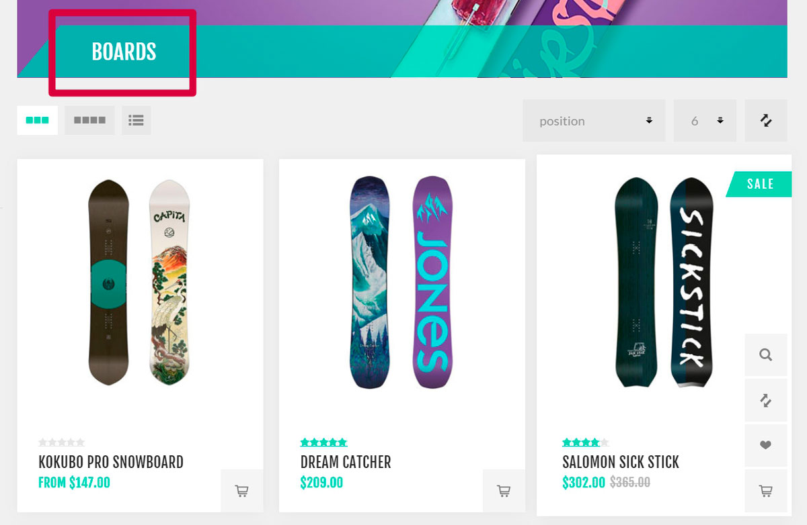
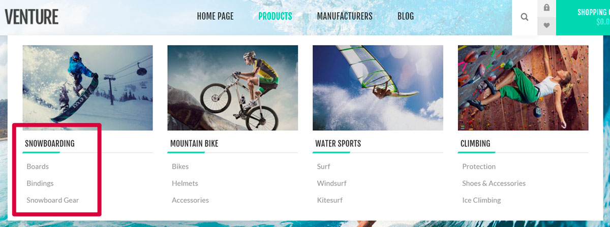

---
title: ক্যাটালগ
uid: bn/running-your-store/catalog/index
author: git.AndreiMaz
contributors: git.MDRashedKhanMenon
---

# ক্যাটালগ

পণ্যগুলি একটি অনলাইন স্টোরের ভিত্তি এবং পণ্য পরিচালনা আপনার স্টোর পরিচালনার কৌশলের একটি অত্যন্ত গুরুত্বপূর্ণ অংশ। পণ্যের তথ্য গ্রাহকদের সিদ্ধান্ত নিতে সাহায্য করে যে তারা কোন জিনিস কিনতে চায় কি না। তাই দোকানে মানসম্মত পণ্যের বিষয়বস্তু নিশ্চিত করুন, কারণ এটি আপনার গ্রাহকদের মধ্যে আস্থা তৈরি করে যে তারা ঠিক সেটাই পাচ্ছে যা তাদের প্রয়োজন এবং প্রত্যাশা।

নপকমার্স-এ পণ্য ব্যবস্থাপনার সবচেয়ে গুরুত্বপূর্ণ উপাদান হল পণ্য যোগ করা, নির্মাতারা, নেভিগেশন সহজ করার জন্য পণ্যের শ্রেণীবিভাগ স্থাপন করা, ভাল পণ্যের বিবরণ এবং আকর্ষণীয় ছবি যোগ করা, সম্ভাব্য সকল পণ্যের রূপ তালিকাভুক্ত করা, পণ্যের ট্যাগ সংজ্ঞায়িত করা একটি পণ্যের অনুসন্ধান দ্রুত এবং কার্যকর করার জন্য।

## একটি লাইভ স্টোরের উদাহরণের একটি ক্যাটালগ
নিম্নলিখিত উদাহরণগুলিতে আমরা নপ-টেমপ্লেটগুলির "Nop Venture Theme" এর উপর ভিত্তি করে আমাদের ডেমো-স্টোর ব্যবহার করব। এই তৃতীয় পক্ষের থিম [এখানে](https://www.nopcommerce.com/nop-venture-theme-14-plugins-nop-templatescom) সম্পর্কে আরও জানুন। সম্পূর্ণ ডেমো স্টোর দেখতে [ডেমো সাইট](https://frontend.nopcommerce.com/?choosetheme=2) দেখুন।

কিছু টিপস আছে যা আপনাকে আপনার গ্রাহকদের জন্য একটি ভালভাবে ডিজাইন করা ক্যাটালগ তৈরি করতে সাহায্য করবে।

### বিভাগ

- আপনার দোকানে বিভাগ যোগ করার সময় নিশ্চিত করুন যে তারা যে পণ্যগুলি (বা উপশ্রেণী) ধারণ করে তা স্পষ্টভাবে বর্ণনা করে। নিম্নলিখিত উদাহরণ হিসাবে, বোর্ড শ্রেণীতে কেবল বোর্ড রয়েছে:
	
	**ক্যাটালগ → বিভাগ** পৃষ্ঠায় **নতুন যোগ করুন** বাটন ব্যবহার করে বিভাগ তৈরি করুন।

- যখন আপনি একটি সাধারণ শ্রেণীকে নির্দিষ্ট শ্রেণীতে আলাদা করতে চান তখন উপশ্রেণীগুলি ব্যবহার করুন। এটি আপনার গ্রাহকদের জন্য অনুসন্ধান প্রক্রিয়া সহজ করে তোলে। নীচের উদাহরণ হিসাবে, ওয়াটার স্পোর্টস বিভাগে সার্ফ, উইন্ডসার্ফ এবং কাইটসার্ফ রয়েছে
উপশ্রেণি:

   
*ক্যাটাগরি এডিট পেজে **প্যারেন্ট ক্যাটাগরি** যোগ করুন যাতে এটি সাবক্যাটগরি হয়।*
সর্বাধিক জনপ্রিয় বিভাগগুলি শীর্ষ মেনুতে যুক্ত করুন যা প্রতিটি গ্রাহককে আরও গ্রাহকদের আকর্ষণ করার জন্য দৃশ্যমান:

*এটি করতে **শীর্ষ মেনুতে অন্তর্ভুক্ত করুন** বিভাগ সম্পাদনা পৃষ্ঠায় চেকবক্স ব্যবহার করুন।

- হোমপেজে সবচেয়ে আকর্ষণীয় বিভাগ যোগ করুন। আপনার দোকানে ভিজিট করার সময় একজন গ্রাহক এই বিষয়গুলি প্রথমে দেখবেন:
	
*এটি করতে **হোম পেজে দেখান** ক্যাটাগরি এডিট পেজে চেকবক্স ব্যবহার করুন।

- আপনার গ্রাহকদের ফিল্টার ব্যবহার করে বিভাগগুলিতে অনুসন্ধান করার অনুমতি দিন:
	
	*ফিল্টার কার্যকারিতা [স্পেসিফিকেশন অ্যাট্রিবিউট](xref:bn/running-your-store/catalog/products/specification-attributes) ব্যবহার করে।*

- আপনার গ্রাহকদের পণ্য সাজানোর এবং প্রদর্শন মোড পরিবর্তন করার অনুমতি দিন:

*সাজানোর বিষয়ে আরও তথ্যের জন্য [ক্যাটালগ সেটিংস-পণ্য বাছাই](xref:bn/running-your-store/catalog/catalog-settings#product-sorting) বিভাগে যান। ডিসপ্লে মোড সেট আপ করার জন্য **ক্রেতাদের পৃষ্ঠার আকার নির্বাচন করার অনুমতি দিন** এবং **পৃষ্ঠা আকারের বিকল্প** বিভাগ সম্পাদনা পাতা থেকে ক্ষেত্রগুলি ব্যবহার করুন।

কীভাবে একটি বিভাগ তৈরি করতে হয় তা জানতে [বিভাগগুলি](xref:bn/running-your-store/catalog/categories) অধ্যায় দেখুন।

## আরো দেখুন

* [বিভাগ](xref:bn/running-your-store/catalog/category)
* [নির্মাতারা](xref:bn/running-your-store/catalog/Manufactures)
* [গুণাবলী](xref:bn/running-your-store/catalog/products/product-attributes)
* [পণ্য](xref:bn/running-your-store/catalog/products/index)
* [ক্যাটালগ সেটিংস](xref:bn/running-your-store/catalog/catalog-settings)
