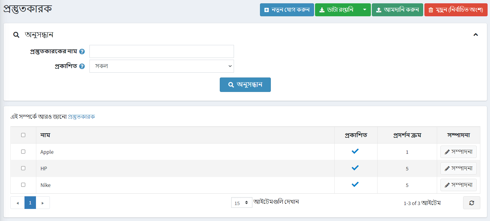
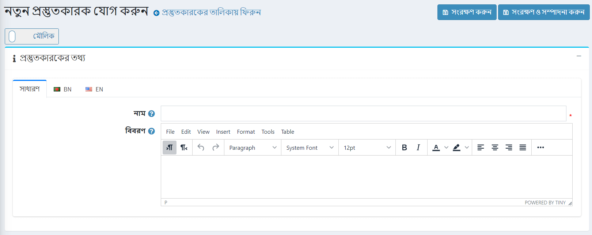
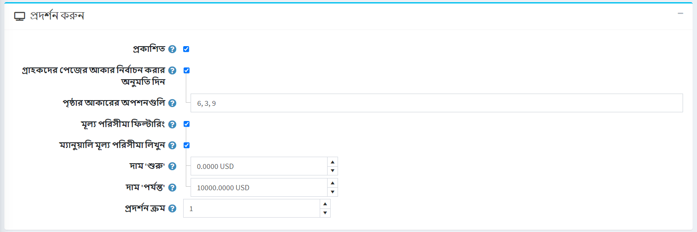
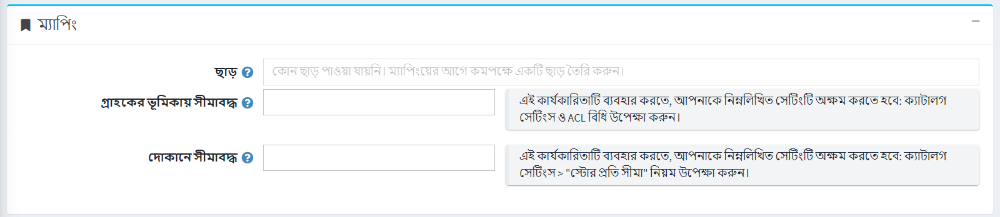
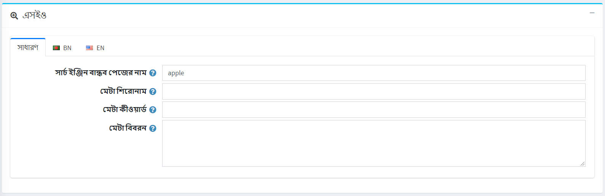
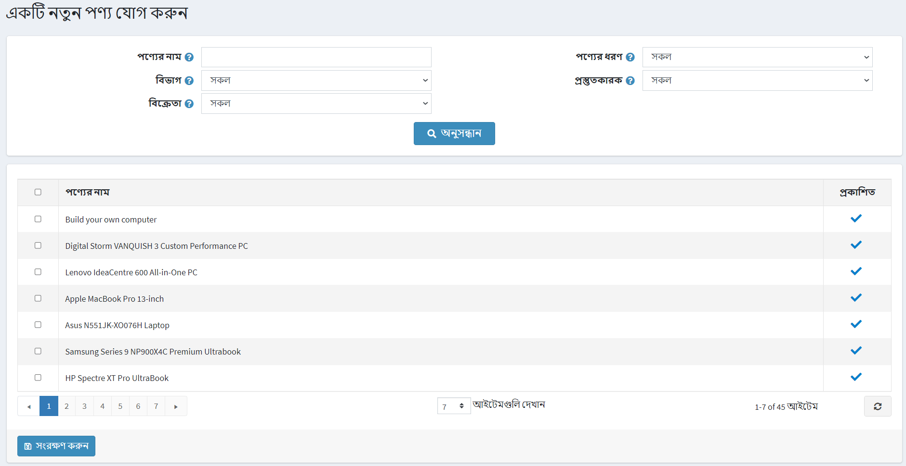
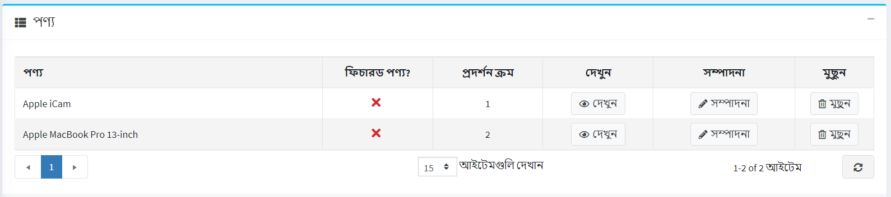

# নির্মাতারা

নির্মাতাদের পরিচালনা করতে যান **ক্যাটালগ → নির্মাতারা**।



**প্রস্তুতকারকের নাম** অথবা নামের একটি অংশ, **প্রকাশিত** সম্পত্তি দ্বারা বা নির্দিষ্ট **স্টোরের সমস্ত নির্মাতাদের মধ্যে** (যদি বেশি একাধিক স্টোর সক্রিয়)।

> [!NOTE]
>
> তালিকা থেকে নির্মাতাদের অপসারণ করতে, মুছে ফেলা আইটেমগুলি নির্বাচন করুন এবং **মুছুন (নির্বাচিত)** বাটনে ক্লিক করুন।
আপনি **এক্সপোর্ট** বাটনে ক্লিক করে ব্যাকআপের উদ্দেশ্যে নির্মাতাদের একটি বহিরাগত ফাইলে রপ্তানি করতে পারেন। **এক্সপোর্ট** বাটনে ক্লিক করার পর আপনি ড্রপডাউন মেনু দেখতে পাবেন যা আপনাকে **এক্সএমএল** বা **এক্সেল** থেকে এক্সপোর্ট করতে সক্ষম করে।

## একটি নতুন প্রস্তুতকারক যোগ করা হচ্ছে

একটি নতুন প্রস্তুতকারক যোগ করতে পৃষ্ঠার শীর্ষে **নতুন যোগ করুন** বাটনে ক্লিক করুন। *একটি নতুন প্রস্তুতকারক যোগ করুন* উইন্ডো প্রদর্শিত হবে।



এই পৃষ্ঠাটি দুটি মোডে উপলব্ধ: **উন্নত** এবং **মৌলিক**। মৌলিক মোডে স্যুইচ করুন যা শুধুমাত্র প্রধান ক্ষেত্র প্রদর্শন করে অথবা সমস্ত উপলব্ধ ক্ষেত্র প্রদর্শন করে উন্নত মোড ব্যবহার করে।

### প্রস্তুতকারকের তথ্য

*প্রস্তুতকারকের তথ্য* প্যানেলে, নিম্নলিখিত বিবরণগুলি সংজ্ঞায়িত করুন:

- **নাম** - এটি ক্যাটালগে প্রদর্শিত প্রস্তুতকারকের নাম।
- **বর্ণনা** - প্রস্তুতকারকের বিবরণ। বিন্যাস এবং ফন্টের জন্য সম্পাদক ব্যবহার করুন।
- **ছবি** - প্রস্তুতকারকের প্রতিনিধিত্বকারী একটি ছবি। আপনার ডিভাইস থেকে ছবিটি আপলোড করুন।

### প্রদর্শন



*ডিসপ্লে* প্যানেলে, নিম্নলিখিত বিবরণ সংজ্ঞায়িত করুন:

- প্রকাশককে পাবলিক স্টোরে দৃশ্যমান করতে সক্ষম করতে **প্রকাশিত** চেকবক্স নির্বাচন করুন।
- গ্রাহকদের একটি পৃষ্ঠার আকার নির্বাচন করতে সক্ষম করার জন্য **গ্রাহকদের পৃষ্ঠার আকার নির্বাচন করার অনুমতি দিন** চেকবক্স নির্বাচন করুন, যেমন নির্মাতার বিবরণ পৃষ্ঠায় প্রদর্শিত পণ্যের সংখ্যা। **পৃষ্ঠার আকারের বিকল্প** ক্ষেত্রের মধ্যে দোকানের মালিক কর্তৃক প্রবেশ করা পৃষ্ঠা আকারের তালিকা থেকে গ্রাহকদের দ্বারা পৃষ্ঠার আকার নির্বাচন করা যেতে পারে।
  - পূর্ববর্তী চেকবক্সে **পৃষ্ঠা আকারের বিকল্পগুলি** প্রদর্শিত হয়। পৃষ্ঠা আকারের বিকল্পগুলির একটি কমা দ্বারা বিচ্ছিন্ন তালিকা লিখুন (যেমন ১০, ৫, ১৫, ২০)। প্রথম বিকল্পটি হল ডিফল্ট পৃষ্ঠার আকার যদি কেউ নির্বাচিত না হয়।
  - **পেজ সাইজ** অপশন প্রদর্শিত হয় যদি **গ্রাহকদের পেজ সাইজ সিলেক্ট করার অনুমতি দেয়** চেকবক্সটি অনির্বাচিত হয়। এটি এই প্রস্তুতকারকের পণ্যের জন্য পৃষ্ঠার আকার নির্ধারণ করে যেমন প্রতি পৃষ্ঠায় '৪' পণ্য।
    > [!TIP]
    >
    > উদাহরণস্বরূপ, যখন আপনি একটি প্রস্তুতকারকের কাছে সাতটি পণ্য যোগ করেন এবং আপনি তার পৃষ্ঠার আকার তিনটিতে সেট করেন। পাবলিক স্টোরে এই নির্মাতার বিশদ পৃষ্ঠায় প্রতি পৃষ্ঠায় তিনটি পণ্য প্রদর্শিত হবে এবং মোট পৃষ্ঠার পরিমাণ হবে তিনটি।

- যদি আপনি মূল্য পরিসীমা দ্বারা ফিল্টারিং সক্ষম করতে চান তবে **মূল্য পরিসীমা ফিল্টারিং** চেকবক্সে টিক দিন।
  - যদি আপনি মূল্য পরিসীমা ম্যানুয়ালি প্রবেশ করতে চান তাহলে **দাম মূল্য পরিসরে লিখুন** চেকবক্সে টিক দিন।
    - যদি উপরের সেটিং সক্ষম করা থাকে তবে ** থেকে 'মূল্য' লিখুন।
    - পাশাপাশি **মূল্য 'থেকে'**।
- **ডিসপ্লে অর্ডার** - প্রস্তুতকারকের প্রদর্শনের জন্য অর্ডার নম্বর। এই ডিসপ্লে নম্বরটি পাবলিক স্টোরে (আরোহী) নির্মাতাদের সাজানোর জন্য ব্যবহৃত হয়। ডিসপ্লে অর্ডার 	১ সহ প্রস্তুতকারক তালিকার শীর্ষে থাকবে।
- **সিস্টেম → টেমপ্লেট** পৃষ্ঠায় যদি কোন কাস্টম প্রস্তুতকারক টেমপ্লেট ইনস্টল করা থাকে তবে দায়ের করা **প্রস্তুতকারক টেমপ্লেটটি** দৃশ্যমান। এই টেমপ্লেটটি নির্ধারণ করে কিভাবে এই প্রস্তুতকারক (এবং এর পণ্য) প্রদর্শিত হবে।

### ম্যাপিং



*ম্যাপিংস* প্যানেলে, নিম্নলিখিত বিবরণ সংজ্ঞায়িত করুন:

- **ছাড়** - এই নির্মাতার সাথে যুক্ত ডিসকাউন্ট নির্বাচন করুন। আপনি **প্রচার → ছাড়** পৃষ্ঠাতে ছাড় তৈরি করতে পারেন। [ডিসকাউন্ট](xref:bn/running-your-store/promotional-tools/discount) অধ্যায়ে ছাড় সম্পর্কে আরও পড়ুন।

    > [!NOTE]
    >
    > মনে রাখবেন যে শুধুমাত্র *নির্মাতাদের নির্ধারিত* প্রকারের ছাড় এখানে দৃশ্যমান। নির্মাতাকে ডিসকাউন্ট ম্যাপ করার পর, তারা এই নির্মাতার সকল পণ্যে প্রয়োগ করা হয়।

    > [!NOTE]
    >
    > আপনি যদি ডিসকাউন্ট ব্যবহার করতে চান তবে নিশ্চিত করুন যে **কনফিগারেশন → সেটিংস → ক্যাটালগ সেটিংস → পারফরমেন্স** প্যানেলে * ডিসকাউন্ট উপেক্ষা করুন (সাইটওয়াইড)** সেটিং অক্ষম করা আছে।

- **সীমিত গ্রাহকের ভূমিকায়** ক্ষেত্রটিতে গ্রাহকের ভূমিকা নির্বাচন করুন যা প্রস্তুতকারককে ক্যাটালগে দেখতে পারবে। এই বিকল্পটি প্রয়োজন না হলে এবং ক্ষেত্রটি খালি রেখে দিন এবং নির্মাতাকে সবাই দেখতে পারে।
    > [!NOTE]
    >
    > এই কার্যকারিতাটি ব্যবহার করার জন্য আপনাকে নিম্নলিখিত সেটিংটি অক্ষম করতে হবে: **কনফিগারেশন → ক্যাটালগ সেটিংস A ACL নিয়ম (সাইটওয়াইড) উপেক্ষা করুন**। অ্যাক্সেস নিয়ন্ত্রণ তালিকা সম্পর্কে আরও পড়ুন [এখানে](xref:bn/running-your-store/customer-management/access-control-list)।

- যদি নির্মাতারা নির্দিষ্ট দোকানে বিক্রি হয় তবে **সীমিত দোকানে** ক্ষেত্রের দোকানগুলি বেছে নিন। এই কার্যকারিতা প্রয়োজন না হলে ক্ষেত্রটি খালি রাখুন।
  > [!NOTE]
  >
  > এই কার্যকারিতাটি ব্যবহার করার জন্য, আপনাকে নিম্নলিখিত সেটিংটি অক্ষম করতে হবে: **ক্যাটালগ সেটিংস "উপেক্ষা করুন" প্রতি দোকান সীমা "নিয়ম (সাইটওয়াইড)**। মাল্টি-স্টোর কার্যকারিতা সম্পর্কে আরও পড়ুন [এখানে](xref:bn/getting-start/advanced-configuration/multi-store)।

### এসইও



*এসইও* প্যানেলে, নিম্নলিখিত বিবরণগুলি সংজ্ঞায়িত করুন:

- **সার্চ ইঞ্জিন বান্ধব পৃষ্ঠার নাম** - সার্চ ইঞ্জিন দ্বারা ব্যবহৃত পৃষ্ঠার নাম। আপনি যদি ক্ষেত্রটি ফাঁকা রাখেন, তাহলে প্রস্তুতকারকের নাম ব্যবহার করে প্রস্তুতকারক পৃষ্ঠার ইউআরএল তৈরি হবে। যদি আপনি কাস্টম-এসইও-পেজ-নাম লিখেন, তাহলে নিম্নলিখিত কাস্টম ইউআরএল ব্যবহার করা হবে: `http://www.yourStore.com/custom-seo-page-name`।
- 
- **মেটা শিরোনাম** ওয়েব পেজের শিরোনাম উল্লেখ করে। এটি একটি কোড যা আপনার ওয়েব পেজের হেডারে োকানো হয়:

    ```html
    <head>
        <title> সার্চ ইঞ্জিন অপ্টিমাইজেশন এবং ওয়েব ব্যবহারযোগ্যতার জন্য টাইটেল ট্যাগ তৈরি করা </title>
    </head>
    ```

- **মেটা কীওয়ার্ড** - প্রস্তুতকারক মেটা কীওয়ার্ড, যা পৃষ্ঠার জন্য সবচেয়ে গুরুত্বপূর্ণ থিমগুলির একটি সংক্ষিপ্ত এবং সংক্ষিপ্ত তালিকা। মেটা কীওয়ার্ড ট্যাগ এর মত দেখায়:`<meta name="keywords" content="কীওয়ার্ড, কিওয়ার্ড, কীওয়ার্ড ফ্রেজ ইত্যাদি।">`

- **মেটা বর্ণনা** - প্রস্তুতকারকের বর্ণনা। মেটা ডেসক্রিপশন ট্যাগ হল পৃষ্ঠার বিষয়বস্তুর একটি সংক্ষিপ্ত এবং সংক্ষিপ্ত সারসংক্ষেপ। মেটা ডেসক্রিপশন ট্যাগ এর মত দেখায়: `<meta name="description" content="আপনার পৃষ্ঠার বিষয়বস্তুর সংক্ষিপ্ত বিবরণ">`

প্রস্তুতকারকের পণ্য যোগ করতে এগিয়ে যেতে **সংরক্ষণ করুন এবং সম্পাদনা চালিয়ে যান** বাটনে ক্লিক করুন।

### পণ্য

*পণ্য* প্যানেলে নির্বাচিত প্রস্তুতকারকের সাথে সম্পর্কিত পণ্যের একটি তালিকা থাকে, এই পণ্যগুলি প্রস্তুতকারকের দ্বারা ক্যাটালগে ফিল্টার করা যায়। দোকানের মালিক প্রস্তুতকারকের কাছে নতুন পণ্য যোগ করতে পারেন। মনে রাখবেন যে আপনি পণ্য যোগ করার আগে আপনাকে প্রস্তুতকারককে সংরক্ষণ করতে হবে।

আপনি এই প্রস্তুতকারকের অন্তর্ভুক্ত করতে চান এমন একটি পণ্য খুঁজে পেতে একটি নতুন পণ্য যোগ করুন এ ক্লিক করুন। আপনি **পণ্যের নাম**, **শ্রেণীবিভাগ**, **বিক্রেতা**, **দোকান**, **পণ্যের ধরন** এবং **প্রস্তুতকারক** দ্বারা অনুসন্ধান করতে পারেন।



আপনি প্রস্তুতকারকের সাথে যোগ করতে চান এমন পণ্যগুলি নির্বাচন করুন এবং **সংরক্ষণ** বাটনে ক্লিক করুন। পণ্য নির্বাচিত প্রস্তুতকারকের অধীনে প্রদর্শিত হবে।



পণ্যটি প্রস্তুতকারকের সাথে যুক্ত হওয়ার পরে, একটি পণ্যের পাশে **সম্পাদনা** বাটনে ক্লিক করে*পণ্য*টেবিলে নিম্নলিখিত তথ্যগুলি সংজ্ঞায়িত করুন:

- **বৈশিষ্ট্যযুক্ত পণ্য**।
- **প্রদর্শন আদেশ**.

> [!NOTE]
>
> **দেখুন** ক্লিক করে, আপনাকে*পণ্যের বিবরণ সম্পাদনা করুন*পৃষ্ঠায় পুননির্দেশিত করা হবে।

**সেভ** ক্লিক করুন।

## আমদানিকারকরা

আপনি যদি আপনার ক্যাটালগে সব নির্মাতাকে ম্যানুয়ালি যোগ করতে না চান তবে আপনি আমদানি বিকল্পটি ব্যবহার করতে পারেন।

> [!NOTE]
>
> আমদানি শুরু করার আগে আপনার এক্সেল ফরম্যাটে আমদানির জন্য একটি টেবিল টেমপ্লেট ডাউনলোড করা উচিত। আপনার নির্মাতাদের সঠিক এবং সঠিক আমদানির জন্য টেবিলে সমস্ত কলামের সঠিকভাবে নামকরণ করা গুরুত্বপূর্ণ (ঠিক যেমন ডাউনলোড করা টেবিলে)।

সমস্ত টেবিল ক্ষেত্র পূরণ করা বাধ্যতামূলক নয়। ভরাট ক্ষেত্রের উপর ভিত্তি করে প্রস্তুতকারক তৈরি করা হবে।

আমদানির জন্য প্রচুর মেমরি সম্পদ প্রয়োজন। এজন্য একবারে ৫০০ - ১০০০ এর বেশি রেকর্ড আমদানি করার সুপারিশ করা হয় না। আপনার যদি আরও রেকর্ড থাকে, সেগুলিকে একাধিক এক্সেল ফাইলে বিভক্ত করা এবং আলাদাভাবে আমদানি করা ভাল।

## আরো দেখুন

-[পণ্য যোগ করা](xref:bn/running-your-store/catalog/products/add-products)
-[এসইও](xref:bn/running-your-store/search-engine-optimization)

## টিউটোরিয়াল

- [নপকমার্স-এ নির্মাতাদের পরিচালনা করা](https://www.youtube.com/watch?v=NnWD9-zi8s4&feature=youtu.be)
