# পণ্য যোগ করা

সম্ভাব্য সর্বোত্তম উপায়ে পণ্য সেট আপ করা একটি দোকানের জন্য অত্যন্ত গুরুত্বপূর্ণ। নিশ্চিত করুন যে কোনও বিবরণ মিস করবেন না, যেমন বিভিন্ন আকার এবং রঙের বিকল্প প্রদর্শন করা, পণ্যের পুঙ্খানুপুঙ্খ বিবরণ দেওয়া, আকর্ষণীয় ছবি যুক্ত করা ইত্যাদি।

একটি নতুন পণ্য যোগ করতে, **ক্যাটালগ → পণ্য** এ যান। ডান উপরের কোণে **নতুন যোগ করুন** বাটনে ক্লিক করুন।

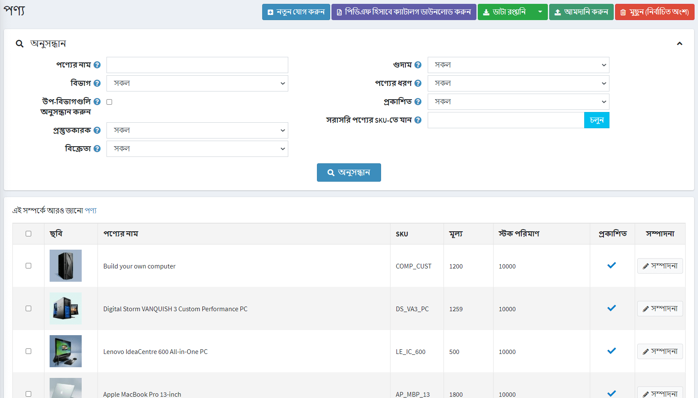

> [!NOTE]
>
> আপনি **আমদানি** বাটনে ক্লিক করে একটি বাহ্যিক ফাইল থেকে পণ্য আমদানি করতে পারেন। একবার আপনার পণ্যের একটি তালিকা হয়ে গেলে, আপনি **এক্সপোর্ট** বাটনে ক্লিক করে ব্যাকআপ উদ্দেশ্যে এটি একটি বহিরাগত ফাইলে রপ্তানি করতে পারেন। **রপ্তানি** বাটনে ক্লিক করার পর আপনি ড্রপডাউন মেনু দেখতে পাবেন যা আপনাকে এক্সপ্লের এক্সএমএল (সব পাওয়া) **অথবা এক্সপোর্ট এক্সএমএল (নির্বাচিত)** এবং **এক্সেল এক্সপোর্ট করতে (সব পাওয়া)** বা **এক্সেলে রপ্তানি করুন (নির্বাচিত)**। অতিরিক্তভাবে, **নির্বাচিত পণ্যগুলিকে পিডিএফ ফাইলে মুদ্রণ করতে** পিডিএফ হিসাবে ক্যাটালগ ডাউনলোড করা সম্ভব। তালিকা থেকে পণ্যগুলি সরানোর জন্য, মুছে ফেলা আইটেমগুলি নির্বাচন করুন এবং **মুছুন (নির্বাচিত)** বাটনে ক্লিক করুন।

*একটি নতুন পণ্য যোগ করুন*পৃষ্ঠা দুটি মোডে উপলব্ধ: **উন্নত** এবং **মৌলিক** (ডিফল্টরূপে উন্নত মোডে)। আপনি মৌলিক মোডে স্যুইচ করতে পারেন যা শুধুমাত্র প্রয়োজনীয় ক্ষেত্র প্রদর্শন করে।

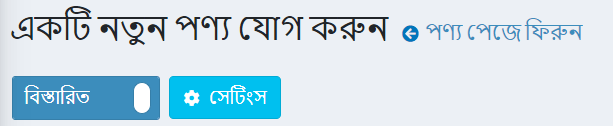

আপনি কোন মৌলিক ক্ষেত্রগুলি প্রয়োজন তা চয়ন করতে *মৌলিক* মোড সেট আপ করতে পারেন। এটি করার জন্য সুইথের পাশে **সেটিংস** বাটনে ক্লিক করুন। *সেটিং* পপআপ প্রদর্শিত হবে, নিম্নরূপ:

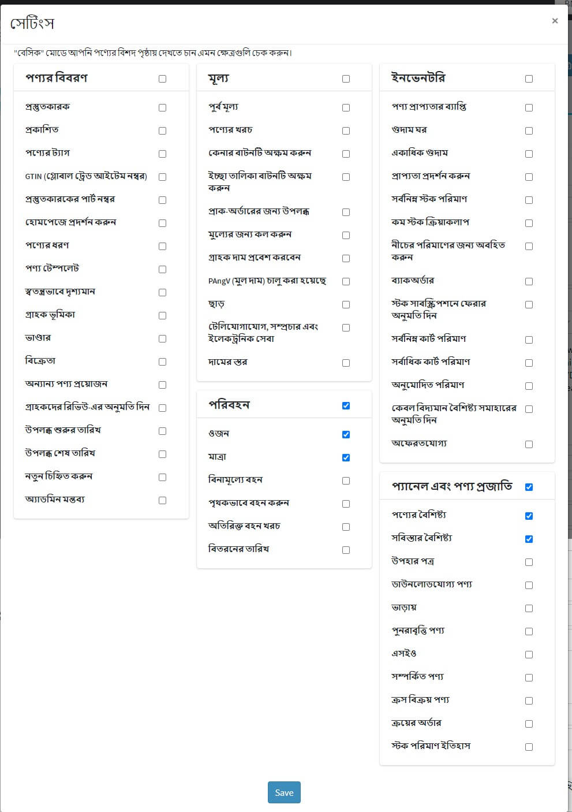

প্রয়োজনীয় ক্ষেত্রগুলিতে টিক দিন এবং ** সংরক্ষণ করুন ** ক্লিক করুন। মনে রাখবেন এই ক্ষেত্রে পৃষ্ঠাটি রিফ্রেশ হবে।

## পণ্যের তথ্য

*পণ্য তথ্য* প্যানেলে সাধারণ তথ্য পূরণ করে শুরু করুন:

- **পণ্যের নাম লিখুন**
- পণ্যটি লিখুন **সংক্ষিপ্ত বিবরণ** যা ক্যাটালগে প্রদর্শিত হবে।
- পণ্যটি লিখুন **সম্পূর্ণ বিবরণ** যা পণ্যের বিবরণ পৃষ্ঠায় দেখানো হবে। এখানে আপনি পাঠ্য, বুলেট পয়েন্ট, লিঙ্ক বা অতিরিক্ত ছবি যোগ করতে পারেন। একটি বিস্তারিত বিবরণ লিখতে ভুলবেন না কারণ এটি আপনার ক্রেতাদের সিদ্ধান্ত গ্রহণকে প্রভাবিত করে।
- পণ্য **এসকেইউ** লিখুন। এই পণ্য স্টক পালন ইউনিট, অভ্যন্তরীণভাবে পণ্য ট্র্যাকিং জন্য ব্যবহৃত। এই পণ্যটি ট্র্যাক করার জন্য এটি আপনার অভ্যন্তরীণ অনন্য আইডি।
- **বিভাগ**। আপনি যতগুলি বিভাগ চান আপনি একটি পণ্য বরাদ্দ করতে পারেন। **ক্যাটালগ → বিভাগ** এ আপনি [পণ্য বিভাগ](xref:bn/running-your-store/catalog/category) পরিচালনা করতে পারেন।

- **প্রস্তুতকারক**। আপনি যতগুলি নির্মাতাদের চান তাদের একটি পণ্য বরাদ্দ করতে পারেন। আপনি [নির্মাতারা](xref:bn/running-your-store/catalog/Manufacturers) পরিচালনা করতে পারেন **ক্যাটালগ → নির্মাতারা** এ।

- আপনার দোকানে পণ্যটি দৃশ্যমান করতে **প্রকাশিত** টিক দিন।
- **পণ্য ট্যাগ লিখুন**, পণ্য সনাক্তকরণের জন্য কীওয়ার্ড কমা দ্বারা তাদের আলাদা করে ট্যাগ লিখুন। একটি নির্দিষ্ট ট্যাগের সাথে যত বেশি পণ্য যুক্ত হবে, ক্যাটালগ পৃষ্ঠার সাইডবারে প্রদর্শিত *জনপ্রিয় ট্যাগ* ক্লাউডে এটি তত বড় হবে। [প্রোডাক্ট ট্যাগ](xref:bn/running-your-store/catalog/products/product-tags) বিভাগে কীভাবে পণ্য ট্যাগগুলি পরিচালনা করবেন তা আরও পড়ুন।
  
  [জনপ্রিয় ট্যাগ](_static/add-product-for-beginners/popular_tags.png)

- **জিটিইন (গ্লোবাল ট্রেড আইটেম নম্বর)** লিখুন। এই শনাক্তকারীদের মধ্যে রয়েছে ইউপিসি (উত্তর আমেরিকায়), ইএএন (ইউরোপে), যেএএন (জাপানে), এবং আইএসবিএন (বইগুলির জন্য)।
- **প্রস্তুতকারকের অংশ নম্বর লিখুন**। এটি একটি নির্মাতা পণ্যের জন্য প্রদত্ত একটি অংশ নম্বর।
- আপনার দোকানের হোম পেজে এই পণ্যটি প্রদর্শন করতে **হোমপেজে দেখান** চেকবক্সে টিক দিন। আপনার সর্বাধিক জনপ্রিয় পণ্যের জন্য প্রস্তাবিত। যদি এই চেকবক্সে টিক দেওয়া থাকে, দোকানের মালিক পণ্যের **ডিসপ্লে অর্ডার** নির্দিষ্ট করতে পারেন। ১ তালিকার শীর্ষে প্রতিনিধিত্ব করে।
- **পণ্যের ধরন** *সহজ* বা *গোষ্ঠীভুক্ত* হিসাবে সেট করুন। [গ্রুপযুক্ত পণ্য (রূপ)](xref:bn/running-your-store/catalog/products/grouped-products-variants) অধ্যায়ে পণ্যের ধরন সম্পর্কে আরও পড়ুন।
- **প্রোডাক্ট টেমপ্লেট** ফিল্ড দেখা যায় যদি আপনার কোন কাস্টম প্রোডাক্ট টেমপ্লেট ইনস্টল করা থাকে **সিস্টেম → টেমপ্লেট** পেজে।
- টিক করুন **পৃথকভাবে দৃশ্যমান** যদি আপনি পণ্যটি ক্যাটালগ বা অনুসন্ধানের ফলাফলে দেখতে চান, অন্যথায় পণ্যটি ক্যাটালগে লুকানো থাকবে এবং শুধুমাত্র একটি গোষ্ঠীভুক্ত পণ্যের বিবরণ পৃষ্ঠা থেকে অ্যাক্সেসযোগ্য হবে।
- **গ্রাহকের ভূমিকা** চয়ন করুন যা ক্যাটালগে পণ্যটি দেখতে সক্ষম হবে। এই বিকল্পটি প্রয়োজন না হলে এই ক্ষেত্রটি খালি রেখে দিন এবং পণ্যটি সবাই দেখতে পারে।
    > [!NOTE]
    >
    > এই কার্যকারিতাটি ব্যবহার করার জন্য আপনাকে নিম্নলিখিত সেটিংটি নিষ্ক্রিয় করতে হবে: **কনফিগারেশন → ক্যাটালগ সেটিংস → এসিএল উপেক্ষা করুন  (সাইটওয়াইড)**। অ্যাক্সেস নিয়ন্ত্রণ তালিকা সম্পর্কে আরও পড়ুন [এখানে](xref:bn/running-your-store/customer-management/access-control-list)।
- নির্দিষ্ট দোকানে পণ্য বিক্রি হলে **স্টোরের মধ্যে সীমিত** ক্ষেত্রের দোকানগুলি বেছে নিন। এই কার্যকারিতা প্রয়োজন না হলে ক্ষেত্রটি খালি রাখুন।
  > [!NOTE]
  >
  > এই কার্যকারিতা ব্যবহার করার জন্য, আপনাকে নিম্নলিখিত সেটিংটি অক্ষম করতে হবে: **ক্যাটালগ সেটিংস "উপেক্ষা করুন" প্রতি দোকান সীমা "নিয়ম (সাইটওয়াইড)**। মাল্টি-স্টোর কার্যকারিতা সম্পর্কে আরও পড়ুন [এখানে](xref:bn/getting-start/advanced-configuration/multi-store)।

- **বিক্রেতা**। আপনি [বিক্রেতাদের](xref:bn/running-your-store/vendor-management) পরিচালনা করতে পারেন **গ্রাহক →বিক্রেতারা** এ।
- প্রোডাক্ট **অন্য প্রোডাক্টের প্রয়োজন** নির্ধারণ করুন। এই ক্ষেত্রে **প্রয়োজনীয় প্রোডাক্ট আইডি নির্বাচন করুন** কমা দ্বারা আলাদা করে প্রবেশ করুন, নিশ্চিত করুন যে কোন বৃত্তাকার রেফারেন্স নেই, যেমন ক এর প্রয়োজন খ, খ এর প্রয়োজন ক। চয়ন করুন ** যদি প্রয়োজন হয় তবে এই পণ্যগুলিকে স্বয়ংক্রিয়ভাবে কার্টে যুক্ত করুন
- গ্রাহকদের এই পণ্যটি পর্যালোচনা করতে সক্ষম করতে, **গ্রাহক পর্যালোচনার অনুমতি দিন** টিক দিন।
- পণ্যের প্রাপ্যতার **উপলভ্য শুরুর তারিখ** এবং/অথবা **উপলভ্য শেষ তারিখ** নির্ধারণ করুন।
- সাম্প্রতিক যোগ করা পণ্যটি চিহ্নিত করতে, **নতুন হিসেবে চিহ্নিত করুন**। এইভাবে আপনি "নতুন পণ্য" পৃষ্ঠায় প্রদর্শিত পণ্যের একটি তালিকা পরিচালনা করতে পারেন। আপনি একটি নির্দিষ্ট সময়ও নির্দিষ্ট করতে পারেন যার সময় এই পণ্যটি নতুন হিসাবে চিহ্নিত করা হবে **নতুন হিসাবে চিহ্নিত করুন। শুরুর তারিখ** এবং **নতুন হিসাবে চিহ্নিত করুন। শেষ তারিখ** ক্ষেত্র।
- **অ্যাডমিন মন্তব্য** ক্ষেত্রের তথ্যের উদ্দেশ্যে একটি মন্তব্য লিখুন। এই মন্তব্যটি শুধুমাত্র অভ্যন্তরীণ ব্যবহারের জন্য, গ্রাহকদের জন্য দৃশ্যমান নয়।

## দাম

*মূল্য* প্যানেলে সংজ্ঞায়িত করুন:

- **মূল্য**, একটি পূর্বনির্ধারিত মুদ্রায়।
    > [!NOTE]
    >
    > আপনি **কনফিগারেশন → কারেন্সি** এ দোকানের মুদ্রা পরিবর্তন করতে পারেন। মুদ্রা সম্পর্কে আরও পড়ুন [এখানে](xref:bn/getting-start/configure-payment/advanced-configuration/currencies)।

- **পুরাতন মূল্য**. যদি এটি শূন্যের চেয়ে বড় হয় তবে এটি পাবলিক স্টোরে দৃশ্যমান হয় এবং তুলনামূলক উদ্দেশ্যে নতুন মূল্যের পাশে প্রদর্শিত হয়।
- **পণ্যের খরচ**, পণ্য বা সেবার উৎপাদনের সাথে যুক্ত সকল খরচের সমষ্টি। এটি গ্রাহকদের কাছে প্রদর্শিত হয় না।
- থেকে **কিনুন বোতাম অক্ষম করুন**। এটি "অনুরোধের ভিত্তিতে" পণ্যগুলির জন্য দরকারী হতে পারে।
- থেকে ** উইশলিস্ট বোতাম অক্ষম করুন **।
- **প্রি-অর্ডারের জন্য উপলব্ধ** যদি পণ্যটি এখনও দোকানে না থাকে, কিন্তু আপনি চান গ্রাহকরা এটি অর্ডার করতে সক্ষম হন। পাবলিক স্টোরে স্ট্যান্ডার্ড *কার্টে যোগ করুন* বোতামটি প্রতিস্থাপন করতে *প্রি-অর্ডার* বাটন প্রদর্শিত হবে। যখন এই বিকল্পটি নির্বাচন করা হয়, **প্রি-অর্ডার প্রাপ্যতা শুরুর তারিখ** ক্ষেত্র প্রদর্শিত হয়। ইউটিসিতে পণ্যের প্রাপ্যতা শুরুর তারিখ লিখুন। এই তারিখটি পৌঁছালে *প্রি-অর্ডার* বোতামটি *কার্টে যোগ করুন* এ পরিবর্তন করা হবে।
- **দামের জন্য কল করুন**, *দামের জন্য কল করুন অথবা পাবলিক স্টোরে পণ্যের বিবরণ পৃষ্ঠায় দামের পরিবর্তে উদ্ধৃতির জন্য কল করুন*। এটি আপনাকে আপনার গ্রাহকদের সাথে একটি যোগাযোগ স্থাপন করতে এবং তাদের আগ্রহী পণ্য সম্পর্কে অতিরিক্ত তথ্য প্রদান করতে সাহায্য করতে পারে।
- **গ্রাহক মূল্য প্রবেশ করে**, নির্দেশ করে যে একজন গ্রাহককে অবশ্যই মূল্য দিতে হবে। নির্বাচিত হলে, নিম্নলিখিত ক্ষেত্রগুলি প্রদর্শিত হয়:
  - **ন্যূনতম পরিমাণ** ক্ষেত্রের মধ্যে, মূল্যের জন্য সর্বনিম্ন পরিমাণ লিখুন।
  - **সর্বোচ্চ পরিমাণ** ক্ষেত্রের মধ্যে, মূল্যের জন্য সর্বোচ্চ পরিমাণ লিখুন।
- **পিএএনজিবি (বেস প্রাইস) সক্ষম**, যদি পণ্যের মূল মূল্য থাকে। জার্মান আইন (পিএএনজিবি) অনুযায়ী এটি প্রয়োজন। উদাহরণস্বরূপ, যদি আপনি ১,৫০ ইউরোতে ৫০০ মিলি বিয়ার বিক্রি করেন, তাহলে আপনাকে মূল মূল্য দেখাতে হবে: প্রতি ১L ৩.০০ ইউরো। নির্বাচিত হলে, নিম্নলিখিত ক্ষেত্রগুলি প্রদর্শিত হয়:
  - **পণ্যের পরিমাণ** - বিক্রি হওয়া পণ্যের পরিমাণ।
  - **পণ্যের একক** - পূর্বে প্রবেশ করা মান পরিমাপ।
  - **রেফারেন্স পরিমাণ** - মূল পরিমাণ।
  - **রেফারেন্স ইউনিট** - পূর্বে প্রবেশ করা মান পরিমাপ।
- **ছাড়**। ডিসকাউন্ট কিভাবে সেট করতে হয় তা শিখুন [এখানে](xref:bn/running-your-store/promotional-tools/discounts)।
    > [!NOTE]
    >
    > যদি আপনি ছাড় ব্যবহার করতে চান তবে নিশ্চিত করুন যে **কনফিগারেশন → সেটিংস → ক্যাটালগ সেটিংস → পারফরম্যান্স** প্যানেলে **ডিসকাউন্ট উপেক্ষা করুন (সাইটওয়াইড)** সেটিং অক্ষম করা আছে।

- পণ্যটি ট্যাক্স থেকে অব্যাহতিপ্রাপ্ত কিনা, **কর অব্যাহতি** টিক দিয়ে। অন্যথায়, **ট্যাক্স বিভাগ** ড্রপডাউন তালিকা থেকে, এই পণ্যের জন্য প্রয়োজনীয় কর শ্রেণীবিভাগ নির্বাচন করুন। স্টোরের মালিক কর কনফিগার করতে পারেন **কনফিগারেশন → ট্যাক্স → ট্যাক্স বিভাগ**।
- ইউরোপীয় ইউনিয়নে ব্যবহৃত বিশেষ কর নিয়ম প্রয়োগ করার জন্য **টেলিযোগাযোগ, সম্প্রচার এবং ইলেকট্রনিক পরিষেবা** হিসাবে পণ্য।
-প্রয়োজনে [স্তর মূল্য](xref:bn/running-your-store/promotional-tools/tier-prices) সেট আপ করুন।

## পাঠানো

*শিপিং* প্যানেলে পণ্য-নির্দিষ্ট শিপিংয়ের বিবরণ সংজ্ঞায়িত করুন:

- পণ্যটি শিপিং করতে পারলে **শিপিং সক্ষম** টিক দিন। বিভাগটি আরও বিশদের জন্য প্রসারিত হয়।
- পণ্য পরিমাপ সেট করুন যা শিপিং গণনার জন্য ব্যবহার করা হবে: **ওজন, দৈর্ঘ্য, প্রস্থ, উচ্চতা**।
    > [!NOTE]
    >
    > আপনি **কনফিগারেশন → শিপিং → পরিমাপ** এ পূর্বনির্ধারিত ব্যবস্থা পরিবর্তন করতে পারেন।

- **বিনামূল্যে শিপিং** যদি পণ্যটি বিনামূল্যে পাঠানো হয়।
- **আলাদাভাবে প্রেরণ করুন** যদি পণ্যটি অন্য পণ্য থেকে আলাদাভাবে পাঠানো হয়। যদি অর্ডারে পণ্যের বেশ কিছু আইটেম অন্তর্ভুক্ত থাকে, সেগুলি সবই আলাদাভাবে পাঠানো হবে।
- **অতিরিক্ত শিপিং চার্জ**।
- **ডেলিভারির তারিখ** যা পাবলিক স্টোরে প্রদর্শিত হবে।
    > [!NOTE]
    >
    >আপনি **কনফিগারেশন → শিপিং → ডেলিভারি ডেটস** এ ডেলিভারির তারিখের বিকল্পগুলি পরিচালনা করতে পারেন।

> [!NOTE]
>
> এখানে **আনুমানিক শিপিং সক্ষম (পণ্য পৃষ্ঠা)** সেটিং যা সক্ষম করা যেতে পারে **কনফিগারেশন → সেটিংস → শিপিং সেটিংস**।
> এই সেটিংটি পণ্যের বিবরণ পৃষ্ঠায় পপ-আপ উইন্ডোতে গ্রাহকের শিপিং ঠিকানার উপর ভিত্তি করে আনুমানিক শিপিং তথ্য প্রদর্শন করতে দেয়।

## ইনভেন্টরি

বর্ণিত পণ্যের জন্য ইনভেন্টরি সেটিংস সংজ্ঞায়িত করুন [এখানে](xref:bn/running-your-store/order-management/inventory-management)।

## ছবি

*ছবি* প্যানেলে আপনি পণ্যের ছবি যোগ করতে পারেন।

- *একটি নতুন ছবি যোগ করুন* এলাকায়, আপনার পণ্য পৃষ্ঠায় আপলোড করতে চান এমন একটি নতুন ছবি নির্বাচন করতে **একটি ফাইল আপলোড করুন** ক্লিক করুন।
- **অল্ট** ফিল্ডে, "img" এইচটিএমএল এলিমেন্টের "alt" বৈশিষ্ট্যের জন্য একটি মান লিখুন। যদি খালি থাকে, তাহলে একটি ডিফল্ট নিয়ম ব্যবহার করা হবে (যেমন পণ্যের নাম)।
- **টাইটেল** ফিল্ডে, "img" এইচটিএমএল এলিমেন্টের "title" অ্যাট্রিবিউটের জন্য একটি মান লিখুন। যদি খালি থাকে, তাহলে একটি ডিফল্ট নিয়ম ব্যবহার করা হবে (যেমন পণ্যের নাম)।
- একটি প্রোডাক্ট পেজে ইমেজের **ডিসপ্লে অর্ডার** সংজ্ঞায়িত করুন। ১ তালিকার শীর্ষে প্রতিনিধিত্ব করে।

ছবি সংরক্ষণ করতে **পণ্যের ছবি যোগ করুন** ক্লিক করুন।

> [!TIP]
>
> [ইউটিউব টিউটোরিয়াল: ভর পণ্যের ছবি আমদানি করা](https://www.youtube.com/watch?v=9BUqR_OGiq4)

## পণ্য বৈশিষ্ট্য

*প্রোডাক্ট অ্যাট্রিবিউটস* প্যানেলে আপনি প্রোডাক্ট অ্যাট্রিবিউট যোগ করতে পারেন। পণ্যের গুণাবলী এবং সেগুলি কীভাবে তৈরি করবেন সে সম্পর্কে আরও জানুন [এখানে](xref:bn/running-your-store/catalog/products/product-attributes)।

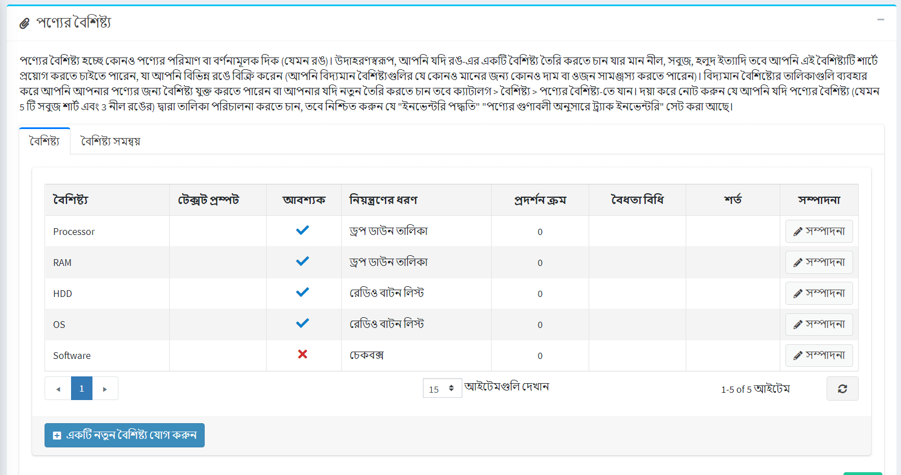

### একটি নতুন বৈশিষ্ট্য যোগ করুন

একবার আপনার তৈরি বৈশিষ্ট্যগুলির একটি তালিকা তৈরি হয়ে গেলে,*বৈশিষ্ট্য*  ট্যাবে **একটি নতুন বৈশিষ্ট্য যুক্ত করুন** ক্লিক করুন। *একটি নতুন বৈশিষ্ট্য যুক্ত করুন* উইন্ডোটি নিম্নরূপ প্রদর্শিত হবে:

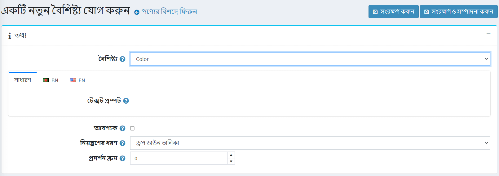

একটি নতুন বৈশিষ্ট্য সেট আপ করুন:

- **অ্যাট্রিবিউট** ড্রপডাউন তালিকা থেকে একটি বৈশিষ্ট্য নির্বাচন করুন।
- **টেক্সট প্রম্পট** ফিল্ডটি পূরণ করুন, যদি আপনি চান যে পাবলিক স্টোরে এই অ্যাট্রিবিউটের সামনে কিছু টেক্সট দেখানো হোক।
- গ্রাহকদের জন্য প্রয়োজনীয় এই বৈশিষ্ট্যটি সেট করার জন্য **টিক প্রয়োজন**।
- এই বৈশিষ্ট্যের জন্য **নিয়ন্ত্রণের ধরন** সংজ্ঞায়িত করুন (যেমন ড্রপডাউন তালিকা, রেডিও বোতাম তালিকা ইত্যাদি)।
    > [! নোট]
    >
    > "তারিখ বাছাইকারী" নিয়ন্ত্রণ প্রকারের জন্য,*সমস্ত সেটিংস (উন্নত)পৃষ্ঠায়* **catalogsettings.countdisplayedyearsdatepicker** প্যারামিটার ব্যবহার করে প্রদর্শনের জন্য কয়েক বছর নির্ধারণ করা সম্ভব। উদাহরণস্বরূপ, যদি আপনি শূন্য সেট করেন তাহলে শুধুমাত্র চলতি বছর প্রদর্শিত হবে। যদি আপনি ৫ সেট করেন তাহলে চলতি বছর এবং পরবর্তী ৫ বছর প্রদর্শিত হবে। [সমস্ত সেটিংস](xref:bn/getting-start/advanced-configuration/all-settings) পৃষ্ঠায় কীভাবে এটি সেট আপ করবেন তা পড়ুন।

- একটি পণ্যের পৃষ্ঠায় বৈশিষ্ট্যের **ডিসপ্লে অর্ডার** সংজ্ঞায়িত করুন। ১ তালিকার শীর্ষে প্রতিনিধিত্ব করে।

**সংরক্ষণ করুন এবং সম্পাদনা চালিয়ে যান** ক্লিক করুন।
**মান** প্যানেল এখন এই বৈশিষ্ট্যের জন্য পূর্বনির্ধারিত মান প্রদর্শন করে। প্রয়োজনে মান সারিতে **সম্পাদনা করুন** ক্লিক করুন।

### একটি বৈশিষ্ট্য মান সম্পাদনা করুন

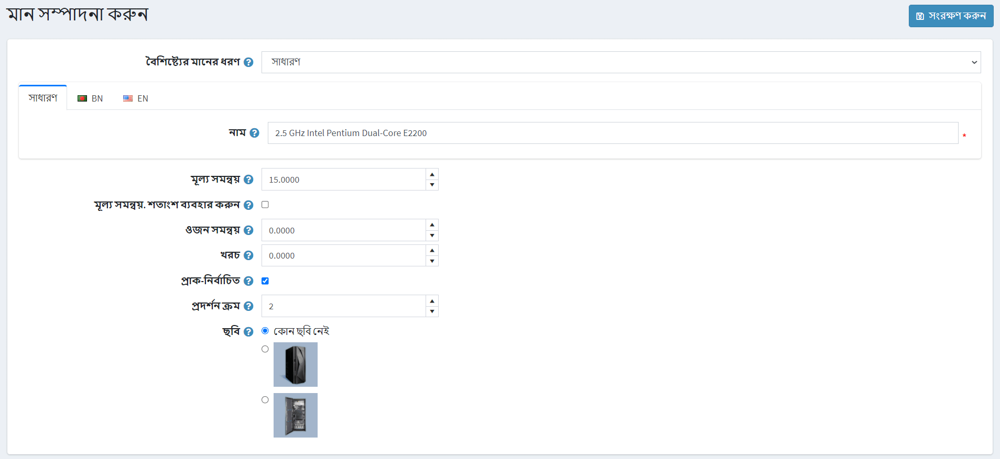

বৈশিষ্ট্য মান বিশদ সম্পাদনা করুন, নিম্নরূপ:

- **অ্যাট্রিবিউট ভ্যালু টাইপ** নির্বাচন করুন। দুটি বৈশিষ্ট্যের মান প্রকার, *সহজ*এবং *পণ্যের সাথে সংযুক্ত*। *পণ্যের সাথে যুক্ত* টাইপটি চয়ন করুন যদি আপনি চান যে এই ক্যাটালগ মানটি আপনার ক্যাটালগ থেকে অন্য একটি পণ্য হোক এবং এর স্টকও ট্র্যাক করুন। এখানে আপনি *বান্ডেল পণ্য কার্যকারিতা* ব্যবহার করতে পারেন যা গ্রাহকদের একক পণ্য হিসাবে বিভিন্ন সংমিশ্রণ বা পণ্যের সেট কিনতে দেয় এবং ক্রেতাদের নিচে বর্ণিত **গ্রাহক প্রবেশের পরিমাণ** ক্ষেত্র ব্যবহার করে বৈশিষ্ট্যগুলির প্রয়োজনীয় পরিমাণ নির্ধারণ করার সুযোগ থাকে।

যদি পূর্ববর্তী সেটিং *পণ্যের সাথে সংযুক্ত* সেট করা হয় তাহলে নিম্নলিখিত ক্ষেত্রগুলি প্রদর্শিত হবে:

- **অ্যাসোসিয়েটেড প্রোডাক্ট** আপনাকে সেই প্রোডাক্টটি বেছে নিতে দেয় যা এই বৈশিষ্ট্যের সাথে যুক্ত হবে। একটি পণ্য চয়ন করতে **একটি পণ্য সংযুক্ত করুন** বোতামটি ব্যবহার করুন।

> [!NOTE]
>
> আপনি সংশ্লিষ্ট পণ্যটি বেছে নেওয়ার পরে কোনও সতর্কতা নেই তা নিশ্চিত করুন। যেমন:
> 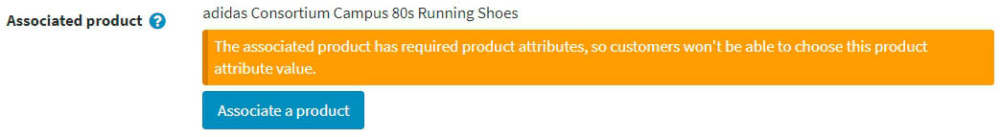

- **গ্রাহক প্রবেশের পরিমাণ** ক্ষেত্রটিতে টিক দিন যাতে গ্রাহককে গুণের পরিমাণ প্রবেশ করতে দেয় (যা সংশ্লিষ্ট পণ্যের প্রতিনিধিত্ব করে)।
- যদি পূর্ববর্তী ক্ষেত্রটি অনির্বাচিত হয় তবে আপনি **পণ্যের পরিমাণ** নির্দিষ্ট করতে পারেন। ন্যূনতম অনুমোদিত মান হল ১।
- বৈশিষ্ট্যের **নাম** লিখুন।
- রঙ স্কোয়ার অ্যাট্রিবিউট কন্ট্রোল ব্যবহার করার জন্য **আরজিভি কালার** নির্দিষ্ট করুন।
- **মূল্য সমন্বয়** ক্ষেত্রটিতে এই বৈশিষ্ট্য মান নির্বাচন করার সময় প্রযোজ্য মূল্য লিখুন। যেমন '১০' যোগ করার জন্য ১০ ডলার। অথবা ১০% যদি **মূল্য সমন্বয়। শতাংশ ব্যবহার করুন* টিক দেওয়া আছে।
- **মূল্য সমন্বয় টিক। শতাংশ ব্যবহার করুন** যা নির্ধারণ করে যে পণ্যে শতাংশ প্রয়োগ করতে হবে। সক্ষম না হলে, একটি নির্দিষ্ট মান ব্যবহার করা হয়।
- এই বৈশিষ্ট্য মান নির্বাচন করার সময় প্রয়োগ করা ওজন সমন্বয় নির্দিষ্ট করতে **ওজন সমন্বয়** ক্ষেত্রটি ব্যবহার করুন।
- **খরচ** ক্ষেত্র নির্দিষ্ট করুন। অ্যাট্রিবিউট ভ্যালু কস্ট হল এই সমস্ত বিভিন্ন উপাদানের খরচ যা এই মান তৈরি করে। উপাদানগুলি বাইরের সরবরাহকারীদের কাছ থেকে কেনা হলে এটি ক্রয়মূল্য হতে পারে, অথবা উপাদানটি যদি ঘরে তৈরি করা হয় তবে উপকরণ এবং উত্পাদন প্রক্রিয়াগুলির সম্মিলিত খরচ।
-যদি এই বৈশিষ্ট্য মানটি গ্রাহকের জন্য আগে থেকে নির্বাচিত করা হয় তবে **পূর্ব-নির্বাচিত** ক্ষেত্রটিতে টিক দিন।
- অ্যাট্রিবিউট ভ্যালুর **ডিসপ্লে অর্ডার** লিখুন। অ্যাট্রিবিউট ভ্যালু লিস্টে প্রথম আইটেমটি উপস্থাপন করে।
- এই বৈশিষ্ট্যের মান সম্পর্কিত একটি **ছবি** বেছে নিন। এই ছবিটি মূল প্রোডাক্ট ইমেজকে প্রতিস্থাপন করবে যখন এই প্রোডাক্ট অ্যাট্রিবিউট ভ্যালুতে ক্লিক করা হবে (নির্বাচিত)।

**সেভ** ক্লিক করুন।

### বৈশিষ্ট্যের শর্তাবলী

প্রয়োজন হলে, *কন্ডিশন* প্যানেলে এই বৈশিষ্ট্যের শর্তাবলী নির্ধারণ করুন। পূর্ববর্তী বৈশিষ্ট্য নির্বাচন করা হলে শর্তসাপেক্ষ বৈশিষ্ট্যগুলি উপস্থিত হয়, যেমন একটি নাম দিয়ে পোশাক ব্যক্তিগত করার জন্য একটি বিকল্প থাকা এবং "ব্যক্তিগতকরণ" রেডিও বোতামটি চেক করা হলে কেবল পাঠ্য ইনপুট বাক্স সরবরাহ করা।

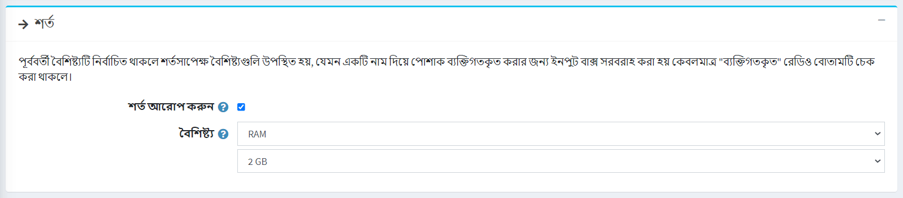

- শর্তটি সক্ষম করতে **সক্ষম অবস্থা** চেকবক্সে টিক দিন।
- **অ্যাট্রিবিউট** নির্বাচন করুন এবং এর মান। মান নির্বাচিত হলে শর্ত পূরণ হয়। যে বৈশিষ্ট্যের জন্য আপনি এই শর্তটি যুক্ত করেছেন তা প্রদর্শিত হবে।

### অ্যাট্রিবিউট কম্বিনেশন

*অ্যাট্রিবিউট কম্বিনেশন* ট্যাবে, বিভিন্ন অ্যাট্রিবিউট কম্বিনেশন এবং তাদের প্রত্যেকের জন্য নিম্নলিখিত তথ্য সংজ্ঞায়িত করুন:

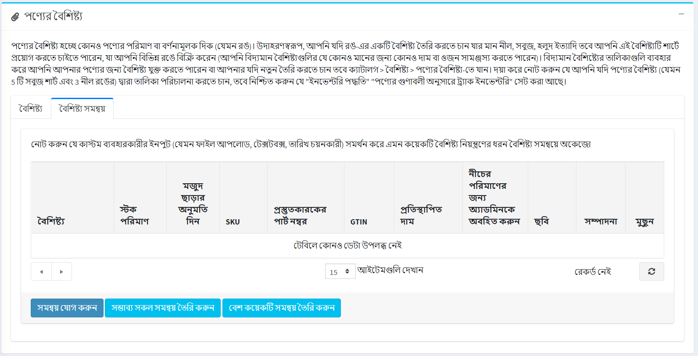

**একটি নতুন সংমিশ্রণ নির্বাচন করতে** সংমিশ্রণ যোগ করুন বাটনে ক্লিক করুন এবং এর বিবরণ লিখুন:

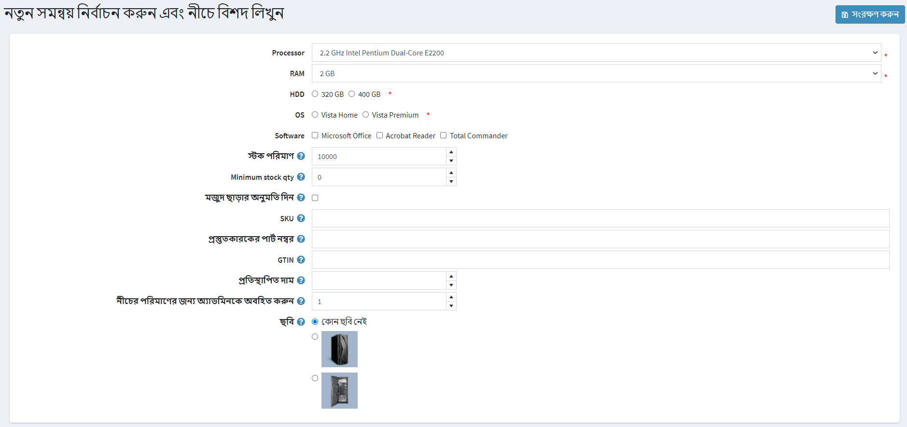

প্রতিটি সংমিশ্রণের জন্য সংজ্ঞায়িত করুন:

- সংমিশ্রণে যে বৈশিষ্ট্যগুলি রয়েছে।
- এই সংমিশ্রণের বর্তমান **স্টক পরিমাণ**।
- যদি আপনি পণ্যের বিবরণ পৃষ্ঠায় 'গুণাবলী দ্বারা স্টক পরিচালনা করুন' সক্ষম করে থাকেন তবে বর্তমান স্টক পরিমাণ **ন্যূনতম স্টক পরিমাণ** (যেমন কম স্টক রিপোর্ট) এর নিচে নেমে গেলে (বিভিন্ন স্থানে) বিভিন্ন কাজ করতে পারেন।
- **স্টক ছাড়ার অনুমতি দিন**, যদি আপনি চান যে আপনার গ্রাহকরা নির্দিষ্ট গুণাবলীর সাথে পণ্য ক্রয় করতে সক্ষম হবেন, যখন স্টক নেই।
- **এসকেইউ**।
- **প্রস্তুতকারকের অংশ সংখ্যা**।
- **জিটিআইএন**।
- **ওভাররাইডেড মূল্য**, যদি নির্দিষ্ট গুণাবলীর পণ্যগুলির দাম পণ্যের নিয়মিত মূল্যের থেকে আলাদা হয়। উদাহরণস্বরূপ, আপনি এইভাবে ছাড় দিতে পারেন। ক্ষেত্রটি উপেক্ষা করার জন্য খালি রাখুন।
  > [! নোট]
  >
  > এই ক্ষেত্রটি নির্দিষ্ট করা হলে অন্যান্য সমস্ত প্রয়োগকৃত ছাড় উপেক্ষা করা হবে।
- **নীচের পরিমাণের জন্য অ্যাডমিনকে নোটিফাই করুন** সেই পরিমাণটি প্রবেশ করান যার অধীনে অ্যাডমিনকে জানানো হবে।
- এই বৈশিষ্ট্য সমন্বয়ের সাথে যুক্ত একটি **ছবি** বেছে নিন। এই প্রোডাক্ট অ্যাট্রিবিউট কম্বিনেশন নির্বাচন করা হলে এই ছবিটি মূল প্রোডাক্ট ইমেজ প্রতিস্থাপন করবে।

**সেভ** ক্লিক করুন।

> [!NOTE]
>
> মনে রাখবেন কিছু কন্ট্রোল কন্ট্রোল টাইপ যা কাস্টম ইউজার ইনপুট সমর্থন করে (যেমন ফাইল আপলোড, টেক্সটবক্স, ডেট পিকার) অ্যাট্রিবিউট কম্বিনেশনের সাথে অকেজো।

সমস্ত সম্ভাব্য সংমিশ্রণ তৈরি করতে **সমস্ত সম্ভাব্য সংমিশ্রণ তৈরি করুন** বোতামটি ব্যবহার করুন। অথবা প্রয়োজনীয় সংমিশ্রণ উৎপন্ন করার জন্য কিছু বৈশিষ্ট্যের মান নির্বাচন করতে **জেনারেট বেশ কয়েকটি সমন্বয়** বোতামটি ব্যবহার করুন।

## স্পেসিফিকেশন বৈশিষ্ট্য

স্পেসিফিকেশন অ্যাট্রিবিউট হল প্রোডাক্ট ফিচার অর্থাৎ স্ক্রিন সাইজ, ইউএসবি-পোর্টের সংখ্যা প্রোডাক্টের বিবরণ পৃষ্ঠায় দৃশ্যমান। স্পেসিফিকেশন অ্যাট্রিবিউটগুলি ক্যাটাগরির বিবরণ পৃষ্ঠায় পণ্য ফিল্টার করার জন্য ব্যবহার করা যেতে পারে। স্পেসিফিকেশন বৈশিষ্ট্য সম্পর্কে আরও পড়ুন [এখানে](xref:bn/running-your-store/catalog/products/specification-attributes)।

> [!NOTE]
>
> পণ্যের বৈশিষ্ট্যগুলির বিপরীতে, স্পেসিফিকেশন বৈশিষ্ট্যগুলি শুধুমাত্র তথ্যের উদ্দেশ্যে ব্যবহৃত হয়।

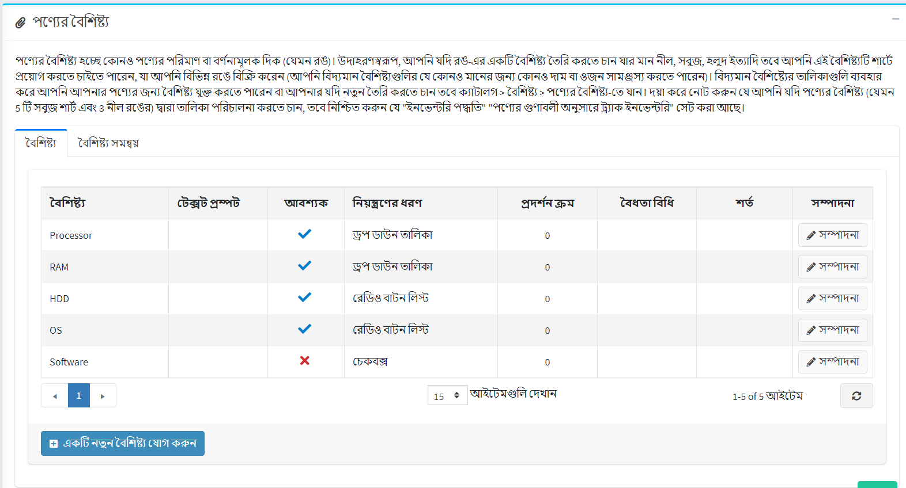

*স্পেসিফিকেশন অ্যাট্রিবিউটস* প্যানেলে স্পেসিফিকেশন অ্যাট্রিবিউট যোগ করুন।

> [!NOTE]
>
> বিদ্যমান বৈশিষ্ট্যের তালিকা ব্যবহার করে আপনি আপনার পণ্যের জন্য একটি বৈশিষ্ট্য যুক্ত করতে পারেন, অথবা যদি আপনি একটি নতুন তৈরি করতে চান তবে **ক্যাটালগ → গুণাবলী → স্পেসিফিকেশন বৈশিষ্ট্য** এ যান।

 একটি নতুন অ্যাট্রিবিউট যুক্ত করতে, **অ্যাড অ্যাট্রিবিউট** বাটনে ক্লিক করুন এবং *একটি নতুন প্রোডাক্ট স্পেসিফিকেশন অ্যাট্রিবিউট যোগ করুন* বিভাগটি পূরণ করুন:

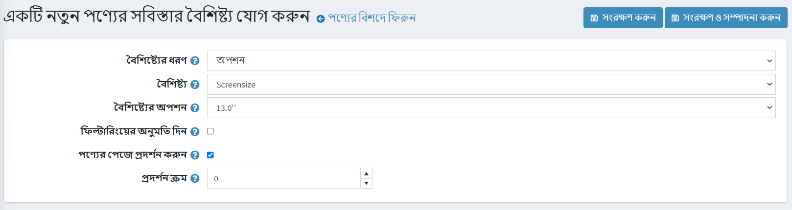

- ড্রপ ডাউন তালিকা থেকে **অ্যাট্রিবিউট টাইপ** নির্বাচন করুন।
- পূর্বনির্ধারিত বৈশিষ্ট্যের তালিকা থেকে **অ্যাট্রিবিউট** নির্বাচন করুন।
- **অ্যাট্রিবিউট অপশন** বেছে নিন।
- **যদি প্রয়োজন হয়**, তাহলে একটি ক্যাটাগরির পৃষ্ঠায় এই বিকল্পের মাধ্যমে ফিল্টার করার অনুমতি দিন।
- পণ্যের পৃষ্ঠায় বৈশিষ্ট্যটি দৃশ্যমান করতে **পণ্যের পৃষ্ঠায় দেখান** টিক দিন।
- অ্যাট্রিবিউট সেট করুন **ডিসপ্লে অর্ডার** ১ তালিকার শীর্ষে প্রতিনিধিত্ব করে।

**সেভ** ক্লিক করুন।

## পণ্য শ্রেণী

প্রোডাক্ট কিনা তা নির্ধারণ করুন:

- [উপহার কার্ড](xref:bn/running-your-store/promotional-tools/gift-cards)
- [ডাউনলোডযোগ্য পণ্য](xref:bn/running-your-store/catalog/products/downloadable-products)
- [ভাড়া](xref:bn/running-your-store/catalog/products/rental-products)
- [পুনরাবৃত্ত পণ্য](xref:bn/running-your-store/catalog/products/recurring-products)

## এসইও

পণ্য পৃষ্ঠার জন্য নিম্নলিখিত এসইও পরামিতি সংজ্ঞায়িত করুন:

- **সার্চ ইঞ্জিন বান্ধব পৃষ্ঠার নাম** - সার্চ ইঞ্জিন দ্বারা ব্যবহৃত পৃষ্ঠার নাম। আপনি যদি কিছু না লিখেন তবে পণ্যের নাম ব্যবহার করে পণ্য পৃষ্ঠার URL তৈরি হয়। যদি আপনি কাস্টম-এসইও-পেজ-নাম লিখেন, তাহলে নিম্নলিখিত কাস্টম ইউআরএল ব্যবহার করা হবে: `http://www.yourStore.com/custom-seo-page-name`।
- **মেটা শিরোনাম** - ওয়েব পেজের জন্য একটি শিরোনাম।
- **মেটা কীওয়ার্ড** - পণ্য সম্পর্কিত সবচেয়ে গুরুত্বপূর্ণ থিম (কীওয়ার্ড এবং মূল বাক্যাংশ) এর একটি সংক্ষিপ্ত এবং সংক্ষিপ্ত তালিকা। এই শব্দগুলি পণ্য পৃষ্ঠার শিরোনামে যুক্ত করা হবে।
- **মেটা বর্ণনা** - পণ্যের একটি সংক্ষিপ্ত বিবরণ যা পণ্য পৃষ্ঠার শিরোনামে যুক্ত করা হবে।

এসইও সম্পর্কে আরও পড়ুন [এখানে](xref:bn/running-your-store/search-engine-optimization)।

## সম্পর্কিত পণ্য এবং ক্রস-সেলস

[এখানে](xref:bn/running-your-store/promotional-tools/cross-sells-and-related-products) বর্ণনা অনুযায়ী সম্পর্কিত পণ্য এবং ক্রস-সেলস সেট আপ করুন

## অর্ডার দিয়ে কেনা

যে অর্ডারে পণ্যটি কেনা হয়েছিল তার একটি তালিকা দেখতে, *অর্ডার দিয়ে কেনা* প্যানেলে যান। এখানে আপনি একটি অর্ডারের অবস্থা পরীক্ষা করতে পারেন এবং বিস্তারিত অর্ডার দেখতে পারেন।

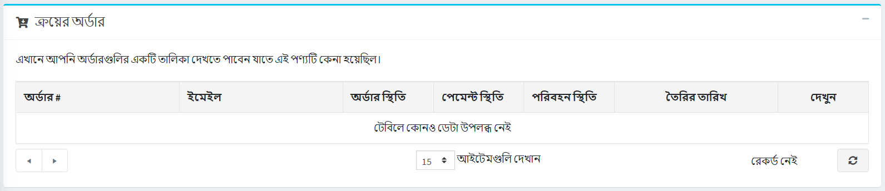

## স্টক পরিমাণ ইতিহাস

এই ট্যাবে আপনি পণ্যের পরিমাণ পরিবর্তন, পণ্যের সাথে অর্ডার দেখতে পারেন।

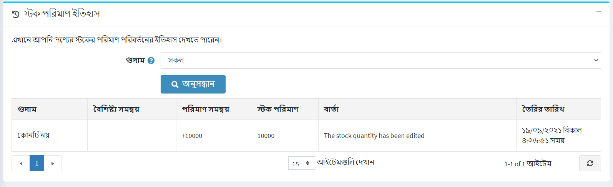

## প্রোডাক্ট পেজ সেট আপ করা

নিম্নলিখিত বিভাগগুলি পণ্যের পৃষ্ঠার সেটিংস বর্ণনা করে: [পণ্য ক্ষেত্র](xref:bn/running-your-store/catalog/catalog-settings#product-fields),  [পণ্য পাতা](xref:bn/running-your-store/catalog/catalog-settings#product-page) এবং [শেয়ার করুন](xref:bn/running-your-store/catalog/catalog-settings#share)।

## আরো দেখুন

- [পণ্যের বিভাগ](xref:bn/running-your-store/catalog/category)
- [পণ্য নির্মাতারা](xref:bn/running-your-store/catalog/Manufactures)
- [অর্ডার ম্যানেজমেন্ট](xref:bn/running-your-store/order-management/index)
- [ওয়েব সেমিনার. NopCommerce এর প্রথম ধাপ](https://www.youtube.com/watch?v=B_CfgJH0ylM&list=PLnL_aDfmRHwsJn1rnKaXdIcJg4pKJeeXs)

## টিউটোরিয়াল

- [ভিডিও টিউটোরিয়াল: একটি নতুন পণ্য যোগ করা হচ্ছে](https://www.youtube.com/watch?v=wVgTgdQVWPQ&index=2&list=PLnL_aDfmRHwsbhj621A-RFb1KnzeFxYz4)
