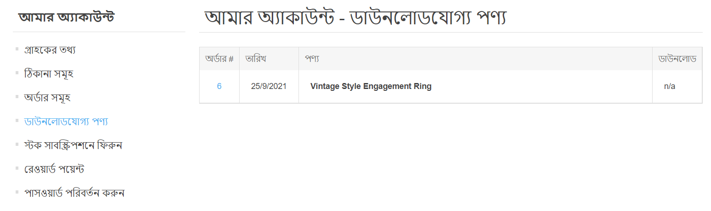
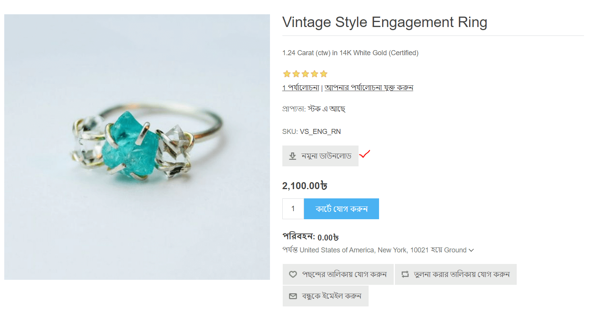
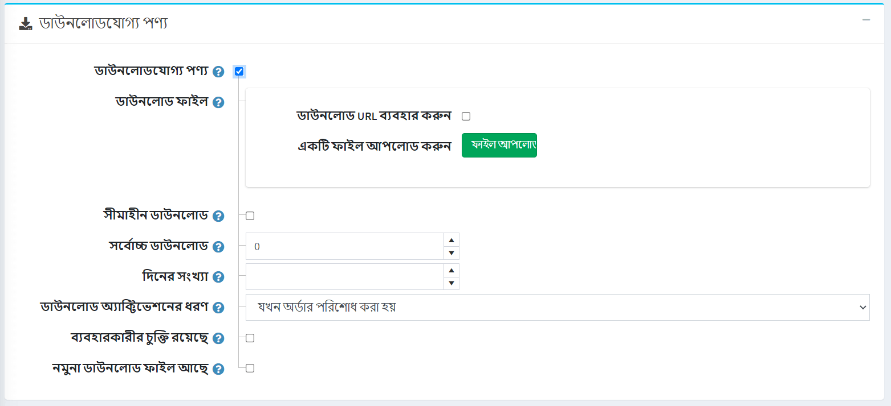

---
title: Downloadable products
uid: en/running-your-store/catalog/products/downloadable-products
author: git.AndreiMaz
contributors: git.DmitriyKulagin, git.exileDev, git.IvanIvanIvanov, git.dunaenko, git.mariannk
---

# Downloadable products

The downloadable products functionality is useful when you are going to sell ebooks or audio books, cources, PDfs, music, software or you want to create a picture stock, for example. 

## Example

Let's say you wish to sell ebooks.

What distinguishes a ebook-store from other stores? 
- First of all you should provide to customers an easy way to download books from your store.
	In nopCommerce, customers can find all the downloadable products they bought in the "My account" section:
  

- You may also wish to allow your customers to preview some parts of the books they want to buy.
	In this case your customers will see the following *Download sample* button on the product details page:
  

- Or it may be useful to ask a customer to agree with the *user agreement* before download an ebook. For example, agree to download and print one copy of each ebook chapter for only personal use.
	This is how a customer will see this agreement:
  

All these features can be set up when you editing a product. Futhermore, in special cases you can restrict downloads of the certain book by setting up a number of days during customers keeps access to the book or maximum downloads number. Or you can choose when customer is enabled to download a book: immediately after the book is paid or after manual validation.

If you already learned how to set up a [common product](xref:en/running-your-store/catalog/products/add-products) learn how to make this product downloadable in the section below.

## Set up a downloadable product

To create a downloadable product, go to **Catalog → Products**. Click **Add new**, fill up the common product fields and tick the corresponding checkbox in the *Downloadable product* panel.

Define the following details:

- In the **Download file** section, upload the file using the **Upload a file** button or **use download URL** by ticking the corresponding checkbox and entering the **Download URL**.
- **Unlimited downloads** - in case the product can be downloaded an unlimited number of times. When this option is not selected, an additional field appears. 
  - In the **Max. downloads** field enter the maximum number of downloads, that are given to a customer, after purchasing the product.
- **Number of days** during which customers keep access to the file. Leave this field empty if you want to enable continuous downloads.
- **Download activation type**:
  - *When order is paid* - select this option to enable the download only when the order payment status is "Paid".
  - *Manually* - select this option to give control to the store administrator. When this option is selected, the administrator must manually activate the download. This is performed in the *Products* panel of an *Edit order details* page.
- **Has user agreement** - if a customer must agree with the user agree in order to be able to download the product.
  - **User agreement text** editor is then displayed enabling you to enter/edit the user agreement text.
- **Has sample download file** allows a customer to download a sample file. 
  - If this is applicable, upload the **Sample download file** using the **Upload a file** button or **use download URL** by ticking the corresponding checkbox and entering the **Download URL**. It will be shown on the product details page and can be downloaded by any customer without any charge.

 > [!TIP]
 >
 > Since downloadable products don't require shipping make sure the **Shipping enabled** field is unticked in the *Shipping* panel.

 > [!TIP]
 >
 > Since you don't need to track inventory of downloadable products make sure the **Inventory method** field is set to *Don't track inventory* in the *Inventory* panel.

## Customer registration

Decide whether customer registration is required for downloadable products by ticking the **Require registration for downloadable products** checkbox in the *Common* panel on the **Configuration → Settings → Customer settings** page.

## Downloadable products account page

If you would like to hide the 'Downloadable products' menu item from the customer account page go to the **Configuration → Settings → Customer settings** page and tick the **Hide 'Downloadable products' tab** checkbox.

## See also

- [Orders](xref:en/running-your-store/order-management/orders)

## Tutorials

- [Managing digital products](https://www.youtube.com/watch?v=om-HKr-B2yA)
