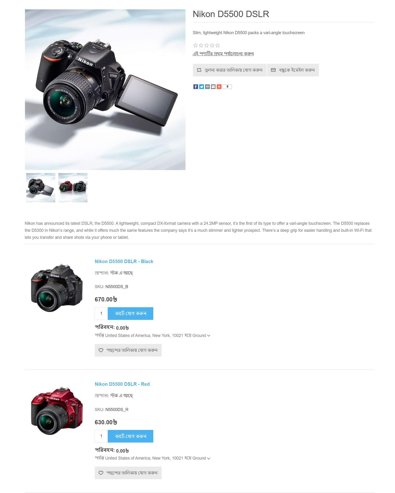
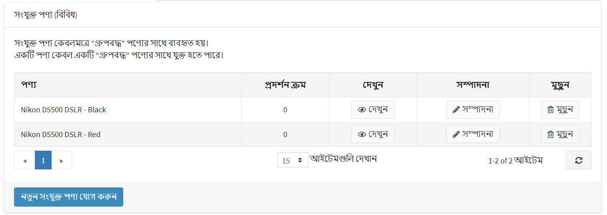

# গোষ্ঠীভুক্ত পণ্য (রূপ)

গোষ্ঠীভুক্ত পণ্য, বা বৈকল্পিক পণ্য, এমন একটি পণ্য বিক্রির সুবিধাজনক হাতিয়ার যা বিভিন্ন পরিপূরক আইটেম বা বিভিন্ন বৈশিষ্ট্যের সেট রয়েছে। এই জাতীয় পণ্যের বিভিন্ন সংমিশ্রণগুলি পৃথক পণ্য হিসাবে বিক্রি করা যেতে পারে এবং দামের তারতম্য হতে পারে।

নপকমার্স-এ, গোষ্ঠীভুক্ত পণ্যগুলি সম্ভাব্য সমস্ত বিকল্প প্রদর্শন করে একটি একক পণ্যের বিবরণ পৃষ্ঠার মত দেখতে। জটিল পণ্য বিক্রির জন্য এটি একটি সুবিধাজনক এবং এসইও-বান্ধব হাতিয়ার।

> [!TIP]
>
> উদাহরণস্বরূপ, একটি বেস প্রোডাক্ট, যেমন একটি ক্যামেরা বডি, লেন্সের বিভিন্ন সেট দিয়ে গ্রুপ করা যায়। একটি গোষ্ঠীভুক্ত পণ্যের আরেকটি ব্যবহারের ক্ষেত্রে বিভিন্ন ধরনের বৈশিষ্ট্যযুক্ত এক ধরনের পণ্য বিক্রি করা হচ্ছে। উদাহরণস্বরূপ, বিভিন্ন স্বাদযুক্ত চকোলেট। এই ক্ষেত্রে, একজন গ্রাহক সহজেই একই পৃষ্ঠায় প্রধান পণ্য এবং তার সমস্ত বিকল্প দেখতে পারেন।

## একটি নতুন গোষ্ঠীবদ্ধ পণ্য যোগ করা

একটি গ্রুপযুক্ত পণ্য তৈরি করতে, **ক্যাটালগ → পণ্য** এ যান। অনুসরণ করার জন্য বেশ কয়েকটি পদক্ষেপ রয়েছে:

  > [!TIP]
  >
  > পণ্যের ক্ষেত্রগুলি কীভাবে পূরণ করবেন তা শিখুন [এখানে](xref:bn/running-your-store/catalog/products/add-products)।

1. একটি *সহজ* পণ্যের ধরণ সহ বেশ কয়েকটি পণ্য তৈরি করুন। এগুলি মূল পণ্যের রূপ। আপনি ক্যাটালগ এবং অনুসন্ধানের ফলাফলে আলাদাভাবে দৃশ্যমান হতে চান কিনা তা সংজ্ঞায়িত করুন, অথবা **পৃথকভাবে দৃশ্যমান** চেকবক্স ব্যবহার করে শুধুমাত্র প্রধান পণ্যের একটি পণ্য পৃষ্ঠায় দেখানো হোক।
1. একটি **গ্রুপযুক্ত (ভ্যারিয়েন্ট সহ পণ্য)** প্রোডাক্ট তৈরি করুন এবং **অ্যাসোসিয়েটেড প্রোডাক্ট (ভ্যারিয়েন্টস)** প্যানেলে আপনার পূর্ববর্তী ধাপে তৈরি করা এই সাধারণ পণ্যগুলি বরাদ্দ করুন:

    

> [!NOTE]
> 
> - পাবলিক স্টোরে, একজন গ্রাহক *গ্রুপযুক্ত* পণ্যের বিবরণ পৃষ্ঠায় প্রতিটি সংশ্লিষ্ট পণ্যের জন্য একটি পৃথক **কার্টে যোগ করুন** বোতাম দেখতে পান।
> - একটি *সহজ* পণ্য শুধুমাত্র একটি *গোষ্ঠীভুক্ত* পণ্যের সাথে যুক্ত হতে পারে।
> - *গোষ্ঠীভুক্ত* পণ্য **সরাসরি অর্ডারযোগ্য নয়**। যাইহোক, তাদের সাথে যুক্ত *সহজ* পণ্য। উদাহরণস্বরূপ, একজন গ্রাহক ক্রিয়েটিভ সাউন্ড কার্ড পণ্য সরাসরি অর্ডার করতে পারেন না। গ্রাহকের পরিবর্তে ক্রিয়েটিভ সাউন্ড কার্ডের একটি ওইএম বা খুচরা সংস্করণ অর্ডার করতে হবে। এই ক্ষেত্রে, *গোষ্ঠীভুক্ত* পণ্যটি একটি ক্রিয়েটিভ সাউন্ড কার্ড, এবং এই *গ্রুপযুক্ত* পণ্যের জন্য দুটি সংযুক্ত *সহজ* পণ্য রয়েছে: ওইএম এবং খুচরা, প্রতিটি সম্ভাব্য ভিন্ন দামের সাথে।

## টিউটোরিয়াল

- [nopCommerce এ গোষ্ঠীভুক্ত পণ্যগুলি বোঝা](https://www.youtube.com/watch?v=B1UdxXf_jmE)
- [nopCommerce এ বান্ডেল পণ্য তৈরি করা](https://www.youtube.com/watch?v=sf9jP6KFcko)
