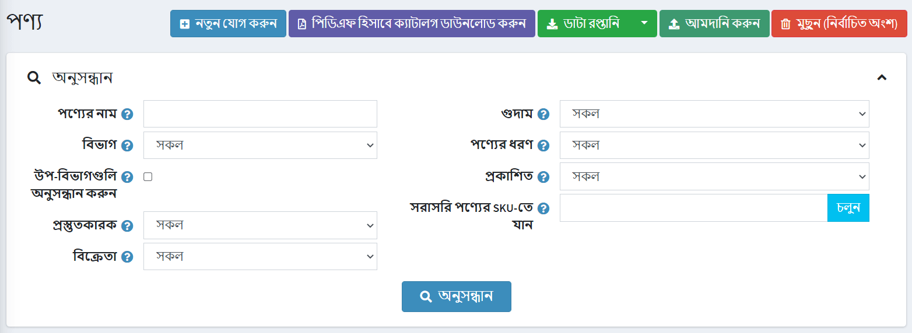
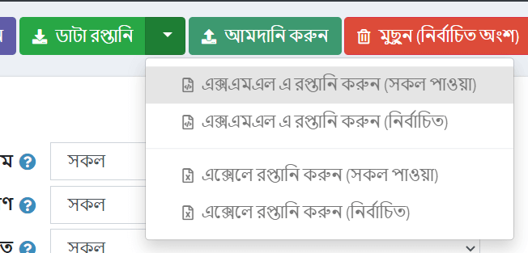
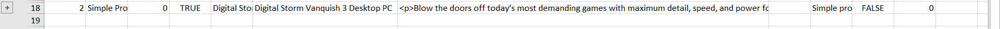
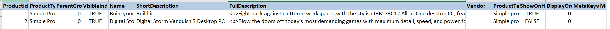
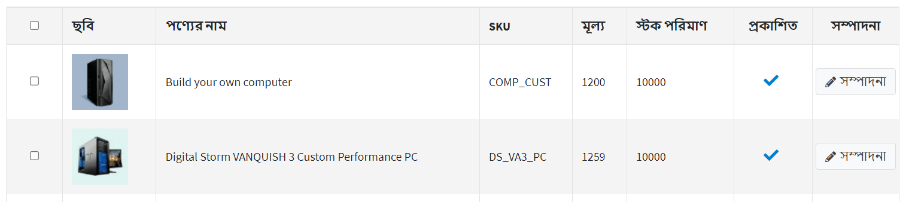

# পণ্য আমদানি/রপ্তানি

নপকমার্স-এ এক্সেল ফরম্যাট থেকে আমদানি এবং এক্সএমএল বা এক্সেলে পণ্য রপ্তানি সমর্থন করে। আপনি পিডিএফ এ আপনার ক্যাটালগ থেকে পণ্য ডাউনলোড করতে পারেন।
আপনি এই বিকল্পগুলি খুঁজে পেতে পারেন **ক্যাটালগ → পণ্য** বাম দিকে প্রধান পৃষ্ঠায়।

## পণ্য রপ্তানি

 **রপ্তানি** বাটনে ক্লিক করে আপনি এক্সএমএল বা এক্সেল ফরম্যাটে পণ্য রপ্তানি করতে পারেন। **রপ্তানি** বাটনে ক্লিক করার পর আপনি ড্রপডাউন মেনু দেখতে পাবেন যা আপনাকে **এক্সএমএল (সব পাওয়া)** অথবা **এক্সএমএল রপ্তানি (নির্বাচিত)** এবং **এক্সেল এক্সপোর্ট (সব পাওয়া)** বা **এক্সেলে রপ্তানি করুন (নির্বাচিত)**।
 

 আপনার যদি সমস্ত পণ্য ডাউনলোড করার প্রয়োজন না হয় তবে প্রয়োজনীয় পণ্যগুলি খুঁজে পেতে *অনুসন্ধান* প্যানেল ব্যবহার করুন অথবা/এবং প্রয়োজনীয় পণ্যগুলি নির্বাচন করতে চেকবক্স ব্যবহার করুন। আপনার পছন্দের পণ্য সহ একটি ফাইল ডাউনলোড করা হবে। ফাইলটিতে প্রোডাক্ট এডিটিং পেজ প্যানেল থেকে সব প্রোডাক্টের বৈশিষ্ট্য রয়েছে (প্রোডাক্ট ইনফো, এসইও, ছবি ইত্যাদি)।

> [!NOTE]
>
> আপনি যদি প্রোডাক্ট অ্যাট্রিবিউট ব্যবহার করেন, একটি এক্সপোর্ট এক্সেল টেবিল সারি দ্বারা গ্রুপ করা হবে। বৈশিষ্ট্যের বিশদ বিবরণ দেখতে টেবিলে আপনার পণ্যের পাশে + ক্লিক করুন।
> 

## পণ্য আমদানি করা

আপনি যদি আপনার ক্যাটালগে ম্যানুয়ালি সব পণ্য যোগ করতে না চান তবে আপনি আমদানি বিকল্পটি ব্যবহার করতে পারেন।

> [!NOTE]
> 
> আমদানি শুরু করার আগে আপনাকে এক্সেল ফরম্যাটে আমদানির জন্য একটি টেবিল টেমপ্লেট ডাউনলোড করতে হবে যেমনটি [রপ্তানি পণ্য](#পণ্য-রপ্তানি) বিভাগে বর্ণিত হয়েছে। আপনার পণ্যের সঠিক এবং সঠিক আমদানির জন্য টেবিলে সমস্ত কলামের সঠিকভাবে নামকরণ করা গুরুত্বপূর্ণ (ঠিক যেমন ডাউনলোড করা টেবিলে)।

সমস্ত টেবিল ক্ষেত্র পূরণ করা বাধ্যতামূলক নয়। ভরাট ক্ষেত্রের উপর ভিত্তি করে পণ্য তৈরি করা হবে।

আমদানিকৃত পণ্য এসকেইউ দ্বারা আলাদা করা হয়। যদি এসকেইউ ইতিমধ্যে বিদ্যমান থাকে, তবে এর সংশ্লিষ্ট পণ্য আপডেট করা হবে।

আমদানির জন্য প্রচুর মেমরি সম্পদ প্রয়োজন। এজন্য একবারে ৫০০ - ১০০০ এর বেশি রেকর্ড আমদানি করার সুপারিশ করা হয় না। আপনার যদি আরও রেকর্ড থাকে, সেগুলিকে একাধিক এক্সেল ফাইলে বিভক্ত করা এবং আলাদাভাবে আমদানি করা ভাল।

### উদাহরণ

উদাহরণস্বরূপ, আমরা আমাদের ক্যাটালগে নৃত্যের জুতা যোগ করতে চাই। টেবিলে একটি নতুন সারি তৈরি করা যাক:

তারপর **আমদানি করুন** ক্লিক করুন, ফাইলটি নির্বাচন করুন এবং **এক্সেল থেকে আমদানি করুন** বাটনে ক্লিক করুন। তারপর ক্যাটালগে আপনার নতুন পণ্য আছে কিনা তা পরীক্ষা করুন।

## আমদানি/রপ্তানি স্থাপন করা

নিম্নলিখিত বিভাগ আমদানি/রপ্তানি সেটিংস বর্ণনা করে: [আমদানী রপ্তানি](xref:bn/running-your-store/catalog/catalog-settings#exportimport)।

## আরো দেখুন

* [পণ্য যোগ করা](xref:bn/running-your-store/catalog/products/add-products)
