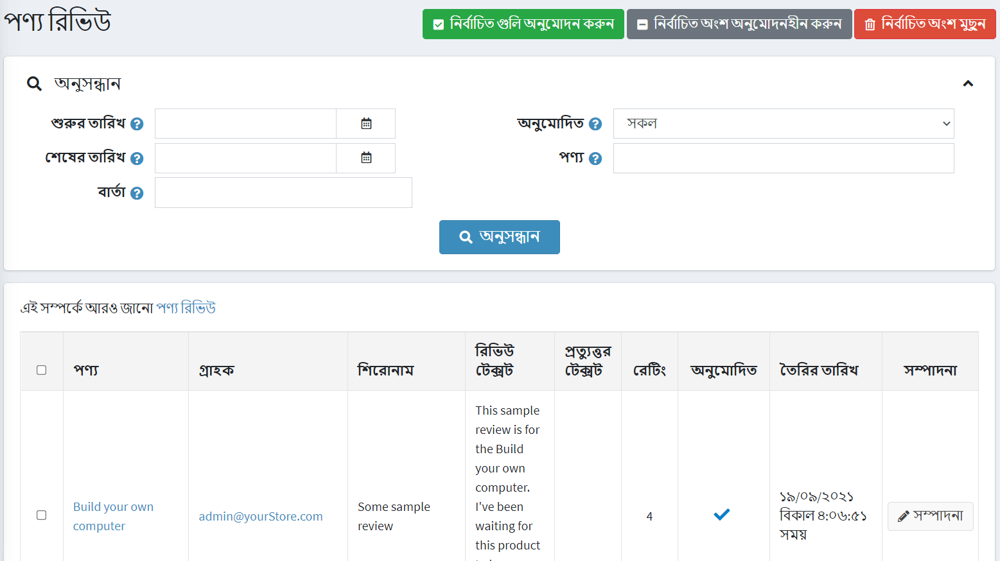
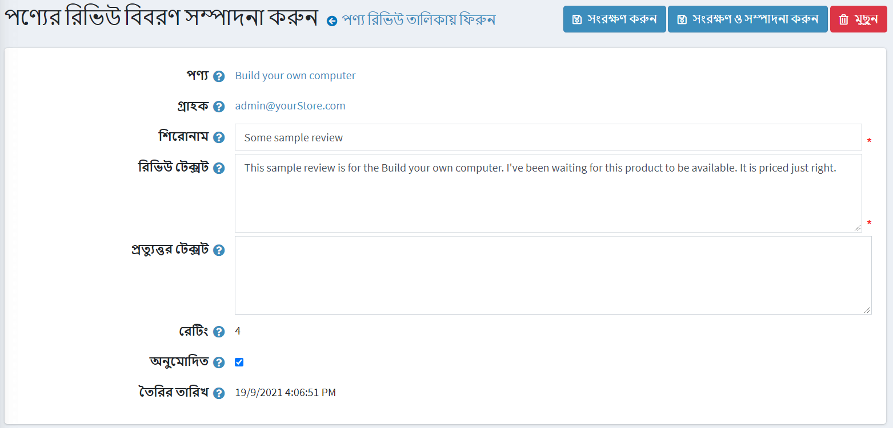
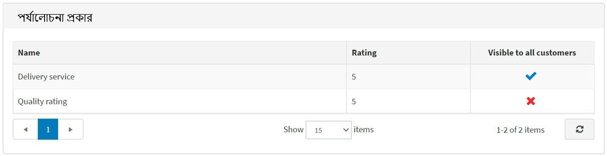

# Product reviews

Product reviews are customers' comments on a product. Reviews can also include ratings.

In the public store, reviews are displayed on the product details page. Customers can write reviews for different products. After a review has been written and approved by a store owner, other customers can define whether the review is helpful or not by clicking *Yes* or *No* beside the review.

> [!NOTE]
>
> By default, the reviews must be approved by the store owner before they appear in the public store. However, in case a store owner decides that reviews do not have to be approved, this default behavior can be changed. To opt out of the obligatory product reviews approval, go to **Configuration → Settings → Catalog settings** and untick the **Product reviews must be approved** option.

## Managing product reviews

To manage product reviews go to **Catalog → Product reviews**. The *Product reviews* window is displayed, as follows:

### Search for reviews

You can search for reviews by:

- Date range using the **Created from** and **Created to**. In the Created From and Created to fields, enter the date range for your search. Alternatively, you can click on the dropdown calendar and select the required date range.
- **Message**. Can be used to find a review by the title or a part of its text.
- **Approved**. Can be used to find a review by a "Approved" property.
- **Product**. Sorts and shows the reviews related to a particular product.
- **Store**. Allows to view all reviews of a particular store's products. This field is displayed if you have more than one store.

### Approve or disapprove

Select the reviews you want to approve or disapprove and click the **Approve selected** button or the **Disapprove selected** button accordingly.

## Editing product reviews

To edit the product review click **Edit** beside the review. The *Edit product review details* window will be displayed, as follows:

- See the **Product** which this review was added for. After clicking on this field, you will be redirected to the edit product details window where you can edit the product details.
- See the **Store** in which this review was written.
- And **Customer** who created the review. After clicking on this field, you will be redirected to the edit customer details window where you can edit the details.
- You can edit the review **Title**.
- As well as the its **Text**.
- In the **Reply text** field you can leave a reply to review, it will be visible in the public store below the review.
- **Rating** displays the customer rating. It cannot be edited.
- Tick the **Is approved** checkbox, to approve the review.
- **Created on** shows the date and time when the review was created.

## Review types

If you created custom review types you will see the *Review types* panel:

On this area, you can view the all addition reviews on current product. **Rating** displays the customer rating. All columns in the table cannot be edited.

For more information on setting up reviews, click see the [Product reviews](xref:en/running-your-store/catalog/catalog-settings#product-reviews) and [Review types](xref:en/running-your-store/catalog/catalog-settings#review-types) chapters.

## Tutorials

- [Managing product reviews](https://www.youtube.com/watch?v=TBOpCoEAMnU&feature=youtu.be)
- [Managing product review types](https://youtu.be/Ts7_T9sd1Do)
