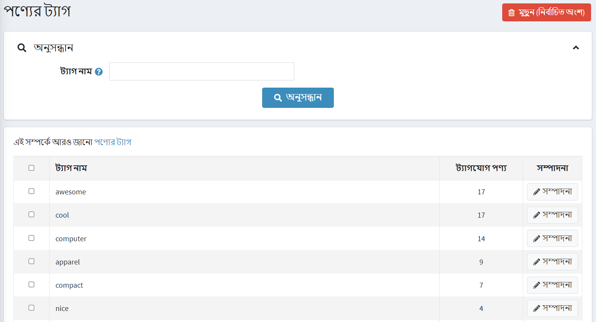
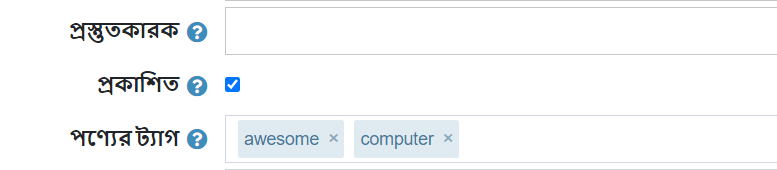
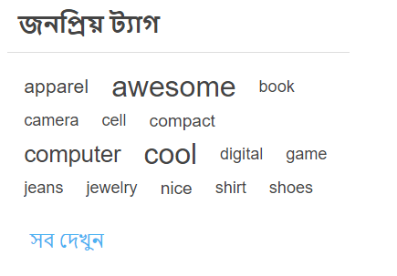

# পণ্যের ট্যাগ

পণ্য ট্যাগ হল পণ্য সনাক্তকরণের কীওয়ার্ড। তারা একটি নির্দিষ্ট বৈশিষ্ট্য দ্বারা পণ্য বাছাই এবং একটি নির্দিষ্ট, সংকীর্ণ পণ্য অনুসন্ধান সক্রিয় করতে ব্যবহৃত হয়।
উদাহরণস্বরূপ, যদি আপনি পোশাক বিক্রি করেন, এবং আপনি টি-শার্টের জন্য ট্যাগ তৈরি করতে চান, এটি "টি-শার্ট", ​​"তুলো", "পোলো" ইত্যাদি হতে পারে।

পাবলিক স্টোরে প্রদর্শিত পণ্যের ট্যাগ সম্পাদনা করতে, **ক্যাটালগ → পণ্য ট্যাগ** এ যান।

পণ্য ট্যাগ পৃষ্ঠায়, আপনি দেখতে পারেন কতগুলি পণ্যের একটি নির্দিষ্ট ট্যাগ রয়েছে **ট্যাগযুক্ত পণ্য** কলামে। আপনি ট্যাগটির পাশে **সম্পাদনা** বাটনে ক্লিক করে সম্পাদনা করতে পারেন। অথবা আপনি ট্যাগগুলি নির্বাচন করে মুছে ফেলতে পারেন এবং তারপরে **মুছুন (নির্বাচিত)** বাটনে ক্লিক করুন।

## পণ্যের ট্যাগ যোগ করা

প্রোডাক্ট যুক্ত বা এডিট করার সময় আপনি এডিট প্রোডাক্ট ডিটেইলস পৃষ্ঠায় ট্যাগ যোগ করতে পারেন।

কমা দ্বারা তাদের আলাদা করে ট্যাগ লিখুন। একবার ট্যাগ তৈরি হয়ে গেলে, সেগুলি অন্যান্য পণ্যের জন্যও ব্যবহার করা যেতে পারে। একটি নির্দিষ্ট ট্যাগের সাথে যত বেশি পণ্য যুক্ত হবে, ক্যাটালগ পৃষ্ঠার সাইডবারে প্রদর্শিত *জনপ্রিয় ট্যাগ* এলাকায় এটি তত বড় হবে:

## পণ্যের ট্যাগ সেট আপ করা

নিচের বিভাগটি পণ্যের ট্যাগের সেটিংস বর্ণনা করে: [ট্যাগ](xref:bn/running-your-store/catalog/catalog-settings#tags)।

## আরো দেখুন

* [পণ্যের বিভাগ](xref:bn/running-your-store/catalog/category)
* [পণ্য যোগ করা](xref:bn/running-your-store/catalog/products/add-products)