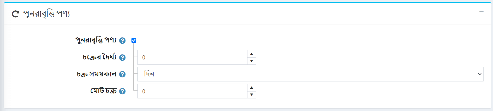

# পুনরাবৃত্ত পণ্য

পুনরাবৃত্ত পণ্যের ধরন সাধারণত সাবস্ক্রিপশন বা কিস্তি পরিশোধের পরিকল্পনা সহ পণ্যগুলির জন্য ব্যবহৃত হয়। যদি আপনার পণ্যটি পুনরাবৃত্তি হয় তবে *পুনরাবৃত্ত পণ্য* প্যানেলে সংশ্লিষ্ট চেকবক্সটিতে টিক দিন।

নিম্নলিখিত বিবরণ সংজ্ঞায়িত করুন:

- **চক্রের দৈর্ঘ্য** এটি একটি সময়কাল পুনরাবৃত্তি আদেশ পুনরাবৃত্তি করা যেতে পারে।
- **সাইকেল পিরিয়ড** *দিনে*,*সপ্তাহ*,*মাস* বা *বছর*। এটি সংজ্ঞায়িত করে একক সময়কাল পরিমাপ করা হবে।
- **মোট চক্র** হলো গ্রাহক বারবার আসার পণ্য পাবেন।

সিস্টেমকে স্বয়ংক্রিয়ভাবে পুনরাবৃত্তিমূলক অর্ডার তৈরি করতে সক্ষম করার জন্য আপনি যেকোনো পণ্যের একটি পুনরাবৃত্তিমূলক চক্র সংজ্ঞায়িত করতে পারেন। এই ক্ষেত্রে, যে কোনো সময় যখন পেমেন্ট করতে হবে, সিস্টেম পরবর্তী পুনরাবৃত্ত আদেশের জন্য প্রাথমিক আদেশের অর্থ প্রদানের বিবরণ ব্যবহার করবে। উপরন্তু, আসল শিপিং চার্জ পরবর্তী আদেশের ক্ষেত্রে প্রযোজ্য হবে।

> [!NOTE]
> 
> কমপক্ষে একটি সক্রিয় পেমেন্ট মডিউল পুনরাবৃত্ত পেমেন্ট সমর্থন করা উচিত।

## আরো দেখুন

- [মুল্য পরিশোধ পদ্ধতি](xref:bn/getting-started/configure-payments/payment-methods/index)
