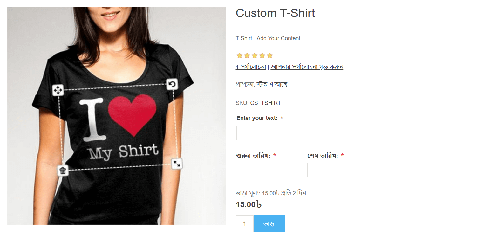
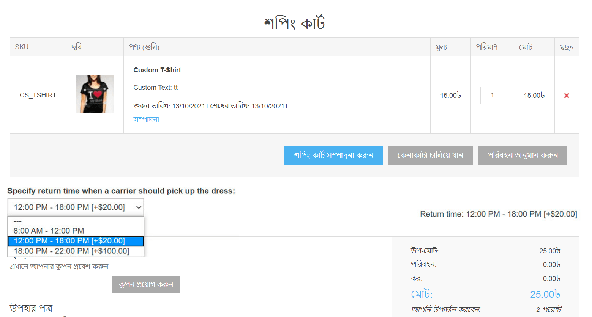
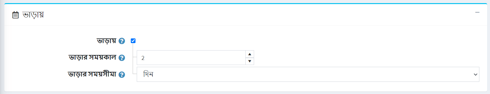
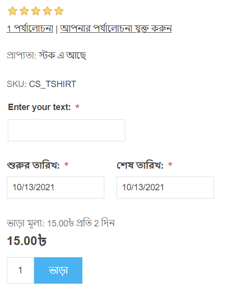

---
title: ভাড়া পণ্য
uid: bn/running-your-store/catalog/products/rental-products
author: git.AndreiMaz
contributors: git.MDRashedKhanMenon
---

# ভাড়া পণ্য

যখন আপনি একটি ওয়েবসাইট তৈরি করতে চান তখন ভাড়ার পণ্যের কার্যকারিতা উপকারী হয় যা গ্রাহকদের রুম এবং হোটেল বুক করতে দেয়। এই বৈশিষ্ট্যটি এমন একটি ওয়েবসাইটের জন্যও ব্যবহার করা যেতে পারে যা বিয়ের পোশাক, ক্যাম্পিং সামগ্রী, বাচ্চাদের খেলনা এবং ভাড়ার জন্য আরও অনেক কিছু প্রদান করে।

## উদাহরণ

ধরুন আপনি একটি ওয়েবসাইট তৈরি করতে চান যা ভাড়ায় বিয়ের পোশাক সরবরাহ করে।

এই ক্ষেত্রে কোন কার্যকারিতা কার্যকর হবে?

- সবচেয়ে গুরুত্বপূর্ণ বৈশিষ্ট্যগুলির মধ্যে একটি হল গ্রাহকদের *ভাড়ার সময়কাল* বেছে নেওয়ার অনুমতি দেওয়া। নপকমার্স-এ, নীচের স্ক্রিনশটের মতো শুরু তারিখ এবং শেষ তারিখ নির্বাচন করার অনুমতি দেওয়া হয়েছে:
	

- নপকমার্স-এ দোকান প্রশাসককে *ভাড়ার সময়কাল* এবং *ভাড়া সময়ের দৈর্ঘ্য* বেছে নেওয়ার অনুমতি দেয়। উদাহরণস্বরূপ, আপনি বিয়ের পোশাক ন্যূনতম ৩ দিনের জন্য ভাড়া দিতে চান। এই ক্ষেত্রে একজন গ্রাহক পণ্যের বিবরণ পৃষ্ঠায় নিম্নলিখিতগুলি দেখতে পাবেন:
	

- *চেকআউট অ্যাট্রিবিউটস* ব্যবহার করে একজন গ্রাহককে ফেরত যাওয়ার সময় নির্দিষ্ট করার অনুমতি দেয় যখন ক্যারিয়ারের পোশাকটি নেওয়া উচিত:
	
	চেকআউট বৈশিষ্ট্য সম্পর্কে আরও পড়ুন [এখানে](xref:bn/running-your-store/order-management/checkout-attributes).

যদি আপনি ইতিমধ্যেই [সাধারণ পণ্য](xref:bn/running-your-store/catalog/products/add-products) সেট আপ করতে শিখে থাকেন তাহলে নিচের বিভাগে এই পণ্যটি কিভাবে ভাড়া দেওয়া যায় তা শিখুন।

## একটি ভাড়া পণ্য সেট আপ করুন

একটি ভাড়া পণ্য তৈরি করতে, **ক্যাটালগ → পণ্য** এ যান। **নতুন যোগ করুন** ক্লিক করুন, সাধারণ পণ্যের ক্ষেত্রগুলি পূরণ করুন এবং*ভাড়া*প্যানেলে সংশ্লিষ্ট চেকবক্সে টিক দিন।

নিম্নলিখিত বিবরণ সংজ্ঞায়িত করুন:

- **ভাড়া সময়কাল দৈর্ঘ্য** একটি ভাড়া চক্র দৈর্ঘ্য, ন্যূনতম বিলিং সময়কাল। এই সময়ের জন্য মূল্য নির্দিষ্ট করা আছে।
- **ভাড়ার সময়কাল** *দিনে*,*সপ্তাহ*,*মাস* বা *বছর*। এটি ইউনিট নির্ধারণ করে সময় ভাড়ার সময় পরিমাপ করা হবে।

ভাড়ার পণ্য কেনার সময়, গ্রাহকদের পাবলিক স্টোরে ভাড়ার সময় নির্দিষ্ট করতে হবে। প্রদত্ত পরিমাণ স্বয়ংক্রিয়ভাবে গণনা করা হয়।

## টিউটোরিয়াল

- [ভাড়া পণ্য ব্যবস্থাপনা](https://www.youtube.com/watch?v=tOaC6hOILZY&list=PLnL_aDfmRHwsbhj621A-RFb1KnzeFxYz4&index=24)
