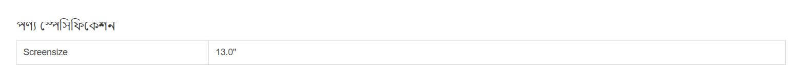
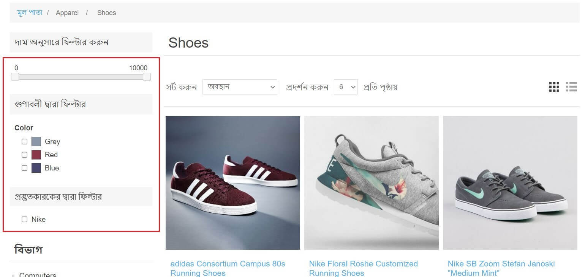
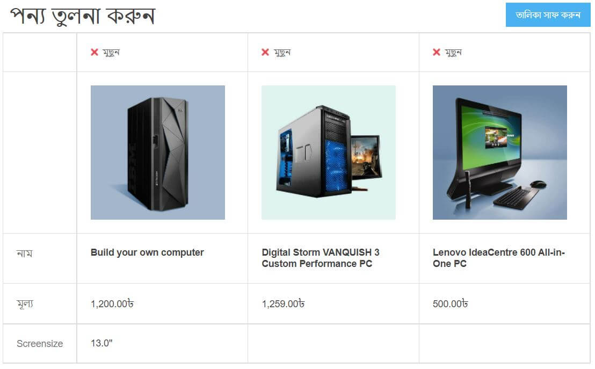
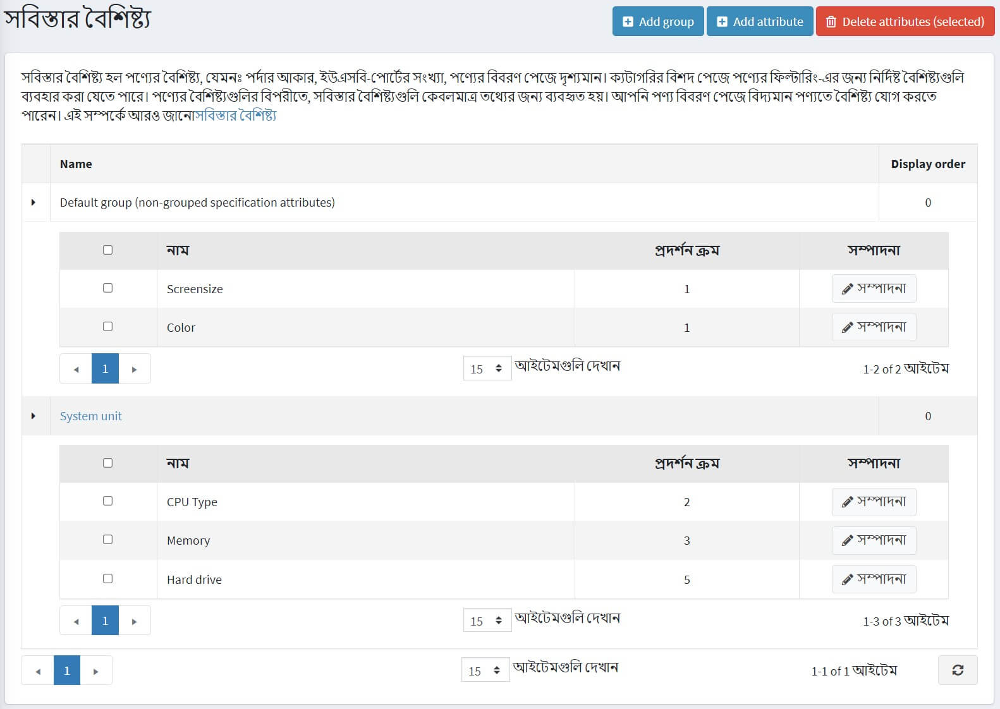
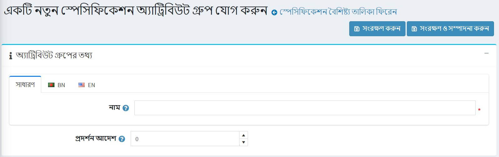
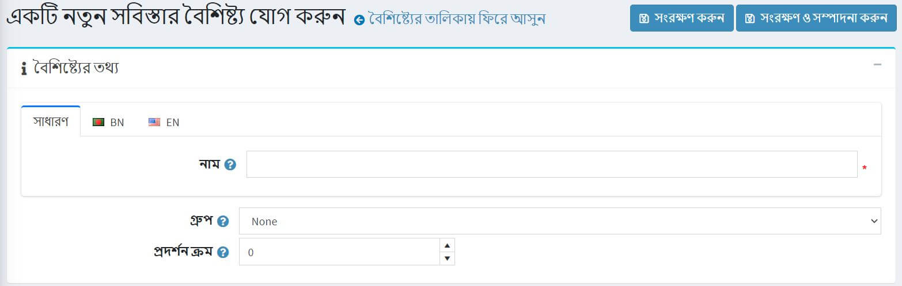
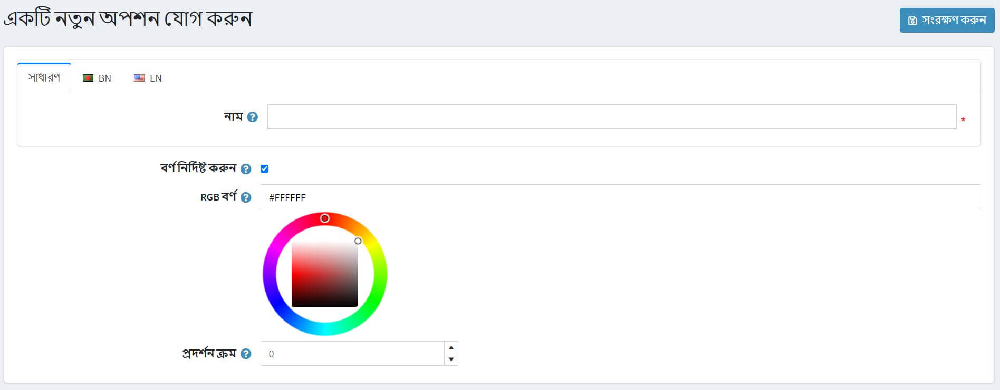
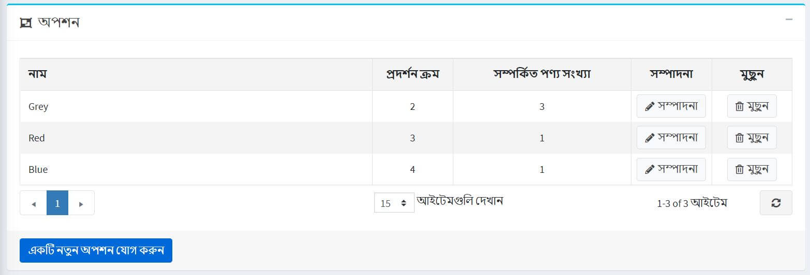
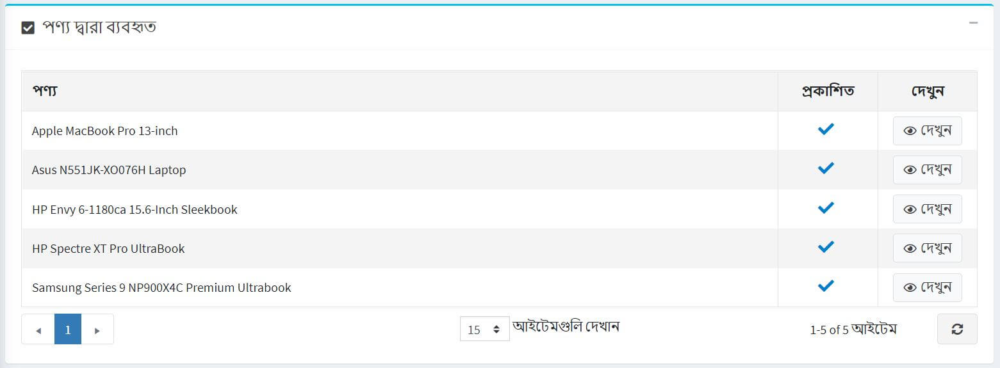

# স্পেসিফিকেশন বৈশিষ্ট্য

স্পেসিফিকেশন অ্যাট্রিবিউটগুলি [প্রোডাক্ট অ্যাট্রিবিউটস](xref:bn/running-your-store/catalog/products/product-attributes) এর অনুরূপ, তবে সেগুলি শুধুমাত্র তথ্যের উদ্দেশ্যে (পণ্যের বিবরণ পৃষ্ঠায় দৃশ্যমান) এবং পণ্য ফিল্টার করার জন্য ব্যবহৃত হয় বিভাগ বিবরণ পৃষ্ঠায়। তারা একটি পণ্যের মূল্য নির্ধারণ করে না এবং সেই সাথে ইনভেন্টরি ট্র্যাকিংয়ের জন্য ব্যবহার করা যায় না।

## উদাহরণ

ধরা যাক আপনি একটি অনলাইন কম্পিউটার স্টোর চালাচ্ছেন। কোন গ্রাহককে সিদ্ধান্ত নিতে সাহায্য করে?

- আপনার পণ্য সম্পর্কে একজন গ্রাহককে পূর্ণ এবং বর্ণনামূলক তথ্য প্রদান করুন। আপনি নির্দিষ্ট কম্পিউটারের সংক্ষিপ্ত এবং সম্পূর্ণ বিবরণ পূরণ করলেও, গ্রাহককে পণ্যের বৈশিষ্ট্য দেখতে দিন যেখানে এটি সবচেয়ে গুরুত্বপূর্ণ বিবরণ প্রতিফলিত করে:

  

  এই টেবিলটি পণ্যের বিবরণ পৃষ্ঠায় প্রদর্শিত হতে পারে যদি আপনি যদি পণ্যের পৃষ্ঠায় দেখান ক্ষেত্রটি নির্বাচন করেন যখন [একটি পণ্যের একটি স্পেসিফিকেশন বৈশিষ্ট্য যুক্ত করে](xref:bn/running-your-store/catalog/products/add-products#specification-attributes)।

- আপনার গ্রাহকদের ফিল্টার কার্যকারিতা ব্যবহার করে কম্পিউটার অনুসন্ধান করার অনুমতি দিন। ধরা যাক আমরা আপনার দোকানে সিপিইউ টাইপ এবং মেমরি দ্বারা অনুসন্ধান করতে পারি। তারপর ক্যাটাগরি পেজটি নিচের মত দেখাবে:

  

এই বৈশিষ্ট্যের দ্বারা ফিল্টার করার অনুমতি দেওয়ার জন্য **ফিল্টার করার অনুমতি দিন** ক্ষেত্রটি নির্বাচন করুন যখন [একটি পণ্যে একটি স্পেসিফিকেশন অ্যাট্রিবিউট যুক্ত করা হচ্ছে](xref:bn/running-your-store/catalog/products/add-products#specification-attributes) নির্দিষ্ট পণ্য।

- আপনার দোকানে "পণ্য তুলনা করুন" কার্যকারিতা অন্তর্ভুক্ত করুন। এই বৈশিষ্ট্যটি স্পেসিফিকেশন বৈশিষ্ট্যগুলিও ব্যবহার করে। আপনার কম্পিউটারের দোকানের জন্য "পণ্যগুলির তুলনা করুন" পৃষ্ঠাটি নিম্নরূপ দেখাবে:
  
  

  "পণ্যগুলির তুলনা করুন" কার্যকারিতা সক্ষম করতে **কনফিগারেশন → সেটিংস → ক্যাটালগ সেটিংস** এ যান। *পণ্যগুলির তুলনা করুন* প্যানেলে **'পণ্যগুলির তুলনা করুন' সক্ষম** চেকবক্সে টিক দিন।

পরবর্তী বিভাগ বর্ণনা করে কিভাবে স্পেসিফিকেশন অ্যাট্রিবিউট তৈরি করা যায়। লক্ষ্য করুন যে স্পেসিফিকেশন বৈশিষ্ট্যগুলির একটি তালিকা তৈরি করার পরে আপনাকে একের পর এক পণ্যগুলিতে স্পেসিফিকেশন বৈশিষ্ট্য যুক্ত করতে হবে। [প্রোডাক্ট-স্পেসিফিকেশন অ্যাট্রিবিউটস](xref:bn/running-your-store/catalog/products/add-products#specification-attributes) বিভাগে পণ্যগুলিতে স্পেসিফিকেশন অ্যাট্রিবিউট কিভাবে যোগ করবেন তা জানুন।

## একটি স্পেসিফিকেশন অ্যাট্রিবিউট গ্রুপ তৈরি করুন

> [!NOTE]
>
> সমস্ত স্পেসিফিকেশন বৈশিষ্ট্য যা কোনো গ্রুপের অন্তর্গত নয় *ডিফল্ট গ্রুপ (নন-গ্রুপেড স্পেসিফিকেশন অ্যাট্রিবিউট)* এর অধীনে।

স্পেসিফিকেশন অ্যাট্রিবিউট এবং তাদের গ্রুপগুলির একটি তালিকা দেখতে এবং এডিট করতে, **ক্যাটালগ → অ্যাট্রিবিউটস → স্পেসিফিকেশন অ্যাট্রিবিউট** এ যান।

একটি নতুন গ্রুপ যোগ করতে **গ্রুপ যোগ করুন** ক্লিক করুন। *একটি নতুন স্পেসিফিকেশন অ্যাট্রিবিউট গ্রুপ যুক্ত করুন* উইন্ডোটি নিম্নরূপ প্রদর্শিত হবে:

*অ্যাট্রিবিউট গ্রুপ তথ্য* প্যানেলে প্রবেশ করুন:

- স্পেসিফিকেশন অ্যাট্রিবিউট গ্রুপের **নাম**।
- **ডিসপ্লে অর্ডার** নম্বর।

তারপর পরিবর্তনগুলি সংরক্ষণ করুন।

## একটি স্পেসিফিকেশন অ্যাট্রিবিউট তৈরি করুন

> [!NOTE]
>
> ডিফল্টরূপে, নপকমার্স-এ পূর্বনির্ধারিত কোন স্পেসিফিকেশন বৈশিষ্ট্য নেই।

স্পেসিফিকেশন বৈশিষ্ট্যগুলির একটি তালিকা দেখতে এবং সম্পাদনা করতে, **ক্যাটালগ → বৈশিষ্ট্য → স্পেসিফিকেশন বৈশিষ্ট্য** এ যান।

এই পৃষ্ঠায় আপনি স্পেসিফিকেশন অ্যাট্রিবিউটগুলি নির্বাচন করে মুছে ফেলতে পারেন এবং তারপর **মুছে ফেলুন (নির্বাচিত)** বাটনে ক্লিক করুন।

একটি নতুন অ্যাট্রিবিউট যোগ করতে ** অ্যাড অ্যাট্রিবিউট যোগ করুন। *একটি নতুন স্পেসিফিকেশন বৈশিষ্ট্য যুক্ত করুন* উইন্ডোটি নিম্নরূপ প্রদর্শিত হবে:

*বৈশিষ্ট্য তথ্য* প্যানেলে প্রবেশ করুন:

- স্পেসিফিকেশন বৈশিষ্ট্যের **নাম**।
- **ডিসপ্লে অর্ডার** নম্বর।

**বিকল্পগুলি সম্পাদনা প্যানেলে এগিয়ে যেতে** সংরক্ষণ করুন এবং সম্পাদনা চালিয়ে যান ক্লিক করুন।

### একটি নতুন বিকল্প যোগ করুন

একটি নতুন স্পেসিফিকেশন অ্যাট্রিবিউট বিকল্প তৈরি করতে *বিকল্প* প্যানেলে **একটি নতুন বিকল্প যোগ করুন** বাটনে ক্লিক করুন। *একটি নতুন বিকল্প যুক্ত করুন* উইন্ডোটি নিম্নরূপ প্রদর্শিত হবে:

নিম্নলিখিত বিকল্প সেটিংস সংজ্ঞায়িত করুন:

- স্পেসিফিকেশন অ্যাট্রিবিউট বিকল্পের **নাম**।
- বিকল্প টেক্সট নামের পরিবর্তে ব্যবহারযোগ্য রং চয়ন করতে **রং নির্দিষ্ট করুন** চেকবক্সে টিক দিন (এটি "রঙের বর্গ" হিসাবে প্রদর্শিত হবে)।
  - **আরজিবি রং** বেছে নিন যা গ্রাহকদের কাছে প্রদর্শিত হবে।
- **ডিসপ্লে অর্ডা** নম্বর।

বিকল্পের বিবরণ সংরক্ষণ করতে **সংরক্ষণ করুন** ক্লিক করুন।

নিম্নলিখিত স্ক্রিনশটটি ইতিমধ্যে যোগ করা বিকল্পগুলি দেখায়:

### পণ্য দ্বারা ব্যবহৃত

আপনি যদি পণ্যের স্পেসিফিকেশন অ্যাট্রিবিউট প্রয়োগ করেন তবে আপনি এই পণ্যগুলির তালিকা *পণ্য দ্বারা ব্যবহৃত* প্যানেলে দেখতে পারেন:

## আরো দেখুন

-[পণ্য যোগ করা](xref:bn/running-your-store/catalog/products/add-products)
-[পণ্যের বৈশিষ্ট্য](xref:bn/running-your-store/catalog/products/product-attributes)
- [ইউটিউব টিউটোরিয়াল: ম্যানেজিং স্পেসিফিকেশন অ্যাট্রিবিউটস](https://www.youtube.com/watch?v=YmD_vHqWzQw&index=11&list=PLnL_aDfmRHwsbhj621A-RFb1KnzeFxYz4)
