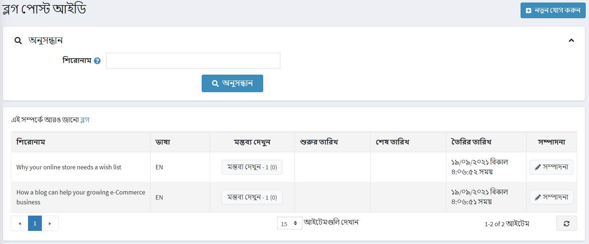
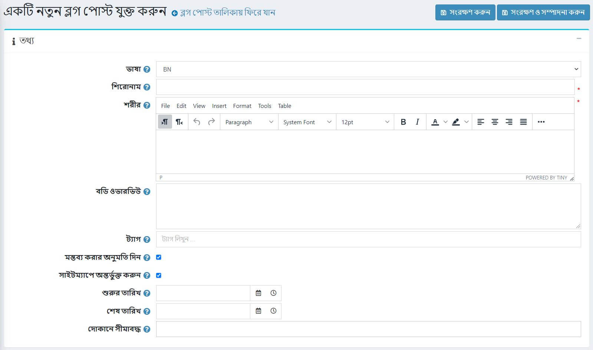
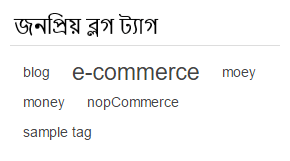
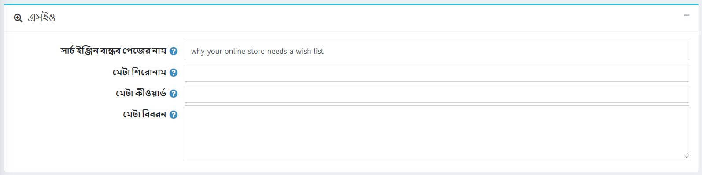
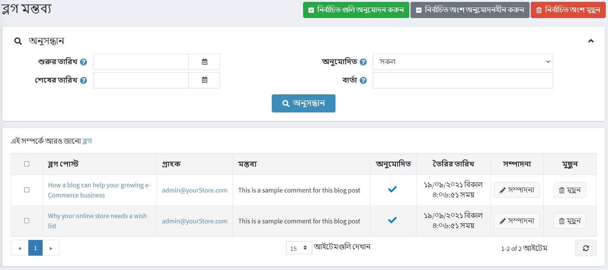
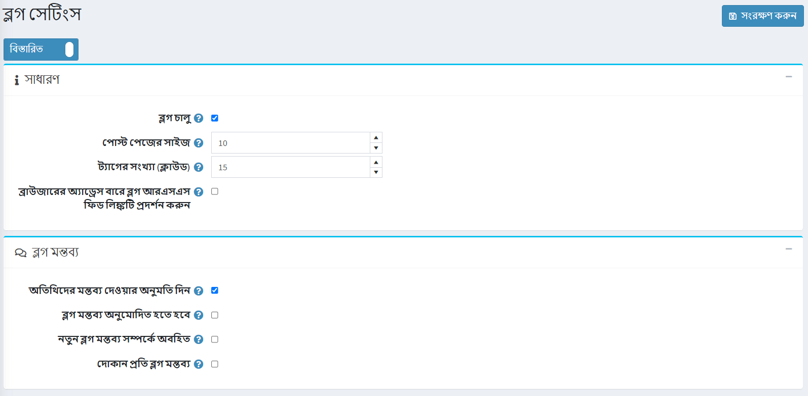

# ব্লগ

একটি ব্লগ হল আপনার বিদ্যমান গ্রাহকদের সাথে সংযোগ স্থাপন, তাদের সর্বশেষ পণ্য অফার সম্পর্কে অবহিত রাখা বা তাদের শিক্ষিত করার পাশাপাশি নতুন গ্রাহক খুঁজে বের করার একটি দুর্দান্ত উপায়।

ব্লগ পোস্ট পরিচালনা করতে **কনটেন্ট ম্যানেজমেন্ট → ব্লগ পোস্ট** এ যান।

## একটি নতুন ব্লগ পোস্ট যোগ করুন

**নতুন যোগ করুন** ক্লিক করুন এবং একটি নতুন ব্লগ পোস্ট সম্পর্কে তথ্য পূরণ করুন।

### তথ্য
*তথ্য* প্যানেলে নিম্নলিখিত ব্লগ পোস্টের বিবরণ সংজ্ঞায়িত করুন:
*যদি একাধিক ভাষা সক্ষম হয়, **ভাষা** ড্রপডাউন তালিকা থেকে, এই ব্লগ পোস্টের ভাষা নির্বাচন করুন। গ্রাহকরা শুধুমাত্র তাদের নির্বাচিত ভাষার জন্য ব্লগ পোস্ট দেখতে পাবেন।
*এই ব্লগ পোস্টের **শিরোনাম** লিখুন।
*এই ব্লগ পোস্টের **শরীর** পাঠ্য লিখুন।
*আপনি **বডি ওভারভিউ** নির্দিষ্ট করতে পারেন যদি আপনি চান যে পুরো ব্লগের মূল অংশটি ব্লগের মূল পৃষ্ঠায় দৃশ্যমান হোক যেখানে সমস্ত ব্লগ পোস্ট তালিকাভুক্ত।
*পাবলিক স্টোরে ব্লগ পৃষ্ঠায় প্রদর্শিত হতে ** ট্যাগ ** লিখুন। ট্যাগগুলি এমন কীওয়ার্ড যা এই ব্লগ পোস্ট দ্বারা চিহ্নিত করা যায়। এই ব্লগ পোস্টের সাথে যুক্ত হওয়ার জন্য ট্যাগগুলির একটি কমা দ্বারা বিচ্ছিন্ন তালিকা লিখুন। একটি নির্দিষ্ট ট্যাগের সাথে যত বেশি ব্লগ পোস্ট যুক্ত হয়, ব্লগ পৃষ্ঠায় সাইডবারে প্রদর্শিত "জনপ্রিয় ট্যাগ" এলাকায় এটির বড় আকার থাকে।
   

* Sগ্রাহকদের এই ব্লগ পোস্টে মন্তব্য যুক্ত করতে সক্ষম করতে **মন্তব্য অনুমোদন করুন** চেকবক্স নির্বাচন করুন।
*সাইটম্যাপে ব্লগ পোস্ট অন্তর্ভুক্ত করতে **সাইটম্যাপে অন্তর্ভুক্ত** চেকবক্স নির্বাচন করুন।
*সমন্বিত ইউনিভার্সাল টাইমে (UTC) এই ব্লগ পোস্ট প্রদর্শনের জন্য **শুরু তারিখ** এবং **শেষ তারিখ** লিখুন।

 > [!NOTE]
 >
 > আপনি যদি ব্লগ পোস্ট শুরুর এবং শেষের তারিখ নির্ধারণ করতে না চান তবে আপনি এই ক্ষেত্রগুলি খালি রাখতে পারেন।

- শুধুমাত্র নির্দিষ্ট দোকানের জন্য এই ব্লগ পোস্টটি সক্ষম করতে **স্টোরগুলিতে সীমিত** ক্ষেত্রের দোকানগুলি বেছে নিন। এই কার্যকারিতা প্রয়োজন না হলে ক্ষেত্রটি খালি রাখুন।
  > [!NOTE]
  >
> এই কার্যকারিতাটি ব্যবহার করার জন্য, আপনাকে নিম্নলিখিত সেটিংটি অক্ষম করতে হবে: **ক্যাটালগ সেটিংস "উপেক্ষা করুন" প্রতি দোকান সীমা "নিয়ম (সাইটওয়াইড)**। মাল্টি-স্টোর কার্যকারিতা সম্পর্কে আরও পড়ুন [এখানে](xref:bn/getting-start/advanced-configuration/multi-store)।

একটি বিদ্যমান ব্লগ পোস্ট সম্পাদনা করার সময় অথবা নতুন সংরক্ষণের জন্য **সংরক্ষণ করুন এবং সম্পাদনা চালিয়ে যান** বোতামে ক্লিক করার পরে, আপনি উপরের ডানদিকে **পূর্বরূপ** বাটনে ক্লিক করে দেখতে পারেন কিভাবে সাইটে ব্লগ পোস্টটি প্রদর্শিত হবে ।

### এসইও
*এসইও* প্যানেলে নিম্নলিখিত ব্লগ পোস্টের বিবরণ সংজ্ঞায়িত করুন:

- **সার্চ ইঞ্জিন বান্ধব পৃষ্ঠার নাম** সংজ্ঞায়িত করুন। উদাহরণস্বরূপ, আপনার URL `http://yourStore.com/the-best-news` তৈরি করতে" সেরা সংবাদ "লিখুন। ব্লগ পোস্টের শিরোনামের উপর ভিত্তি করে এটি স্বয়ংক্রিয়ভাবে তৈরি করতে এই ক্ষেত্রটি খালি রাখুন।
- **মেটা শিরোনাম** ক্ষেত্রের পৃষ্ঠার শিরোনামকে ওভাররাইড করুন (ডিফল্ট শিরোনাম হল ব্লগ পোস্টের শিরোনাম)।
- লিখুন **মেটা কীওয়ার্ড** - ব্লগ পোস্ট মেটা কীওয়ার্ড ব্লগ পোস্ট হেডারে যোগ করতে হবে। এটি পৃষ্ঠার জন্য সবচেয়ে গুরুত্বপূর্ণ থিমগুলির একটি সংক্ষিপ্ত এবং সংক্ষিপ্ত তালিকা।
- ব্লগ পোস্ট হেডারে যোগ করার জন্য **মেটা বর্ণনা** লিখুন। মেটা ডেসক্রিপশন ট্যাগ হল পৃষ্ঠার বিষয়বস্তুর একটি সংক্ষিপ্ত এবং সংক্ষিপ্ত সারসংক্ষেপ।

## ব্লগ মন্তব্য পরিচালনা করুন

ব্লগ মন্তব্য পরিচালনা করতে **বিষয়বস্তু ব্যবস্থাপনা → ব্লগ মন্তব্য** নির্বাচন করুন।

নির্বাচিত মন্তব্য অনুমোদন করার জন্য **অনুমোদিত নির্বাচন করুন** এবং অনুমোদিত না করার জন্য **বাছাইকৃত অনুমোদন** বোতামটি ব্যবহার করুন।
আপনি একটি ব্লগ মন্তব্য সম্পাদনা বা মুছে ফেলতে পারেন। মুছে ফেললে এই মন্তব্যটি সিস্টেম থেকে সরিয়ে দেওয়া হবে।

## ব্লগ সেটিংস

আপনি **কনফিগারেশন → সেটিংস → ব্লগ সেটিংস** এ ব্লগ সেটিংস পরিচালনা করতে পারেন। এই পৃষ্ঠাটি ২ টি মোডে উপলব্ধ: *উন্নত* এবং *মৌলিক*।

এই পৃষ্ঠাটি মাল্টি-স্টোর কনফিগারেশন সক্ষম করে, এর মানে হল যে একই স্টোরিং সকল স্টোরের জন্য সংজ্ঞায়িত করা যেতে পারে, অথবা স্টোর থেকে স্টোরে আলাদা হতে পারে। আপনি যদি একটি নির্দিষ্ট দোকানের জন্য সেটিংস পরিচালনা করতে চান, মাল্টি-স্টোর কনফিগারেশন ড্রপ-ডাউন তালিকা থেকে তার নামটি চয়ন করুন এবং তাদের জন্য কাস্টম মান নির্ধারণ করতে বাম পাশে সমস্ত প্রয়োজনীয় চেকবক্সে টিক দিন। আরও তথ্যের জন্য [মাল্টি-স্টোর](xref:bn/get-start/advanced-configuration/multi-store) পড়ুন।

### সাধারণ

নিম্নলিখিত *সাধারণ* সেটিংস সংজ্ঞায়িত করুন:
*আপনার দোকানে ব্লগ কার্যকারিতা সক্ষম করতে, **ব্লগ সক্ষম** চেকবক্স নির্বাচন করুন।
**পোস্ট পেজের সাইজ** ফিল্ডে, প্রতি পৃষ্ঠায় পোস্টের সংখ্যা সেট করুন।
**ট্যাগের সংখ্যা (ক্লাউড)** ফিল্ডে, ট্যাগ ক্লাউডে প্রদর্শিত ট্যাগের সংখ্যা লিখুন।
ব্রাউজার অ্যাড্রেস বারে ব্লগ আরএসএস ফিড লিঙ্কটি দেখানোর জন্য ব্রাউজার অ্যাড্রেস বারে **ডিসপ্লে ব্লগ আরএসএস ফিড লিঙ্ক** চেকবক্স নির্বাচন করুন।

### ব্লগ মন্তব্য

নিম্নলিখিত *ব্লগ মন্তব্য* সেটিংস সংজ্ঞায়িত করুন:
*নিবন্ধন না করা ব্যবহারকারীদের ব্লগে মন্তব্য যোগ করতে সক্ষম করতে **অতিথিদের মন্তব্য ছেড়ে দেওয়ার অনুমতি দিন** চেকবক্স নির্বাচন করুন।
*নির্বাচন করুন **ব্লগ মন্তব্য অনুমোদিত হতে হবে** চেকবক্স যদি ব্লগ মন্তব্য প্রশাসক দ্বারা অনুমোদিত হতে হবে।
***নতুন ব্লগ মন্তব্য সম্পর্কে বিজ্ঞপ্তি** চেকবক্স নির্বাচন করুন, নতুন ব্লগ মন্তব্য সম্পর্কে দোকান মালিককে অবহিত করতে।
*শুধুমাত্র বর্তমান দোকানে লেখা ব্লগ মন্তব্য প্রদর্শনের জন্য **দোকান প্রতি ব্লগ মন্তব্য** চেকবক্স নির্বাচন করুন।

**সেভ** ক্লিক করুন।

> [!NOTE]
>
> আপনি নিরাপত্তার উদ্দেশ্যে ব্লগ মন্তব্যের জন্য ক্যাপচা সক্ষম করতে পারেন। আরও তথ্যের জন্য [ক্যাপচা](xref:bn/getting-start/advanced-configuration/security-settings#captcha) বিভাগে যান।