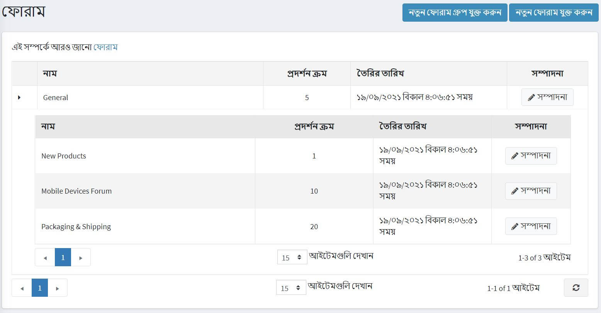
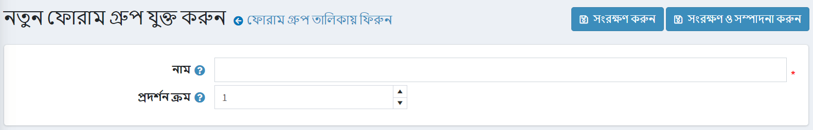
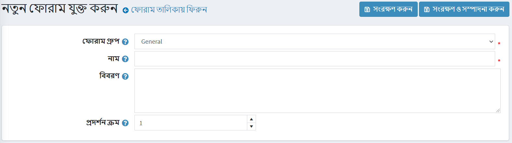
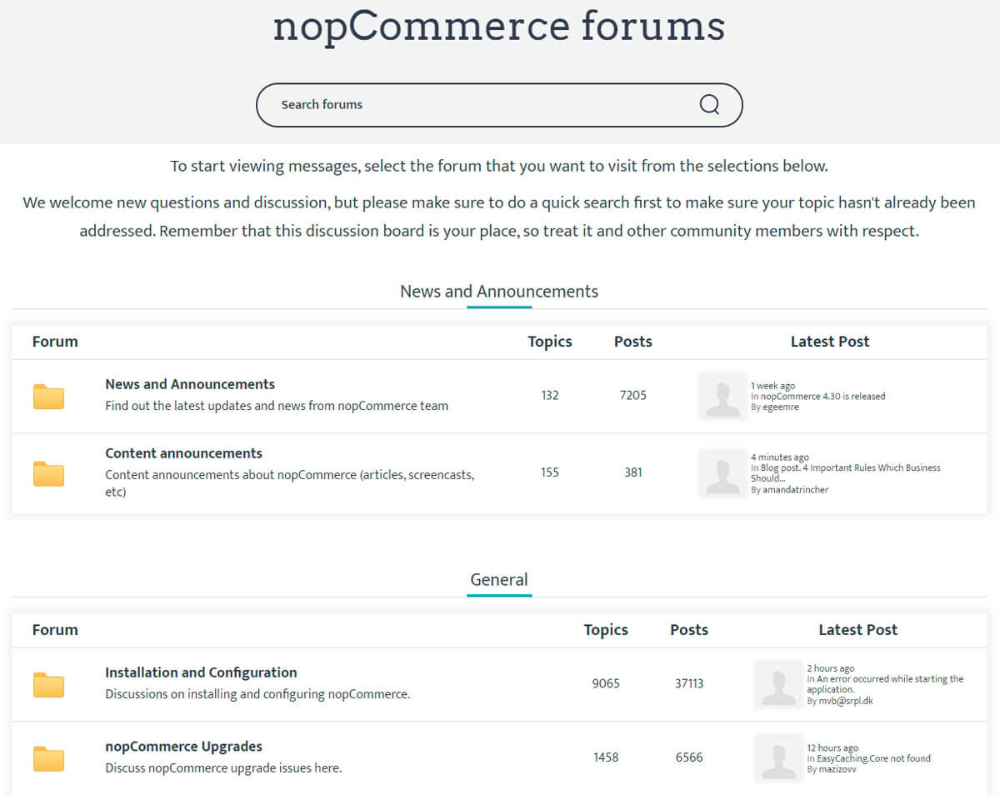
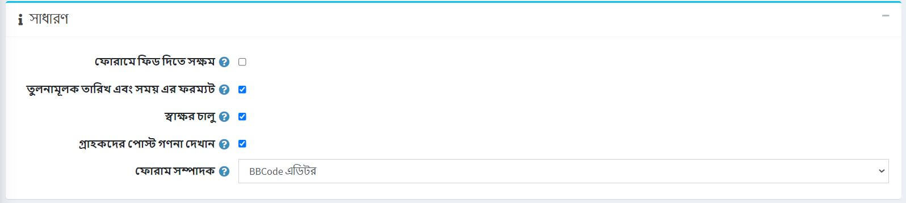
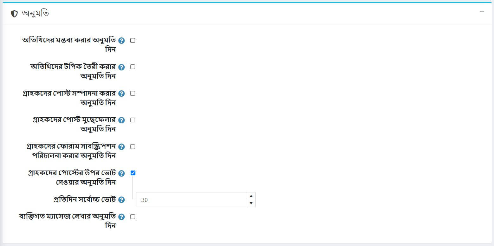
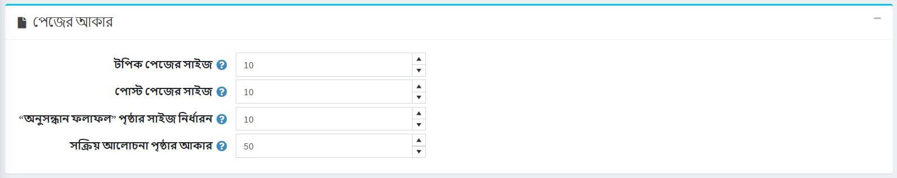
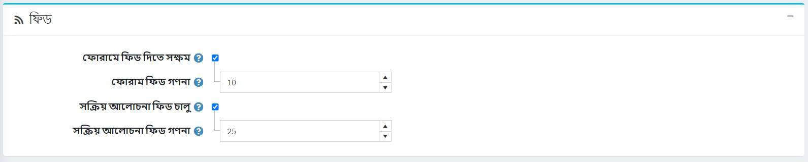

# ফোরাম

একটি ফোরাম হল একটি অনলাইন আলোচনা সাইট যেখানে মানুষ পোস্ট করা বার্তা আকারে কথোপকথন করতে পারে। একটি ফোরামে বেশ কয়েকটি সাবফোরাম থাকতে পারে, যার প্রত্যেকটিতে বেশ কয়েকটি বিষয় থাকে।

> [!NOTE]
>
> নপকমার্স-এ, ফোরাম ডিফল্টরূপে নিষ্ক্রিয় করা হয়। ফোরাম সক্ষম করতে, **কনফিগারেশন → সেটিংস → ফোরাম সেটিংস** এ যান এবং **ফোরাম সক্ষম** চেকবক্সে টিক দিন। "ফোরাম" লিঙ্কটি পাবলিক স্টোরের মেনুতে প্রদর্শিত হওয়া উচিত (উপরের মেনু বা ডিফল্ট থিমের পাদলেখ)।

ফোরাম গ্রুপ এবং ফোরাম পরিচালনা করার জন্য (ফোরাম গ্রুপের ভিতরে) **কন্টেন্ট ম্যানেজমেন্ট → ফোরাম** এ যান।

## একটি নতুন ফোরাম গ্রুপ যোগ করুন

**নতুন ফোরাম গ্রুপ যোগ করুন** বাটনে ক্লিক করুন।

- একটি নতুন ফোরাম গ্রুপ **নাম** সংজ্ঞায়িত করুন।
- **ডিসপ্লে অর্ডার** ফিল্ডে, ফোরাম গ্রুপের ডিসপ্লে অর্ডার লিখুন। ১ এর মান তালিকার শীর্ষে প্রতিনিধিত্ব করে

**সেভ** ক্লিক করুন।

## একটি নতুন ফোরাম যুক্ত করুন

- **ফোরাম গ্রুপ** ড্রপডাউন তালিকা থেকে, প্রয়োজনীয় ফোরাম গ্রুপ নির্বাচন করুন।
- নতুন ফোরামের **নাম** লিখুন।
- নতুন ফোরামের **বর্ণনা** লিখুন।
- ফোরাম গ্রুপের জন্য **ডিসপ্লে অর্ডার** নির্বাচন করুন। ১ এর মান তালিকার শীর্ষে প্রতিনিধিত্ব করে

**সেভ** ক্লিক করুন।

ফোরাম কিভাবে কাজ করবে তার একটি উদাহরণ দেখতে <http://www.nopcommerce.com/boards/> এ যান।

## ফোরাম সেটিংস

ফোরাম সেটিংস অ্যাক্সেস করতে **কনফিগারেশন → সেটিংস → ফোরাম সেটিংস** এ যান। এই পৃষ্ঠাটি ২ টি মোডে উপলব্ধ: *উন্নত* এবং *মৌলিক*।

এই পৃষ্ঠাটি মাল্টি-স্টোর কনফিগারেশন সক্ষম করে, এর মানে হল যে একই স্টোরিং সকল স্টোরের জন্য সংজ্ঞায়িত করা যেতে পারে, অথবা স্টোর থেকে স্টোরে আলাদা হতে পারে। আপনি যদি একটি নির্দিষ্ট দোকানের জন্য সেটিংস পরিচালনা করতে চান, মাল্টি-স্টোর কনফিগারেশন ড্রপ-ডাউন তালিকা থেকে তার নামটি চয়ন করুন এবং তাদের জন্য কাস্টম মান নির্ধারণ করতে বাম পাশে সমস্ত প্রয়োজনীয় চেকবক্সে টিক দিন। আরও তথ্যের জন্য [মাল্টি-স্টোর](xref:bn/get-start/advanced-configuration/multi-store) পড়ুন।

### সাধারণ

*সাধারণ* প্যানেলে নিম্নলিখিত ফোরাম সেটিংস সংজ্ঞায়িত করুন:

- **ফোরাম সক্ষম** চেকবক্স চেক করে ফোরাম সক্ষম করুন।
- আপেক্ষিক তারিখ এবং সময় সক্ষম করতে **আপেক্ষিক তারিখ এবং সময় বিন্যাস** চেকবক্স নির্বাচন করুন (যেমন ২ ঘন্টা আগে, ১ দিন আগে)।
- আপনি **স্বাক্ষর সক্ষম** চেক করে গ্রাহকদের স্বাক্ষর নির্দিষ্ট করার সুযোগ দিতে পারেন।
- গ্রাহকদের তৈরি করা পোস্টের সংখ্যা দেখাতে সক্ষম করতে **গ্রাহকদের পোস্ট কাউন্ট দেখান** চেকবক্স নির্বাচন করুন।
- **ফোরাম এডিটর** ড্রপডাউন তালিকা থেকে, ব্যবহার করার জন্য ফোরাম এডিটর টাইপ নির্বাচন করুন:
  - সহজ টেক্সটবক্স।
  - বিবিকোড সম্পাদক।
  > [!NOTE]
  >
  > উত্পাদন পরিবেশে ফোরাম সম্পাদকের ধরন পরিবর্তন করার সুপারিশ করা হয় না।

### অনুমতি

*অনুমতি* প্যানেলে নিম্নলিখিত ফোরাম সেটিংস সংজ্ঞায়িত করুন:

- **অতিথিদের পোস্ট তৈরির অনুমতি দিন**।
- **অতিথিদের বিষয় তৈরির অনুমতি দিন**।
- **গ্রাহকদের পোস্ট সম্পাদনা করার অনুমতি দিন**।
- **গ্রাহকদের পোস্ট মুছে ফেলার অনুমতি দিন**।
- **গ্রাহকদের ফোরাম সাবস্ক্রিপশন পরিচালনা করার অনুমতি দিন**।
- ভোটিং সক্ষম করতে **ব্যবহারকারীদের পোস্টের জন্য ভোট দেওয়ার অনুমতি দিন** চেকবক্সে টিক দিন।
  - **প্রতিদিন সর্বোচ্চ ভোট** ক্ষেত্রটি পূর্ববর্তী সেটিং সক্ষম থাকলে প্রতিটি ব্যবহারকারী প্রতিদিন করতে পারে এমন একটি সংখ্যা নির্ধারণ করে।
**ব্যক্তিগত বার্তাগুলি চেক করুন** চেকবক্স চেক করে ব্যক্তিগত বার্তাগুলি সক্ষম করুন। সক্ষম হলে নিচের দুটি সেটিংস দৃশ্যমান হবে:
  - নতুন ব্যক্তিগত বার্তা পেলে **সতর্কতা পপআপ সক্ষম করতে** -এর জন্য সতর্কতা দেখান চেকবক্সে টিক দিন।
  - যদি ব্যক্তিগত গ্রাহকদের **নতুন ব্যক্তিগত বার্তা সম্পর্কে** ইমেলের মাধ্যমে অবহিত করা হয় তবে ব্যক্তিগত বিজ্ঞপ্তি সম্পর্কে বিজ্ঞপ্তি দিন, টিক দিন।

### পৃষ্ঠার মাপ

*পৃষ্ঠা আকার* প্যানেলে নিম্নলিখিত ফোরাম সেটিংস সংজ্ঞায়িত করুন:

- **টপিক পেজ সাইজ** - ফোরামে টপিকের জন্য পেজের সাইজ যেমন প্রতি পৃষ্ঠায় '১০' বিষয়।
- **পোস্ট পৃষ্ঠার আকার** - বিষয়গুলির পোস্টের জন্য পৃষ্ঠার আকার উদা প্রতি পৃষ্ঠায় '১০' পোস্ট।
- **অনুসন্ধান ফলাফল পৃষ্ঠার আকার** - অনুসন্ধান ফলাফলের জন্য পৃষ্ঠার আকার উদা প্রতি পৃষ্ঠায় '১০' ফলাফল।
- **সক্রিয় আলোচনা পৃষ্ঠার আকার** - সক্রিয় আলোচনার পৃষ্ঠার জন্য পৃষ্ঠার আকার উদা প্রতি পৃষ্ঠায় '১০' ফলাফল।

### ফিড

*ফিডস* প্যানেলে নিম্নলিখিত ফোরাম সেটিংস সংজ্ঞায়িত করুন:

- প্রতিটি ফোরামের জন্য আরএসএস ফিড সক্ষম করতে **ফোরাম ফিডস সক্ষম** চেকবক্স নির্বাচন করুন।
- **ফোরাম ফিড কাউন্ট** ফিল্ডে প্রতিটি ফিডের অন্তর্ভুক্ত বিষয়গুলির সংখ্যা নির্ধারণ করুন।
- সক্রিয় আলোচনার বিষয়গুলির জন্য আরএসএস ফিড সক্ষম করতে **সক্রিয় আলোচনা ফিড সক্ষম** চেকবক্স নির্বাচন করুন।
- **সক্রিয় আলোচনা ফিড গণনা** ক্ষেত্রের মধ্যে "সক্রিয় আলোচনা" ফিডের অন্তর্ভুক্ত আলোচনার সংখ্যা নির্ধারণ করুন।

## টিউটোরিয়াল

- [নপকমার্স-এ ফোরাম পরিচালনা করা](https://www.youtube.com/watch?v=wW2QvC4WA_8)