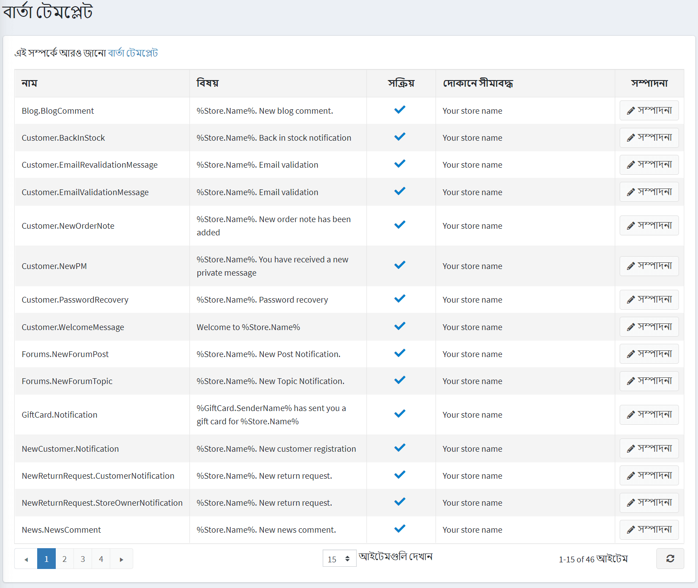
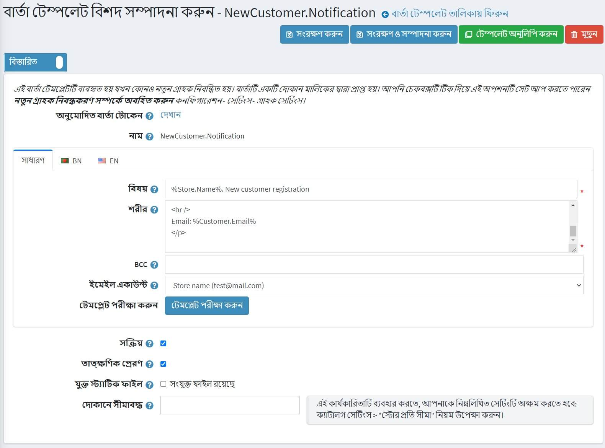

# বার্তা টেমপ্লেট

বার্তা টেমপ্লেটগুলি আপনার দোকান থেকে পাঠানো স্বয়ংক্রিয় বার্তার বিন্যাস, বিষয়বস্তু এবং বিন্যাস নির্ধারণ করে। তাদের লেনদেনের ইমেল বলা হয় কারণ প্রতিটি একটি নির্দিষ্ট ধরনের লেনদেনের সাথে যুক্ত।

অর্ডার স্ট্যাটাস ইত্যাদি সম্পর্কে ব্যবহারকারীদের অবহিত করার জন্য ডিফল্টরূপে নপকমার্স-এ বেশ কয়েকটি মেসেজ টেমপ্লেট পাওয়া যায়। মেসেজ টেমপ্লেটগুলি অ্যাক্সেস করতে **কনটেন্ট ম্যানেজমেন্ট → মেসেজ টেমপ্লেট** এ যান।

একটি নির্দিষ্ট দোকানে ব্যবহৃত বার্তা টেমপ্লেটগুলি অনুসন্ধান করতে, তালিকা থেকে দোকানের একটি নাম নির্বাচন করুন।

## একটি বার্তা টেমপ্লেট সম্পাদনা করুন

আপনি যে বার্তাটি সম্পাদনা করতে চান তা খুঁজুন এবং **সম্পাদনা করুন** এ ক্লিক করুন। *সম্পাদনা বার্তার টেমপ্লেট বিবরণ* উইন্ডোটি নিম্নরূপ প্রদর্শিত হয়:

আপনার যদি একাধিক ভাষা ইনস্টল থাকে তবে প্রয়োজনীয় **ভাষা ট্যাব** নির্বাচন করুন।

> [!TIP]
> 
> ডিফল্টরূপে, সিস্টেমে শুধুমাত্র ইংরেজি ভাষা ব্যবহার করা হয়। আপনি **কনফিগারেশন → ভাষা** এ ভাষা পরিচালনা করতে পারেন। [লোকালাইজেশন](xref:bn/getting-start/advanced-configuration/localization) বিভাগে নপকমার্স-এর ভাষা সম্পর্কে আরও পড়ুন।

নিম্নরূপ বার্তা টেমপ্লেট বিবরণ সম্পাদনা করুন:
- বার্তার **বিষয়** সম্পাদনা করুন। আপনি বিষয়টিতে টোকেন অন্তর্ভুক্ত করতে পারেন। আপনি পৃষ্ঠার শীর্ষে অনুমোদিত সমস্ত টোকেন সহ তালিকাটি দেখতে পারেন।
- বার্তার **শরীর** সম্পাদনা করুন।
- **বিসিসি** ফিল্ডে, প্রয়োজন হলে এই ইমেল বার্তার অন্ধ কপি প্রাপকদের প্রবেশ করুন।
- **ইমেইল একাউন্ট** ড্রপডাউন তালিকা থেকে, এই মেসেজ টেমপ্লেট পাঠাতে ব্যবহৃত ইমেইল অ্যাকাউন্ট নির্বাচন করুন।
- আপনি **টেস্ট টেমপ্লেট** বাটনে ক্লিক করে এই বার্তা টেমপ্লেটটি পরীক্ষা করতে পারেন। যখন ক্লিক করুন *পরীক্ষার ইমেল পাঠান* প্রদর্শিত হয়, নিম্নরূপ:
[পরীক্ষার ইমেইল পাঠান](_static/message-templates/test-template.jpg)
**ইমেল পাঠান** ক্ষেত্রটিতে আপনার ইমেল লিখুন, কিছু পরীক্ষার মান দিয়ে টোকেনগুলি পূরণ করুন তারপর **পাঠান** বাটনে ক্লিক করুন।
	
> [!TIP]
> 
> ইমেল অ্যাকাউন্টগুলি **কনফিগারেশন → ইমেল অ্যাকাউন্ট** এ কনফিগার করা হয়। [ইমেল অ্যাকাউন্ট](xref:bn/get-start/email-accounts) বিভাগে এ সম্পর্কে আরও পড়ুন।

- এই মেসেজটি পাঠাতে হবে তা নির্দেশ করার জন্য **সক্রিয়** অপশনটি নির্বাচন করুন।
- যদি আপনি এই ইমেলটি অবিলম্বে পাঠাতে চান তবে **অবিলম্বে পাঠান** চেকবক্সে টিক দিন।
- যদি পূর্ববর্তী চেকবক্সটি অনির্বাচিত হয় **বিলম্ব পাঠান** ক্ষেত্র প্রদর্শিত হয়।
- প্রতিটি সংযুক্ত ইমেলের সাথে সংযুক্ত একটি ফাইল আপলোড করতে **সংযুক্ত স্ট্যাটিক** ফাইল চেকবক্স নির্বাচন করুন।
- নির্দিষ্ট দোকানে ক্যাটাগরি বিক্রি হলে **স্টোরের মধ্যে সীমিত** ক্ষেত্রের দোকানগুলি বেছে নিন। এই কার্যকারিতা প্রয়োজন না হলে ক্ষেত্রটি খালি রাখুন।

> [!NOTE]
>
> এই কার্যকারিতাটি ব্যবহার করার জন্য, আপনাকে নিম্নলিখিত সেটিংটি অক্ষম করতে হবে: **ক্যাটালগ সেটিংস → উপেক্ষা করুন "প্রতি দোকান সীমা" নিয়ম (সাইটওয়াইড)**। মাল্টি-স্টোর কার্যকারিতা সম্পর্কে আরও পড়ুন [এখানে](xref:bn/getting-start/advanced-configuration/multi-store)।

**সেভ** ক্লিক করুন।

> [!NOTE]
> 
> মেসেজ টেমপ্লেটের সম্পূর্ণ কপি তৈরি করতে, উপরের ডানদিকে **টেমপ্লেট কপি করুন** ক্লিক করুন। যদি আপনার বেশ কয়েকটি দোকান কনফিগার থাকে এবং আপনার প্রতিটি দোকানের জন্য আলাদা টেমপ্লেট তৈরি করতে চান তবে এটি কার্যকর।

## আরো দেখুন

-[ইমেল অ্যাকাউন্ট](xref:bn/getting-start/email-accounts)
-[ভাষা](xref:bn/getting-start/advanced-configuration/localization)

## টিউটোরিয়াল

- [বার্তা টেমপ্লেটগুলিতে শর্ত যুক্ত করা](https://www.youtube.com/watch?v=5chrb1yH1v4&feature=youtu.be)