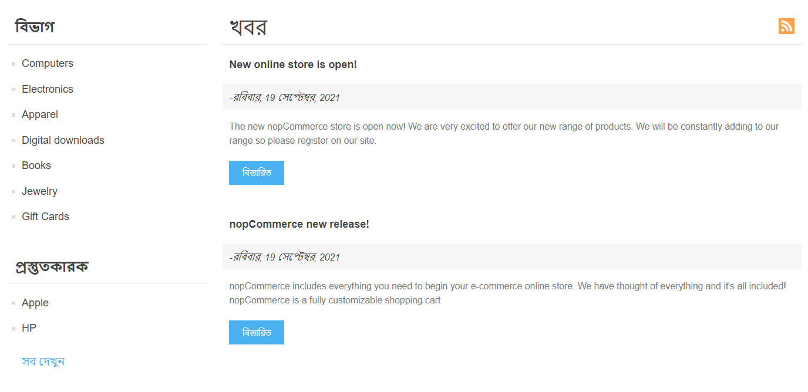
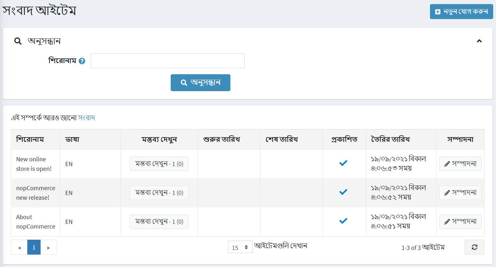
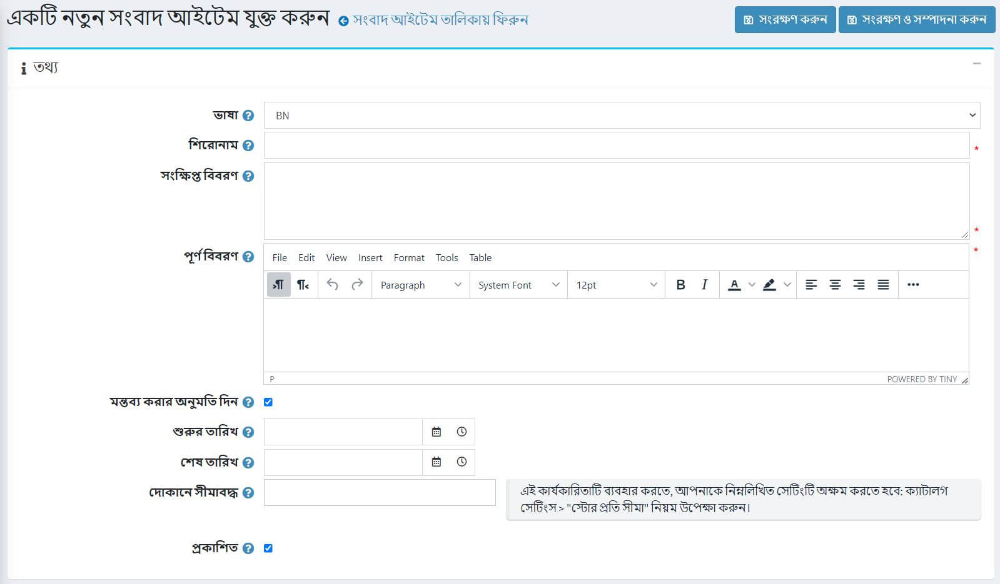
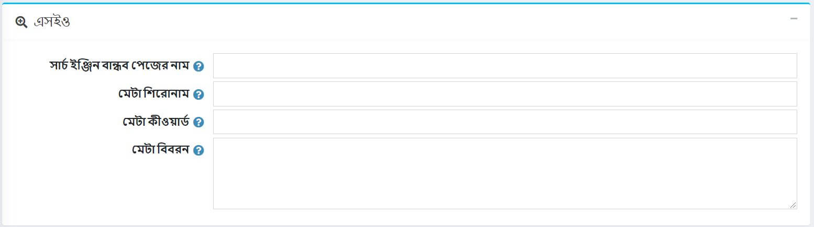
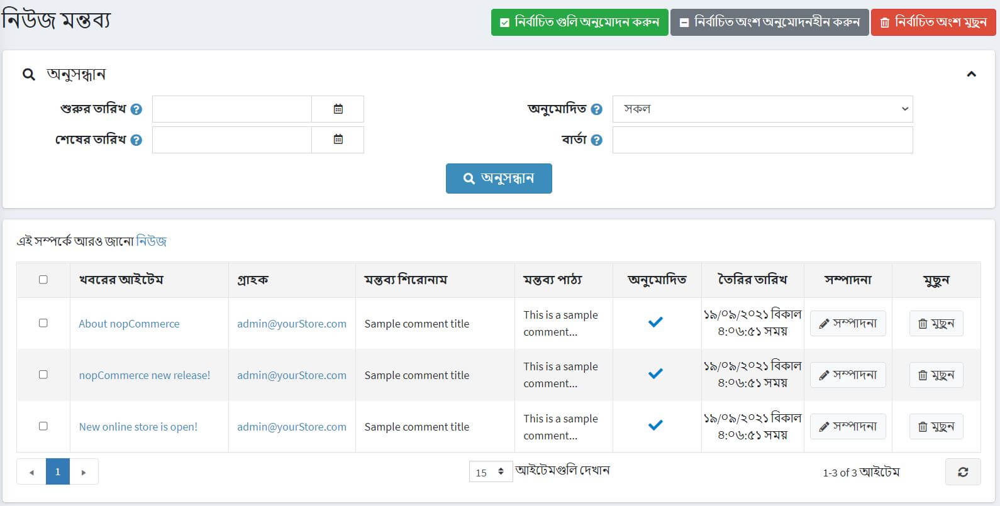
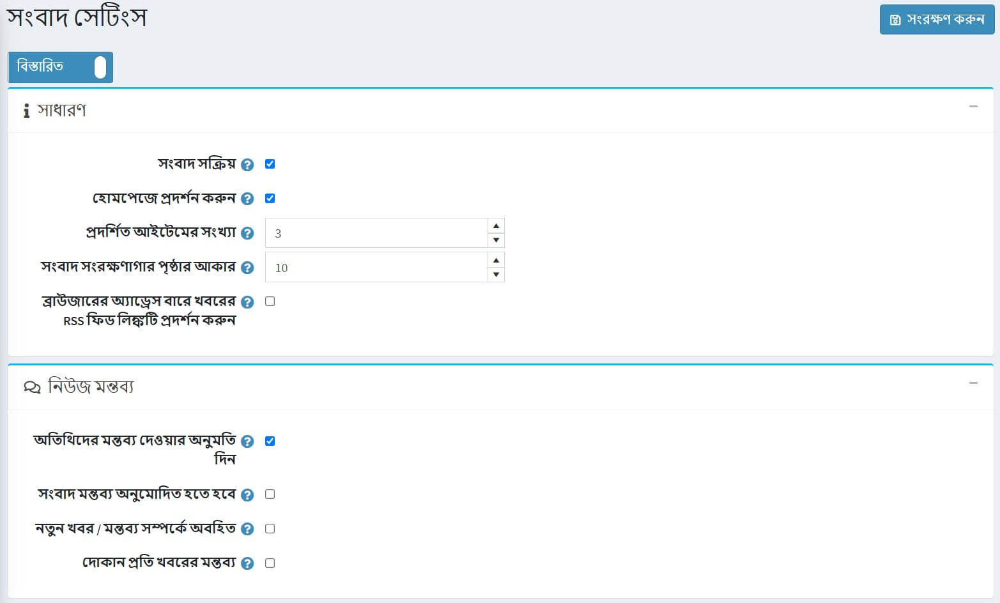

# খবর

নপকমার্স আপনাকে আপনার দোকানে সংবাদ পোস্ট করার অনুমতি দেয়। নপকমার্স-এর সর্বশেষ রিলিজের তথ্য, আপনার কোম্পানির আপডেট ইত্যাদির মতো গুরুত্বপূর্ণ কোনো খবর থাকতে পারে।

হোমপেজে অথবা সাইট ফুটার মেনুতে আপনার দোকানে খবর প্রদর্শিত হয়।

নিউজ ম্যানেজ করতে **কনটেন্ট ম্যানেজমেন্ট → নিউজ আইটেম** এ যান। সমস্ত খবরের তালিকা নিম্নরূপ প্রদর্শিত হয়:

## খবর যোগ করা

একটি নতুন সংবাদ যোগ করার জন্য **সম্পাদনা করুন** বাটনে ক্লিক করুন এবং সংবাদ আইটেম সম্পর্কে তথ্য পূরণ করুন।

### তথ্য

*তথ্য* প্যানেলে নিম্নলিখিত সংবাদ আইটেমের বিবরণ সংজ্ঞায়িত করুন:
- যদি একাধিক ভাষা সক্ষম হয়, **ভাষা** ড্রপডাউন তালিকা থেকে, এই সংবাদটির ভাষা নির্বাচন করুন। গ্রাহকরা শুধুমাত্র তাদের নির্বাচিত ভাষার জন্য খবর দেখতে পাবেন।
- এই খবরের **শিরোনাম** লিখুন। উদাহরণস্বরূপ: "আমাদের নতুন নপকমার্স স্টোরের সূচনা"।
- **সংক্ষিপ্ত বিবরণ** ক্ষেত্রের মধ্যে, এই সংবাদের একটি বিমূর্ত লিখুন। এই পাঠ্যটি আপনার দর্শকরা পাবলিক স্টোরের খবরের তালিকায় দেখতে পাবেন।
- **সম্পূর্ণ বিবরণ** ফিল্ডে, এই খবরের টেক্সট লিখুন।
- নিউজ আইটেমগুলিতে মন্তব্য যুক্ত করতে গ্রাহকদের সক্ষম করতে **মন্তব্য অনুমোদন করুন** চেকবক্স নির্বাচন করুন।
*সমন্বিত ইউনিভার্সাল টাইমে (UTC) এই সংবাদটি প্রদর্শনের জন্য **শুরু তারিখ** এবং **শেষ তারিখ** লিখুন।

 > [!NOTE]
 >
 > আপনি যদি খবরের শুরুর এবং শেষের তারিখ নির্ধারণ করতে না চান তবে আপনি এই ক্ষেত্রগুলি খালি রাখতে পারেন।

 - শুধুমাত্র নির্দিষ্ট দোকানের জন্য এই নিউজ আইটেমটি সক্ষম করতে **স্টোর সীমিত** স্টোরের দোকানগুলি বেছে নিন। এই কার্যকারিতা প্রয়োজন না হলে ক্ষেত্রটি খালি রাখুন।
 
> [!NOTE]
>
> এই কার্যকারিতাটি ব্যবহার করার জন্য, আপনাকে নিম্নলিখিত সেটিংটি অক্ষম করতে হবে: **ক্যাটালগ সেটিংস "উপেক্ষা করুন" প্রতি দোকান সীমা "নিয়ম (সাইটওয়াইড)**। মাল্টি-স্টোর কার্যকারিতা সম্পর্কে আরও পড়ুন [এখানে](xref:bn/getting-start/advanced-configuration/multi-store)।

- আপনার দোকানে এই সংবাদটি প্রকাশ করতে **প্রকাশিত** চেকবক্স নির্বাচন করুন।

একটি বিদ্যমান সংবাদ আইটেম সম্পাদনা করার সময় অথবা নতুন সংরক্ষণের জন্য **সংরক্ষণ করুন এবং সম্পাদনা চালিয়ে যান** বাটনে ক্লিক করার পরে, আপনি সাইটে ডানদিকে নিউম আইটেমটি কীভাবে প্রদর্শিত হবে তা দেখতে উপরের ডানদিকে **পূর্বরূপ** বাটনে ক্লিক করতে পারেন। ।

### এসইও

*এসইও* প্যানেলে নিম্নলিখিত সংবাদ আইটেমের বিবরণ সংজ্ঞায়িত করুন:

- **সার্চ ইঞ্জিন বান্ধব পৃষ্ঠার নাম** সংজ্ঞায়িত করুন। উদাহরণস্বরূপ, আপনার URL `http://yourStore.com/the-best-news` তৈরি করতে" সেরা সংবাদ "লিখুন। খবরের শিরোনামের উপর ভিত্তি করে স্বয়ংক্রিয়ভাবে এটি তৈরি করতে এই ক্ষেত্রটি খালি রাখুন।
- **মেটা শিরোনাম** ক্ষেত্রের পৃষ্ঠার শিরোনামকে ওভাররাইড করুন (ডিফল্ট শিরোনাম হল সংবাদ আইটেমের শিরোনাম)।
- **মেটা কীওয়ার্ড লিখুন** - নিউজ আইটেম হেডারে নিউজ আইটেম মেটা কিওয়ার্ড যোগ করতে হবে। এটি পৃষ্ঠার জন্য সবচেয়ে গুরুত্বপূর্ণ থিমগুলির একটি সংক্ষিপ্ত এবং সংক্ষিপ্ত তালিকা।
- খবরের শিরোনামে যোগ করার জন্য **মেটা বর্ণনা** লিখুন। মেটা ডেসক্রিপশন ট্যাগ হল পৃষ্ঠার বিষয়বস্তুর একটি সংক্ষিপ্ত এবং সংক্ষিপ্ত সারসংক্ষেপ।

## খবরের মন্তব্য পরিচালনা করা

সংবাদ মন্তব্য পরিচালনা করতে, **বিষয়বস্তু ব্যবস্থাপনা → সংবাদ মন্তব্য** এ যান।

নির্বাচিত মন্তব্য অনুমোদন করার জন্য **অনুমোদিত নির্বাচন করুন** এবং অনুমোদিত না করার জন্য **বাছাইকৃত অনুমোদন** বোতামটি ব্যবহার করুন।
আপনি একটি মন্তব্য সম্পাদনা বা মুছে ফেলতে পারেন। মুছে ফেললে এই মন্তব্যটি সিস্টেম থেকে সরিয়ে দেওয়া হবে।

## নিউজ সেটিংস

আপনি **কনফিগারেশন → সেটিংস → নিউজ সেটিংস** এ নিউজ সেটিংস পরিচালনা করতে পারেন। এই পৃষ্ঠাটি ২ টি মোডে উপলব্ধ: *উন্নত* এবং *মৌলিক*।

এই পৃষ্ঠাটি মাল্টি-স্টোর কনফিগারেশন সক্ষম করে, এর মানে হল যে একই স্টোরিং সকল স্টোরের জন্য সংজ্ঞায়িত করা যেতে পারে, অথবা স্টোর থেকে স্টোরে আলাদা হতে পারে। আপনি যদি একটি নির্দিষ্ট দোকানের জন্য সেটিংস পরিচালনা করতে চান, মাল্টি-স্টোর কনফিগারেশন ড্রপ-ডাউন তালিকা থেকে তার নামটি চয়ন করুন এবং তাদের জন্য কাস্টম মান নির্ধারণ করতে বাম পাশে সমস্ত প্রয়োজনীয় চেকবক্সে টিক দিন। আরও তথ্যের জন্য [মাল্টি-স্টোর](xref:bn/get-start/advanced-configuration/multi-store) পড়ুন।

### সাধারণ

নিম্নলিখিত *সাধারণ* সেটিংস সংজ্ঞায়িত করুন:
*আপনার দোকানে সংবাদ কার্যকারিতা সক্ষম করতে, **সংবাদ সক্ষম** চেকবক্স নির্বাচন করুন।
*আপনার দোকানের হোম পেজে আপনার সংবাদগুলি প্রদর্শন করতে **হোম পেজে দেখান** টিক দিন।
*হোম পেজে **প্রদর্শনের জন্য আইটেমের সংখ্যা** লিখুন।
**নিউজ আর্কাইভ পেজ সাইজ** লিখুন। এটি একটি পৃষ্ঠায় প্রদর্শিত সংখ্যক সংবাদ।
*ব্রাউজার অ্যাড্রেস বারে **ডিসপ্লে নিউজ আরএসএস ফিড লিংকে টিক দিন** গ্রাহকদের ব্রাউজার অ্যাড্রেস বারে নিউজ আরএসএস ফিড লিঙ্ক চালু করতে।

### খবরের মন্তব্য

নিম্নলিখিত *সংবাদ মন্তব্য* সেটিংস সংজ্ঞায়িত করুন:

- অ-নিবন্ধিত ব্যবহারকারীদের খবরে মন্তব্য যোগ করতে সক্ষম করতে **অতিথিদের মন্তব্য ছেড়ে দেওয়ার অনুমতি দিন** চেকবক্স নির্বাচন করুন।
- **খবরের মন্তব্যগুলি অবশ্যই অনুমোদিত হতে হবে** চেকবক্স নির্বাচন করুন যদি খবরের মন্তব্য প্রশাসক কর্তৃক অনুমোদিত হয়।
- **নতুন খবরের মন্তব্য সম্পর্কে বিজ্ঞপ্তি** চেকবক্স নির্বাচন করুন, নতুন সংবাদ মন্তব্য সম্পর্কে দোকান মালিককে অবহিত করতে।
- শুধুমাত্র বর্তমান দোকানে লেখা নিউজ মন্তব্য প্রদর্শন করতে **স্টোর প্রতি নিউজ মন্তব্য** চেকবক্স নির্বাচন করুন।

**সেভ** ক্লিক করুন।

## টিউটোরিয়াল

- [নপকমার্স-এ নিউজ ম্যানেজ করা](https://www.youtube.com/watch?v=ztLlRXvBQK4)