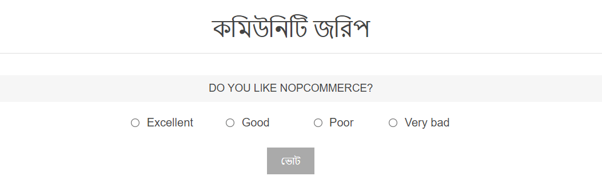
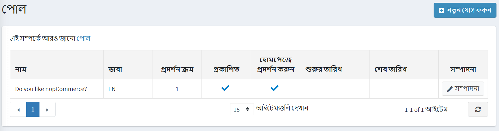
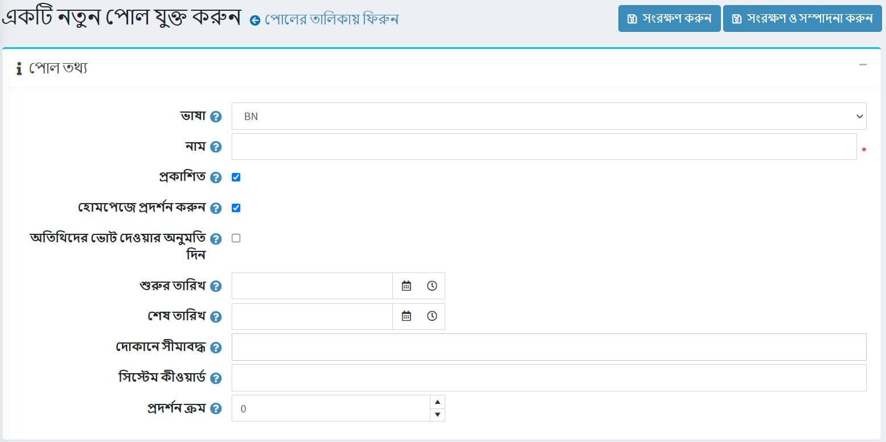
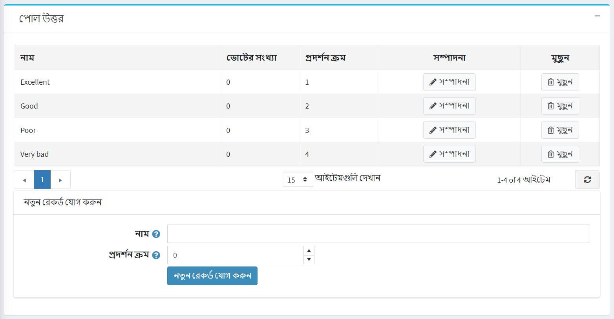

# ভোট

নপকমার্স-এ ভোটের কার্যকারিতা আপনাকে আপনার ইকমার্স সাইটটিকে আরও ইন্টারেক্টিভ করতে দেয়। একটি ইকমার্স সাইটের জন্য আপনি পোল ব্যবহার করতে পারেন এমন অনেকগুলি উপায় রয়েছে। একটি জনপ্রিয় উপায় হল তাদের সংক্ষিপ্ত গ্রাহক সন্তুষ্টি জরিপ হিসেবে ব্যবহার করা। মানুষ মতামত চাওয়া পছন্দ করে এবং এটি একটি ভাল সুযোগ যে আপনি একজন অনলাইন বণিক হিসেবে কেমন করছেন তা দেখার জন্য।

Deafult Clean নপকমার্স থিমের হোম পেজে জরিপের মত দেখাচ্ছে:

সমস্ত নির্বাচন দেখতে এবং নতুন যোগ করতে **কনটেন্ট ম্যানেজমেন্ট → পোলস** এ যান।

একটি নির্দিষ্ট দোকানে ব্যবহৃত পোলগুলি অনুসন্ধান করতে, তালিকা থেকে দোকানের একটি নাম নির্বাচন করুন।

## পোল যোগ করা

একটি নতুন পোল যোগ করতে উপরের ডানদিকে **নতুন যোগ করুন** বাটনে ক্লিক করুন।

### ভোটের তথ্য

নতুন ভোটের জন্য নিম্নলিখিত বিবরণ সংজ্ঞায়িত করুন:

- যদি একাধিক ভাষা সক্ষম হয়, **ভাষা** ড্রপডাউন তালিকা থেকে, এই ভোটের ভাষা নির্বাচন করুন। গ্রাহকরা শুধুমাত্র তাদের নির্বাচিত ভাষার জন্য ভোট দেখতে পাবেন।
- এই জরিপের বর্ণনামূলক **নাম** লিখুন। এই পাঠ্যটি গ্রাহকরা দেখতে পাবেন। উদাহরণস্বরূপ, "আপনি আমাদের দোকান সম্পর্কে কি মনে করেন?"।
- এই পোলটি সক্রিয় করতে **প্রকাশিত** চেকবক্সে টিক দিন।
- হোম পেজে পোল দেখান **চেকবক্সে টিক দিন যদি আপনি হোম পেজে পোল দেখাতে চান।
- অনিবন্ধিত অতিথিদের ভোটের জন্য ভোট দিতে সক্ষম করতে **অতিথিদের ভোট দেওয়ার অনুমতি দিন** চেকবক্সে টিক দিন।
- কোঅর্ডিনেটেড ইউনিভার্সাল টাইমে (UTC) **স্টার্ট ডেট** এবং **এন্ড ডেট** লিখুন।
  > [!NOTE]
  >
  > আপনি যদি খবরের শুরুর এবং শেষের তারিখ নির্ধারণ করতে না চান তবে আপনি এই ক্ষেত্রগুলি খালি রাখতে পারেন।

- শুধুমাত্র নির্দিষ্ট দোকানের জন্য এই জরিপ সক্ষম করার জন্য **সীমিত দোকানে** ক্ষেত্রের দোকানগুলি বেছে নিন। এই কার্যকারিতা প্রয়োজন না হলে ক্ষেত্রটি খালি রাখুন।

> [!NOTE]
>
> এই কার্যকারিতাটি ব্যবহার করার জন্য, আপনাকে নিম্নলিখিত সেটিংটি অক্ষম করতে হবে: **ক্যাটালগ সেটিংস "উপেক্ষা করুন" প্রতি দোকান সীমা "নিয়ম (সাইটওয়াইড)**। মাল্টি-স্টোর কার্যকারিতা সম্পর্কে আরও পড়ুন [এখানে](xref:bn/getting-start/advanced-configuration/multi-store)।

- **সিস্টেম কীওয়ার্ড** ফিল্ডে আপনি নির্দিষ্ট করতে পারেন যে পোল কোথায় প্রদর্শিত হবে। উদাহরণস্বরূপ, LeftColumnPoll।
- ভোটের **ডিসপ্লে অর্ডার** লিখুন। ১ এর মান তালিকার শীর্ষে প্রতিনিধিত্ব করে।

**ভোটের উত্তর প্যানেলে এগিয়ে যেতে** সংরক্ষণ করুন এবং সম্পাদনা চালিয়ে যান, ক্লিক করুন।

### পোল উত্তর

নিম্নলিখিত পোল উত্তর তথ্য পূরণ করুন:
***নাম** যা একজন গ্রাহকের কাছে প্রদর্শিত হবে।
**ডিসপ্লে অর্ডার**। ১ এর মান তালিকার শীর্ষে প্রতিনিধিত্ব করে।

তারপর উত্তর সংরক্ষণ করতে **নতুন রেকর্ড যোগ করুন** বাটনে ক্লিক করুন।

উত্তরগুলির সম্পূর্ণ তালিকা নিম্নলিখিত উপায়ে দেখতে পারে:

আপনি যদি প্রয়োজন হয় তবে ** রেকর্ডগুলি সম্পাদনা করতে পারেন এবং ** সেগুলি মুছে ফেলতে পারেন।

## টিউটোরিয়াল

- [নপকমার্স এ ভোট পরিচালনা][https://www.youtube.com/watch?v=RJP45cUhuZQ]
