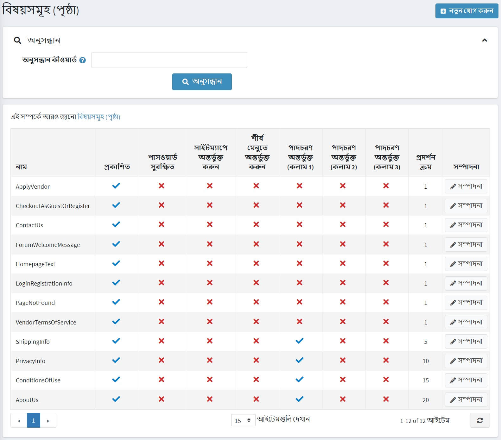
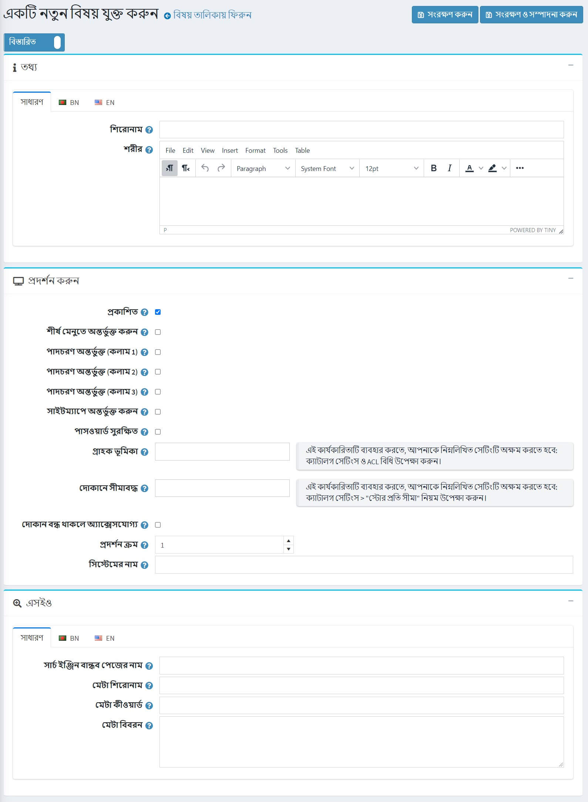

# বিষয় (পৃষ্ঠা)

বিষয়গুলি (পৃষ্ঠাগুলি) ফ্রি-ফর্ম সামগ্রী ব্লক যা আপনার সাইটে প্রদর্শিত হতে পারে, অন্য পৃষ্ঠার মধ্যে বা তাদের নিজস্ব পৃষ্ঠায় এম্বেড করা হয়। এগুলি প্রায়শই FAQ পৃষ্ঠা, নীতি পৃষ্ঠা, বিশেষ নির্দেশাবলী ইত্যাদির জন্য ব্যবহৃত হয়। কাস্টম পৃষ্ঠা তৈরি করতে, আপনার একটি নতুন বিষয় তৈরি করা উচিত এবং বিষয়বস্তুর বিশদ পৃষ্ঠায় আপনার কাস্টম পৃষ্ঠার সামগ্রী প্রবেশ করা উচিত। প্রতিটি ভাষার জন্য বিষয়বস্তু আলাদাভাবে লেখা যেতে পারে।

## বিষয় তালিকা

বিষয়গুলি দেখতে **বিষয়বস্তু ব্যবস্থাপনা → বিষয় (পৃষ্ঠা)** এ যান।
**সার্চ কিওয়ার্ডস** ফিল্ডে (অথবা টপিক টেক্সটের একটি অংশ), অথবা একটি নির্দিষ্ট দোকানের সব টপিকের মধ্যে টপিক টেক্সট লিখে টপিক লিস্টে টপিকস সার্চ করুন।



## বিষয় যোগ করা

একটি নতুন বিষয় যোগ করতে **বিষয়বস্তু ব্যবস্থাপনা → বিষয় (পৃষ্ঠা)** এ যান।
**নতুন যোগ করুন** ক্লিক করুন এবং একটি নতুন বিষয় সম্পর্কে তথ্য পূরণ করুন।



### তথ্য

*তথ্য* প্যানেলে নিম্নলিখিত বিষয়ের বিবরণ সংজ্ঞায়িত করুন:

*বিষয়টির জন্য **শিরোনাম** লিখুন।
**শরীর** ক্ষেত্রটিতে প্রদত্ত সম্পাদক ব্যবহার করে বিষয়বস্তু যুক্ত করুন।
***URL** ক্ষেত্রটি শুধুমাত্র তথ্যের উদ্দেশ্যে। এটি পাবলিক স্টোরের টপিকের ইউআরএল। আপনি নীচের **সার্চ ইঞ্জিন বান্ধব পৃষ্ঠার নাম** ক্ষেত্রটি সম্পাদনা করে এটি সম্পাদনা করতে পারেন।

### ডিপ্লে

*ডিপ্লে* প্যানেলে নিম্নলিখিত বিষয়ের বিবরণ সংজ্ঞায়িত করুন:
এই টপিকটি প্রকাশ করার জন্য **প্রকাশিত** চেকবক্সে টিক দিন।
*আপনি এই বিষয়টি **শীর্ষ মেনুতে**, **পাদলেখ (কলাম ১)**, পাদলেখ (কলাম ২), পাদলেখ (কলাম ৩) এবং **সাইটম্যাপ** এ অন্তর্ভুক্ত করতে পারেন। সংশ্লিষ্ট চেকবক্সে টিক দিয়ে এটি করুন।
**এই পাসওয়ার্ড সুরক্ষিত হলে** পাসওয়ার্ড সুরক্ষিত **চেকবক্স নির্বাচন করুন।** পাসওয়ার্ড ** ক্ষেত্রটি পাবলিক স্টোরের বিষয় পৃষ্ঠায় প্রদর্শিত হয়। একজন গ্রাহক এই বিষয়ের বিষয়বস্তু অ্যাক্সেস করার জন্য একটি পাসওয়ার্ড প্রবেশ করে।
***গ্রাহকের ভূমিকা** ড্রপ-ডাউন তালিকা থেকে গ্রাহকের ভূমিকা বা ভূমিকা নির্বাচন করুন যা এই বিষয়ে অ্যাক্সেস করতে পারে।
  > [!NOTE]
  >
  > এই কার্যকারিতাটি ব্যবহার করার জন্য আপনাকে নিম্নলিখিত সেটিংটি অক্ষম করতে হবে: **কনফিগারেশন → ক্যাটালগ সেটিংস এসিএল নিয়ম (সাইটওয়াইড) উপেক্ষা করুন**। অ্যাক্সেস নিয়ন্ত্রণ তালিকা সম্পর্কে আরও পড়ুন [এখানে](xref:bn/running-your-store/customer-management/access-control-list)।

***সীমিত দোকানে** ড্রপ-ডাউন তালিকায় এমন দোকানগুলি নির্বাচন করুন যেখানে বিষয় প্রদর্শিত হবে।
  > [!NOTE]
  >
> এই কার্যকারিতাটি ব্যবহার করার জন্য, আপনাকে নিম্নলিখিত সেটিংটি অক্ষম করতে হবে: **ক্যাটালগ সেটিংস "উপেক্ষা করুন" প্রতি দোকান সীমা "নিয়ম (সাইটওয়াইড)**। মাল্টি-স্টোর কার্যকারিতা সম্পর্কে আরও পড়ুন [এখানে](xref:bn/getting-start/advanced-configuration/multi-store)।

***যখন দোকান বন্ধ থাকে তখন অ্যাক্সেসযোগ্য** ক্ষেত্রটি ব্যবহার করুন যখন দোকানটি বন্ধ থাকে তখন এই বিষয়টিকে অ্যাক্সেসযোগ্য করে তুলুন।
*এই বিষয় নির্বাচন করুন **ডিসপ্লে অর্ডার**। উদাহরণস্বরূপ, ১ একটি তালিকায় প্রথমে আইটেমটি উপস্থাপন করবে।
*এই বিষয়ের **সিস্টেমের** নাম লিখুন।
  > [!NOTE]
  >
  > বিভিন্ন বিষয়ের জন্য একই সিস্টেমের নাম ব্যবহার করা সম্ভব। উদাহরণস্বরূপ, আপনি একই সিস্টেমের নাম দিয়ে দুটি ভিন্ন বিষয় তৈরি করতে পারেন এবং সেগুলি বিভিন্ন গ্রাহকের ভূমিকার জন্য অ্যাক্সেসযোগ্য করে তুলতে পারেন। উদাহরণস্বরূপ, *অতিথি* এবং *নিবন্ধিত* গ্রাহকের ভূমিকা। এর মানে হল যে অতিথি এবং নিবন্ধিত গ্রাহকরা সাইটে বিভিন্ন বিষয়বস্তু দেখতে পাবেন।

> [!NOTE]
>
> বিদ্যমান বিষয় সম্পাদনা করার সময় অথবা নতুন সংরক্ষণের জন্য **সংরক্ষণ করুন এবং সম্পাদনা চালিয়ে যান** বাটনে ক্লিক করার পরে, আপনি সাইটটিতে বিষয়টি কীভাবে প্রদর্শিত হবে তা দেখতে **প্রিভিউ** বাটনে ক্লিক করতে পারেন।

### এসইও

*এসইও* প্যানেলে নিম্নলিখিত বিষয়ের বিবরণ সংজ্ঞায়িত করুন:
**সার্চ ইঞ্জিন বান্ধব পৃষ্ঠার নাম** ফিল্ডে, সার্চ ইঞ্জিন দ্বারা ব্যবহৃত পৃষ্ঠার নাম লিখুন। যদি আপনি কিছু না লিখেন তাহলে ওয়েব পেজ ইউআরএল পেজের নাম ব্যবহার করে গঠিত হয়। যদি আপনি *custom-seo-page-name* লিখেন, তাহলে নিচের URL টি ব্যবহার করা হবে: `http://www.yourStore.com/custom-seo-page-name`।
**মেটা শিরোনাম** ক্ষেত্রে, প্রয়োজনীয় শিরোনাম লিখুন। শিরোনাম ট্যাগ আপনার ওয়েব পৃষ্ঠার শিরোনাম নির্দিষ্ট করে। এটি কোড যা আপনার ওয়েব পেজের হেডারে হয় এবং নিম্নলিখিত বিন্যাসে থাকে:

   ```html
   <head>
     <title>
        সার্চ ইঞ্জিন অপ্টিমাইজেশন এবং ওয়েব ব্যবহারযোগ্যতার জন্য টাইটেল ট্যাগ তৈরি করা
      <title>
   </head>
   ```
*প্রয়োজনীয় বিভাগ **মেটা কীওয়ার্ড** লিখুন, যা আপনার পৃষ্ঠার সবচেয়ে গুরুত্বপূর্ণ থিমগুলির একটি সংক্ষিপ্ত এবং সংক্ষিপ্ত তালিকা। মেটা কীওয়ার্ড ট্যাগ নিম্নলিখিত বিন্যাস নেয়:

   ```html
   <meta name="keywords" content="কীওয়ার্ড, কিওয়ার্ড, কিওয়ার্ড ফ্রেজ ইত্যাদি।">
   ```

***মেটা বর্ণনা** ফিল্ডে, বিভাগের একটি বিবরণ লিখুন। মেটা বর্ণনা ট্যাগ আপনার পৃষ্ঠার বিষয়বস্তুর একটি সংক্ষিপ্ত এবং সংক্ষিপ্ত সারসংক্ষেপ। মেটা বিবরণ ট্যাগ নিম্নলিখিত বিন্যাসে রয়েছে:

   ```html
   <meta name="description" content="আপনার পৃষ্ঠার বিষয়বস্তুর সংক্ষিপ্ত বিবরণ।">
   ```

**সেভ** ক্লিক করুন। বিষয়টি পাবলিক স্টোরে প্রদর্শিত হবে।

## আরো দেখুন

-[এসইও](xref:bn/running-your-store/search-engine-optimization)

## টিউটোরিয়াল

- [নতুন বিষয় টেমপ্লেট যুক্ত করা হচ্ছে](https://www.youtube.com/watch?v=M-g4Ux2GCaY)
