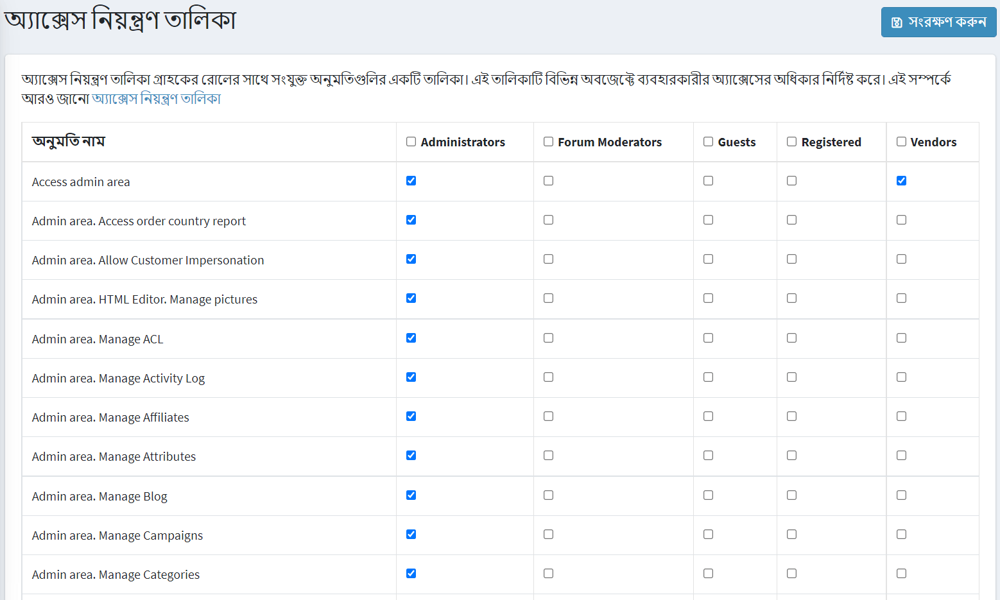

# অ্যাক্সেস নিয়ন্ত্রণ তালিকা

অ্যাক্সেস কন্ট্রোল লিস্ট (এসিএল) ব্যবহারকারীদের সাইটের নির্দিষ্ট কিছু এলাকায় অ্যাক্সেস সীমাবদ্ধ বা মঞ্জুর করে। এই তালিকা প্রশাসকদের দ্বারা পরিচালিত হয়। অতএব, ব্যবহারকারীর এটি অ্যাক্সেস করতে সক্ষম হওয়ার জন্য প্রশাসকের অধিকার থাকতে হবে। অ্যাক্সেস তালিকায় নিম্নলিখিত বৈশিষ্ট্য রয়েছে:

*অ্যাক্সেস কন্ট্রোল লিস্ট ভূমিকা ভিত্তিক, যেমন *গ্লোবাল অ্যাডমিনিস্ট্রেটর*,*কন্টেন্ট ম্যানেজার* ইত্যাদি ভূমিকা পরিচালনা করে এই ভূমিকাগুলির তালিকা **গ্রাহক → গ্রাহক ভূমিকা** পৃষ্ঠায় পরিচালনা করা যায়। আরও তথ্যের জন্য [গ্রাহক ভূমিকা](xref:bn/running-your-store/customer-management/customer-role) পড়ুন।
*প্রশাসন এলাকায় অ্যাক্সেস নিয়ন্ত্রণ তালিকা প্রদর্শিত হয়। নিশ্চিত করুন, এসিএল অ্যাক্সেস করার জন্য ব্যবহারকারী একজন প্রশাসক।
*পূর্বনির্ধারিত প্রশাসক কর্ম বিদ্যমান। এর মধ্যে রয়েছে *অর্ডার পরিচালনা করুন*, *গ্রাহকদের পরিচালনা করুন* এবং আরও অনেক কিছু।

অ্যাক্সেস কন্ট্রোল লিস্ট ম্যানেজ করতে **কনফিগারেশন → অ্যাক্সেস কন্ট্রোল লিস্ট** এ যান। *অ্যাক্সেস নিয়ন্ত্রণ তালিকা* উইন্ডো প্রদর্শিত হয়:

*অনুমতি* আইটেমের পাশে প্রয়োজনীয় ভূমিকা নির্বাচন করুন। নির্বাচিত ভূমিকা অনুযায়ী নির্বাচিত ক্রিয়াকলাপে অ্যাক্সেস থাকবে।

**সেভ** ক্লিক করুন।

> [!TIP]
> 
> উদাহরণ: আমাদের *কন্টেন্ট ম্যানেজার* নামে একটি ভূমিকা প্রয়োজন। *কন্টেন্ট ম্যানেজার* এর অবশ্যই নতুন পণ্য এবং নির্মাতাদের ব্যবস্থাপনায় অ্যাক্সেস থাকতে হবে, সাইটে পর্যালোচনা সম্পাদনা, ব্লগ, প্রচারাভিযান এবং শপিং কার্টে প্রবেশাধিকার থাকতে হবে না।
> এটি করার জন্য:
> ১। **কাস্টমার ম্যানেজার** নামে একটি গ্রাহক ভূমিকা তৈরি করুন **গ্রাহক → গ্রাহকের ভূমিকা** পৃষ্ঠায়।

> ২। এসিএল- এ নিম্নলিখিত অনুমতিগুলির পাশে চেকবক্সে টিক দিন: *অ্যাক্সেস অ্যাডমিন এলাকা, অ্যাডমিন এলাকা। ব্লগ, অ্যাডমিন এলাকা পরিচালনা করুন। ক্যাম্পেইন, অ্যাডমিন এলাকা পরিচালনা করুন। ফোরাম, অ্যাডমিন এলাকা পরিচালনা করুন। সংবাদ, প্রশাসন এলাকা পরিচালনা করুন। নিউজলেটার গ্রাহক, পাবলিক স্টোর পরিচালনা করুন। নেভিগেশনের অনুমতি দিন, পাবলিক স্টোর। প্রদর্শন মূল্য*।

> ৩। পরিবর্তনগুলি সংরক্ষণ করুন।
