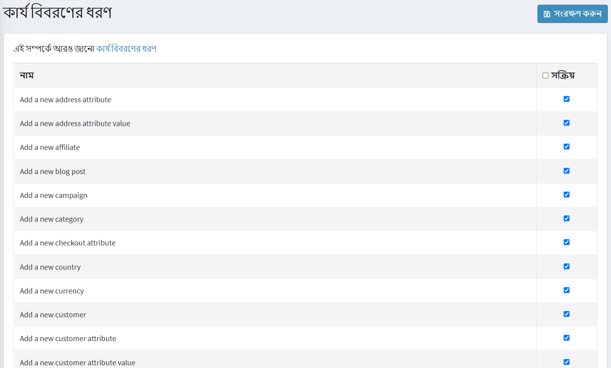
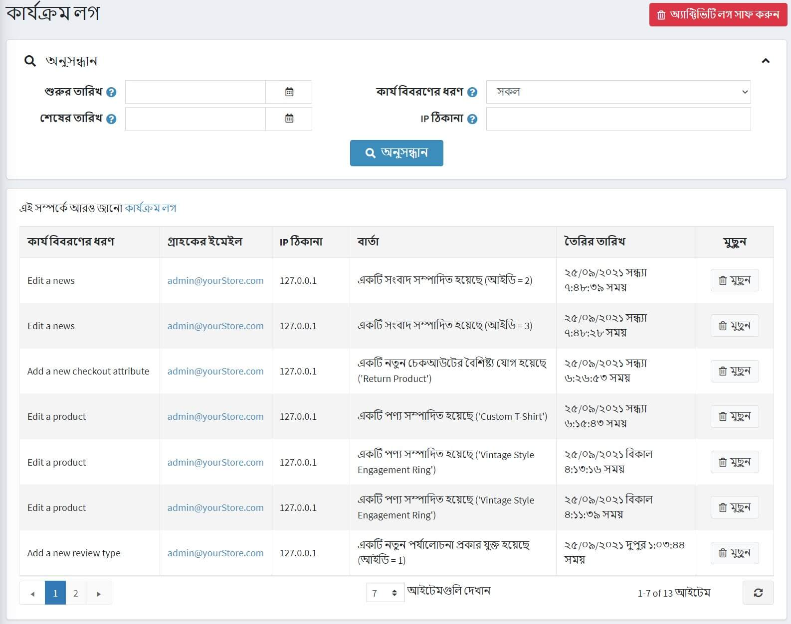

# কার্য বিবরণ

সিস্টেমে ব্যবহারকারীর কার্যকলাপ ট্র্যাক করতে কার্যকলাপ লগ ব্যবহার করা হয়। ডিফল্টরূপে, সমস্ত *কার্যকলাপ প্রকার* নপকমার্স-এ ট্র্যাক করার জন্য সক্ষম করা হয়। একটি দোকান মালিক প্রাসঙ্গিক চেকবক্স আনচিক করে তাদের নিষ্ক্রিয় করতে পারেন। তালিকাভুক্ত বেশিরভাগ কার্যকলাপের ধরন শুধুমাত্র প্রশাসকের জন্য, এবং প্রশাসন এলাকায় রেকর্ড কর্ম। যাইহোক, কিছু পাবলিক স্টোরের জন্য এবং ক্রেতাদের কর্মের ট্র্যাক (যেমন, কার্ট/ইচ্ছা তালিকায় যোগ করা, অর্ডার দেওয়া ইত্যাদি)।

## গ্রাহক কার্যকলাপের ধরন

কার্যকলাপের ধরন সক্ষম/নিষ্ক্রিয় করতে, **গ্রাহক → কার্যকলাপের ধরন** এ যান।

যে ক্রিয়াকলাপের ধরনটি আপনি সক্ষম করতে চান তার পাশে **সক্রিয় আছে** চেকবক্সে টিক দিন। তারপর উপরের ডানদিকে **সেভ** ক্লিক করুন।

## গ্রাহক কার্যকলাপ লগ

কার্যকলাপ লগ অনুসন্ধান করতে, **গ্রাহক → কার্যকলাপ লগ** এ যান।

নিম্নলিখিত এক বা একাধিক ক্ষেত্র ব্যবহার করে অনুসন্ধানের মানদণ্ড নির্ধারণ করুন:

- তারিখের পরিসীমা অনুসারে অনুসন্ধানের জন্য **তৈরি থেকে** এবং **থেকে তৈরি** ক্ষেত্রের মধ্যে তারিখ পরিসীমা লিখুন। বিকল্পভাবে, আপনি ড্রপডাউন ক্যালেন্ডারে ক্লিক করতে পারেন এবং প্রয়োজনীয় তারিখের রেঞ্জ নির্বাচন করতে পারেন।
- **ক্রিয়াকলাপ লগ টাইপ** গ্রাহকের কার্যকলাপের জন্য।
- **আইপি ঠিকানা** আইপি ঠিকানা দ্বারা গ্রাহকের জন্য অনুসন্ধান করুন।

আপনি নির্দিষ্ট অ্যাক্টিভিটি লগ আইটেমটি পাশের **ডিলিট** বাটনে ক্লিক করে পরিষ্কার করতে পারেন অথবা উপরের ডানদিকে **ক্লিয়ার অ্যাক্টিভিটি লগ** বাটনে ক্লিক করে ক্রিয়াকলাপের পুরো লগ সাফ করতে পারেন।