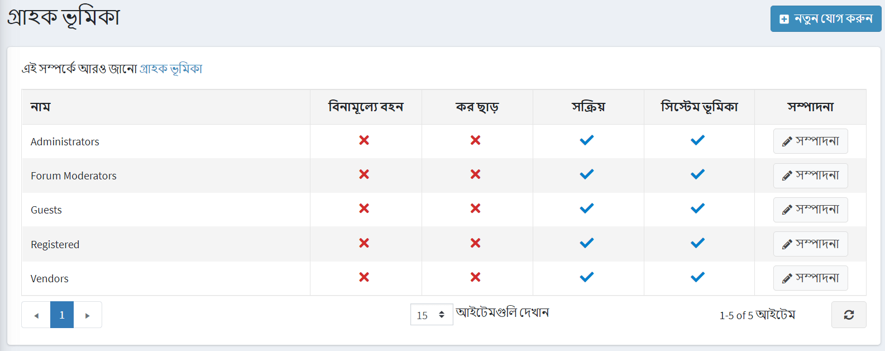
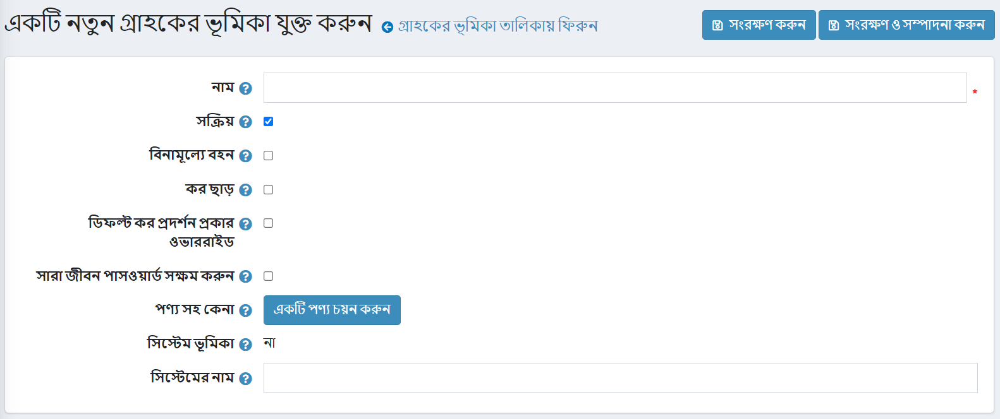

# গ্রাহকের ভূমিকা

নপকমার্স-এ গ্রাহকের ভূমিকা আপনাকে আপনার ওয়েব স্টোর ব্যবহারকারীদের গ্রুপ গঠন করতে সক্ষম করে। আপনি বিভিন্ন গ্রুপ তৈরি করতে পারেন যেমন দোকান প্রশাসক, ক্রেতা, [বিক্রেতারা](xref:bn/running-your-store/vendor-management), এবং অন্যান্য। আপনি এই গ্রুপগুলিকে [অ্যাক্সেস কন্ট্রোল লিস্ট](xref:bn/running-your-store/customer-management//access-control-list) ।

গ্রাহকের ভূমিকা পরিচালনা করতে **গ্রাহক → গ্রাহকের ভূমিকা** এ যান। *গ্রাহকের ভূমিকা* উইন্ডোটি নিম্নরূপ প্রদর্শিত হয়:

নতুন গ্রাহক ভূমিকা যোগ করতে **নতুন যোগ করুন** ক্লিক করুন। *একটি নতুন গ্রাহক ভূমিকা যোগ করুন* উইন্ডো প্রদর্শিত হয়:

নিম্নলিখিত তথ্য সংজ্ঞায়িত করুন:
***গ্রাহকের ভূমিকার নাম**।
*এই ভূমিকা সক্রিয় করতে **সক্রিয়** টিক দিন।
***ফ্রি শিপিং** চেকবক্সে টিক দিন, এই ভূমিকা সহ গ্রাহকদের তাদের অর্ডারে ফ্রি শিপিং পেতে সক্ষম করতে।
*করমুক্ত ক্রয় করতে এই ভূমিকা সহ গ্রাহকদের সক্ষম করতে **ট্যাক্স ছাড়** চেকবক্সে টিক দিন।
**ওভাররাইড ডিফল্ট ট্যাক্স ডিসপ্লে টাইপ** এ টিক দিন এবং **ডিফল্ট ট্যাক্স ডিসপ্লে টাইপ** ড্রপ-ডাউন তালিকা থেকে ট্যাক্সের ধরনগুলির মধ্যে একটি নির্বাচন করুন:
  **কর সহ*
  **কর বাদে*
*একটি নির্দিষ্ট সময়ের পরে গ্রাহকদের পাসওয়ার্ড পরিবর্তন করতে বাধ্য করতে **পাসওয়ার্ড আজীবন সক্ষম করুন** টিক দিন।
***পণ্য দিয়ে কেনা**। একটি বিশেষ পণ্য চয়ন করতে **পণ্য নির্বাচন করুন** বাটনে ক্লিক করুন। এই পণ্যটি কেনা (অর্থ প্রদান) করার পরে একজন গ্রাহককে এই গ্রাহকের ভূমিকায় যুক্ত করা হয়।
  > [!NOTE]
  >
  > ফেরত বা অর্ডার বাতিলের ক্ষেত্রে আপনাকে অবশ্যই একজন গ্রাহককে এই ভূমিকা থেকে সরিয়ে দিতে হবে।

*** সিস্টেমের ভূমিকা**। এই সেটিংটি দেখায় যে কোডটিতে এই ভূমিকা ব্যবহার করা হয়েছে কিনা। এটি পূর্বনির্ধারিত এবং পরিবর্তন করা যাবে না।
*গ্রাহকের ভূমিকার **সিস্টেমের নাম**।

**সেভ** ক্লিক করুন।

## টিউটোরিয়াল

* [গ্রাহকের ভূমিকার ওভারভিউ](https://www.youtube.com/watch?v=3vdIDNIYFIQ)
* [একজন মুছে যাওয়া প্রশাসক ব্যবহারকারীকে পুনরুদ্ধার করা](https://www.youtube.com/watch?v=D45WkrbaA38)
