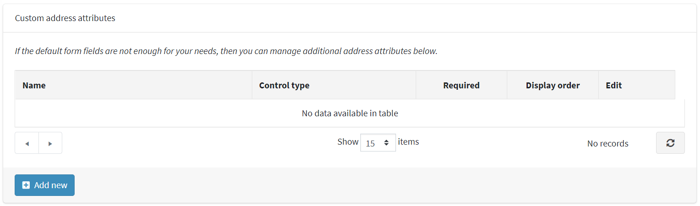

# গ্রাহক সেটিংস

গ্রাহক সেটিংসের মধ্যে রয়েছে গ্রাহকদের অবতার আপলোড করা, গ্রাহকের অবস্থান দেখানো, নামের বিন্যাস পরিবর্তন করা, যোগদানের তারিখ এবং আরও অনেক কিছু অন্তর্ভুক্ত করা।

গ্রাহক সেটিংস নির্ধারণ করতে, **কনফিগারেশন → সেটিংস → গ্রাহক সেটিংস** এ যান। গ্রাহক সেটিংস উইন্ডো প্রদর্শিত হয়। এই উইন্ডোতে ছয়টি প্যানেল রয়েছে: সাধারণ, পাসওয়ার্ড এবং নিরাপত্তা, অ্যাকাউন্ট, প্রোফাইল, গ্রাহক ফর্ম ক্ষেত্র এবং ঠিকানা ফর্ম ক্ষেত্র।

১। **সাধারণ** প্যানেলে সাধারণ গ্রাহক সেটিংস রয়েছে।

২। **পাসওয়ার্ড এবং নিরাপত্তা** প্যানেলে এমন ক্ষেত্র রয়েছে যা নিরাপত্তা সেটিংস এবং পাসওয়ার্ড জটিলতা কনফিগার করতে ব্যবহার করা যেতে পারে।

৩। **অ্যাকাউন্ট** প্যানেলে গ্রাহক অ্যাকাউন্ট স্থাপনের জন্য ক্ষেত্র রয়েছে।

৪। **প্রোফাইল** প্যানেলে গ্রাহকের প্রোফাইল কনফিগার করার জন্য ক্ষেত্র রয়েছে।

৫। **গ্রাহক ফর্ম ক্ষেত্র** প্যানেলে এমন ক্ষেত্র রয়েছে যা গ্রাহক নিবন্ধন পৃষ্ঠায় ব্যবহৃত হয়।

৬। **ঠিকানা ফর্ম ক্ষেত্র** প্যানেলে চেকআউটের সময় গ্রাহকের ঠিকানা বিশদ বিবরণের জন্য ক্ষেত্র রয়েছে

## সাধারণ

সাধারণ গ্রাহক সেটিংস সংজ্ঞায়িত করুন, নিম্নরূপ:
**নিবন্ধন পদ্ধতি** নির্বাচন করুন, নিম্নরূপ:
  **স্ট্যান্ডার্ড অ্যাকাউন্ট তৈরি**: ব্যবহারকারীরা নিবন্ধন করতে সক্ষম, কোন অনুমোদনের প্রয়োজন নেই।
  ***রেজিস্ট্রেশনের পরে ইমেইল যাচাইকরণ প্রয়োজন**: ব্যবহারকারীরা নিবন্ধন করতে সক্ষম হন, তবে তাদের অ্যাকাউন্ট অনুমোদিত হওয়ার আগে তাদের অবশ্যই পাঠানো নিশ্চিতকরণ ইমেল গ্রহণ করতে হবে।
  ***একজন গ্রাহককে প্রশাসক কর্তৃক অনুমোদিত হওয়া উচিত**: ব্যবহারকারীরা নিবন্ধন করতে সক্ষম, প্রশাসকের অনুমোদন প্রয়োজন।
  **নিবন্ধন নিষ্ক্রিয় করা হয়েছে**: নিবন্ধন অক্ষম করতে এই বিকল্পটি নির্বাচন করুন।
*নতুন গ্রাহক নিবন্ধনের বিষয়ে বিজ্ঞপ্তি **চেকবক্সে টিক দিন, যাতে নতুন গ্রাহক নিবন্ধিত হওয়ার সময় প্রতিটি দোকানের মালিককে ইমেল বিজ্ঞপ্তি পেতে সক্ষম করে।
**ডাউনলোডযোগ্য পণ্যের জন্য নিবন্ধনের প্রয়োজন** চেকবক্সে টিক দিন যদি গ্রাহকদের ডাউনলোডযোগ্য পণ্য ক্রয়ের জন্য নিবন্ধন সম্পন্ন করতে হয়।
**গ্রাহকদের উপহার কার্ডের ব্যালেন্স চেক করার অনুমতি দিন** গ্রাহকদের উপহার কার্ডের ব্যালেন্স চেক করার অনুমতি দিন।
  > [!NOTE]
  >
  > যদি **গ্রাহকদের উপহার কার্ডের ব্যালেন্স চেক করার অনুমতি দেয়** ক্ষেত্রটি চেক করা হয়, তাহলে অ্যাডমিন এলাকায় ক্যাপচা সেটিং সক্ষম করতে হবে (**কনফিগারেশন → সেটিংস → সাধারণ সেটিংস AP ক্যাপচা প্যানেল**)। এই বৈশিষ্ট্যটি সম্ভাব্যভাবে নিরাপদ নয় এবং ব্রুটফোর্স প্রতিরোধ এবং জটিল করার জন্য ক্যাপচা প্রয়োজন। আরো বিস্তারিত জানার জন্য [ক্যাপচা সেটিংস](xref:bn/getting-start/advanced-configuration/security-settings#captcha) দেখুন।

*অ্যাকাউন্ট পৃষ্ঠায় পাবলিক স্টোরে **গ্রাহকদের টাইম জোন নির্বাচন করার অনুমতি দিতে হবে কিনা তা চয়ন করুন। অন্যথায়, ডিফল্ট টাইম জোন ব্যবহার করা হয়।
*ড্রপডাউন তালিকা থেকে**ডিফল্ট স্টোর টাইম জোন** নির্বাচন করুন।
   > [!NOTE]
   >
   > বর্তমান সময় অঞ্চল স্বয়ংক্রিয়ভাবে প্রদর্শিত হয়।
 
 *গ্রাহকদের বাহ্যিক প্রমাণীকরণ সমিতি অপসারণের অনুমতি দিতে **গ্রাহকদের সমিতি অপসারণের অনুমতি দিন** টিক দিন।

## পাসওয়ার্ড এবং নিরাপত্তা

**পাসওয়ার্ডের সর্বনিম্ন দৈর্ঘ্য সেট করুন, পাসওয়ার্ডে কমপক্ষে একটি ছোট হাত থাকতে হবে, পাসওয়ার্ডে কমপক্ষে একটি বড় হাতের অক্ষর থাকতে হবে, পাসওয়ার্ডে কমপক্ষে একটি অ অক্ষরবিশিষ্ট অক্ষর থাকতে হবে, পাসওয়ার্ডের জটিলতা পরিবর্তন করতে পাসওয়ার্ডের কমপক্ষে একটি অঙ্ক থাকতে হবে**
**অনুপযুক্ত পাসওয়ার্ড নম্বর** এমন একটি পাসওয়ার্ড যা পূর্ববর্তী পাসওয়ার্ডের মতো নয়।
*নিম্নরূপ **ডিফল্ট পাসওয়ার্ড ফরম্যাট** নির্বাচন করুন:

* *পরিষ্কার*
* *হ্যাশড*
* *এনক্রিপ্ট করা*

  > [!NOTE]
  > 
  > এই সেটিংটি গ্রাহকদের পাসওয়ার্ড সংরক্ষণের জন্য এবং শুধুমাত্র নতুন নিবন্ধিত গ্রাহকদের জন্য প্রযোজ্য হবে।

**পাসওয়ার্ড লাইফটাইম** পাসওয়ার্ডের মেয়াদ শেষ হওয়ার জন্য দিনের সংখ্যা লিখুন।
  > [!NOTE]
  >
  > **পাসওয়ার্ড লাইফটাইম** ফিচারটি ব্যবহার করতে চেক করতে ভুলবেন না **পাসওয়ার্ড লাইফটাইম সক্ষম করুন** সেই ভূমিকাগুলির জন্য গ্রাহক ভূমিকা সম্পাদনা পৃষ্ঠায় (**গ্রাহক → গ্রাহকের ভূমিকা**) সম্পত্তি, যা পাসওয়ার্ড পরিবর্তন করতে হবে। আরো বিস্তারিত জানার জন্য [গ্রাহক ভূমিকা](xref:bn/running-your-store/customer-management/customer-role) পড়ুন।

**পাসওয়ার্ড পুনরুদ্ধারের লিঙ্কে। দিন বৈধ** ক্ষেত্র, পাসওয়ার্ড পুনরুদ্ধারের লিঙ্কের জন্য দিনের সংখ্যা লিখুন। যদি আপনি লিঙ্কটির মেয়াদ শেষ না হতে চান তবে এটি ০ তে সেট করুন।
**সর্বোচ্চ লগইন ব্যর্থতা** নম্বর লিখুন। এই বৈশিষ্ট্যটি অক্ষম করতে ০ সেট করুন।
**লকআউট সময় (লগইন ব্যর্থতা)** ব্যবহারকারীদের লকআউট করার জন্য মিনিটের সংখ্যা লিখুন।
**যদি আপনি আপনার গ্রাহকদের রেজিস্ট্রেশনের সময় দুবার ইমেইল দিতে চান তবে** ফোর্স দুইবার প্রবেশ করান, চেকবক্সে টিক দিন।

## অ্যাকাউন্ট

* ইমেলের পরিবর্তে লগইন এবং নিবন্ধনের জন্য ব্যবহারকারীর নাম ব্যবহার করতে সক্ষম করতে **'ব্যবহারকারীর নাম' সক্ষম** চেকবক্সে টিক দিন।
  > [!NOTE]
  >
  > উৎপাদন পরিবেশে এই বিকল্পটি পরিবর্তন করার সুপারিশ করা হয় না।
  
  যখন **'ব্যবহারকারীর নাম' সক্ষম** চেকবক্স নির্বাচন করা হয়, নিম্নলিখিত বিকল্পগুলি প্রদর্শিত হয়:
  * **গ্রাহকদের তাদের ব্যবহারকারীর নাম পরিবর্তন করার অনুমতি দিন**: যদি গ্রাহকদের তাদের ব্যবহারকারীর নাম পরিবর্তন করার অনুমতি দেওয়া হয় তবে এই বিকল্পটি নির্বাচন করুন।
  * **গ্রাহকদের ব্যবহারকারীর নামগুলির প্রাপ্যতা যাচাই করার অনুমতি দিন**: *আমার অ্যাকাউন্ট - গ্রাহক তথ্য* পৃষ্ঠায় *সংরক্ষণ করুন* বাটনে ক্লিক করার আগে গ্রাহকদের ব্যবহারকারীর নাম প্রাপ্যতা যাচাই করার অনুমতি দেওয়ার জন্য এই বিকল্পটি নির্বাচন করুন। এই ক্ষেত্রে **চেক প্রাপ্যতা** বাটন প্রদর্শিত হয়, নিচের উদাহরণ দেখুন।

* আপনি যদি ব্যবহারকারীর নাম যাচাইকরণ সক্ষম করতে চান **ব্যবহারকারীর নাম যাচাইকরণ সক্ষম** ক্ষেত্রটিতে টিক দিন (পাবলিক স্টোরে "আমার অ্যাকাউন্ট" পৃষ্ঠায় নিবন্ধন বা পরিবর্তন করার সময়)। যখন এই চেকবক্স নির্বাচন করা হয়, নিম্নলিখিত বিকল্পগুলি প্রদর্শিত হয়:
  ***ব্যবহারকারীর নাম যাচাইকরণের নিয়ম**: এই ক্ষেত্রে একটি ব্যবহারকারীর নামের জন্য বৈধতা নিয়ম সেট করুন। আপনি অনুমোদিত অক্ষরের একটি তালিকা বা একটি নিয়মিত অভিব্যক্তি নির্দিষ্ট করতে পারেন। আপনি যদি রেগুলার এক্সপ্রেশন ব্যবহার করেন তাহলে **ব্যবহারকারীর নাম যাচাই করার জন্য রিজেক্স ব্যবহার করুন** ক্ষেত্রটি নীচে বর্ণিত।
  *ব্যবহারকারীর নাম যাচাইকরণের জন্য রিজেক্স ব্যবহার করুন **ব্যবহারকারীর নাম যাচাইকরণের জন্য নিয়মিত অভিব্যক্তি ব্যবহার করতে** (পাবলিক স্টোরে "আমার অ্যাকাউন্ট" পৃষ্ঠায় নিবন্ধন বা পরিবর্তন করার সময়) পরীক্ষা করুন।
**গ্রাহকের নাম বিন্যাস** নির্বাচন করুন, নিম্নরূপ:
  * *ইমেলগুলি দেখান*
  * *ব্যবহারকারীর নাম দেখান*
  * *পুরো নাম দেখান*
  * *প্রথম নাম দেখান*
  গ্রাহকের নাম স্টোরটিতে গ্রাহকের খবর এবং ব্লগ মন্তব্যের পাশে, ফোরাম পৃষ্ঠায় এবং অন্যান্যগুলিতে দেখানো হবে।
**ফোন নম্বর যাচাইকরণ সক্ষম** চেকবক্স চেক করুন যদি আপনি ফোন নম্বর যাচাইকরণ সক্ষম করতে চান (পাবলিক স্টোরে "আমার অ্যাকাউন্ট" পৃষ্ঠায় নিবন্ধন বা পরিবর্তন করার সময়)। যখন এই চেকবক্স নির্বাচন করা হয়, নিম্নলিখিত বিকল্পগুলি প্রদর্শিত হয়:
  **ফোন নম্বর যাচাইকরণ নিয়ম**: এই ক্ষেত্রে একটি ফোন নম্বরের জন্য বৈধতা নিয়ম সেট করুন। আপনি অনুমোদিত অক্ষরের একটি তালিকা বা একটি নিয়মিত অভিব্যক্তি নির্দিষ্ট করতে পারেন। আপনি যদি রেগুলার এক্সপ্রেশন ব্যবহার করেন তাহলে **ব্যবহারকারীর নাম যাচাই করার জন্য রিজেক্স ব্যবহার করুন** ক্ষেত্রটি নীচে বর্ণিত।
  *ফোন নম্বর যাচাইকরণের জন্য রেগেক্স ব্যবহার করুন ** ফোন নম্বর যাচাইকরণের জন্য নিয়মিত অভিব্যক্তি ব্যবহার করতে (পাবলিক স্টোরে "আমার অ্যাকাউন্ট" পৃষ্ঠায় নিবন্ধন বা পরিবর্তন করার সময়) পরীক্ষা করুন।
***গ্রাহকদের অবতার আপলোড করার অনুমতি দিন**: গ্রাহকদের অবতারগুলি তাদের সংবাদ এবং ব্লগ মন্তব্যের পাশে স্টোরটিতে দেখানো হবে, ফোরাম পৃষ্ঠায় এবং অন্যান্যগুলিতে। এই বিকল্পটি নির্বাচিত হলে, নিম্নলিখিত চেকবক্সটি প্রদর্শিত হবে:
* ডিফল্ট ব্যবহারকারী অবতার প্রদর্শন করতে **ডিফল্ট অবতার সক্ষম** চেকবক্সে টিক দিন।
* "আমার অ্যাকাউন্ট" পৃষ্ঠায় এই ট্যাবটি আড়াল করতে **লুকানো 'ডাউনলোডযোগ্য পণ্য' ট্যাব** চেকবক্সে টিক দিন।
* "আমার অ্যাকাউন্ট" পৃষ্ঠায় এই ট্যাবটি লুকানোর জন্য **হাইড 'স্টক সাবস্ক্রিপশন' ট্যাব** চেকবক্সে টিক দিন।
* নিউজলেটার সাবস্ক্রিপশন বক্স প্রদর্শন করতে না চাইলে **লুকান নিউজলেটার বক্স** চেকবক্সে টিক দিন।
* **নিউজলেটার বক্সে টিক দিন। আনসাবস্ক্রাইব করার অনুমতি দিন** নিউজলেটার ব্লকে "আনসাবস্ক্রাইব" অপশন প্রদর্শনের জন্য চেকবক্স। উদাহরণস্বরূপ, জার্মানিতে এটি প্রয়োজন।
* গ্রাহকের সর্বশেষ পরিদর্শন করা পৃষ্ঠাটি সংরক্ষণ করতে **স্টোর সর্বশেষ দেখা পৃষ্ঠা** চেকবক্সে টিক দিন। এরপর আপনি **গ্রাহক → অনলাইন গ্রাহক** পৃষ্ঠায় বিভিন্ন গ্রাহকদের দ্বারা সর্বশেষ পরিদর্শন করা পৃষ্ঠাগুলি দেখতে পারেন। সাইটের কর্মক্ষমতা উন্নত করতে আপনি এই চেকবক্সটি আনটিক করতে পারেন।
*গ্রাহকদের শেষ আইপি ঠিকানা সংরক্ষণ করতে **স্টোর আইপি ঠিকানা** চেকবক্সে টিক দিন। অক্ষম হলে, এটি কর্মক্ষমতা উন্নত করতে পারে।

## প্রোফাইল

* **গ্রাহকের প্রোফাইল দেখার অনুমতি দিন**: এই সেটিং পাবলিক স্টোরে অন্যান্য গ্রাহকদের বিবরণ দেখতে সক্ষম করে।
* প্রয়োজনে **গ্রাহকদের অবস্থান দেখান** চেকবক্সে টিক দিন।
* প্রয়োজনে **গ্রাহকদের যোগদান তারিখ দেখান** চেকবক্সে টিক দিন।

## গ্রাহক ফর্ম ক্ষেত্র

*গ্রাহক ফর্ম ক্ষেত্র* প্যানেলে, নিম্নলিখিত ফর্ম ক্ষেত্রগুলি সিস্টেমে সক্ষম কিনা তা নির্ধারণ করুন:

* **'লিঙ্গ' সক্ষম**
* **'প্রথম নাম' সক্ষম** সক্রিয় করা হলে, আপনি এই ক্ষেত্রের প্রয়োজন হবে কিনা তাও সিদ্ধান্ত নিতে পারেন।
* **'শেষ নাম' সক্ষম** সক্রিয় করা হলে, আপনি এই ক্ষেত্রের প্রয়োজন হবে কিনা তাও সিদ্ধান্ত নিতে পারেন।
* **'জন্ম তারিখ' সক্ষম** সক্ষম হলে, আপনি এই ক্ষেত্রের প্রয়োজন হবে কিনা তাও সিদ্ধান্ত নিতে পারেন এবং ন্যূনতম অনুমোদিত বয়স লিখতে পারেন (উদাহরণস্বরূপ, একজন গ্রাহকের বয়স 18 এর উপরে তা নিশ্চিত করার জন্য)।
* **'কোম্পানি' সক্ষম।** সক্ষম হলে, আপনি এই ক্ষেত্রের প্রয়োজন হবে কিনা তাও সিদ্ধান্ত নিতে পারেন।
* **'রাস্তার ঠিকানা' সক্ষম** সক্ষম হলে, আপনি এই ক্ষেত্রের প্রয়োজন হবে কিনা তাও সিদ্ধান্ত নিতে পারেন।
* **'রাস্তার ঠিকানা ২' সক্ষম**, যদি দ্বিতীয় রাস্তার ঠিকানা সক্রিয় থাকে। সক্রিয় করা হলে, আপনি এই ক্ষেত্রের প্রয়োজন হবে কিনা তাও সিদ্ধান্ত নিতে পারেন।
* **'জিপ/পোস্টাল কোড' সক্ষম** সক্রিয় করা হলে, আপনি এই ক্ষেত্রের প্রয়োজন হবে কিনা তাও সিদ্ধান্ত নিতে পারেন।
* **'সিটি' সক্ষম।** সক্ষম হলে, আপনি এই ক্ষেত্রের প্রয়োজন হবে কিনা তাও সিদ্ধান্ত নিতে পারেন।
* **'কাউন্টি/অঞ্চল' সক্ষম** সক্ষম হলে, আপনি এই ক্ষেত্রের প্রয়োজন হবে কিনা তাও সিদ্ধান্ত নিতে পারেন।
* **'দেশ' সক্ষম।** সক্ষম হলে, আপনি এই ক্ষেত্রের প্রয়োজন হবে কিনা তাও সিদ্ধান্ত নিতে পারেন।
* রাজ্য/প্রদেশ সক্ষম। দ্রষ্টব্য: এই ক্ষেত্রটি কেবল তখনই দৃশ্যমান হয় যখন **দেশ** ক্ষেত্র সক্রিয় থাকে।
* **'ফোন নম্বর' সক্ষম** সক্ষম হলে, আপনি এই ক্ষেত্রের প্রয়োজন হবে কিনা তাও সিদ্ধান্ত নিতে পারেন।
* **'ফ্যাক্স নম্বর' সক্ষম** সক্ষম হলে, আপনি এই ক্ষেত্রের প্রয়োজন হবে কিনা তাও সিদ্ধান্ত নিতে পারেন।
* নিবন্ধন চলাকালীন গোপনীয়তা নীতি গ্রহণ করার জন্য গ্রাহকদের অনুরোধ করার জন্য **'গোপনীয়তা নীতি গ্রহণ করুন' সক্ষম** চেকবক্সে টিক দিন।
* নিবন্ধনের সময় গ্রাহকদের একটি নিউজলেটার সাবস্ক্রিপশন দেওয়ার জন্য **'নিউজলেটার' সক্ষম** চেকবক্সে টিক দিন।
* যখন **'নিউজলেটার' সক্ষম** চেকবক্স নির্বাচন করা হয়, **ডিফল্টরূপে টিক দেওয়া নিউজলেটার** চেকবক্স প্রদর্শিত হয়। এটি স্বয়ংক্রিয়ভাবে নিবন্ধন পৃষ্ঠায় 'নিউজলেটার' চেকবক্সটি টিক হিসাবে সেট করে।

### কাস্টম গ্রাহকের বৈশিষ্ট্য

যদি আপনার প্রয়োজনীয়তার জন্য ডিফল্ট ফর্ম ক্ষেত্রগুলি পর্যাপ্ত না হয়, তাহলে আপনি এই টেবিলটি ব্যবহার করে অতিরিক্ত গ্রাহক বৈশিষ্ট্যগুলি পরিচালনা করতে পারেন। গ্রাহক বৈশিষ্ট্যগুলি চেকআউট বৈশিষ্ট্যগুলির মতোই তৈরি করা হয়। আরও বিস্তারিত জানার জন্য, [চেকআউট বৈশিষ্ট্য](xref:bn/running-your-store/order-management/checkout-attributes) পড়ুন।

## ঠিকানা ফর্ম ক্ষেত্র

*ঠিকানা ফর্ম ক্ষেত্র* প্যানেলে, একজন দোকান মালিক নিবন্ধনের সময় উপলব্ধ ঠিকানা ফর্ম ক্ষেত্রগুলি পরিচালনা করতে পারেন। আপনি নিম্নলিখিতগুলির মধ্যে কোন ক্ষেত্রগুলি সক্ষম এবং প্রয়োজনীয় তা নির্বাচন করতে পারেন:

* **'কোম্পানি' সক্ষম** সক্ষম হলে, আপনি এই ক্ষেত্রের প্রয়োজন হবে কিনা তাও সিদ্ধান্ত নিতে পারেন।
* **'রাস্তার ঠিকানা' সক্ষম** সক্ষম হলে, আপনি এই ক্ষেত্রের প্রয়োজন হবে কিনা তাও সিদ্ধান্ত নিতে পারেন।
* **'রাস্তার ঠিকানা ২' সক্ষম**, যদি দ্বিতীয় রাস্তার ঠিকানা সক্রিয় থাকে। সক্রিয় করা হলে, আপনি এই ক্ষেত্রের প্রয়োজন হবে কিনা তাও সিদ্ধান্ত নিতে পারেন।
* **'জিপ/পোস্টাল কোড' সক্ষম** সক্রিয় করা হলে, আপনি এই ক্ষেত্রের প্রয়োজন হবে কিনা তাও সিদ্ধান্ত নিতে পারেন।
* **'সিটি' সক্ষম।** সক্ষম হলে, আপনি এই ক্ষেত্রের প্রয়োজন হবে কিনা তাও সিদ্ধান্ত নিতে পারেন।
* **'কাউন্টি/অঞ্চল' সক্ষম** সক্ষম হলে, আপনি এই ক্ষেত্রের প্রয়োজন হবে কিনা তাও সিদ্ধান্ত নিতে পারেন।
* **'দেশ' সক্ষম।** সক্ষম হলে, আপনি এই ক্ষেত্রের প্রয়োজন হবে কিনা তাও সিদ্ধান্ত নিতে পারেন।
* রাজ্য/প্রদেশ সক্ষম। দ্রষ্টব্য: এই ক্ষেত্রটি কেবল তখনই দৃশ্যমান হয় যখন **দেশ** ক্ষেত্র সক্রিয় থাকে।
* **'ফোন নম্বর' সক্ষম** সক্ষম হলে, আপনি এই ক্ষেত্রের প্রয়োজন হবে কিনা তাও সিদ্ধান্ত নিতে পারেন।
* **'ফ্যাক্স নম্বর' সক্ষম** সক্ষম হলে, আপনি এই ক্ষেত্রের প্রয়োজন হবে কিনা তাও সিদ্ধান্ত নিতে পারেন।

### কাস্টম অ্যাড্রেস অ্যাট্রিবিউট

> [!NOTE]
> 
> যদি ডিফল্ট ঠিকানা ক্ষেত্রগুলি আপনার প্রয়োজনীয়তার জন্য যথেষ্ট না হয়, তাহলে আপনি এই টেবিলটি ব্যবহার করে অতিরিক্ত ঠিকানা বৈশিষ্ট্যগুলি পরিচালনা করতে পারেন। ঠিকানার বৈশিষ্ট্যগুলি চেকআউট বৈশিষ্ট্যগুলির মতোই তৈরি করা হয়। আরো বিস্তারিত জানার জন্য, [চেকআউট বৈশিষ্ট্য](xref:bn/running-your-store/order-management/checkout-attributes) পড়ুন।

পৃষ্ঠার শীর্ষে **সেভ** ক্লিক করুন।

## টিউটোরিয়াল

* [পাসওয়ার্ড সেটিংস কনফিগার করা](https://www.youtube.com/watch?v=TwWArXNi0CA)
