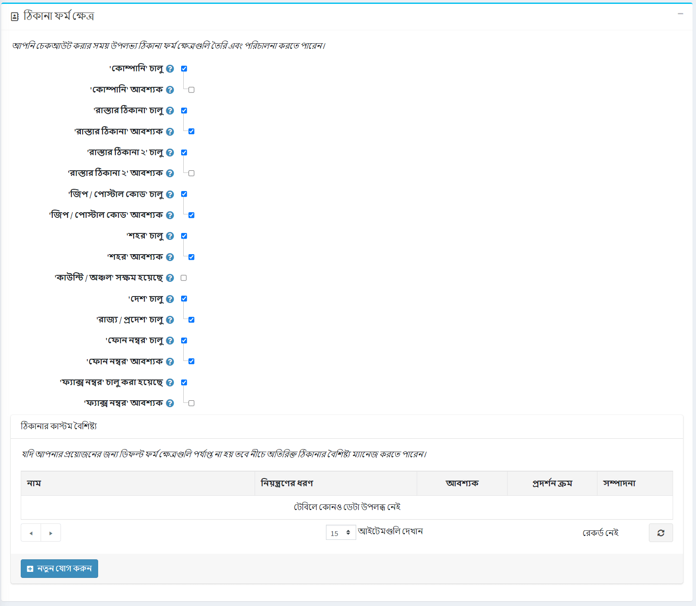

# গ্রাহক সেটিংস

গ্রাহক সেটিংসের মধ্যে রয়েছে গ্রাহকদের অবতার আপলোড করা, গ্রাহকের অবস্থান দেখানো, নামের বিন্যাস পরিবর্তন করা, যোগদানের তারিখ এবং আরও অনেক কিছু অন্তর্ভুক্ত করা।

গ্রাহক সেটিংস নির্ধারণ করতে, **কনফিগারেশন → সেটিংস → গ্রাহক সেটিংস** এ যান। গ্রাহক সেটিংস উইন্ডো প্রদর্শিত হয়। এই উইন্ডোতে ছয়টি প্যানেল রয়েছে: সাধারণ, পাসওয়ার্ড এবং নিরাপত্তা, অ্যাকাউন্ট, প্রোফাইল, গ্রাহক ফর্ম ক্ষেত্র এবং ঠিকানা ফর্ম ক্ষেত্র।

১। **সাধারণ** প্যানেলে সাধারণ গ্রাহক সেটিংস রয়েছে।

২। **পাসওয়ার্ড এবং নিরাপত্তা** প্যানেলে এমন ক্ষেত্র রয়েছে যা নিরাপত্তা সেটিংস এবং পাসওয়ার্ড জটিলতা কনফিগার করতে ব্যবহার করা যেতে পারে।

৩। **অ্যাকাউন্ট** প্যানেলে গ্রাহক অ্যাকাউন্ট স্থাপনের জন্য ক্ষেত্র রয়েছে।

৪। **প্রোফাইল** প্যানেলে গ্রাহকের প্রোফাইল কনফিগার করার জন্য ক্ষেত্র রয়েছে।

৫। **গ্রাহক ফর্ম ক্ষেত্র** প্যানেলে এমন ক্ষেত্র রয়েছে যা গ্রাহক নিবন্ধন পৃষ্ঠায় ব্যবহৃত হয়।

৬। **ঠিকানা ফর্ম ক্ষেত্র** প্যানেলে চেকআউটের সময় গ্রাহকের ঠিকানা বিশদ বিবরণের জন্য ক্ষেত্র রয়েছে

## সাধারণ

সাধারণ গ্রাহক সেটিংস সংজ্ঞায়িত করুন, নিম্নরূপ:
**নিবন্ধন পদ্ধতি** নির্বাচন করুন, নিম্নরূপ:
  **স্ট্যান্ডার্ড অ্যাকাউন্ট তৈরি**: ব্যবহারকারীরা নিবন্ধন করতে সক্ষম, কোন অনুমোদনের প্রয়োজন নেই।
  ***রেজিস্ট্রেশনের পরে ইমেইল যাচাইকরণ প্রয়োজন**: ব্যবহারকারীরা নিবন্ধন করতে সক্ষম হন, তবে তাদের অ্যাকাউন্ট অনুমোদিত হওয়ার আগে তাদের অবশ্যই পাঠানো নিশ্চিতকরণ ইমেল গ্রহণ করতে হবে।
  ***একজন গ্রাহককে প্রশাসক কর্তৃক অনুমোদিত হওয়া উচিত**: ব্যবহারকারীরা নিবন্ধন করতে সক্ষম, প্রশাসকের অনুমোদন প্রয়োজন।
  **নিবন্ধন নিষ্ক্রিয় করা হয়েছে**: নিবন্ধন অক্ষম করতে এই বিকল্পটি নির্বাচন করুন।
*নতুন গ্রাহক নিবন্ধনের বিষয়ে বিজ্ঞপ্তি **চেকবক্সে টিক দিন, যাতে নতুন গ্রাহক নিবন্ধিত হওয়ার সময় প্রতিটি দোকানের মালিককে ইমেল বিজ্ঞপ্তি পেতে সক্ষম করে।
**ডাউনলোডযোগ্য পণ্যের জন্য নিবন্ধনের প্রয়োজন** চেকবক্সে টিক দিন যদি গ্রাহকদের ডাউনলোডযোগ্য পণ্য ক্রয়ের জন্য নিবন্ধন সম্পন্ন করতে হয়।
**গ্রাহকদের উপহার কার্ডের ব্যালেন্স চেক করার অনুমতি দিন** গ্রাহকদের উপহার কার্ডের ব্যালেন্স চেক করার অনুমতি দিন।
  > [!NOTE]
  >
  > যদি **গ্রাহকদের উপহার কার্ডের ব্যালেন্স চেক করার অনুমতি দেয়** ক্ষেত্রটি চেক করা হয়, তাহলে অ্যাডমিন এলাকায় ক্যাপচা সেটিং সক্ষম করতে হবে (**কনফিগারেশন → সেটিংস → সাধারণ সেটিংস AP ক্যাপচা প্যানেল**)। এই বৈশিষ্ট্যটি সম্ভাব্যভাবে নিরাপদ নয় এবং ব্রুটফোর্স প্রতিরোধ এবং জটিল করার জন্য ক্যাপচা প্রয়োজন। আরো বিস্তারিত জানার জন্য [ক্যাপচা সেটিংস](xref:bn/getting-start/advanced-configuration/security-settings#captcha) দেখুন।

*অ্যাকাউন্ট পৃষ্ঠায় পাবলিক স্টোরে **গ্রাহকদের টাইম জোন নির্বাচন করার অনুমতি দিতে হবে কিনা তা চয়ন করুন। অন্যথায়, ডিফল্ট টাইম জোন ব্যবহার করা হয়।
*ড্রপডাউন তালিকা থেকে **ডিফল্ট স্টোর টাইম জোন** নির্বাচন করুন।
   > [!NOTE]
   >
   > বর্তমান সময় অঞ্চল স্বয়ংক্রিয়ভাবে প্রদর্শিত হয়।
 
 *গ্রাহকদের বাহ্যিক প্রমাণীকরণ সমিতি অপসারণের অনুমতি দিতে **গ্রাহকদের সমিতি অপসারণের অনুমতি দিন** টিক দিন।

## পাসওয়ার্ড এবং নিরাপত্তা

**পাসওয়ার্ডের সর্বনিম্ন দৈর্ঘ্য সেট করুন, পাসওয়ার্ডে কমপক্ষে একটি ছোট হাত থাকতে হবে, পাসওয়ার্ডে কমপক্ষে একটি বড় হাতের অক্ষর থাকতে হবে, পাসওয়ার্ডে কমপক্ষে একটি অ অক্ষরবিশিষ্ট অক্ষর থাকতে হবে, পাসওয়ার্ডের জটিলতা পরিবর্তন করতে পাসওয়ার্ডের কমপক্ষে একটি অঙ্ক থাকতে হবে**
**অনুপযুক্ত পাসওয়ার্ড নম্বর** এমন একটি পাসওয়ার্ড যা পূর্ববর্তী পাসওয়ার্ডের মতো নয়।
*নিম্নরূপ **ডিফল্ট পাসওয়ার্ড ফরম্যাট** নির্বাচন করুন:
  * *পরিষ্কার*
  * *হ্যাশড*
  * *এনক্রিপ্ট করা*
  > [!NOTE]
  > 
  > এই সেটিংটি গ্রাহকদের পাসওয়ার্ড সংরক্ষণের জন্য এবং শুধুমাত্র নতুন নিবন্ধিত গ্রাহকদের জন্য প্রযোজ্য হবে।

**পাসওয়ার্ড লাইফটাইম** পাসওয়ার্ডের মেয়াদ শেষ হওয়ার জন্য দিনের সংখ্যা লিখুন।
  > [!NOTE]
  >
  > **পাসওয়ার্ড লাইফটাইম** ফিচারটি ব্যবহার করতে চেক করতে ভুলবেন না **পাসওয়ার্ড লাইফটাইম সক্ষম করুন** সেই ভূমিকাগুলির জন্য গ্রাহক ভূমিকা সম্পাদনা পৃষ্ঠায় (**গ্রাহক → গ্রাহকের ভূমিকা**) সম্পত্তি, যা পাসওয়ার্ড পরিবর্তন করতে হবে। আরো বিস্তারিত জানার জন্য [গ্রাহক ভূমিকা](xref:bn/running-your-store/customer-management/customer-role) পড়ুন।

**পাসওয়ার্ড পুনরুদ্ধারের লিঙ্কে। দিন বৈধ** ক্ষেত্র, পাসওয়ার্ড পুনরুদ্ধারের লিঙ্কের জন্য দিনের সংখ্যা লিখুন। যদি আপনি লিঙ্কটির মেয়াদ শেষ না হতে চান তবে এটি ০ তে সেট করুন।
**সর্বোচ্চ লগইন ব্যর্থতা** নম্বর লিখুন। এই বৈশিষ্ট্যটি অক্ষম করতে ০ সেট করুন।
**লকআউট সময় (লগইন ব্যর্থতা)** ব্যবহারকারীদের লকআউট করার জন্য মিনিটের সংখ্যা লিখুন।
**যদি আপনি আপনার গ্রাহকদের রেজিস্ট্রেশনের সময় দুবার ইমেইল দিতে চান তবে** ফোর্স দুইবার প্রবেশ করান, চেকবক্সে টিক দিন।

## অ্যাকাউন্ট

* ইমেলের পরিবর্তে লগইন এবং নিবন্ধনের জন্য ব্যবহারকারীর নাম ব্যবহার করতে সক্ষম করতে ** 'ব্যবহারকারীর নাম' সক্ষম ** চেকবক্সে টিক দিন।
  > [! নোট]
  >
  > উৎপাদন পরিবেশে এই বিকল্পটি পরিবর্তন করার সুপারিশ করা হয় না।
  
  যখন **'ব্যবহারকারীর নাম' সক্ষম** চেকবক্স নির্বাচন করা হয়, নিম্নলিখিত বিকল্পগুলি প্রদর্শিত হয়:
  * **গ্রাহকদের তাদের ব্যবহারকারীর নাম পরিবর্তন করার অনুমতি দিন**: যদি গ্রাহকদের তাদের ব্যবহারকারীর নাম পরিবর্তন করার অনুমতি দেওয়া হয় তবে এই বিকল্পটি নির্বাচন করুন।
  * **গ্রাহকদের ব্যবহারকারীর নামগুলির প্রাপ্যতা যাচাই করার অনুমতি দিন**: *আমার অ্যাকাউন্ট - গ্রাহক তথ্য*পৃষ্ঠায় *সংরক্ষণ করুন* বাটনে ক্লিক করার আগে গ্রাহকদের ব্যবহারকারীর নাম প্রাপ্যতা যাচাই করার অনুমতি দেওয়ার জন্য এই বিকল্পটি নির্বাচন করুন। এই ক্ষেত্রে **চেক প্রাপ্যতা** বাটন প্রদর্শিত হয়, নিচের উদাহরণ দেখুন।

* Tick the **Username validation is enabled** field if you want to enable username validation (when registering or changing on the "My account" page in the public store). When this checkbox is selected, the following options are displayed:
  * **Username validation rule**: set the validation rule for a username in this field. You can specify a list of allowed characters or a regular expression. If you use a regular expression check the **Use regex for username validation** field described below.
  * Check the **Use regex for username validation** field to use a regular expression for username validation (when registering or changing on the "My account" page in the public store).
* Select the **Customer name format**, as follows:
  * *Show emails*
  * *Show usernames*
  * *Show full names*
  * *Show first name*
  The customer name will be shown in the store next to the customer's news and blog comments, on the forum pages and others.
* Check the **Phone number validation is enabled** checkbox if you want to enable phone number validation (when registering or changing on the "My account" page in the public store). When this checkbox is selected, the following options are displayed:
  * **Phone number validation rule**: set the validation rule for a phone number in this field. You can specify a list of allowed characters or a regular expression. If you use a regular expression check the **Use regex for username validation** field described below.
  * Check the **Use regex for phone number validation** field to use a regular expression for phone number validation (when registering or changing on the "My account" page in the public store).
* **Allow customers to upload avatars**: the customers' avatars will be shown in the store next to their news and blog comments, on the forum pages and others. If this option is selected, the following checkbox is displayed:
  * Tick the **Default avatar enabled** checkbox, to display the default user avatars.
* Tick the **Hide 'Downloadable products' tab** checkbox, to hide this tab on the "My account" page.
* Tick the **Hide 'Back in stock subscriptions' tab** checkbox, to hide this tab on the "My account" page.
* Tick the **Hide newsletter box** checkbox if you do not want to display the newsletter subscription box.
* Tick the **Newsletter box. Allow to unsubscribe** checkbox to display "unsubscribe" option in the newsletter block. For example, it's required in Germany.
* Tick the **Store last visited page** checkbox, to store the customer's last visited page. You can then view the last visited pages by different customers on the **Customers → Online customers** page. You can untick this checkbox, to improve the site performance.
* Tick the **Store IP address** checkbox, to store the last IP address of customers. When disabled, it can improve performance.

## Profile

* **Allow viewing of customer profiles**: this setting enables to see the details of other customers in the public store.
* Tick the **Show customers location** checkbox if required.
* Tick the **Show customers join date** checkbox if required.

## Customer form fields
In the *Customer form fields* panel, define whether the following form fields are enabled in the system:

* **'Gender' enabled**
* **'First name' enabled**. When enabled, you can also decide whether this field should be required.
* **'Last name' enabled**. When enabled, you can also decide whether this field should be required.
* **'Date of Birth' enabled.** When enabled, you can also decide whether this field should be required and enter a minimum allowed age (for example, to ensure that a customer is above 18).
* **'Company' enabled.** When enabled, you can also decide whether this field should be required.
* **'Street address' enabled.** When enabled, you can also decide whether this field should be required.
* **'Street address 2' enabled**, if the second street address is enabled. When enabled, you can also decide whether this field should be required.
* **'Zip/postal code' enabled**. When enabled, you can also decide whether this field should be required.
* **'City' enabled.** When enabled, you can also decide whether this field should be required.
* **'County/region' enabled.** When enabled, you can also decide whether this field should be required.
* **'Country' enabled.** When enabled, you can also decide whether this field should be required.
* **'State/province' enabled.** When enabled, you can also decide whether this field should be required. Note: This field is visible only when the **Country** field is enabled.
* **'Phone number' enabled.** When enabled, you can also decide whether this field should be required.
* **'Fax number' enabled.** When enabled, you can also decide whether this field should be required.
* Tick the **'Accept privacy policy' enabled** checkbox, to request customers to accept the privacy policy during the registration.
* Tick the **'Newsletter' enabled** checkbox to offer customers a newsletter subscription during the registration. 
  * When the **'Newsletter' enabled** checkbox is selected, the **Newsletter ticked by default** checkbox is displayed. This automatically sets the 'Newsletter' checkbox on the registration page as ticked.

### Custom customer attributes 
If the default form fields are not enough for your requirements, you can manage additional customer attributes using this table. Customer attributes are created in the same manner as checkout attributes. For further details, refer to [Checkout attributes](xref:bn/running-your-store/order-management/checkout-attributes).

## Address form fields
In the *Address form fields* panel, a store owner can manage the address form fields available during the registration. You can select which fields are enabled and required among the following:

* **'Company' enabled.** When enabled, you can also decide whether this field should be required.
* **'Street address' enabled.** When enabled, you can also decide whether this field should be required.
* **'Street address 2' enabled**, if the second street address is enabled. When enabled, you can also decide whether this field should be required.
* **'Zip/postal code' enabled**. When enabled, you can also decide whether this field should be required.
* **'City' enabled.** When enabled, you can also decide whether this field should be required.
* **'County/region' enabled.** When enabled, you can also decide whether this field should be required.
* **'Country' enabled.** When enabled, you can also decide whether this field should be required.
* **'State/province' enabled.** When enabled, you can also decide whether this field should be required. Note: This field is visible only when the **Country** field is enabled.
* **'Phone number' enabled.** When enabled, you can also decide whether this field should be required.
* **'Fax number' enabled.** When enabled, you can also decide whether this field should be required.

### Custom address attributes
> [!NOTE]
> 
> If the default address fields are not enough for your requirements, you can manage additional address attributes using this table. Address attributes are created in the same manner as checkout attributes. For further details, refer to [Checkout Attributes](xref:bn/running-your-store/order-management/checkout-attributes).

Click **Save** in the top of the page.

## Tutorials

* [Configuring password settings](https://www.youtube.com/watch?v=TwWArXNi0CA)
