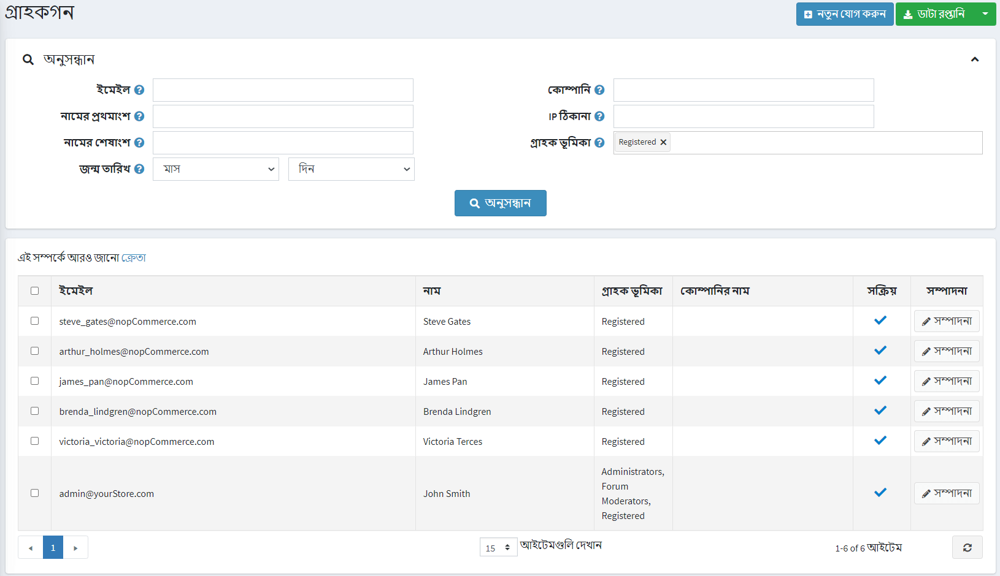
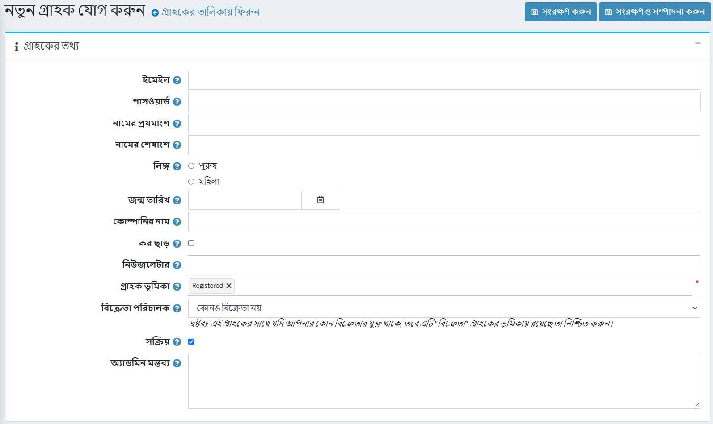
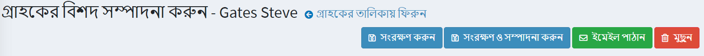
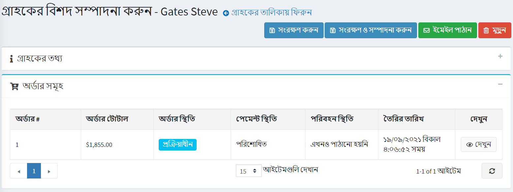
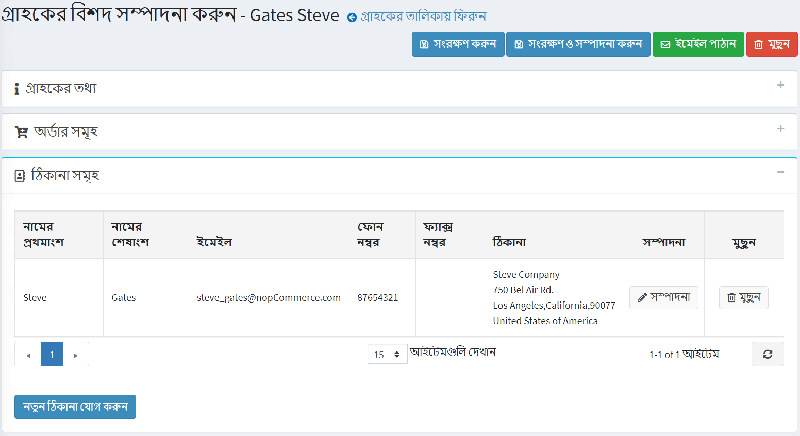
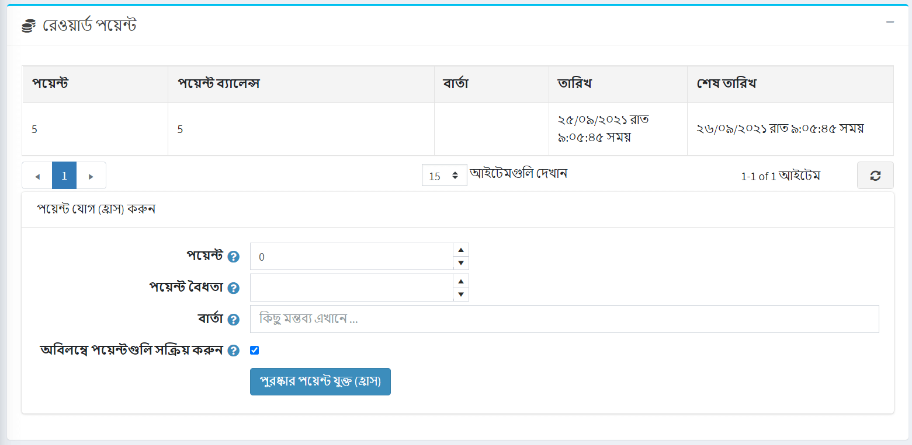

# গ্রাহকদের পরিচালনা করা

গ্রাহক তালিকায় সমস্ত বিদ্যমান গ্রাহকদের বিবরণ রয়েছে, সেইসাথে নতুন গ্রাহকদের যোগ করার অনুমতি দেয়। নপকমার্স-এ গ্রাহকরা প্রশাসক, বিক্রেতা এবং ক্রেতাদের মতো সকল ব্যবহারকারীকে অন্তর্ভুক্ত করে। গ্রাহকদের পরিচালনা করতে, **গ্রাহক → গ্রাহক** এ যান। নিম্নলিখিত উইন্ডো প্রদর্শিত হবে:

গ্রাহকদের অনুসন্ধান করতে, *গ্রাহক* উইন্ডোতে নিম্নলিখিত অনুসন্ধান মানদণ্ডগুলির মধ্যে একটি বা একাধিক প্রবেশ করুন:

- **ইমেইল**।
- **ব্যবহারকারীর নাম**, যদি [গ্রাহক সেটিংস](xref:bn/running-your-store/customer-management/customer-settings) সক্রিয় করা হয়।
- **নামের প্রথম অংশ**.
- **নামের শেষাংশ**.
- **জন্ম তারিখ**, যদি [গ্রাহক সেটিংস](xref:bn/running-your-store/customer-management/customer-settings) সক্রিয় করা হয়।
- **কোম্পানি**, যদি [গ্রাহক সেটিংস](xref:bn/running-your-store/customer-management/customer-settings) সক্রিয় থাকে।
- **ফোন**, যদি [গ্রাহক সেটিংস](xref:bn/running-your-store/customer-management/customer-settings) সক্রিয় থাকে ।
- **পিন কোড**, যদি [গ্রাহক সেটিংস](xref:bn/running-your-store/customer-management/customer-settings) সক্রিয় করা হয়।
- **আইপি ঠিকানা**.
- **গ্রাহকের ভূমিক** - আপনি প্রদর্শিত হওয়ার জন্য এক বা একাধিক গ্রাহকের ভূমিকা নির্বাচন করতে পারেন।

> [!NOTE]
>
> আপনি এক্সএমএল -এ এক্সপোর্ট করুন (সব) **অথবা এক্সেল -এ এক্সপোর্ট করুন (সব)** ক্লিক করে গ্রাহকের ডেটা এক্সটার্নাল ফাইলে এক্সপোর্ট করতে পারেন। আপনি **এক্সএমএল -এ এক্সপোর্ট (নির্বাচিত** বা **এক্সেল -এ এক্সপোর্ট (নির্বাচিত)** ক্লিক করে নির্বাচিত গ্রাহকের ডেটা একটি বহিরাগত ফাইলে রপ্তানি করতে পারেন।

তারপর **অনুসন্ধান** বাটনে ক্লিক করুন।

## একটি নতুন গ্রাহক যোগ করুন

নতুন গ্রাহক যোগ করতে,*গ্রাহক* উইন্ডোতে **নতুন যোগ করুন** ক্লিক করুন।
*একটি নতুন গ্রাহক যোগ করুন* উইন্ডো প্রদর্শিত হবে। নিম্নলিখিত গ্রাহকের বিবরণ সংজ্ঞায়িত করুন:

## গ্রাহকের তথ্য

*গ্রাহক তথ্য* প্যানেল গ্রাহকদের ব্যক্তিগত এবং অ্যাকাউন্টের তথ্য প্রবেশ করতে দেয়, যেমন একটি পাসওয়ার্ড পরিবর্তন করুন, গ্রাহকের ভূমিকা নির্ধারণ/অপসারণ করুন।

আপনি নিম্নলিখিত ক্ষেত্রগুলি সম্পাদনা করতে পারেন:

- **ইমেল** ঠিকানা।
- **পাসওয়ার্ড**।
- **নামের প্রথম অংশ**.
- **নামের শেষাংশ**.
- **লিঙ্গ**।
- **জন্ম তারিখ**.
- **কোমপানির নাম**.
- * কি কর অব্যাহতি** নির্দেশ করে যে গ্রাহক কর থেকে অব্যাহতিপ্রাপ্ত কিনা।
- স্টোর নিউজলেটারে গ্রাহককে সাবস্ক্রাইব করার জন্য **নিউজলেটার** মাল্টি সিলেক্টে উপযুক্ত দোকানগুলি বেছে নিন।
- **গ্রাহকের ভূমিকা** - এক বা একাধিক গ্রাহকের ভূমিকা। মনে রাখবেন যে সিস্টেমে লগইন করার জন্য যে কোনও ভূমিকা প্রয়োজন (যেমন প্রশাসক, বিক্রেতা) অন্যদের মধ্যে "নিবন্ধিত" গ্রাহকের ভূমিকা থাকা উচিত। আপনি [গ্রাহক ভূমিকা](xref:bn/running-your-store/customer-management/customer-role) বিভাগে গ্রাহকের ভূমিকা সেট করতে পারেন।
- **বিক্রেতার ম্যানেজার** ড্রপডাউন তালিকা থেকে, প্রয়োজন হলে, এই গ্রাহক অ্যাকাউন্টের সাথে যুক্ত একজন বিক্রেতা নির্বাচন করুন। যুক্ত হলে, এই গ্রাহক নির্বাচিত বিক্রেতা পোর্টালে লগইন করতে এবং তার পণ্য এবং অর্ডার পরিচালনা করতে সক্ষম হবে। মনে রাখবেন যে আপনার যদি এই গ্রাহকের সাথে কোন বিক্রেতা যুক্ত থাকে তবে নিশ্চিত করুন যে এই গ্রাহক রেকর্ডটি [বিক্রেতাদের](xref:bn/running-your-store/vendor-management) তালিকায় রয়েছে।
- গ্রাহককে সক্রিয় করতে **সক্রিয়** চেকবক্সে টিক দিন।
- **প্রশাসক মন্তব্য** - অভ্যন্তরীণ ব্যবহারের জন্য প্রশাসকের মন্তব্য, প্রয়োজন হলে।

পরিবর্তনগুলি সংরক্ষণ করার জন্য ** সংরক্ষণ করুন ** বাটনে ক্লিক করুন অথবা আরো গ্রাহকের তথ্যের জন্য এগিয়ে যেতে **সংরক্ষণ করুন এবং সম্পাদনা চালিয়ে যান** বাটনে ক্লিক করুন। এই ক্ষেত্রে আপনি গ্রাহক বিবরণ পৃষ্ঠায় নতুন যোগ করা প্যানেলগুলি দেখতে পাবেন।

আপনি দেখতে পাবেন **ইমেল পাঠান**, **ব্যক্তিগত বার্তা পাঠান** (যদি [ফোরাম](xref:bn/running-your-store/content-management/forums) সক্রিয়) এবং **মুছে ফেলুন** বোতাম ।

**ইমেইল পাঠান** বাটনে ক্লিক করার পর,*ইমেইল পাঠান* উইন্ডো প্রদর্শিত হবে যা একজন দোকানের মালিককে গ্রাহককে একটি ইমেইল পাঠাতে সক্ষম করে। **সেন্ড প্রাইভেট মেসেজ** বাটনে ক্লিক করার পর*প্রাইভেট মেসেজ*উইন্ডোটি গ্রাহককে মেসেজ পাঠাতে সক্ষম করে প্রদর্শিত হবে। প্রাইভেট মেসেজিং ব্যবহার করতে, [ফোরাম সেটিংস](xref:bn/running-your-store/content-management/forums) এ ব্যক্তিগত মেসেজের অনুমতি দিন।

## অর্ডার

*অর্ডার* প্যানেলে আপনি গ্রাহকের অর্ডারের বিবরণ দেখতে পারেন।

## ঠিকানা

*ঠিকানা* প্যানেলে আপনি গ্রাহকের নতুন ঠিকানা দেখতে, সম্পাদনা এবং তৈরি করতে পারেন।

একটি নতুন গ্রাহক ঠিকানা যোগ করতে **নতুন ঠিকানা যোগ করুন** বাটনে ক্লিক করুন। উপযুক্ত ক্ষেত্র পূরণ করুন এবং **সংরক্ষণ করুন** ক্লিক করুন। নতুন ঠিকানা গ্রাহকের সাথে যুক্ত হবে।

## বর্তমান শপিং কার্ট এবং ইচ্ছা তালিকা

*বর্তমান শপিং কার্ট এবং ইচ্ছা তালিকা* প্যানেলে আপনি গ্রাহকের শপিং কার্ট এবং ইচ্ছা তালিকা দেখতে পারেন।

## কার্য বিবরণ

*কার্যকলাপ লগ* প্যানেলে আপনি গ্রাহকের কার্যকলাপ লগ দেখতে পারেন। [অ্যাক্টিভিটি লগ-কাস্টমার অ্যাক্টিভিটি টাইপস](xref:bn/running-your-store/customer-management/activity-log#customer-activity-types) বিভাগে ক্রিয়াকলাপের ধরনগুলি কীভাবে পরিচালনা করবেন তা দেখুন।

## অর্ডার দিন (ছদ্মবেশী)

*প্লেস অর্ডারে (ছদ্মবেশী)* প্যানেল স্টোর মালিকরা পাসওয়ার্ড তথ্য না রেখে তাদের গ্রাহকদের জন্য অর্ডার তৈরি করতে পারেন। যেসব গ্রাহক নিবন্ধন করতে চান না, অথবা ফোনে অর্ডার দেওয়ার জন্য CSR ব্যবহার করে বড় সাইটগুলির জন্য এটি কার্যকর।

প্যানেলে **প্লেস অর্ডার** বাটন রয়েছে। এই বোতামটি ক্লিক করার পরে আপনাকে পাবলিক স্টোরে পুন redনির্দেশিত করা হবে। গ্রাহক যে পণ্যগুলি চান তা নির্বাচন করুন, সেগুলি কার্টে ঠিক সেইভাবে যুক্ত করুন যেমন গ্রাহক পাবলিক স্টোরে করবেন, তারপর স্বাভাবিক চেকআউট প্রক্রিয়ার মাধ্যমে এগিয়ে যাওয়ার জন্য **চেকআউট** বোতামটি ব্যবহার করুন এবং তারপর **সমাপ্তি সেশন** লিঙ্কে ক্লিক করুন এই সেশনটি শেষ করতে পৃষ্ঠার শীর্ষে।

## স্টক সাবস্ক্রিপশনে ফিরে আসুন

*স্টক সাবস্ক্রিপশনে ফিরে যান* প্যানেলে গ্রাহকরা যে পণ্যগুলি সাবস্ক্রাইব করেছেন তা দেখুন।

## পুরস্কার পয়েন্ট

*রিওয়ার্ড পয়েন্টে* প্যানেল স্টোরের মালিকরা গ্রাহককে রিওয়ার্ড পয়েন্ট যোগ করতে পারেন অথবা তার রিওয়ার্ড পয়েন্ট ব্যবহারের ইতিহাস দেখতে পারেন। পুরস্কার পয়েন্ট প্রোগ্রাম সক্ষম হলে এই প্যানেলটি দৃশ্যমান হয়। আরও তথ্যের জন্য [পুরস্কার পয়েন্ট](xref:bn/running-your-store/promotional-tools/reward-points) বিভাগটি দেখুন।

### পয়েন্ট যোগ করুন (কমানো)

এই প্যানেলে:

- **পয়েন্টের পরিমাণ লিখুন**। পয়েন্ট কমানোর জন্য একটি নেতিবাচক মান লিখুন।
- **পয়েন্টের বৈধতা** ক্ষেত্রের মধ্যে নির্দিষ্ট দিনের সংখ্যা উল্লেখ করুন যখন প্রদত্ত পয়েন্টগুলি বৈধ হবে (শুধুমাত্র পয়েন্টের ইতিবাচক পরিমাণের জন্য)।
- **বার্তা** বা মন্তব্য লিখুন।
- **অ্যাক্টিভেট পয়েন্ট অবিলম্বে** চেকবক্সে টিক দিন যদি আপনি চান গ্রাহকরা উপার্জন পয়েন্টগুলি উপার্জনের পরেই ব্যবহার করতে সক্ষম হবেন। আপনি যদি এই চেকবক্সটি চেক না করেন তবে আরও একটি বিকল্প প্রদর্শিত হবে:
- যদি পূর্ববর্তী চেকবক্সটি অনির্বাচিত হয়, **রিওয়ার্ড পয়েন্ট অ্যাক্টিভেশন** ফিল্ডে নির্দিষ্ট সময়কাল (দিন/ঘন্টার সংখ্যা) উল্লেখ করুন, যার পরে পুরস্কার পয়েন্ট সক্রিয় করা হবে।

## আরো দেখুন

- [গ্রাহকের ভূমিকা](xref:bn/running-your-store/customer-management/customer-role)
- [বিক্রেতারা](xref:bn/running-your-store/vendor-management)

## টিউটোরিয়াল

- [নপকমার্স-এ গ্রাহক ব্যবস্থাপনা](https://www.youtube.com/watch?v=DOl-g-NNFEM&list=PLnL_aDfmRHwsbhj621A-RFb1KnzeFxYz4&index=1)
- [একটি মুছে ফেলা ইমেল ঠিকানা পুনরায় বরাদ্দ করা](https://www.youtube.com/watch?v=lqmrWJdXZEE&t=1s)
- [ছদ্মবেশী মোডের ওভারভিউ](https://www.youtube.com/watch?v=KQi-CDVawJ4)