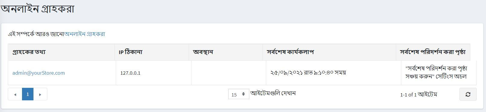

# অনলাইন গ্রাহকরা

অনলাইন গ্রাহক বিভাগ দোকানের মালিকদের গত ২০ মিনিটের মধ্যে অনলাইনে থাকা গ্রাহকদের দেখতে সক্ষম করে। এই তথ্যটি দোকান মালিকদের জন্য দরকারী কারণ এটি সর্বশেষ পরিদর্শন করা পৃষ্ঠাটি দেখায় এবং দর্শকদের ক্রেতাদের রূপান্তর করার জন্য প্রয়োজনীয় পদক্ষেপগুলি নির্ধারণ করতে সহায়তা করে।

এই উইন্ডোটি অ্যাক্সেস করতে, **গ্রাহক → অনলাইন গ্রাহক** এ যান।

*অনলাইন গ্রাহক* উইন্ডোতে নিম্নলিখিত কলামগুলি অন্তর্ভুক্ত রয়েছে:

- **গ্রাহকের তথ্য**, আপনি লিঙ্কে ক্লিক করে গ্রাহকের তথ্য দেখতে এবং সম্পাদনা করতে পারেন।
- **আইপি ঠিকানা** - গ্রাহকের বর্তমান আইপি ঠিকানা
- **অবস্থান** - গ্রাহকের আইপি ঠিকানা অনুসারে অবস্থান।
- **শেষ কার্যকলাপ** - অনলাইন গ্রাহক সর্বশেষ লগ ইন করার তারিখ এবং সময়।
- **শেষ পরিদর্শন পৃষ্ঠা** - গ্রাহক শেষবার যে পৃষ্ঠাটি দেখেছিলেন।

> [!NOTE]
>
> সর্বশেষ পরিদর্শন করা পৃষ্ঠাটি দেখার জন্য আপনাকে **কনফিগারেশন → সেটিংস → গ্রাহক সেটিংস** পৃষ্ঠায় (*অ্যাকাউন্ট*প্যানেল) **স্টোর শেষ পরিদর্শন পৃষ্ঠা** সেটিং সক্ষম করতে হবে।

এই পৃষ্ঠায় ম্যাক্সমাইন্ডের তৈরি জিওলাইট ২ ডেটা রয়েছে, যা [http://www.maxmind.com](http://www.maxmind.com) থেকে পাওয়া যায়
