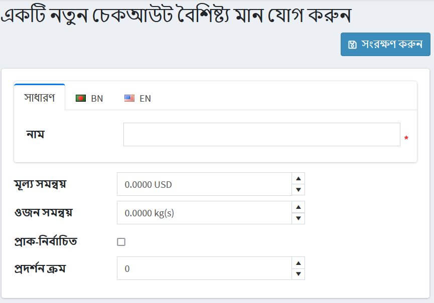

# চেকআউট বৈশিষ্ট্য

চেকআউট বৈশিষ্ট্যগুলি অতিরিক্ত অর্ডারের তথ্য উপস্থাপন করে যা কেনাকাটা প্রক্রিয়ার শেষ পর্যায়ে সংগ্রহ করা হয়।

> [!TIP]
>
> চেকআউট বৈশিষ্ট্যগুলি ব্যবহার করে দোকানের মালিকরা নির্দিষ্ট করতে পারেন, উদাহরণস্বরূপ, একটি কেনা পণ্যের জন্য উপহার-মোড়ক প্রয়োজন বা নাজুক পণ্যের ক্ষেত্রে সতর্কতার সাথে পরিচালনার প্রয়োজন।

চেকআউট বৈশিষ্ট্য শপিং কার্ট পৃষ্ঠায় প্রদর্শিত হয় এবং ব্যবহারকারীদের চেকআউটের আগে প্রয়োজন হলে সেগুলি নির্বাচন করতে সক্ষম করে।

চেকআউট বৈশিষ্ট্যগুলি সেট আপ বা সম্পাদনা করতে, **ক্যাটালগ → বৈশিষ্ট্য → চেকআউট বৈশিষ্ট্য** এ যান।

আপনি চেকআউট বৈশিষ্ট্যগুলি নির্বাচন করতে পারেন এবং তাদের মুছে ফেলার জন্য **মুছুন (নির্বাচিত)** বাটনে ক্লিক করতে পারেন।

## একটি নতুন চেকআউট বৈশিষ্ট্য যুক্ত করুন

একটি নতুন চেকআউট বৈশিষ্ট্য তৈরি করতে, **নতুন যোগ করুন** ক্লিক করুন। *একটি নতুন চেকআউট বৈশিষ্ট্য যুক্ত করুন* উইন্ডোটি নিম্নরূপ প্রদর্শিত হবে:

এই পৃষ্ঠাটি দুটি মোডে উপলব্ধ: **উন্নত** এবং **মৌলিক**। মৌলিক মোডে স্যুইচ করুন যা শুধুমাত্র প্রধান ক্ষেত্র প্রদর্শন করে অথবা সমস্ত উপলব্ধ ক্ষেত্র প্রদর্শন করে উন্নত মোড ব্যবহার করে।

*অ্যাট্রিবিউট তথ্য* প্যানেলে, নিম্নলিখিত তথ্য সংজ্ঞায়িত করুন:

- **নাম** - বৈশিষ্ট্যের নাম।
- **টেক্সট প্রম্পট** - একটি প্রশ্ন বা একটি মন্তব্য যা শপিং কার্ট পৃষ্ঠায় চেকআউট এলাকায় প্রদর্শিত হবে।
- **কন্ট্রোল টাইপ** ড্রপডাউন তালিকা থেকে, বৈশিষ্ট্য মান প্রদর্শনের জন্য প্রয়োজনীয় পদ্ধতি নির্বাচন করুন:*ড্রপডাউন তালিকা*,*রেডিও বোতাম তালিকা*,*চেকবক্স*,*টেক্সটবক্স*, ইত্যাদি।
  > [!NOTE]
  >
  > ড্রপডাউন তালিকা, রেডিও তালিকা, চেকবক্স এবং রঙের স্কোয়ারের জন্য দোকানের মালিককে মান নির্ধারণ করতে হবে (যেমন সবুজ, নীল, লাল ইত্যাদি)। *টেক্সটবক্স* এবং *ডেট পিকার* কন্ট্রোল টাইপের জন্য স্টোরের মালিককে মান নির্ধারণ করতে হয় না কারণ গ্রাহকদের এই টেক্সটবক্স ফিল্ডগুলো পূরণ করার জন্য অনুরোধ করা হবে। উপরন্তু, কিছু নিয়ন্ত্রণ প্রকারের জন্য, আপনি যাচাইকরণের নিয়ম নির্দিষ্ট করতে পারেন। উদাহরণস্বরূপ:*টেক্সটবক্স*বৈশিষ্ট্যের জন্য, আপনি **সর্বনিম্ন দৈর্ঘ্য**, **সর্বোচ্চ দৈর্ঘ্য** এবং **ডিফল্ট মান** নির্ধারণ করতে পারেন। *ফাইল আপলোড*বৈশিষ্ট্যের জন্য, আপনি **অনুমোদিত ফাইল এক্সটেনশন** এবং **সর্বোচ্চ ফাইলের আকার(কেবি)** নির্ধারণ করতে পারেন।

- ক্রয় প্রক্রিয়া শেষ করার আগে একটি বৈশিষ্ট্য মান নির্বাচন করা প্রয়োজন হলে **প্রয়োজনীয়** চেকবক্সে টিক দিন।
- **ডিসপ্লে অর্ডার** - চেকআউট বৈশিষ্ট্যের অর্ডার নম্বর প্রদর্শন করুন।
- টিপ করুন **শিপেবল প্রোডাক্ট প্রয়োজন** চেকবক্সের ক্ষেত্রে যদি এই অ্যাট্রিবিউটটি শুধুমাত্র সেই প্রোডাক্টের জন্য প্রদর্শিত হয় যা প্রেরণের প্রয়োজন হয়।
- টিক করা **ট্যাক্স অব্যাহতি** চেকবক্স নির্দেশ করে যে এই চেকআউট বৈশিষ্ট্যটিতে কর প্রয়োগ করা হবে না।
- যদি কর প্রয়োগ করা হয়, **ট্যাক্স বিভাগ** ড্রপডাউন তালিকা থেকে, চেকআউট বৈশিষ্ট্য কর বিভাগ নির্বাচন করুন।
- **দোকানে সীমাবদ্ধ** আপনাকে এক বা একাধিক দোকানে বৈশিষ্ট্য সীমাবদ্ধ করতে সক্ষম করে।
  > [!NOTE]
  >
  > এই কার্যকারিতাটি ব্যবহার করার জন্য, আপনাকে নিম্নলিখিত সেটিংটি অক্ষম করতে হবে: **ক্যাটালগ সেটিংস "উপেক্ষা করুন" প্রতি দোকান সীমা "নিয়ম (সাইটওয়াইড)**। মাল্টি-স্টোর কার্যকারিতা সম্পর্কে আরও পড়ুন [এখানে](xref:bn/getting-start/advanced-configuration/multi-store)।

**সংরক্ষণ করুন এবং সম্পাদনা চালিয়ে যান** অ্যাট্রিবিউট ভ্যালু*প্যানেলে (যদি প্রযোজ্য হয়) ক্লিক করুন।

### একটি নতুন চেকআউট বৈশিষ্ট্য মান যোগ করুন

*অ্যাট্রিবিউট ভ্যালু* প্যানেলে, একটি নতুন অ্যাট্রিবিউট মান তৈরি করতে **একটি নতুন চেকআউট অ্যাট্রিবিউট মান যোগ করুন** ক্লিক করুন।

*একটি নতুন চেকআউট বৈশিষ্ট্য মান যোগ করুন* উইন্ডোতে, নিম্নলিখিত তথ্য সংজ্ঞায়িত করুন:

- **নাম** - বৈশিষ্ট্যের মান নাম।
  > [!TIP]
  >
  > উদাহরণস্বরূপ, *হ্যাঁ* বা *না*, "আপনার কি ভঙ্গুর যত্নের ব্যবস্থাপনা প্রয়োজন" এর মতো প্রশ্নের জন্য?

- **মূল্য সমন্বয়** অ্যাট্রিবিউট মান নির্বাচিত হলে ক্রয়ের মোট যোগফল প্রবেশ করা পরিমাণ যোগ করবে।
- **ওজন সমন্বয়** অ্যাট্রিবিউট মান নির্বাচিত হলে প্রবেশকৃত পরিমাণ দ্বারা অর্ডারের ওজন পরিবর্তন করবে।
- একটি গ্রাহকের জন্য অ্যাট্রিবিউট মানটি আগে থেকে নির্বাচিত হওয়ার জন্য **পূর্বনির্ধারিত** চেকবক্সে টিক দিন।
- **ডিসপ্লে অর্ডার** - অ্যাট্রিবিউট ভ্যালুর অর্ডার নম্বর প্রদর্শন করুন।

আপনি*এট্রিবিউট ভ্যালু* প্যানেলে অ্যাট্রিবিউটের পাশে সংশ্লিষ্ট বোতামে ক্লিক করে **এডিট** এবং **ডিলিট** অ্যাট্রিবিউট ভ্যালু করতে পারেন।

## একটি শর্ত যোগ করুন

*কন্ডিশন* প্যানেলে, দোকানের মালিক চেকআউট অ্যাট্রিবিউট দৃশ্যমান হওয়ার জন্য একটি শর্ত নির্দিষ্ট করতে পারেন (অন্যান্য বৈশিষ্ট্যের উপর নির্ভর করে)। পূর্ববর্তী বৈশিষ্ট্য নির্বাচন করা হলেই শর্তসাপেক্ষ বৈশিষ্ট্যটি উপস্থিত হয়।

**সেভ** ক্লিক করুন। নতুন বৈশিষ্ট্যটি পাবলিক স্টোরে শপিং কার্ট পৃষ্ঠায় প্রদর্শিত হবে।

## টিউটোরিয়াল

- [চেকআউট বৈশিষ্ট্য যোগ করা](https://www.youtube.com/watch?v=sJcZP1qjHmY&list=PLnL_aDfmRHwsbhj621A-RFb1KnzeFxYz4&index=3)
- [শর্তাধীন চেকআউট বৈশিষ্ট্যের ওভারভিউ](https://www.youtube.com/watch?v=z3UiXgK8Jgo&list=PLnL_aDfmRHwsbhj621A-RFb1KnzeFxYz4&index=18)
