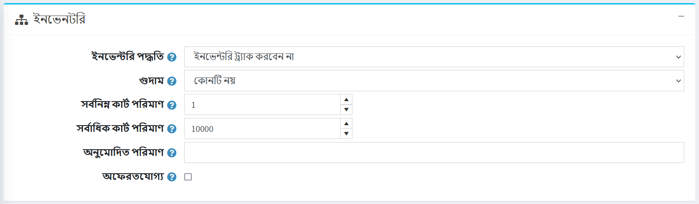
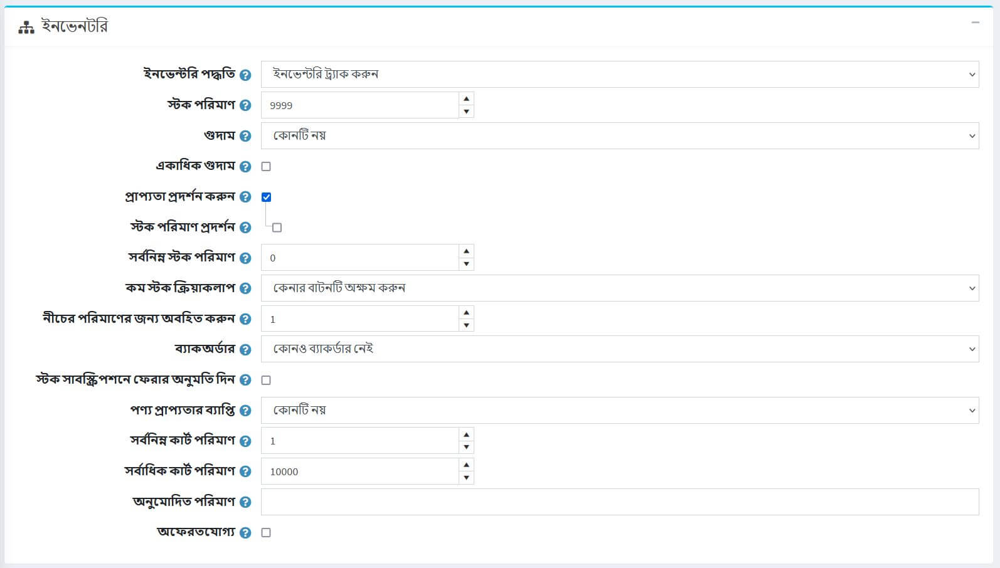
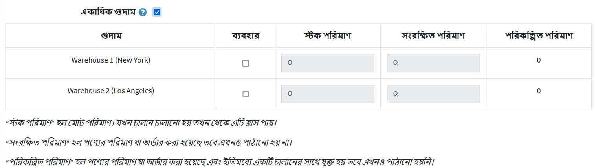
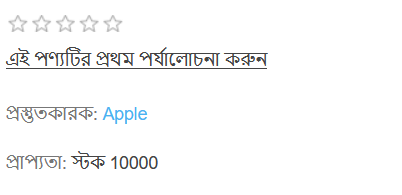
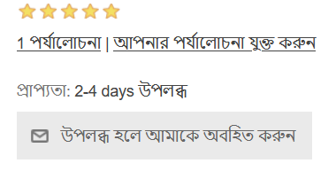
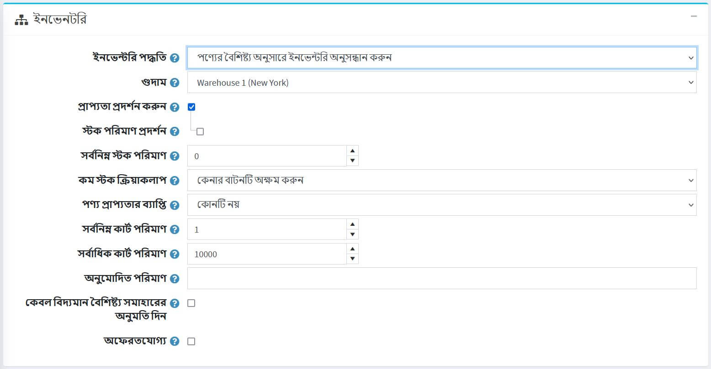
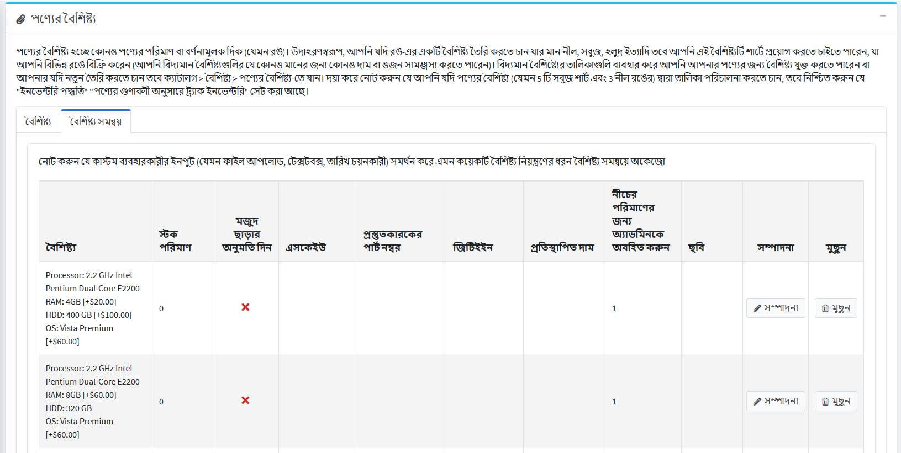
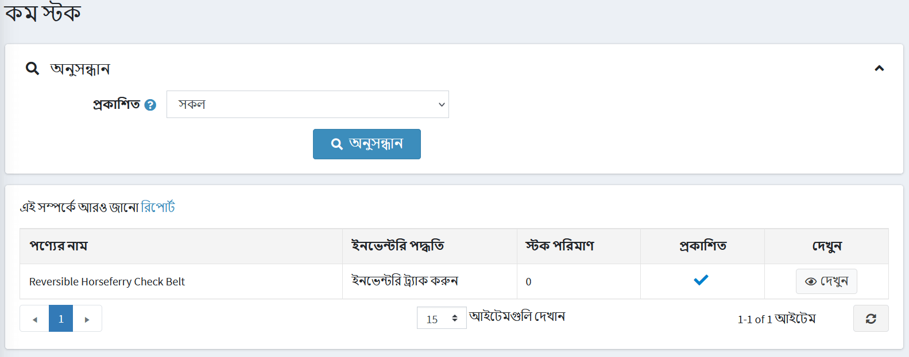

# ইনভেন্টরি ম্যানেজমেন্ট

ইনভেন্টরি ম্যানেজমেন্ট হল স্টক লেভেল কন্ট্রোলিং এর একটি সিস্টেম। NopCommerce এ এটি ইনভেন্টরি সেট আপ এবং কম স্টক ট্র্যাকিং নিয়ে গঠিত।

তালিকা সেট করতে, **ক্যাটালগ → পণ্য একটি পণ্য সম্পাদনা করুন** এ যান। *পণ্যের বিবরণ সম্পাদনা করুন* উইন্ডোতে, *ইনভেন্টরি* প্যানেলে যান। এই প্যানেলে আপনি তিনটি ইনভেন্টরি পদ্ধতির মধ্যে একটি বেছে নিতে পারেন:

১। [ইনভেন্টরি ট্র্যাক করবেন না](#dont-track-inventory)

২। [ইনভেন্টরি ট্র্যাক করবেন](#track-inventory)

৩। [পণ্যের গুণাবলী অনুসারে তালিকা ট্র্যাক করুন](#track-inventory-by-product-attributes)

পরবর্তী বিভাগগুলিতে আমরা এই পদ্ধতিগুলির মধ্যে পার্থক্য দেখতে পাব।

## ইনভেন্টরি ট্র্যাক করবেন না

কিছু পণ্যের জন্য ইনভেন্টরি ট্র্যাকিংয়ের প্রয়োজন নাও হতে পারে। উদাহরণস্বরূপ, পরিষেবা, সেকেন্ড হ্যান্ড বা কাস্টম-তৈরি পণ্য। এই ক্ষেত্রে, একটি দোকানের মালিক **ইনভেন্টরি পদ্ধতি** ক্ষেত্রের মধ্যে *ট্র্যাক ইনভেন্টরি* বিকল্পটি বেছে নিয়ে কোন ট্র্যাকিং করতে পারে না।

এই ক্ষেত্রে, দোকান মালিক সংজ্ঞায়িত করতে পারেন:

- **গুদাম** যা শিপিং হার গণনা করার সময় ব্যবহার করা হবে। [গুদামগুলি](xref:bn/getting-start/configure-shipping/advanced-configuration/warehouses) অধ্যায়ে আরও পড়ুন।
- **ন্যূনতম কার্ট পরিমাণ** একটি গ্রাহকের শপিং কার্টে অনুমোদিত পরিমাণ যেমন ৩ তে সেট করুন শুধুমাত্র গ্রাহকদের এই পণ্যটির ৩ বা তার বেশি কেনার অনুমতি দেয়।
- **সর্বোচ্চ কার্ট পরিমাণ** একটি গ্রাহকের শপিং কার্টে অনুমোদিত পরিমাণ যেমন সেট ৫ শুধুমাত্র গ্রাহকদের এই পণ্য ৫ কিনতে অনুমতি দেয়।
- **অনুমোদিত পরিমাণ** ক্ষেত্রের মধ্যে, আপনি যে পরিমাণ পণ্যগুলি সীমাবদ্ধ রাখতে চান তার একটি কমা দ্বারা পৃথক করা তালিকা লিখুন। একটি পরিমাণ পাঠ্যবাক্সের পরিবর্তে যা তাদের যেকোন পরিমাণে প্রবেশ করতে দেয়, তারা এখানে যে মানগুলি প্রবেশ করে তার একটি ড্রপডাউন তালিকা পাবে।
- যদি এই পণ্যটি ফেরতযোগ্য না হয় তবে **ফেরতযোগ্য নয়** চেকবক্সে টিক দিন। এই ক্ষেত্রে একজন গ্রাহককে রিটার্নের অনুরোধ জমা দেওয়ার অনুমতি দেওয়া হবে না।

## ট্র্যাক ইনভেন্টরি

যদি ইনভেন্টরি ট্র্যাকিং প্রয়োজন হয়, দোকানের মালিক দুটি বিকল্পের মধ্যে একটি **ইনভেন্টরি পদ্ধতি** বেছে নিতে পারেন: *ট্র্যাক ইনভেন্টরি* বিকল্পটি তাদের জন্য, যাদের প্রোডাক্ট ভেরিয়েন্ট নেই, এবং শুধু জানতে হবে কতগুলো আইটেম বাকি আছে। এই বিভাগে আমরা *ট্র্যাক ইনভেন্টরি* বিকল্পটি বর্ণনা করব।
একবার এই বিকল্পটি নির্বাচিত হলে, বিভাগটি নতুন ক্ষেত্র প্রদর্শন করে প্রসারিত করে:

নিম্নরূপ তালিকা সেট করুন:

**স্টক পরিমাণ** মোট পরিমাণ। অর্ডার প্রেরণের সময় এটি প্রতিবার হ্রাস পায়।
***গুদাম** বেছে নিন যা শিপিং রেট গণনার সময় ব্যবহার করা হবে। আপনি **কনফিগারেশন → শিপিং → গুদাম** পৃষ্ঠায় গুদাম পরিচালনা করতে পারেন। আরও তথ্যের জন্য [গুদামগুলি](xref:bn/getting-start/configure-shipping/advanced-configuration/warehouses) পৃষ্ঠাটি দেখুন।
আপনি একাধিক গুদাম থেকে শিপিং এবং ইনভেন্টরি ম্যানেজমেন্ট সমর্থন করতে চাইলে **একাধিক গুদাম** চেকবক্সে টিক দিন। এইভাবে আপনি প্রতি গুদামে ইনভেন্টরি পরিচালনা করতে পারেন:
  
    পণ্যের জন্য এই গুদামটি ব্যবহার করতে চাইলে উপযুক্ত সারিতে **ব্যবহার করুন** ক্লিক করুন।
    **স্টক পরিমাণ** মোট পরিমাণ কত? অর্ডার প্রেরণের সময় এটি প্রতিবার হ্রাস পায়।
    *প্রবেশ করুন **সংরক্ষিত পরিমাণ** পণ্যের পরিমাণ যা অর্ডার করা হয়েছে কিন্তু এখনও পাঠানো হয়নি বা একটি চালানে যোগ করা হয়নি।
    ***পরিকল্পিত পরিমাণ** হল পণ্যের পরিমাণ যা অর্ডার করা হয়েছে এবং ইতিমধ্যে একটি চালানে যোগ করা হয়েছে কিন্তু এখনও পাঠানো হয়নি।

*গ্রাহকদের অর্ডার দেওয়া থেকে বিরত রাখতে এবং পণ্যটি স্টকের বাইরে আছে তা খুঁজে বের করতে, আপনি কিছু পদক্ষেপ নিতে পারেন। পাবলিক স্টোরে স্টক প্রাপ্যতা প্রদর্শনের জন্য **ডিসপ্লে প্রাপ্যতা** চেকবক্সে টিক দিন।
  *যদি প্রয়োজন হয়, **ডিসপ্লে স্টক পরিমাণ** চেকবক্সে টিক দিন, যাতে গ্রাহকরা পণ্যের বিবরণ পৃষ্ঠায় একটি পণ্যের স্টক পরিমাণ দেখতে সক্ষম হন (এই চেকবক্সটি তখনই প্রদর্শিত হয় যখন **ডিসপ্লে প্রাপ্যতা** চেকবক্স টিক দেওয়া থাকে)। নিচের স্ক্রিনশটটি দেখায় যে একজন গ্রাহক পাবলিক স্টোরে কী দেখতে পাবেন:

      

***ন্যূনতম স্টক পরিমাণ** ক্ষেত্রের মধ্যে, একটি ন্যূনতম মান লিখুন, যার অধীনে আরও পদক্ষেপ নেওয়া হবে।
***নিম্ন স্টক কার্যকলাপ** ড্রপডাউন তালিকা থেকে, যখন স্টক পরিমাণ ন্যূনতম স্টক পরিমাণের নীচে নেমে আসে তখন নেওয়া পদক্ষেপগুলি নির্বাচন করুন, নিম্নরূপ:
  ***কিছুই না**: দোকানের মালিকরা এখনও কোন পদক্ষেপ না নেওয়ার সিদ্ধান্ত নিতে পারেন। এর মানে হল যে গ্রাহকরা পণ্য অর্ডার করতে পারেন।
  ***কিনুন বোতাম অক্ষম করুন**: স্টক কম থাকলে কিনুন বোতামটি অক্ষম হয়ে যায়। অতএব, গ্রাহকরা এই পণ্যটি কিনতে পারেন না কিন্তু এখনও এটি দোকানে বিদ্যমান দেখতে পারেন।
  ***অপ্রকাশিত**: পণ্যটি আর দোকানে দেখা যায় না। ব্যবহার করা হয় যখন পণ্য সম্পূর্ণরূপে বন্ধ হয়ে যাচ্ছে।

**নিচের পরিমাণের জন্য বিজ্ঞপ্তি** ক্ষেত্রের মধ্যে, একটি মান লিখুন যার অধীনে প্রশাসকের কাছে একটি বিজ্ঞপ্তি ইমেল পাঠানো হবে।
*দোকানের মালিকরা **ব্যাকঅর্ডার** সেট করতে পারেন, অর্থাৎ ক্রয়ের মুহূর্তে যে অর্ডারগুলি পূরণ করা যাবে না। ব্যাকঅর্ডার ড্রপডাউন তালিকা থেকে, প্রয়োজনীয় ব্যাকঅর্ডার মোড নির্বাচন করুন, নিম্নরূপ:
  **কোন ব্যাকঅর্ডার নেই**: স্টক না থাকলে গ্রাহকরা এই পণ্যটি কিনতে পারবেন না।
  * **০ এর নিচে পরিমাণের অনুমতি দিন**: গ্রাহকরা এই পণ্যটি কিনতে পারেন এমনকি কোন স্টক না থাকলেও।
  * **০ এর নিচে পরিমাণ অনুমোদন করুন এবং গ্রাহককে জানান**: স্টক না থাকা সত্ত্বেও গ্রাহকরা এই পণ্যটি কিনতে পারেন। উপরন্তু, তারা নিম্নলিখিত বার্তা সহ একটি বিজ্ঞপ্তি পায়: স্টক আউট - ব্যাকঅর্ডার এবং একবার স্টকে প্রেরণ করা হবে (**ডিসপ্লে প্রাপ্যতা** বিকল্পটি এই ক্ষেত্রেও সক্ষম করা উচিত)*।

*টিক করুন **স্টক সাবস্ক্রিপশনে আবার অনুমতি দিন**, গ্রাহকদের পণ্যের প্রাপ্যতা সম্পর্কে একটি বিজ্ঞপ্তির জন্য সাবস্ক্রাইব করতে সক্ষম করুন, যেমন নীচের স্ক্রিনশটে রয়েছে:
  
  

*** পণ্যের প্রাপ্যতা পরিসীমা** বেছে নিন যা গ্রাহকদের জন্য প্রদর্শিত হবে যখন এই মুহূর্তে পণ্যটি উপলব্ধ নয়। আপনি **কনফিগারেশন → শিপিং → তারিখ এবং রেঞ্জ** পৃষ্ঠার *পণ্যের প্রাপ্যতা পরিসীমা* প্যানেলে প্রাপ্যতা সীমা সেট করতে পারেন। আরো বিস্তারিত জানার জন্য [তারিখ এবং রেঞ্জ](xref:bn/getting-start/configure-shipping/advanced-configuration/তারিখ-এবং-পরিসর) পৃষ্ঠা পড়ুন।
- **ন্যূনতম কার্ট পরিমাণ** একটি গ্রাহকের শপিং কার্টে অনুমোদিত পরিমাণ যেমন customers এ সেট করুন শুধুমাত্র গ্রাহকদের এই পণ্যটির purchase বা তার বেশি কেনার অনুমতি দিতে।
- **সর্বোচ্চ কার্ট পরিমাণ** একটি গ্রাহকের শপিং কার্টে অনুমোদিত পরিমাণ যেমন গ্রাহকদের এই পণ্যটির ৫ কেনার অনুমতি দিতে ৫ তে সেট করুন।
- **অনুমোদিত পরিমাণ** ক্ষেত্রের মধ্যে, আপনি যে পরিমাণ পণ্যগুলি সীমাবদ্ধ রাখতে চান তার একটি কমা দ্বারা পৃথক করা তালিকা লিখুন। একটি পরিমাণ পাঠ্যবাক্সের পরিবর্তে যা তাদের যেকোন পরিমাণে প্রবেশ করতে দেয়, তারা এখানে যে মানগুলি প্রবেশ করে তার একটি ড্রপডাউন তালিকা পাবে।
- যদি এই পণ্যটি ফেরতযোগ্য না হয় তবে **ফেরতযোগ্য নয়** চেকবক্সে টিক দিন। এই ক্ষেত্রে একজন গ্রাহককে রিটার্নের অনুরোধ জমা দেওয়ার অনুমতি দেওয়া হবে না।

## পণ্যের গুণাবলী অনুসারে তালিকা ট্র্যাক করুন
যদি আপনার প্রোডাক্ট অ্যাট্রিবিউট কম্বিনেশন থাকে এবং তাদের স্টক পরিমাণ ট্র্যাক করার প্রয়োজন হয়, তাহলে *প্রোডাক্ট অ্যাট্রিবিউট দ্বারা ট্র্যাক ইনভেন্টরি* ইনভেন্টরি পদ্ধতি বেছে নিন।
একবার এই বিকল্পটি নির্বাচিত হলে, বিভাগটি নতুন ক্ষেত্র প্রদর্শন করে প্রসারিত করে:

***গুদাম** বেছে নিন যা শিপিং রেট গণনার সময় ব্যবহার করা হবে। আপনি **কনফিগারেশন → শিপিং → গুদাম** পৃষ্ঠায় গুদাম পরিচালনা করতে পারেন। আরও তথ্যের জন্য [গুদামগুলি](xref:bn/getting-start/configure-shipping/advanced-configuration/warehouses) পৃষ্ঠাটি দেখুন।
* গ্রাহকদের অর্ডার দেওয়া থেকে বিরত রাখতে এবং পণ্যটি স্টকের বাইরে আছে তা খুঁজে বের করতে, আপনি কিছু পদক্ষেপ নিতে পারেন। পাবলিক স্টোরে স্টক প্রাপ্যতা প্রদর্শনের জন্য **ডিসপ্লে প্রাপ্যতা** চেকবক্সে টিক দিন।
  *যদি প্রয়োজন হয়, **ডিসপ্লে স্টক পরিমাণ** চেকবক্সে টিক দিন, যাতে গ্রাহকরা পণ্যের বিবরণ পৃষ্ঠায় একটি পণ্যের স্টক পরিমাণ দেখতে সক্ষম হন (এই চেকবক্সটি তখনই প্রদর্শিত হয় যখন **ডিসপ্লে প্রাপ্যতা** চেকবক্স টিক দেওয়া থাকে)। নিচের স্ক্রিনশটটি দেখায় যে একজন গ্রাহক পাবলিক স্টোরে কী দেখতে পাবেন:
    
    

* **পণ্যের প্রাপ্যতা পরিসীমা** বেছে নিন যা গ্রাহকদের জন্য প্রদর্শিত হবে যখন এই মুহূর্তে পণ্যটি উপলভ্য নয়। আপনি **কনফিগারেশন → শিপিং → তারিখ এবং রেঞ্জ** পৃষ্ঠার *পণ্যের প্রাপ্যতা পরিসীমা* প্যানেলে প্রাপ্যতা সীমা সেট করতে পারেন। আরো বিস্তারিত জানার জন্য [তারিখ এবং রেঞ্জ](xref:bn/getting-start/configure-shipping/advanced-configuration/তারিখ-এবং-পরিসর) পৃষ্ঠা পড়ুন।
- **ন্যূনতম কার্ট পরিমাণ** একটি গ্রাহকের শপিং কার্টে অনুমোদিত পরিমাণ যেমন গ্রাহক-এ সেট করুন শুধুমাত্র গ্রাহকদের এই পণ্যটির ক্রয় বা তার বেশি কেনার অনুমতি দিতে।
- **সর্বোচ্চ কার্ট পরিমাণ** একটি গ্রাহকের শপিং কার্টে অনুমোদিত পরিমাণ যেমন গ্রাহকদের এই পণ্যটির ৫ কেনার অনুমতি দিতে ৫ তে সেট করুন।
- **অনুমোদিত পরিমাণ** ক্ষেত্রের মধ্যে, আপনি যে পরিমাণ পণ্যগুলি সীমাবদ্ধ রাখতে চান তার একটি কমা দ্বারা পৃথক করা তালিকা লিখুন। একটি পরিমাণ পাঠ্যবাক্সের পরিবর্তে যা তাদের যেকোন পরিমাণে প্রবেশ করতে দেয়, তারা এখানে যে মানগুলি প্রবেশ করে তার একটি ড্রপডাউন তালিকা পাবে।
- টিক করুন **শুধুমাত্র বিদ্যমান অ্যাট্রিবিউট কম্বিনেশনগুলিকে অনুমতি দিন** কার্ট/উইশলিস্টে যোগ করার অনুমতি দিতে শুধুমাত্র বিদ্যমান অ্যাট্রিবিউট কম্বিনেশন যার পরিমাণ ০ এর বেশি। এক্ষেত্রে আপনার স্টকে থাকা সমস্ত প্রোডাক্ট অ্যাট্রিবিউট কম্বিনেশন তৈরি করতে হবে।
- যদি এই পণ্যটি ফেরতযোগ্য না হয় তবে **ফেরতযোগ্য নয়** চেকবক্সে টিক দিন। এই ক্ষেত্রে একজন গ্রাহককে রিটার্নের অনুরোধ জমা দেওয়ার অনুমতি দেওয়া হবে না।

> [!NOTE]
>
> বিভিন্ন বৈশিষ্ট্যের সংমিশ্রণের জন্য **স্টক পরিমাণ** সেট করার জন্য, প্রোডাক্ট এট্রিবিউটস প্যানেলের *প্রোডাক্ট অ্যাট্রিবিউটস* প্যানেলের **অ্যাট্রিবিউট কম্বিনেশন** ট্যাবে যান। এই ট্যাবে আপনি নির্দিষ্ট স্ট্রিটের বাইরে থাকা সত্ত্বেও অর্ডার অনুমোদন করতে সক্ষম করার জন্য একটি নির্দিষ্ট বৈশিষ্ট্য সমন্বয়ের জন্য **স্টক আউট করার অনুমতি** দিন কিনা তা নির্ধারণ করতে পারেন।
  

> [!TIP]
>
> বর্তমানে স্টকে থাকা পণ্যগুলি ট্র্যাক করতে, **রিপোর্টস → কম স্টক** এ যান।
> কম স্টক রিপোর্টে বর্তমানে স্টকের অধীনে থাকা পণ্যের একটি তালিকা রয়েছে, যেমন স্টক পরিমাণ পণ্যের বিবরণ পৃষ্ঠায় *ইনভেন্টরি* বিভাগে সেট করা সর্বনিম্ন স্টক পরিমাণের সমান বা কম।
  
  পণ্যের বিবরণ পৃষ্ঠা দেখতে **দেখুন** ক্লিক করুন, যেখানে এই স্টক সেটিংস পরিবর্তন করা যাবে।
  নপকমার্স-এ রিপোর্ট সম্পর্কে আরও বিস্তারিত জানার জন্য [রিপোর্ট](xref:bn/running-your-store/catalog/products/product-attributes) পৃষ্ঠা দেখুন।

## আরো দেখুন

* [পণ্যের বৈশিষ্ট্য](xref:bn/running-your-store/catalog/products/product-attributes)
* [গুদাম](xref:bn/get-start/configure-shipping/advanced-configuration/warehouses)

## টিউটোরিয়াল

* [নপকমার্স-এ ব্যাকঅর্ডার পরিচালনা করা] (https://www.youtube.com/watch?v=CMhQ39clCKM)