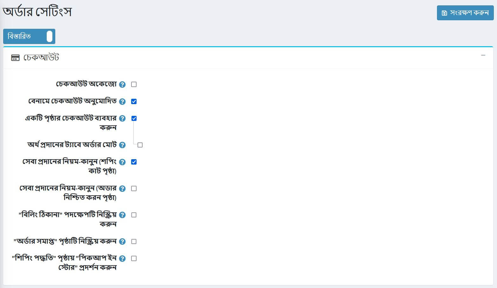
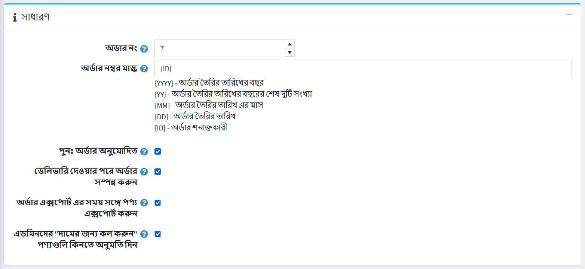
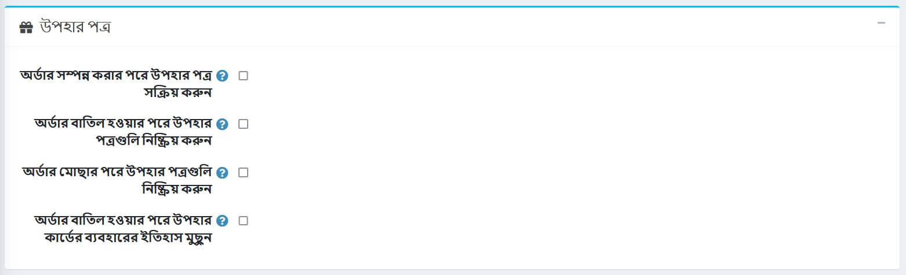

# অর্ডার সেটিংস

অর্ডার সেটিংস নির্ধারণ করতে, **কনফিগারেশন → সেটিংস → অর্ডার সেটিংস** এ যান। *অর্ডার সেটিংস* উইন্ডো প্রদর্শিত হবে।

এই পৃষ্ঠাটি মাল্টি-স্টোর কনফিগারেশন সক্ষম করে, এর মানে হল যে একই স্টোরিং সকল স্টোরের জন্য সংজ্ঞায়িত করা যেতে পারে, অথবা স্টোর থেকে স্টোরে আলাদা হতে পারে। আপনি যদি একটি নির্দিষ্ট দোকানের জন্য সেটিংস পরিচালনা করতে চান, মাল্টি-স্টোর কনফিগারেশন ড্রপ-ডাউন তালিকা থেকে তার নামটি চয়ন করুন এবং তাদের জন্য কাস্টম মান নির্ধারণ করতে বাম পাশে সমস্ত প্রয়োজনীয় চেকবক্সে টিক দিন। আরও তথ্যের জন্য [মাল্টি-স্টোর](xref:bn/getting-start/advanced-configuration/multi-store) পড়ুন।

এই উইন্ডোতে আপনি নিম্নলিখিত অর্ডার সেটিংস সংজ্ঞায়িত করতে পারেন:

## চেকআউট

*চেকআউট* প্যানেলে নিম্নলিখিত সেটিংস সংজ্ঞায়িত করুন:

* **চেকআউট নিষ্ক্রিয়**, চেকআউট প্রক্রিয়া নিষ্ক্রিয় করতে।
* **বেনামী চেকআউট অনুমোদিত**, গ্রাহকদের নিবন্ধন/লগ ইন ছাড়া পণ্য ক্রয় করতে সক্ষম করতে।
* থেকে **এক পৃষ্ঠা চেকআউট ব্যবহার করুন**, যা একটি একক ওয়েব পেজ যা আপনার গ্রাহকরা আপনার কাছ থেকে পণ্য বা পরিষেবা কিনতে ব্যবহার করবে।
* **পেমেন্ট ইনফো ট্যাবে অর্ডার টোটাল** পেমেন্ট ইনফো ট্যাবে প্রোডাক্ট লিস্ট এবং অর্ডার টোটাল প্রদর্শন করতে (এক পেজ চেকআউট)।
* অর্ডার প্রসেস করার আগে গ্রাহকদের **পরিষেবার শর্তাবলী** মেনে নিতে হবে (**শপিং কার্ট পৃষ্ঠায়**)।
* অর্ডার প্রসেস করার আগে গ্রাহকদের **পরিষেবার শর্তাবলী** মেনে নিতে হবে (**কনফার্ম অর্ডারের পৃষ্ঠায়**)।
* চেকআউটের সময় **"বিলিং ঠিকানা" ধাপ** অক্ষম করুন। বিলিং ঠিকানা ডিফল্ট রেজিস্ট্রেশন ডেটা ব্যবহার করে পূর্বে ভরা এবং সংরক্ষণ করা হবে (নির্বাচিত *অতিথি* চেকআউটের সাথে ব্যবহার করা যাবে না)। **কনফিগারেশন → সেটিংস → গ্রাহক সেটিংস** এ নিশ্চিত করুন যে উপযুক্ত ঠিকানা ক্ষেত্রগুলি যা পূর্বে পূরণ করা যাবে না তাদের প্রয়োজন নেই (বা অক্ষম)।
* একটি **অর্ডার সম্পন্ন "পৃষ্ঠা** অক্ষম করতে, একটি অর্ডার দেওয়ার পরে স্বয়ংক্রিয়ভাবে একজন গ্রাহককে অর্ডার বিশদ পৃষ্ঠায় পুননির্দেশিত করতে।
* **শিপিং পদ্ধতি "পৃষ্ঠায় বা শিপিং ঠিকানা পৃষ্ঠায়"** দোকানে পিকআপ "প্রদর্শন করতে।

## মোট অর্ডার

*অর্ডার টোটাল* প্যানেলে নিম্নলিখিত সেটিংস সংজ্ঞায়িত করুন:

* **ন্যূনতম অর্ডার উপ-মোট পরিমাণ**। এই পরিমাণের অধীনে আদেশ জারি করা হবে না।
* **ট্যাক্স সহ "ন্যূনতম অর্ডার উপ-মোট পরিমাণ" গণনা করুন। এই ক্ষেত্রে, পূর্ববর্তী ধাপে নির্দিষ্ট করা ন্যূনতম অর্ডার উপ-মোট পরিমাণ ক্ষেত্র** যাচাই করার সময় কর সহ একটি অর্ডার সাব-টোটাল গণনা করা হবে।
* **সর্বনিম্ন অর্ডারের মোট পরিমাণ** এই পরিমাণের অধীনে আদেশ জারি করা হবে না।
* থেকে **অটো আপডেট অর্ডার টোটাল** এডমিন এলাকায় অর্ডার সম্পাদনা করার সময় অর্ডার টোটাল স্বয়ংক্রিয়ভাবে আপডেট করা (বর্তমানে বিটা পরীক্ষায়)।

## সাধারণ

*সাধারণ* প্যানেলে নিম্নলিখিত সেটিংস সংজ্ঞায়িত করুন:

* **অর্ডার আইডি** কাউন্টার। আপনি যদি একটি নির্দিষ্ট সংখ্যায় আপনার অর্ডার শুরু করতে চান তবে এটি কার্যকর। এটি শুধুমাত্র পরে তৈরি আদেশ প্রভাবিত করে। মানটি সর্বাধিক বর্তমান অর্ডার আইডির চেয়ে বড় হতে হবে।
* **অর্ডার নম্বর মাস্ক** এ আপনি কাস্টম অর্ডার নম্বর তৈরি করতে পারেন। উদাহরণস্বরূপ, {YYYY} দিয়ে শুরু করুন - অর্ডার তৈরির তারিখের বছর।
* **কি পুনরায় অর্ডার অনুমোদিত** গ্রাহকদের পুনরায় অর্ডার করতে সক্ষম করে। পুন--অর্ডার প্রক্রিয়াটি স্বয়ংক্রিয়ভাবে শপিং কার্টে সমস্ত আইটেম যোগ করে যা পূর্ববর্তী অর্ডারে ছিল।
* থেকে **সম্পূর্ণ অর্ডার যখন বিতরণ করা হয়**, অর্ডার স্থিতি "সম্পূর্ণ" সেট করতে শুধুমাত্র যখন তার শিপিং অবস্থা "বিতরণ" হয়। অন্যথায়, "শিপড" অবস্থা যথেষ্ট হবে।
* থেকে **পণ্যের সাথে অর্ডার রপ্তানি করুন**।
* **প্রশাসকদের "কল ফর প্রাইস" পণ্য কেনার অনুমতি দিন**, প্রশাসকদের (ছদ্মবেশী মোডে) "দামের জন্য কল করুন" হিসাবে চিহ্নিত পণ্য কেনার অনুমতি দিন।

## পিডিএফ চালান

*পিডিএফ ইনভয়েস* প্যানেলে নিম্নলিখিত সেটিংস সংজ্ঞায়িত করুন:
!পিডিএফ চালান](_static/order-settings/pdf-invoice.jpg)

* **পিডিএফ চালান সংযুক্ত করতে ("অর্ডার দেওয়া" ইমেল)**।
* **পিডিএফ ইনভয়েস সংযুক্ত করতে ("অর্ডার পেইড" ইমেল)**।
* **পিডিএফ চালান সংযুক্ত করতে ("অর্ডার সম্পন্ন" ইমেল)**।

> [!TIP]
>
> [পিডিএফ সেটিংস](xref:bn/getting-start/advanced-configuration/pdf-settings) অধ্যায়ে কীভাবে পিডিএফ সেট আপ করবেন তা শিখুন।

## উপহার কার্ড

*উপহার কার্ড* প্যানেলে নিম্নলিখিত সেটিংস সংজ্ঞায়িত করুন:

* **অর্ডার শেষ হওয়ার পর উপহার কার্ড সক্রিয় করুন**, অর্ডার সম্পন্ন হলে সংশ্লিষ্ট উপহার কার্ড সক্রিয় করতে।
* **একটি অর্ডার বাতিল করার পর উপহার কার্ড নিষ্ক্রিয় করুন**, অর্ডার বাতিল হলে সংশ্লিষ্ট উপহার কার্ড নিষ্ক্রিয় করতে।
* **একটি অর্ডার মুছে ফেলার পরে উপহার কার্ডগুলি নিষ্ক্রিয় করুন**, অর্ডার মুছে গেলে সংশ্লিষ্ট উপহার কার্ডগুলি নিষ্ক্রিয় করতে।
* **অর্ডার বাতিলের পরে উপহার কার্ড ব্যবহারের ইতিহাস মুছে ফেলুন**, অর্ডার বাতিল হওয়ার পরে উপহার কার্ড ব্যবহারের ইতিহাস মুছে ফেলার জন্য।

## রিটার্ন রিকোয়েস্ট সেটিংস

*রিটার্ন রিকোয়েস্ট সেটিংস* প্যানেলে আপনি রিটার্ন রিকোয়েস্ট সেট করতে পারেন। আরো বিস্তারিত জানার জন্য [রিটার্ন রিকোয়েস্ট সেটিংস](xref:bn/running-your-store/order-management/return-request#return-request-settings) বিভাগটি দেখুন।

## আরো দেখুন

* [অর্ডার](xref:bn/running-your-store/order-management/orders)
* [রিটার্নের অনুরোধ](xref:bn/running-your-store/order-management/return-request)
* [পিডিএফ সেটিংস](xref:bn/getting-start/advanced-configuration/pdf-settings)
