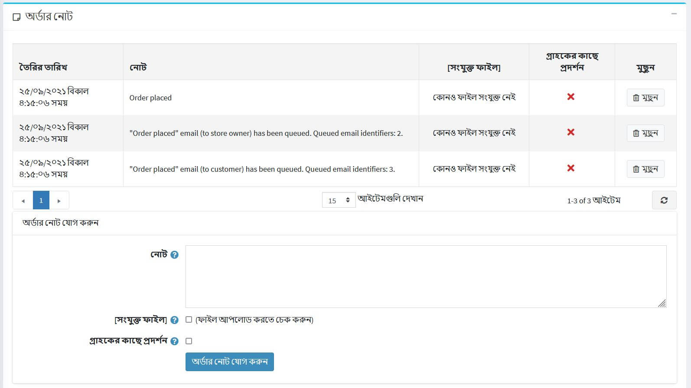

# অর্ডার

অর্ডার দেখতে এবং পরিচালনা করতে, **বিক্রয় → অর্ডার** এ যান। অর্ডার পৃষ্ঠায় সমস্ত বর্তমান অর্ডারের তালিকা রয়েছে। গ্রাহক একটি লেনদেন সম্পন্ন করার পর, অর্ডার পৃষ্ঠায় একটি নতুন অর্ডার উপস্থিত হয়।

পৃষ্ঠার শীর্ষ এলাকা একটি দোকানের মালিককে অর্ডার অনুসন্ধান করতে সক্ষম করে। নির্দিষ্ট অনুসন্ধানের মানদণ্ড লিখুন এবং দোকানে রাখা কোনও অর্ডার খুঁজে পেতে বিভিন্ন ধরণের ফিল্টার ব্যবহার করুন। যখন কোন অনুসন্ধান করা হয়, অনুসন্ধানের ফলাফল পর্দার নিচের অর্ধেক অংশে প্রদর্শিত হয়। অর্ডারের বিস্তারিত দেখতে আপনি **দেখুন** ক্লিক করতে পারেন।

## অর্ডারের জন্য অনুসন্ধান করুন

অর্ডার অনুসন্ধান করতে, নিম্নলিখিত অনুসন্ধান মানদণ্ডগুলির মধ্যে একটি বা একাধিক লিখুন:

* **শুরুর তারিখ** এবং **শেষ তারিখ** অর্ডার তৈরির সময়কাল নির্ধারণ করতে।
* **গুদাম** একটি নির্দিষ্ট গুদাম থেকে পণ্য দিয়ে অর্ডার লোড করতে।
* **পণ্য** - একটি পণ্যের নাম লিখুন
* **অর্ডারের অবস্থা** - নিচের যেকোন একটি নির্বাচন করুন:*সব*,*মুলতুবি*,*প্রক্রিয়াকরণ*,*সম্পূর্ণ*,*বাতিল*।
* **পেমেন্ট স্ট্যাটাস** - সার্চ করার জন্য একটি নির্দিষ্ট পেমেন্ট স্ট্যাটাস নির্বাচন করুন:
* **শিপিং স্ট্যাটাস** - সার্চ করার জন্য একটি নির্দিষ্ট শিপিং স্ট্যাটাস নির্বাচন করুন:*সব*,*শিপিংয়ের প্রয়োজন নেই*,*এখনো পাঠানো হয়নি*,*আংশিক পাঠানো*,*শিপড*,*ডেলিভার্ড*।
* **স্টোর** - একটি নির্দিষ্ট স্টোর সেট করুন যেখানে অর্ডার দেওয়া হয়েছিল।
* **বিক্রেতা** - একটি নির্দিষ্ট বিক্রেতা দ্বারা অনুসন্ধান করুন। আপনি একটি নির্দিষ্ট বিক্রেতা থেকে পণ্য সঙ্গে অর্ডার দেখতে পাবেন।
* **বিলিং ফোন নম্বর** - গ্রাহকের ফোন নম্বর।
* **বিলিং ইমেইল ঠিকানা** - গ্রাহকের ইমেইল ঠিকানা।
* **বিলিং শেষ নাম** - গ্রাহকের শেষ নাম।
* **বিলিং দেশ** - গ্রাহকের দেশ।
* **পেমেন্ট পদ্ধতি** - একটি নির্দিষ্ট পেমেন্ট পদ্ধতি সেট করুন যা চেকআউটের সময় ব্যবহৃত হয়েছিল।
* **অর্ডার নোট** - অর্ডার নোট অনুসন্ধান করুন। সমস্ত অর্ডার লোড করার জন্য খালি ছেড়ে দিন।
* **সরাসরি অর্ডার করতে যান** - অর্ডার নম্বর লিখুন এবং প্রয়োজনীয় অর্ডার প্রদর্শন করতে **যাও** ক্লিক করুন।

> [!NOTE]
>
> আপনি পৃষ্ঠার শীর্ষে **এক্সপোর্ট** বাটনে ক্লিক করে একটি বহিরাগত ফাইলে অর্ডার রপ্তানি করতে পারেন। **এক্সপোর্ট** বাটনে ক্লিক করার পর আপনি ড্রপডাউন মেনু দেখতে পাবেন যা আপনাকে এক্সপ্লের এক্সএমএল (সব পাওয়া) **অথবা এক্সপোর্ট এক্সএমএল (নির্বাচিত)** এবং **এক্সেল এক্সপোর্ট করতে (সব পাওয়া)** বা **এক্সেলে রপ্তানি করুন (নির্বাচিত)**।

## আদেশ বিবরণী

অর্ডারের সম্পূর্ণ তথ্য দেখতে, তালিকাতে অর্ডারের পাশে **দেখুন** ক্লিক করুন।

পিডিএফ -এ অর্ডারের চালান তৈরি করতে ডান উপরের কোণে **চালান (পিডিএফ)** বাটনে ক্লিক করুন। যদি আপনি অর্ডারটি মুছে ফেলতে চান তবে **মুছুন** ক্লিক করুন।

### তথ্য

**তথ্য** প্যানেলে একজন দোকান মালিক নিম্নলিখিত কাজ করতে পারেন:

* দেখুন **অর্ডার#** যা একটি অনন্য অর্ডার নম্বর।
* দেখুন **তৈরি করা** - তারিখ/সময় অর্ডার দেওয়া/তৈরি করা হয়েছিল।
*সেই **গ্রাহককে** দেখুন যিনি অর্ডার দিয়েছেন।
* দেখুন **অর্ডার স্ট্যাটাস**। অর্ডার স্থিতি *সম্পূর্ণ হবে* শুধুমাত্র একবার অর্থ প্রদানের স্থিতি *প্রদত্ত* এবং শিপিং স্থিতি *বিতরণ* এ সেট করা হবে। **চেঞ্জ স্ট্যাটাস** বাটনে ক্লিক করে অর্ডার স্ট্যাটাস ম্যানুয়ালি পরিবর্তন করা যায়। যাইহোক, এই বিকল্পটি শুধুমাত্র উন্নত ব্যবহারকারীদের জন্য সুপারিশ করা হয় কারণ এই ক্ষেত্রে সমস্ত উপযুক্ত কর্ম (যেমন ইনভেন্টরি অ্যাডজাস্টমেন্ট, নোটিফিকেশন ইমেইল পাঠানো, রিওয়ার্ড পয়েন্ট, গিফট কার্ড অ্যাক্টিভেশন/ডিঅ্যাক্টিভেশন ইত্যাদি) ম্যানুয়ালি করতে হবে।
* **আদেশ বাতিল**. একটি নিশ্চিতকরণ বার্তা প্রদর্শিত হবে, সিস্টেম থেকে আদেশটি সরানোর জন্য **হ্যাঁ** ক্লিক করুন।

> [!NOTE]
>
> যখন একজন গ্রাহক ম্যানুয়াল ক্রেডিট কার্ড পেমেন্ট পদ্ধতি ব্যবহার করেন, যা ডাটাবেসে ক্রেডিট কার্ডের তথ্য সংরক্ষণ করতে সক্ষম হয়, তখন একটি বোতাম **ক্রেডিট কার্ড সম্পাদনা করুন** দৃশ্যমান হয়। যদি অন্য কোন পেমেন্ট পদ্ধতি ব্যবহার করা হয়, এই বোতামটি দৃশ্যমান হবে না।

* দেখুন **অর্ডার সাবটোটাল**, **অর্ডার শিপিং**, **অর্ডার ট্যাক্স**, **অর্ডার মোট**, **লাভ**। আপনি যদি **অর্ডার টোটাল এডিট** বাটনে ক্লিক করেন তাহলে আপনি নিচের স্ক্রিনশটের মতো অর্ডার টোটাল এডিট করতে পারবেন:

* **এই অর্ডারের জন্য ব্যবহৃত** পেমেন্ট পদ্ধতি দেখুন।
* **পেমেন্ট স্ট্যাটাস দেখুন**। নিম্নলিখিতগুলির মধ্যে একটি হতে পারে: *মুলতুবি *, *অনুমোদিত*, *প্রদত্ত (ক্যাপচার)*, *ফেরত*, *আংশিকভাবে ফেরত*, অথবা *বাতিল*।

> [!NOTE]
>
> সমস্ত পেমেন্ট গেটওয়ে এই সমস্ত স্ট্যাটাস সমর্থন করে না। [পেমেন্ট পদ্ধতি](xref:bn/get-start/configure-payment/payment-methods/index) অধ্যায়ে পেমেন্ট পদ্ধতি সম্পর্কে আরও পড়ুন।

যদি পেমেন্ট স্ট্যাটাস *অনুমোদিত* হয় তবে প্রাসঙ্গিক বোতামগুলি **অকার্যকর** এবং **ক্যাপচার** অর্ডারে পাওয়া যাবে। **ক্যাপচার** গ্রাহকের কাছ থেকে তহবিল সংগ্রহ করতে ব্যবহৃত হয়। **অকার্যকর** এমন একটি আদেশ বাতিল করে যা ক্যাপচার করা হয়নি।

যদি পেমেন্টের স্থিতি *মুলতুবি* হয়, মালিক আদেশের জন্য পেমেন্ট জারি করা হয়েছে তা নির্দেশ করতে **পেমেন্ট হিসাবে চিহ্নিত করুন** ক্লিক করতে পারেন।

যদি পেমেন্ট স্ট্যাটাস *পেমেন্ট* **রিফান্ড** এবং **আংশিক ফেরত** বোতাম পাওয়া যাবে। **রিফান্ড** ক্লিক করার পরে একটি নিশ্চিতকরণ উইন্ডো প্রদর্শিত হবে। **আংশিক ফেরত** বাটনে ক্লিক করার পর *আংশিক ফেরত* উইন্ডো প্রদর্শিত হবে। এই উইন্ডোটি মালিককে মোট অর্ডারের কিছু অংশ ফেরত দিতে সক্ষম করে, যেমন:

 
	
* **এই স্টোরটি দেখুন** যেখানে এই অর্ডারটি রাখা হয়েছিল।
* অভ্যন্তরীণ ব্যবহারের জন্য প্রদর্শিত **অর্ডার GUID** দেখুন।
* দেখুন **গ্রাহক আইপি ঠিকানা** যা গ্রাহক অর্ডার দেওয়ার সময় ব্যবহার করেছিলেন।
 
### বিলিং এবং শিপিং

**বিলিং এবং শিপিং প্যানেলে**, প্রয়োজনে বিলিং এবং শিপিং তথ্য দেখুন এবং সম্পাদনা করুন।

* **বিলিং ঠিকানা** এবং **শিপিং ঠিকানা** দেখুন। ঐচ্ছিকভাবে আপনি প্রয়োজনীয় শিপিং ঠিকানা খুঁজে পেতে **গুগল ম্যাপে ঠিকানা দেখুন** লিঙ্কে ক্লিক করতে পারেন। বিলিং বা শিপিং অ্যাড্রেস এডিট করতে **এডিট** বাটনে ক্লিক করুন।
* প্রয়োজনে **শিপিং পদ্ধতি** দেখুন এবং সম্পাদনা করুন।
* **শিপিং স্ট্যাটাস দেখুন**।

> [!NOTE]
>
> দোকানের মালিকগণ প্রতি অর্ডার বিভিন্ন চালান তৈরি করতে পারেন। যদি আপনি একটি চালান তৈরি করেন কিন্তু সমস্ত পণ্য পাঠান না, তাহলে অর্ডারের শিপিং অবস্থা **আংশিকভাবে প্রেরিত**। একবার সমস্ত পণ্য প্রেরণ করা হলে, অবস্থাটি **শিপড** এ পরিবর্তিত হয়। একবার সমস্ত চালান বিতরণ করা হলে, স্থিতি পরিবর্তিত হয় **বিতরণ করা**।

**শিপমেন্ট** এর তালিকা দেখুন।
 
চালানের বিবরণ দেখতে পাশে **দেখুন** ক্লিক করুন। চালানের তথ্য জানালা প্রদর্শিত হবে:
 

**চালান যোগ করুন** বোতামটি প্রতি অর্ডারে বেশ কয়েকটি চালান তৈরি করতে সক্ষম হয় এবং অর্ডারে কমপক্ষে একটি অ-প্রেরিত পণ্য থাকলে দৃশ্যমান হয়। অর্ডারে একটি নতুন চালান যোগ করতে **শিপমেন্ট যোগ করুন** বাটনে ক্লিক করুন এবং আপনি দেখতে পাবেন **অর্ডারে একটি নতুন চালান যোগ করুন** উইন্ডো:
  
  
* **ট্র্যাকিং নম্বর** ফিল্ডে, চালানের ট্র্যাকিং নম্বর লিখুন। ট্র্যাকিং নম্বর আপনার গ্রাহকদের এবং আপনি আপনার শিপিং এজেন্ট (ডাকঘর, অথবা একটি ব্যক্তিগত কুরিয়ার পরিষেবা যেমন FedEx বা UPS) দ্বারা পরিচালিত টেলিফোন বা অনলাইন সিস্টেমের মাধ্যমে একটি চালানের অগ্রগতি পরীক্ষা করতে সক্ষম হন। যখন একটি চালান তার রুট ধরে নির্দিষ্ট পয়েন্ট অতিক্রম করে, এটি শিপিং এজেন্ট সিস্টেম দ্বারা চিহ্নিত করা হয়, এবং ট্র্যাকিং ডাটাবেস নতুন অবস্থান এবং সময়ের তথ্যের সাথে আপডেট করা হয়।
* প্রয়োজনে **অ্যাডমিন মন্তব্য** ক্ষেত্রটি পূরণ করুন।
* বর্তমান তারিখ ব্যবহার করে চালানটি শিপমেন্ট হিসাবে চিহ্নিত করার জন্য **শিপড** চেকবক্স চেক করুন।
* যদি আগের চেকবক্সে টিক দেওয়া হয় **বিতরণ করা** চেকবক্স পাওয়া যায়। বর্তমান তারিখ ব্যবহার করে চালান বিতরণ হিসাবে চিহ্নিত করতে এই চেকবক্সটিতে টিক দিন।
* **পণ্য পাঠানো** প্যানেলে: **জাহাজের পরিমাণ** কলামে, জাহাজে নির্দিষ্ট অর্ডার আইটেমের প্রয়োজনীয় পরিমাণ লিখুন।

### পণ্য

* **পণ্য** প্যানেলে একজন দোকানের মালিক করতে পারেন:
* **মূল্য, পরিমাণ এবং মোট মূল্য সহ পণ্যের তথ্য দেখুন**।
* পণ্যের বিস্তারিত পৃষ্ঠা দেখতে **পণ্যের নাম** লিঙ্কে ক্লিক করুন। যদি কোন প্রোডাক্ট ডাউনলোড করা যায় তাহলে ডাউনলোডের সংখ্যা রিসেট করতে **রিসেট করুন** অথবা **লাইসেন্স ফাইল আপলোড করুন** ক্লিক করুন। উপরন্তু, যখন কোনও পণ্যের *ডাউনলোড অ্যাক্টিভেশন টাইপ* *ম্যানুয়ালি* সেট করা হয়, তখন একজন অ্যাডমিনিস্ট্রেটর সাইট থেকে পণ্য ডাউনলোড করতে সক্ষম করতে **সক্রিয় করুন** অথবা ডাউনলোড অক্ষম করতে **নিষ্ক্রিয় করুন** ক্লিক করার বিকল্প থাকে সাইট থেকে পণ্য।
* সম্পাদনা করুন **পণ্য** **মূল্য**, **পরিমাণ**, **ছাড়** এবং **মোট**।
* **সিস্টেম থেকে একটি পণ্য মুছে** ফেলুন।
 
* **পণ্য যোগ করুন** ক্লিক করুন। তালিকা থেকে পণ্য নির্বাচন করুন। তারপরে, *অর্ডারে একটি নতুন পণ্য যুক্ত করুন* উইন্ডোতে প্রয়োজনীয় পণ্যটি সন্ধান করুন। তারপর প্রয়োজনীয় মান পূরণ করতে এগিয়ে যান এবং **পণ্য যোগ করুন** ক্লিক করুন। অর্ডারে নতুন প্রোডাক্ট যোগ করার পর অর্ডার টোটাল আপডেট করতে ভুলবেন না।
 

### অর্ডার নোট

* **অর্ডার নোট** প্যানেলে, দোকানের মালিক তথ্যের উদ্দেশ্যে অর্ডারে যোগ করা নোটগুলি দেখতে পারেন, নোট মুছে ফেলতে পারেন এবং নতুন নোট যোগ করতে পারেন। একটি নোটের একটি **সংযুক্ত ফাইল থাকতে পারে** এবং পাবলিক স্টোরে **একজন গ্রাহকের কাছে** প্রদর্শিত হতে পারে।

## আরো দেখুন

* [পণ্য যোগ করা](xref:bn/running-your-store/catalog/products/add-products)
* [শিপমেন্ট](xref:bn/running-your-store/order-management/shipping-management)
* [অর্ডার পরিচালনার জন্য ইউটিউব টিউটোরিয়াল](https://www.youtube.com/watch?v=z6TUJOO3gVg&index=5&list=PLnL_aDfmRHwsbhj621A-RFb1KnzeFxYz4)
