# ফেরতের অনুরোধ

রিটার্ন রিকোয়েস্ট ফিচার গ্রাহকদের পূর্বে কেনা আইটেমগুলিতে রিটার্নের অনুরোধ করতে সক্ষম করে। এগুলি আরএমএ অনুরোধ হিসাবেও পরিচিত। এই বিকল্পটি শুধুমাত্র সম্পূর্ণ অর্ডারের জন্য উপলব্ধ। রিটার্ন রিকোয়েস্ট সেটিংস **কনফিগারেশন → সেটিংস → অর্ডার সেটিংস** রিটার্ন রিকোয়েস্ট সেটিং প্যানেলে পরিচালিত হয়।

রিটার্ন রিকোয়েস্ট সক্ষম করতে **রিটার্ন সিস্টেম সক্ষম করুন** চেকবক্সে টিক দিন।
যখন এই বিকল্পটি সক্ষম করা হয়, একটি **রিটার্ন আইটেম (গুলি)** বোতামটি পাবলিক স্টোরে অর্ডার বিশদ পৃষ্ঠায় সম্পূর্ণ অর্ডারের জন্য প্রদর্শিত হয়।

রিটার্ন রিকোয়েস্ট সেটিংস বিভাগে এগিয়ে যেতে [এখানে](#return-request-settings) ক্লিক করুন ।

পরবর্তী বিভাগগুলিতে আমরা বর্ণনা করব কিভাবে রিটার্ন রিকোয়েস্ট ফাংশনটি আপনার গ্রাহকরা ব্যবহার করতে পারেন এবং কিভাবে অ্যাডমিন এলাকায় রিটার্ন রিকোয়েস্ট ম্যানেজ করবেন।

## ফেরতের অনুরোধ জমা দিন

রিটার্নের অনুরোধ জমা দেওয়ার জন্য, একজন গ্রাহককে নিম্নলিখিত পদক্ষেপগুলি নিতে হবে:

১। পাবলিক স্টোরে,*আমার অ্যাকাউন্ট* উইন্ডোতে যান এবং **অর্ডার** ক্লিক করুন। নিম্নলিখিত পৃষ্ঠা প্রদর্শিত হবে: 
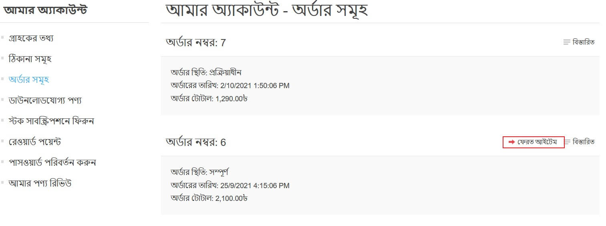

২। সম্পূর্ণ অর্ডারের পাশে **ফেরত আইটেম (গুলি)** বাটনে ক্লিক করুন যা ফেরত দিতে হবে। অর্ডার# *উইন্ডো থেকে* রিটার্ন আইটেম (গুলি) প্রদর্শিত হয়, যেমন নিম্নলিখিত উদাহরণে দেখানো হয়েছে:
  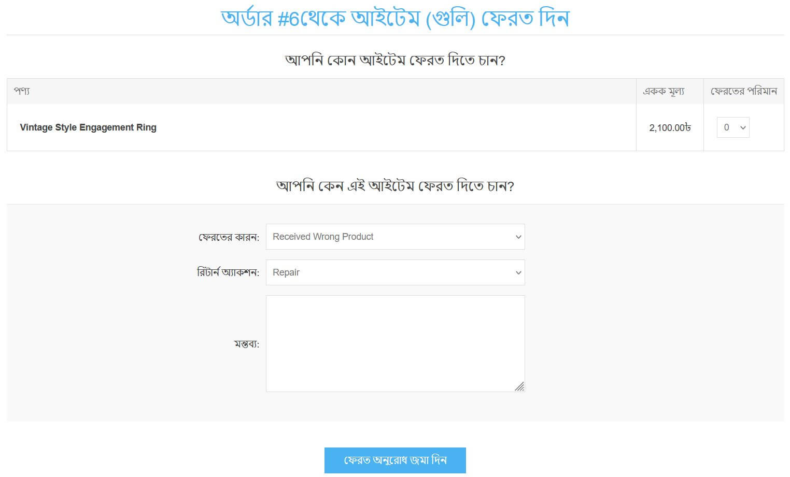

* **ফেরার পরিমাণ** ড্রপডাউন তালিকাটি ফেরত দেওয়া আইটেমের সংখ্যা নির্বাচন করার অনুমতি দেয়।
  * **রিটার্ন কারণ** ড্রপডাউন তালিকা একটি রিটার্ন অনুরোধ করার কারণ নির্বাচন করার অনুমতি দেয়। উদাহরণস্বরূপ, ভুল পণ্য অর্ডার করা, ভুল পণ্য পাওয়া এবং আরও অনেক কিছু । [নীচে](#return-request-settings) পড়ুন কিভাবে রিটার্নের কারণগুলি পরিচালনা করবেন।
* **রিটার্ন অ্যাকশন** ড্রপডাউন তালিকাটি প্রয়োজনীয় রিটার্ন অ্যাকশন বেছে নেওয়ার অনুমতি দেয়। উদাহরণস্বরূপ, পণ্য মেরামত, পণ্য প্রতিস্থাপন, ক্রেডিট ইস্যু ইত্যাদি। [নীচে](#return-request-settings) পড়ুন কিভাবে রিটার্ন অ্যাকশন ম্যানেজ করতে হয়।
  * যদি আপনি আপনার অনুরোধে কিছু অতিরিক্ত নথি বা ছবি সংযুক্ত করতে চান তবে **একটি ফাইল আপলোড করুন** বিকল্পটি ব্যবহার করুন।

  > [!NOTE]
  >
  > এই বিকল্পটি তখনই পাওয়া যায় যখন **ফাইল আপলোডের অনুমতি দিন** চেকবক্স চেক করা হয়। কীভাবে এটি সেট আপ করবেন তা পড়ুন [নীচে](#return-request-settings)।

* **কমেন্টস** ফিল্ডে, একজন গ্রাহক তথ্যের উদ্দেশ্যে একটি চ্ছিক মন্তব্য দিতে পারেন।
৩। **রিটার্ন রিকোয়েস্ট** ফিচার ব্যবহার করার পর, গ্রাহক পাবলিক স্টোরে *আমার অ্যাকাউন্ট* পৃষ্ঠা থেকে তৈরি রিটার্ন রিকোয়েস্ট এবং এর স্ট্যাটাস দেখতে পাবেন রিটার্ন ।
  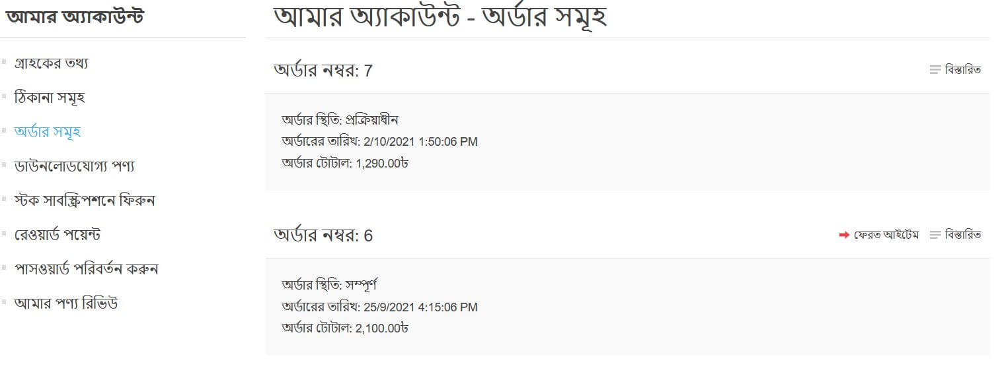

## ফেরত অনুরোধগুলি পরিচালনা করুন

দোকান মালিক এখন প্রশাসন এলাকায় এই রিটার্ন অনুরোধটি পরিচালনা করতে পারেন।

রিটার্ন রিকোয়েস্ট দেখতে এবং এডিট করতে **সেলস → রিটার্ন রিকোয়েস্ট** এ যান। সমস্ত প্রত্যাবর্তন অনুরোধ প্রদর্শিত হবে, নিম্নরূপ:
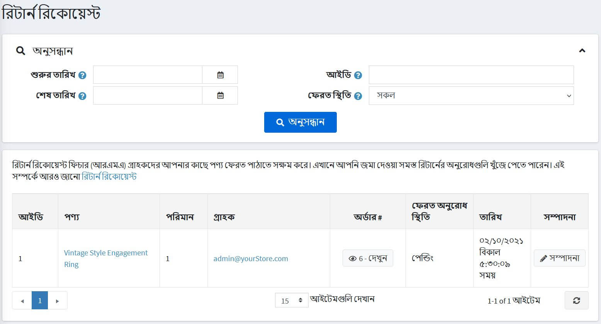

রিটার্ন রিকুয়েস্টের পাশে **এডিট করুন** এ ক্লিক করুন, *রিটার্ন রিকোয়েস্টের বিবরণ এডিট করুন* উইন্ডো প্রদর্শিত হবে:
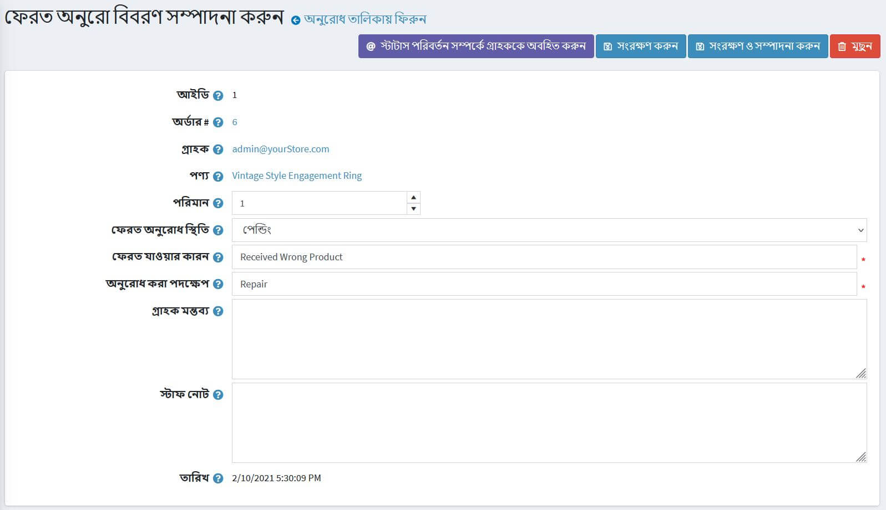

দোকান প্রশাসককে অনুমতি দেওয়া হয়েছে:

* রিটার্ন রিকুয়েস্ট দেখুন **আইডি**।
* দেখুন **অর্ডার#**। অর্ডার নম্বরে ক্লিক করলে সংশ্লিষ্ট অর্ডার বিশদ পৃষ্ঠায় পুননির্দেশিত হয়।
* **গ্রাহক** দেখুন। গ্রাহক ইমেইলে ক্লিক করলে সংশ্লিষ্ট গ্রাহক বিবরণ পৃষ্ঠায় পুননির্দেশিত হয়।
* **প্রোডাক্ট** দেখুন। পণ্যের নামের উপর ক্লিক করলে সংশ্লিষ্ট পণ্যের বিবরণ পৃষ্ঠায় পুননির্দেশিত হয়।
* ফেরত পণ্যের **পরিমাণ** লিখুন।
* **রিটার্ন রিকোয়েস্ট স্ট্যাটাস নির্বাচন করুন**:
  * *বিচারাধীন*
  * *প্রাপ্ত*
  * *রিটার্ন অনুমোদিত*
  * *আইটেম (গুলি) মেরামত করা হয়েছে*
  * *আইটেম (গুলি) ফেরত দেওয়া হয়েছে*
  * *অনুরোধ প্রত্যাখ্যাত*
  * *বাতিল করা হয়েছে*

* রিটার্নের কারণ** ফিল্ডে, প্রয়োজনে রিটার্নের কারণ সম্পাদনা করুন।
* **অনুরোধকৃত অ্যাকশন** ফিল্ডে, প্রয়োজনে অনুরোধকৃত ক্রিয়া সম্পাদনা করুন।
* **গ্রাহক মন্তব্য** ক্ষেত্রের মধ্যে, প্রয়োজনে গ্রাহকের দেওয়া মন্তব্য সম্পাদনা করুন।
* **স্টাফ নোটস** ফিল্ডে, তথ্যের উদ্দেশ্যে একটি ঐচ্ছিক নোট লিখুন। এই নোটগুলি গ্রাহকের কাছে প্রদর্শিত হবে না।
* রিটার্নের অনুরোধ জমা দেওয়ার সময় **তারিখ** দেখুন।

> [!NOTE]
>
> রিটার্ন রিকোয়েস্ট স্ট্যাটাস পরিবর্তনের কথা জানিয়ে গ্রাহককে একটি ইমেইল পাঠাতে **গ্রাহককে স্ট্যাটাস পরিবর্তন সম্পর্কে অবহিত করুন** বোতামে ক্লিক করুন। 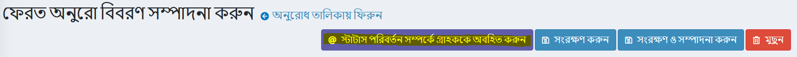

## রিটার্ন রিকোয়েস্ট সেটিংস

রিটার্ন রিকোয়েস্ট সেটিংস সংজ্ঞায়িত করতে, **কনফিগারেশন → সেটিংস → অর্ডার সেটিংস** এ যান।

এই পৃষ্ঠাটি মাল্টি-স্টোর কনফিগারেশন সক্ষম করে, এর মানে হল যে একই স্টোরিং সকল স্টোরের জন্য সংজ্ঞায়িত করা যেতে পারে, অথবা স্টোর থেকে স্টোরে আলাদা হতে পারে। আপনি যদি একটি নির্দিষ্ট দোকানের জন্য সেটিংস পরিচালনা করতে চান, মাল্টি-স্টোর কনফিগারেশন ড্রপ-ডাউন তালিকা থেকে তার নামটি চয়ন করুন এবং তাদের জন্য কাস্টম মান নির্ধারণ করতে বাম পাশে সমস্ত প্রয়োজনীয় চেকবক্সে টিক দিন। আরও তথ্যের জন্য [মাল্টি-স্টোর](xref:bn/getting-start/advanced-configuration/multi-store) পড়ুন।

*রিটার্ন রিকোয়েস্ট সেটিংস* প্যানেলে যান:
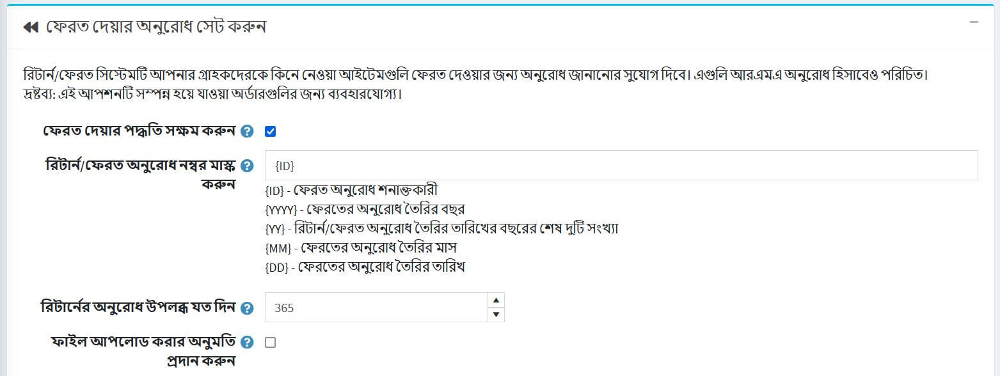

এই প্যানেলে আপনি সংজ্ঞায়িত করতে পারেন:

* থেকে **রিটার্ন সিস্টেম সক্ষম করুন**, আপনার গ্রাহকদের ক্রয়কৃত আইটেমের জন্য রিটার্নের অনুরোধ জমা দিতে সক্ষম করতে।
* ক্ষেত্রের মধ্যে **রিটার্ন রিকোয়েস্ট নম্বর মাস্ক** প্রয়োজন হলে কাস্টম রিটার্ন রিকুয়েস্ট নম্বর উল্লেখ করুন।
* **রিটার্ন রিকোয়েস্ট পাওয়া দিনের সংখ্যা**, রিটার্ন রিকোয়েস্ট লিংক কাস্টমার এরিয়াতে কত দিন পাওয়া যাবে তা নির্ধারণ করতে।
  > [!TIP]
  >
  > উদাহরণস্বরূপ, যদি দোকানের মালিক কেনার ৩০ দিনের মধ্যে ফেরত দেওয়ার অনুমতি দেয়, এই ক্ষেত্রটি ৩০ এ সেট করা হবে। **রিটার্ন আইটেম (গুলি)** বোতাম।

*রিটার্ন রিকুয়েস্ট জমা দেওয়ার সময় আপনি যদি ফাইল আপলোড করার অনুমতি দিতে চান তবে **ফাইল আপলোডের অনুমতি দিন** চেকবক্সে টিক দিন। এই বিকল্পটি বিশেষ করে গ্রাহকদের জন্য দরকারী যারা তাদের অর্ডারে কিছু সমস্যার সম্মুখীন হয়েছে, যেমন ক্ষতিগ্রস্ত আইটেম বা ভুল পণ্য গ্রহণ ইত্যাদি।

### রিটার্ন অনুরোধের কারণ

এই প্যানেলটি একটি তালিকা উপস্থাপন করে যে কোন গ্রাহক রিটার্নের অনুরোধ জমা দেওয়ার সময় বেছে নিতে পারেন।
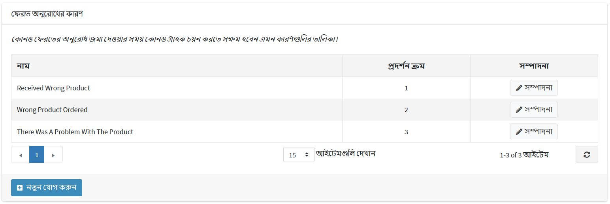

একটি নতুন অনুরোধের কারণ যুক্ত করতে **নতুন যোগ করুন** ক্লিক করুন। *নতুন রিটার্ন অনুরোধের কারণ যুক্ত করুন* উইন্ডোটি নিম্নরূপ প্রদর্শিত হবে:
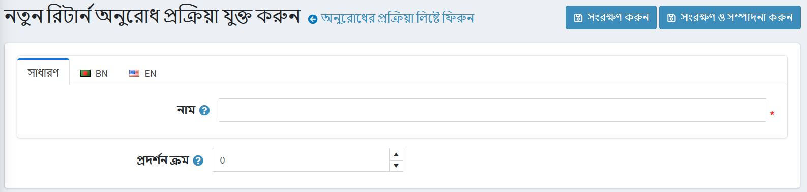

রিটার্ন অনুরোধের কারণ লিখুন **নাম** এবং **ডিসপ্লে অর্ডার** নম্বর (১ তালিকার প্রথম আইটেমটি প্রতিনিধিত্ব করে)। পরিবর্তনগুলি সংরক্ষণ করতে **সংরক্ষণ** ক্লিক করুন।

### রিটার্ন রিকোয়েস্ট অ্যাকশন

এই প্যানেল কর্মের একটি তালিকা উপস্থাপন করে যা গ্রাহক রিটার্নের অনুরোধ জমা দেওয়ার সময় বেছে নিতে পারেন।
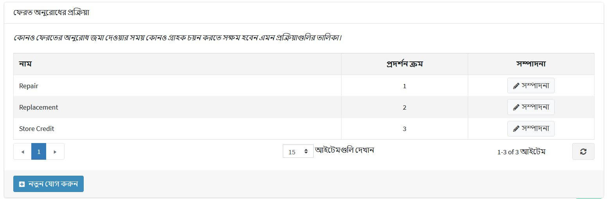

একটি নতুন রিকোয়েস্ট অ্যাকশন যোগ করতে **নতুন যোগ করুন** ক্লিক করুন। *নতুন রিটার্ন রিকোয়েস্ট অ্যাকশন যোগ করুন* উইন্ডোটি নিম্নরূপ প্রদর্শিত হবে:
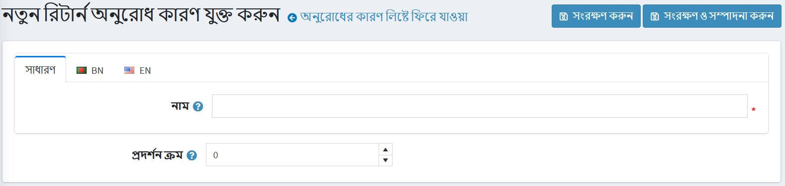

রিটার্ন রিকোয়েস্ট অ্যাকশন লিখুন **নাম** এবং **ডিসপ্লে অর্ডার** নম্বর (১ তালিকার প্রথম আইটেমটি উপস্থাপন করে)। পরিবর্তনগুলি সংরক্ষণ করতে **সংরক্ষণ** ক্লিক করুন।

## আরো দেখুন

* [ইউটিউব টিউটোরিয়াল: রিটার্ন রিকুয়েস্ট ম্যানেজ করা](https://www.youtube.com/watch?v=VqF2GZ2ip_0&list=PLnL_aDfmRHwsbhj621A-RFb1KnzeFxYz4&index=17)
* [অর্ডার সেটিংস](xref:bn/running-your-store/order-management/order-settings)
* [অর্ডার](xref:bn/running-your-store/order-management/orders)