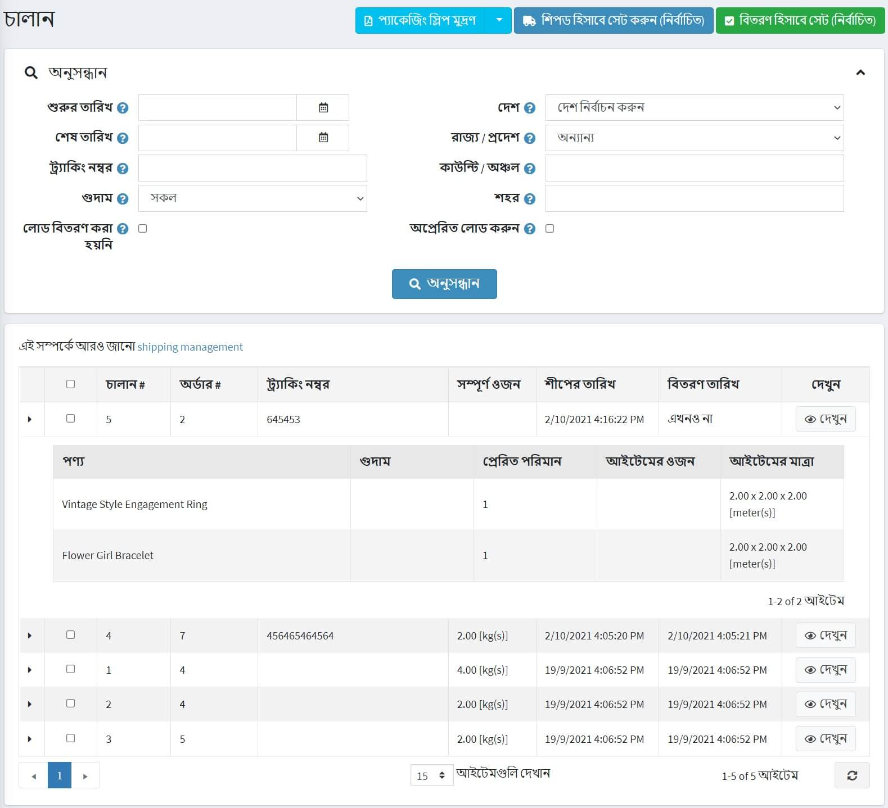
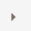
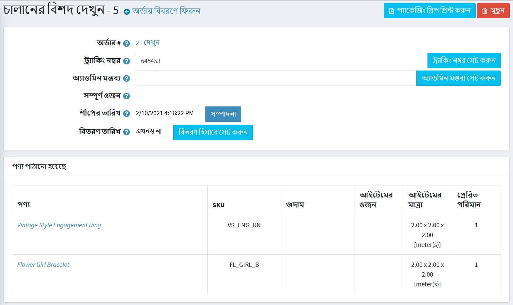

# শিপিং ব্যবস্থাপনা

শিপমেন্ট অনুসন্ধান এবং দেখার জন্য **বিক্রয় → শিপমেন্ট** এ যান।

## চালানের তালিকা

পৃষ্ঠার শীর্ষ এলাকা আপনাকে বিভিন্ন অনুসন্ধান মানদণ্ড অনুসারে একটি চালান অনুসন্ধান করতে সক্ষম করে:

* এই তারিখগুলির মধ্যে তৈরি চালানের জন্য **শুরুর তারিখ** এবং **শেষ তারিখ**।
* যদি আপনি একটি নির্দিষ্ট ট্র্যাকিং নম্বর দিয়ে চালান খুঁজে পেতে চান তবে **ট্র্যাকিং নম্বর** লিখুন।
* একটি নির্দিষ্ট গুদাম থেকে পাঠানো চালানের জন্য **গুদাম** নির্বাচন করুন।
* যদি আপনি ইতিমধ্যে বিতরণ করা আইটেমগুলি লোড করতে না চান তবে **লোড বিতরণ** চেকবক্সে ক্লিক করুন।
* একটি চালান গন্তব্য অনুসন্ধানের জন্য **দেশ, রাজ্য/প্রদেশ, কাউন্টি/অঞ্চল, শহর** ব্যবহার করুন।
* যদি আপনি ইতিমধ্যেই প্রেরিত আইটেমগুলি লোড করতে না চান তবে **লোড না পাঠানো** চেকবক্স ক্লিক করুন।

নির্দিষ্ট শিপমেন্টগুলিকে **পাঠানো হিসাবে সেট করুন (নির্বাচিত)** অথবা **বিতরণ হিসাবে সেট করুন (নির্বাচিত)**। প্যাকেজিং রসিদ প্রিন্ট করতে আপনি **প্যাকেজিং স্লিপ (নির্বাচিত)** অথবা **মুদ্রণ প্যাকেজিং স্লিপ (সব)** করতে পারেন।

চালানের তালিকায়, একটি দোকানের মালিক চালানের প্রথম কলামে  এ ক্লিক করে একটি চালানের সমস্ত আইটেম দেখতে পারেন।

## চালান বিবরণ

**ভিউ** এ ক্লিক করলে,*শিপমেন্টের বিবরণ দেখুন* উইন্ডো খোলা হবে, নিম্নরূপ:

এই উইন্ডোতে আপনি করতে পারেন:

* অর্ডারে এগিয়ে যান।
* চালানের জন্য একটি **ট্র্যাকিং নম্বর** সেট করুন।
* অভ্যন্তরীণ ব্যবহারের জন্য একটি **অ্যাডমিন মন্তব্য** যোগ করুন।
* **চালানের মোট ওজন** দেখুন।
* চালানটি **শিপড** হিসাবে চিহ্নিত করুন।
* **সম্পাদিত তারিখ** সম্পাদনা করুন।
* চালানকে **বিতরণ করা** হিসাবে চিহ্নিত করুন।
* **বিতরণ তারিখ** সম্পাদনা করুন।
* **প্যাকেজিং স্লিপ প্রিন্ট করুন**।
* **চালান মুছুন**।

## শিপিং সেটিংস

শিপিং সেট আপ করার জন্য [কনফিগার শিপিং](xref:bn/getting-start/configure-shipping/index) বিভাগে যান।

## আরো দেখুন

* [অর্ডার](xref:bn/running-your-store/order-management/orders)
* [পণ্য যোগ করা](xref:bn/running-your-store/catalog/products/add-products)
