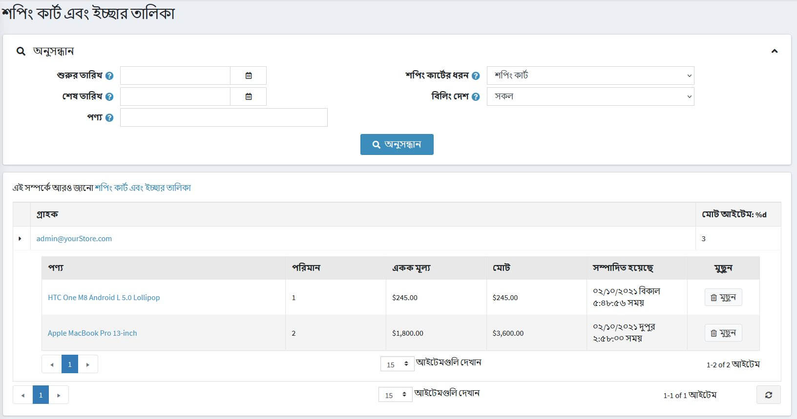
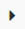
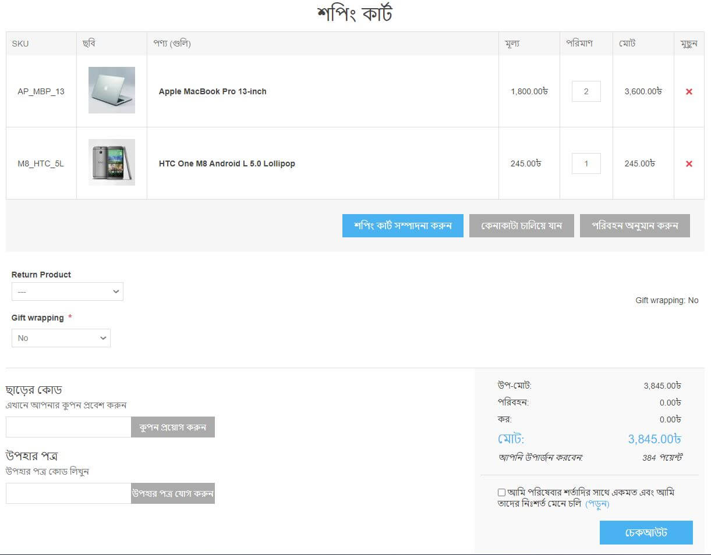
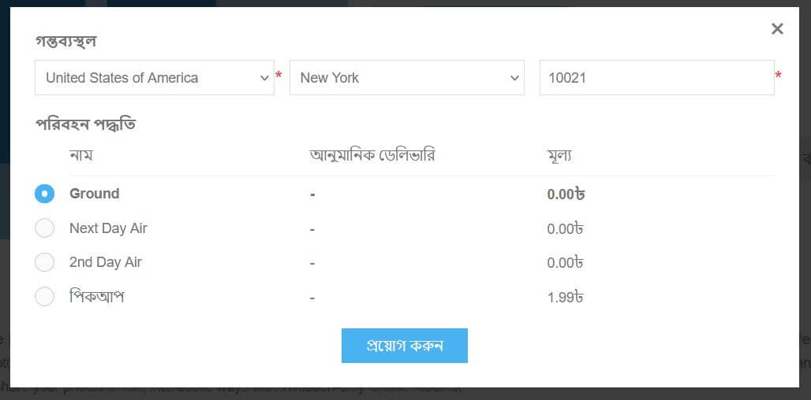
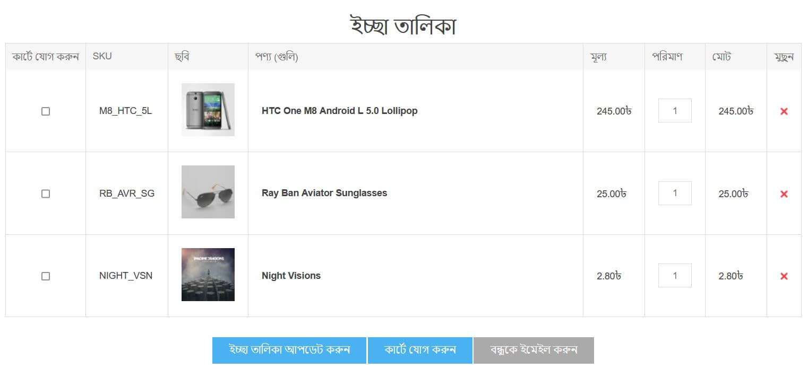
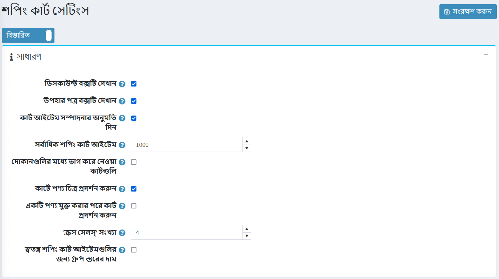
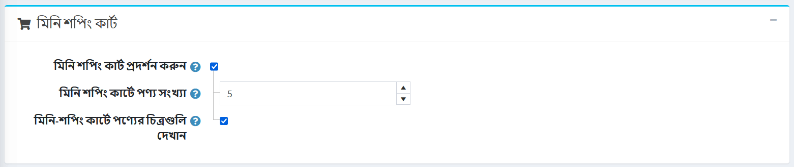
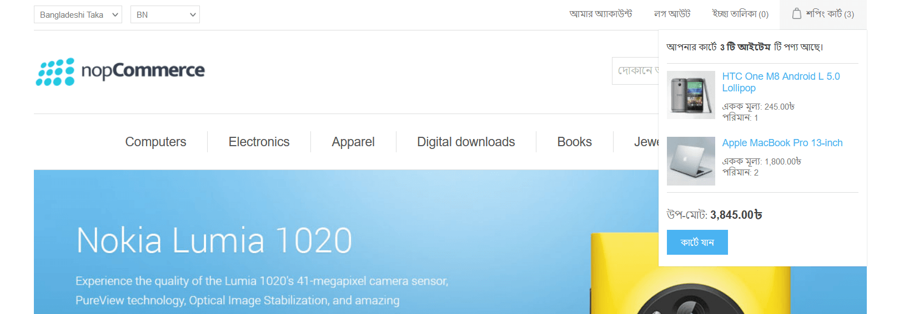
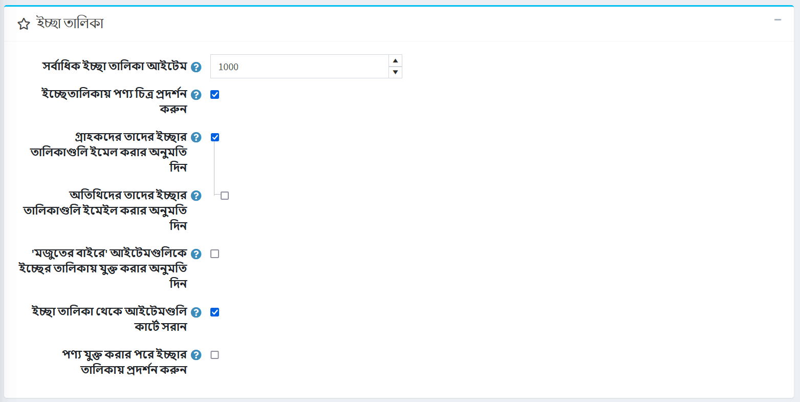

# শপিং কার্ট এবং ইচ্ছা তালিকা

"শপিং কার্টস এবং উইশলিস্টস" বিভাগটি দোকান মালিকদের সমস্ত বিদ্যমান শপিং কার্ট এবং সমস্ত গ্রাহকদের এবং সমস্ত স্টোর থেকে এক পৃষ্ঠায় থাকা তালিকা দেখতে সক্ষম করে। এই পৃষ্ঠাটি অ্যাক্সেস করতে **বিক্রয় → শপিং কার্ট এবং ইচ্ছা তালিকা** এ যান।

পৃষ্ঠার শীর্ষে *অনুসন্ধান* এলাকায় পছন্দসই **শপিং কার্টের ধরন নির্বাচন করুন**: *শপিং কার্ট* অথবা *উইশলিস্ট* ।

আপনি প্রথম কলামে নিম্নলিখিত আইকনে ক্লিক করে পণ্যগুলি প্রসারিত করতে পারেন: .

তালিকা থেকে, আপনি গ্রাহক লিঙ্কে ক্লিক করে গ্রাহক বিবরণ পৃষ্ঠায় যেতে পারেন। আপনি পণ্যের নামের উপর ক্লিক করে সম্পাদনা পণ্যের বিবরণ পৃষ্ঠাটি দেখতে পারেন অথবা **মুছে ফেলুন** বাটনে ক্লিক করে পণ্যটি কার্ট থেকে মুছে ফেলতে পারেন।

## বাজারের ব্যাগ

* শপিং কার্ট টাইপ **বিক্রয় → শপিং কার্ট এবং উইশলিস্টের** ড্রপডাউন তালিকা থেকে **শপিং কার্ট নির্বাচন করুন এবং শপিং কার্টের তালিকা দেখতে** **সার্চ** ক্লিক করুন। এই তালিকায় এমন সব পণ্য রয়েছে যা কার্টে রাখা হয়েছিল, কিন্তু কেনা হয়নি।

নিচের স্ক্রিনশটটি দেখায় কিভাবে একজন গ্রাহক পাবলিক স্টোরে একটি শপিং কার্ট পৃষ্ঠা দেখেন:

শপিং কার্ট পৃষ্ঠায় কয়েকটি উপাদান রয়েছে। প্রয়োজনে তাদের মধ্যে কিছু অক্ষম করা যেতে পারে:

১। **সরান** কলামের বোতামটি শপিং কার্ট থেকে একটি আইটেম সরানোর অনুমতি দেয়।

২। **শপিং কার্ট আপডেট করুন** বোতামটি একজন গ্রাহককে **পরিমাণ** ক্ষেত্রের মধ্যে উপযুক্ত নম্বর প্রবেশ করিয়ে পণ্যের পরিমাণ পরিবর্তন করতে দেয়।

৩। **কেনাকাটা চালিয়ে যান** বোতামটি একজন গ্রাহককে ক্যাটালগের দিকে এগিয়ে যেতে দেয়।

৪। **এস্টিমেট শিপিং** বাটন গ্রাহককে শিপিং অনুমান করতে দেয়। এই বাটনে ক্লিক করার পর নিচের পপআপ উইন্ডোটি প্রদর্শিত হবে:

  
  এই উইন্ডোতে, গ্রাহক শিপিং ঠিকানা প্রবেশ করতে পারেন এবং উপযুক্ত শিপিং বিকল্পগুলি দেখতে পারেন।
  আপনি **কনফিগারেশন → সেটিংস → শিপিং সেটিংস** পৃষ্ঠায় **আনুমানিক শিপিং সক্ষম (কার্ট পৃষ্ঠা)** চেকবক্সটি আনচিক করে শপিং কার্ট পৃষ্ঠায় শিপিং অনুমান অক্ষম করতে পারেন।

১। আপনি উপরে দেওয়া শপিং কার্টের স্ক্রিনশটে **উপহার মোড়ানো** ড্রপডাউন দেখতে পারেন। এটি একটি চেকআউট বৈশিষ্ট্য। [চেকআউট গুণাবলী](xref:bn/running-your-store/order-management/checkout-attributes) অধ্যায়ে চেকআউট বৈশিষ্ট্যগুলি কীভাবে পরিচালনা করবেন তা আরও পড়ুন।

২।  **ডিসকাউন্ট কোড** বিভাগটি একজন গ্রাহককে একটি ছাড় কোড লিখতে দেয়। আপনি **কনফিগারেশন → সেটিংস → শপিং কার্ট সেটিংস** পৃষ্ঠায় **ডিসকাউন্ট বক্স** চেকবক্স আনচিক করে এটি অক্ষম করতে পারেন। [ডিসকাউন্ট](xref:bn/running-your-store/promotional-tools/discount) অধ্যায়ে ছাড় সম্পর্কে আরও পড়ুন।

৩। **উপহার কার্ড** বিভাগ গ্রাহককে একটি উপহার কার্ড ব্যবহার করতে দেয়। আপনি **কনফিগারেশন → সেটিংস → শপিং কার্ট সেটিংস** পৃষ্ঠায় **উপহার কার্ড বক্স দেখান** চেকবক্সটি টিক চিহ্ন দিয়ে এটি অক্ষম করতে পারেন। [উপহার কার্ড](xref:bn/running-your-store/promotional-tools/gift-cards) অধ্যায়ে উপহার কার্ড সম্পর্কে আরও পড়ুন।

৪। শপিং কার্ট টোটাল বিভাগে একজন গ্রাহক শিপিং ফি দেখে। [কনফিগার শিপিং](xref:bn/getting-start/configure-shipping/index) বিভাগে শিপিং কিভাবে সেট আপ করবেন তা পড়ুন।

৫। একই বিভাগে একজন গ্রাহক কর তথ্য দেখেন। [কনফিগার কর](xref:bn/get-start/configure-tax/index) বিভাগে কিভাবে ট্যাক্স সেট করবেন তা পড়ুন।

৬। একই বিভাগে একজন গ্রাহক দেখেন কত পুরস্কার পয়েন্ট অর্জন করা হবে। [রিওয়ার্ড পয়েন্ট](xref:bn/running-your-store/promotional-tools/reward-points) বিভাগে কিভাবে রিওয়ার্ড পয়েন্ট সেট করবেন তা পড়ুন।

৭। একই বিভাগে একজন গ্রাহক সেবার শর্তাবলী দেখে। আপনি **পরিষেবার শর্তাবলী (শপিং কার্ট পৃষ্ঠা)** চেকবক্সটি **কনফিগারেশন → সেটিংস → অর্ডার সেটিংস** পৃষ্ঠায় টিক চিহ্ন দিয়ে এটি অক্ষম করতে পারেন।

> [!NOTE]
>
> যদি আপনি কোন গ্রাহককে একটি শপিং কার্টে একটি নির্দিষ্ট পণ্য যোগ করতে না দিতে চান তবে পণ্য সম্পাদনা পৃষ্ঠার *মূল্য* প্যানেলে **বিক্রয় বোতাম অক্ষম করুন** চেকবক্সে টিক দিন। [প্রোডাক্ট যুক্ত করুন](xref:bn/running-your-store/catalog/products/add-products) অধ্যায়ে একটি প্রোডাক্ট যুক্ত করার বিষয়ে আরও পড়ুন।
> [!NOTE]
>
> প্লাগইনগুলির জন্য আমাদের [মার্কেটপ্লেস](http://www.nopcommerce.com/marketplace) দেখুন যা আপনাকে পরিত্যক্ত গাড়ি পরিচালনা করতে এবং হারানো বিক্রয় পুনরুদ্ধার করতে সহায়তা করে।

## ইচ্ছেতালিকা

* শপিং কার্ট টাইপ **সেলস → শপিং কার্টস এবং উইশলিস্ট** পৃষ্ঠায় ড্রপডাউন তালিকা থেকে *উইশলিস্ট* অপশনটি নির্বাচন করুন এবং উইশলিস্ট দেখতে **সার্চ** ক্লিক করুন।

একটি উইশলিস্ট এমন পণ্যগুলির একটি তালিকা যা গ্রাহক বন্ধুদের সাথে ভাগ করতে পারেন, অথবা পরে কার্টে স্থানান্তর করতে সংরক্ষণ করতে পারেন। যদি কোনও পণ্যের জন্য একটি উইশলিস্ট যোগ করা সক্ষম হয়, তবে পাবলিক স্টোরের পণ্যের বিবরণ পৃষ্ঠায় **ইচ্ছার তালিকায় যোগ করুন** বোতামটি উপস্থিত হয়। যখন বিভিন্ন ভেরিয়েন্টের একটি পণ্য একটি ইচ্ছা তালিকায় যোগ করা হয়, একটি গ্রাহক দ্বারা নির্বাচিত সমস্ত ভেরিয়েন্ট ইচ্ছার তালিকায় অন্তর্ভুক্ত করা হয়।

> [!TIP]
>
> উদাহরণস্বরূপ, যদি একজন গ্রাহক একই শার্ট যোগ করেন, কিন্তু ২ টি ভিন্ন রঙে, প্রতিটি শার্ট ইচ্ছা তালিকায় একটি পৃথক আইটেম হিসাবে উপস্থিত হয়। যদি গ্রাহক একই পণ্যকে একাধিকবার ইচ্ছার তালিকায় যুক্ত করেন, তাহলে পণ্যটি একবারই প্রদর্শিত হয়, কিন্তু একটি আপডেট করা পরিমাণের সাথে যা পণ্যটি যুক্ত হওয়ার সংখ্যা প্রতিফলিত করে।

নিচের স্ক্রিনশটটি দেখায় কিভাবে একজন গ্রাহক পাবলিক স্টোরে একটি ইচ্ছার তালিকা পৃষ্ঠা দেখেন:

ইচ্ছা তালিকা পৃষ্ঠায় কয়েকটি উপাদান রয়েছে:

১। **সরান** কলামের বোতামটি ইচ্ছা তালিকা থেকে একটি আইটেম সরানোর অনুমতি দেয়।

২।  **আপডেট উইশলিস্ট** বোতামটি একজন গ্রাহককে **Qty** ক্ষেত্রের মধ্যে উপযুক্ত নম্বর লিখে একটি পণ্যের পরিমাণ পরিবর্তন করতে দেয়।

৩। **কার্টে যুক্ত করুন** বোতামটি গ্রাহককে নির্বাচিত পণ্যগুলি কার্টে যুক্ত করতে দেয়।

৪। একটি **বন্ধুকে ইমেইল করুন** বোতামটি গ্রাহককে ইমেইলের মাধ্যমে বন্ধুকে ইচ্ছার তালিকা পাঠাতে দেয়। আপনি **কনফিগারেশন → সেটিংস → শপিং কার্ট সেটিংস** পৃষ্ঠায় **গ্রাহকদের তাদের ইচ্ছা তালিকা ইমেল করার** চেকবক্সটি আনক্লিক করে এটি অক্ষম করতে পারেন।

৫। শেয়ার করার জন্য **আপনার ইচ্ছার তালিকা ইউআরএল** একজন গ্রাহককে ইচ্ছা তালিকা শেয়ার করার অনুমতি দেয়।

> [!NOTE]
>
> যদি আপনি কোন গ্রাহককে একটি নির্দিষ্ট পণ্যের একটি ইচ্ছার তালিকায় যোগ করতে না দিতে চান তবে পণ্য সম্পাদনা পৃষ্ঠার *মূল্য* প্যানেলে **অক্ষম ইচ্ছা তালিকা বোতাম** চেকবক্সে টিক দিন। [প্রোডাক্ট যুক্ত করুন](xref:bn/running-your-store/catalog/products/add-products) অধ্যায়ে একটি প্রোডাক্ট যুক্ত করার বিষয়ে আরও পড়ুন।

## শপিং কার্ট এবং ইচ্ছা তালিকা সেটিংস

শপিং কার্ট এবং ইচ্ছা তালিকা সেটিংস পরিবর্তন করতে **কনফিগারেশন → সেটিংস → শপিং কার্ট সেটিংস** পৃষ্ঠায় যান।

এই পৃষ্ঠাটি মাল্টি-স্টোর কনফিগারেশন সক্ষম করে, এর মানে হল যে একই স্টোরিং সকল স্টোরের জন্য সংজ্ঞায়িত করা যেতে পারে, অথবা স্টোর থেকে স্টোরে আলাদা হতে পারে। আপনি যদি একটি নির্দিষ্ট দোকানের জন্য সেটিংস পরিচালনা করতে চান, মাল্টি-স্টোর কনফিগারেশন ড্রপ-ডাউন তালিকা থেকে তার নামটি চয়ন করুন এবং তাদের জন্য কাস্টম মান নির্ধারণ করতে বাম পাশে সমস্ত প্রয়োজনীয় চেকবক্সে টিক দিন। আরও তথ্যের জন্য [মাল্টি-স্টোর](xref:bn/get-start/advanced-configuration/multi-store) পড়ুন।

### সাধারন বিন্যাস

*সাধারণ* প্যানেলে আপনি সংজ্ঞায়িত করতে পারেন:

* **ডিসকাউন্ট বক্স দেখান** শপিং কার্ট পৃষ্ঠায় ডিসকাউন্ট কুপন বক্স প্রদর্শন করা।
* **উপহার কার্ড বক্স দেখান** শপিং কার্ট পৃষ্ঠায় উপহার কার্ড বাক্স প্রদর্শন করা।
* **কার্ট আইটেম সম্পাদনার অনুমতি দিন**, গ্রাহকদের কার্টে আইটেম সম্পাদনা করতে সক্ষম করতে। এই বৈশিষ্ট্যটি দরকারী যখন পণ্যগুলির মূল্য গ্রাহকদের দ্বারা প্রবেশ করা হয়।
* **সর্বাধিক শপিং কার্ট আইটেম** - শপিং কার্টে সর্বাধিক সংখ্যক পণ্য যুক্ত করার অনুমতি দেওয়া হয়েছে।
* স্টোরের মধ্যে শপিং কার্ট (এবং ইচ্ছা তালিকা) শেয়ার করার জন্য **দোকানের মধ্যে ভাগ করা কার্টস** চেকবক্স নির্বাচন করুন।
* **কার্টে পণ্যের ছবি দেখান**, দোকানের শপিং কার্টে পণ্যের ছবি প্রদর্শন করতে।
* **একটি পণ্য যুক্ত করার পরে কার্ট প্রদর্শন করুন**, কার্টে একটি পণ্য যোগ করার পরপরই শপিং কার্ট পৃষ্ঠা প্রদর্শন করুন। যখন এই চেকবক্সটি অনির্বাচিত হয়, গ্রাহক সেই পৃষ্ঠায় থাকবে যেখানে পণ্যটি কার্টে যুক্ত করা হয়েছিল।
* **ক্রস বিক্রির সংখ্যা** যা আপনি পাবলিক স্টোরে শপিং কার্টের চেকআউট পৃষ্ঠায় প্রদর্শন করতে চান। ০ লিখুন, যদি আপনি ক্রস-সেল প্রদর্শন করতে না চান।

### মিনি শপিং কার্ট সেটিংস

*মিনি শপিং কার্ট* প্যানেলে আপনি সংজ্ঞায়িত করতে পারেন:

* **মিনি-শপিং কার্ট দেখান**-একটি ড্রপ ডাউন মেনু থেকে, যা "শপিং কার্ট" লিঙ্কের উপর ঘোরাফেরা করার সময়, প্রধান উইন্ডোর উপরের ডানদিকে কোণায় প্রদর্শিত হয়, যেমনটি নীচে দেখানো হয়েছে:
  
যখন এই ক্ষেত্রটি টিক দেওয়া হয় তখন নিম্নলিখিত ক্ষেত্রগুলি প্রদর্শিত হয়:
  * **মিনি -শপিং কার্টে পণ্যের সংখ্যা** - পাবলিক স্টোরে মিনি শপিং কার্ট ড্রপডাউন মেনুতে প্রদর্শিত পণ্যের সর্বাধিক সংখ্যা।
  * **মিনি শপিং কার্টে প্রোডাক্ট ইমেজ দেখান** মিনি শপিং কার্ট ড্রপডাউন মেনুতে ছবি প্রদর্শিত হয় কিনা তা নির্ধারণ করতে।

### ইচ্ছা তালিকা সেটিংস

*ইচ্ছা তালিকা* প্যানেলে আপনি সংজ্ঞায়িত করতে পারেন:

* **সর্বোচ্চ ইচ্ছা তালিকা আইটেম** - সর্বাধিক সংখ্যক বিভিন্ন পণ্যের ইচ্ছা তালিকাতে যোগ করার অনুমতি দেওয়া হয়।
* **ইচ্ছার তালিকায় পণ্যের ছবি** দেখান
* **গ্রাহকদের তাদের ইচ্ছা তালিকা** বন্ধুদের কাছে ইমেল করার অনুমতি দিন। যখন এই ক্ষেত্রটি সক্ষম করা হয় তখন নিম্নলিখিত ক্ষেত্রটি প্রদর্শিত হয়:
* **অতিথিদের তাদের ইচ্ছা তালিকা** বন্ধুদের কাছে ইমেল করার অনুমতি দিন।
* **'আউট অফ স্টক' আইটেমগুলিকে ইচ্ছার তালিকায় যোগ করার অনুমতি দিন**।
* **"আইটেমগুলিকে ইচ্ছা তালিকা থেকে কার্টে সরান" চেকবক্স নির্বাচন করুন যখন "কার্টে যোগ করুন"** বাটনে ক্লিক করুন। অন্যথায়, তারা অনুলিপি করা হয়।
* **একটি পণ্য যোগ করার পর ইচ্ছা তালিকা প্রদর্শন করুন**, ইচ্ছা তালিকাতে একটি পণ্য যোগ করার পরপরই ইচ্ছা তালিকা পৃষ্ঠা প্রদর্শন করা। যখন এই চেকবক্সটি অনির্বাচিত হয়, গ্রাহক সেই পৃষ্ঠায় থাকবে যেখানে পণ্যটি ইচ্ছার তালিকায় যুক্ত করা হয়েছিল।

## আরো দেখুন

* [অর্ডার](xref:bn/running-your-store/order-management/orders)
* [প্রচারমূলক সরঞ্জাম](xref:bn/running-your-store/promotional-tools/index)

## টিউটোরিয়াল

* [NopCommerce এ ইচ্ছা তালিকাগুলির ওভারভিউ](https://www.youtube.com/watch?v=9EN7oZSwIVE)
