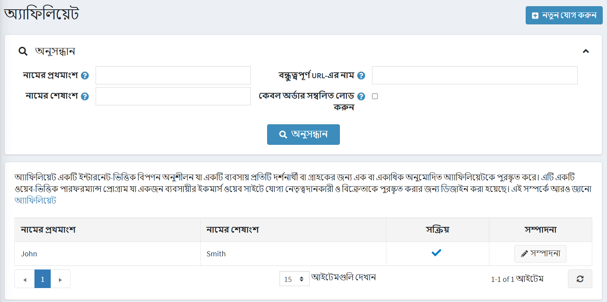

# সংযুক্ত করণ

অ্যাফিলিয়েট মার্কেটিং হল একটি ইন্টারনেট-ভিত্তিক মার্কেটিং প্র্যাকটিস যেখানে অ্যাফিলিয়েটরা ওয়েবসাইট ট্র্যাফিকের জন্য পুরস্কৃত হয় (প্রতিটি ভিজিটর বা গ্রাহক)। এটি একটি ওয়েব-ভিত্তিক পে-পারফরম্যান্স প্রোগ্রাম যা অনুমোদিত অংশীদারদের তাদের ওয়েবসাইট থেকে একটি বণিক ওয়েবসাইটে বিক্রয় করার জন্য ক্ষতিপূরণ দেওয়ার জন্য ডিজাইন করা হয়েছে।

অ্যাফিলিয়েট হল তৃতীয় পক্ষ যারা আপনার সাইটে গ্রাহকদের রেফার করে। নপকমার্স-এ সফটওয়্যার সেই রেফারেলগুলিকে ট্র্যাক করতে পারে যাতে স্টোর অ্যাডমিনিস্ট্রেটর সংশ্লিষ্টদের দেওয়া কমিশন নির্ধারণ করতে পারে। একবার একজন গ্রাহককে একটি অ্যাফিলিয়েট আইডি বরাদ্দ করা হলে, তাদের দেওয়া প্রতিটি অর্ডারও সেই আইডি দিয়ে ট্যাগ করা হয়।

 নপকমার্স- এ, একটি অ্যাফিলিয়েট পার্টনার লিঙ্ক নিম্নরূপ দেখায়: `http://www.yourstore.com/?AffiliateID=N` (যেখানে N একটি অ্যাফিলিয়েট আইডি)। একটি দোকানের মালিক বিপণনের উদ্দেশ্যে *বন্ধুত্বপূর্ণ URL* নাম ক্ষেত্রও নির্দিষ্ট করতে পারেন: `http://www.yourstore.com/?affiliate=your_friendly_name_here`। এই ইউআরএলটি প্রদর্শিত হয় যখন আপনি অ্যাফিলিয়েট বিশদ পৃষ্ঠা দেখুন। যখন এই হাইপারলিঙ্কটি অ্যাফিলিয়েট সাইট থেকে ক্লিক করা হয়, nopCommerce একটি অ্যাফিলিয়েট আইডি ক্যোয়ারী স্ট্রিং প্যারামিটার খোঁজে।

## একটি নতুন অ্যাফিলিয়েট যোগ করুন

একটি অ্যাফিলিয়েট যোগ করতে **প্রোমোশন → অ্যাফিলিয়েটস ** এ যান এবং** **নতুন যোগ করুন** এ ক্লিক করুন।

অ্যাফিলিয়েট বিশদ সংজ্ঞায়িত করুন:

- অ্যাফিলিয়েট সক্রিয় করতে **সক্রিয়** চেকবক্স নির্বাচন করুন।
- **নামের প্রথম অংশ**.
- **নামের শেষাংশ**.
- **ইমেইল**।
- **কোম্পানির নাম**.
- ড্রপ-ডাউন তালিকা থেকে **দেশ** নির্বাচন করুন।
- যদি নির্বাচিত দেশটি মার্কিন যুক্তরাষ্ট্র হয় তবে **রাজ্য/প্রদেশ** উল্লেখ করুন।
- **কাউন্টি/অঞ্চল**।
- **শহর**।
- **ঠিকানা ১**.
- **ঠিকানা ২**.
- **জিপ/পোস্টাল কোড**।
- **ফোন নম্বর**.
- **ফ্যাক্স নম্বর**.
- **প্রশাসক মন্তব্য** ক্ষেত্রের মধ্যে, আপনি একটি ঐচ্ছিক মন্তব্য বা অভ্যন্তরীণ ব্যবহারের জন্য তথ্য লিখতে পারেন।
- আপনি **ফ্রেন্ডলি ইউআরএল নাম উল্লেখ করতে পারেন** যা মার্কেটিং এর উদ্দেশ্যে একটি বন্ধুত্বপূর্ণ অ্যাফিলিয়েট ইউআরএল লিংক অথবা আপনি এই ফিল্ডটি খালি রাখতে পারেন, তাহলে ডিফল্ট ইউআরএল ব্যবহার করা হবে। ডিফল্টরূপে, অ্যাফিলিয়েট পার্টনারদের URL থাকে: `http://www.yourstore.com/?AffiliateID=N` (যেখানে N হল একটি অ্যাফিলিয়েট আইডি)।

যদি আপনি **সংরক্ষণ করুন এবং সম্পাদনা চালিয়ে যান** ক্লিক করেন তাহলে আপনি আরও দুটি প্যানেল দেখতে পাবেন যেখানে আপনি এই অধিভুক্তটি কতটা কার্যকর তা পরীক্ষা করতে পারেন:

* *অনুমোদিত গ্রাহক* প্যানেল সমস্ত অনুমোদিত গ্রাহকদের একটি তালিকা দেখায়।
* *এফিলিয়েটেড অর্ডার* প্যানেল সমস্ত অনুমোদিত অর্ডারের একটি তালিকা দেখায়। যখন একটি অনুমোদিত গ্রাহক একটি অর্ডার দেয়, আপনি এই প্যানেলে অর্ডার দেখতে পারেন।

## আরো দেখুন

-[অর্ডার ম্যানেজমেন্ট](xref:bn/running-your-store/order-management/index)
-[গ্রাহক ব্যবস্থাপনা](xref:bn/running-your-store/customer-management/index)

