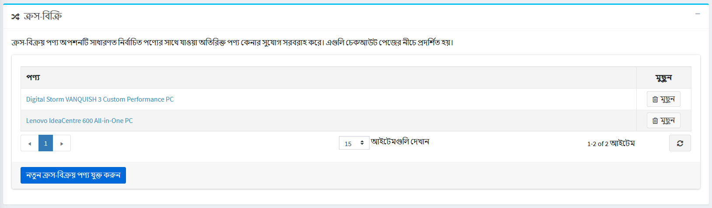
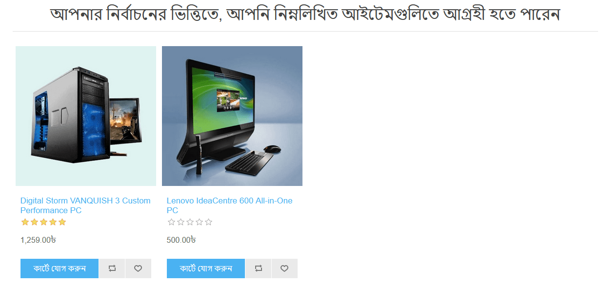
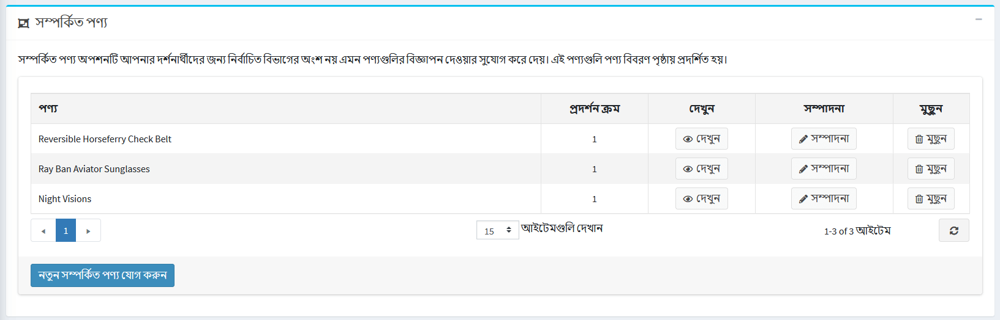
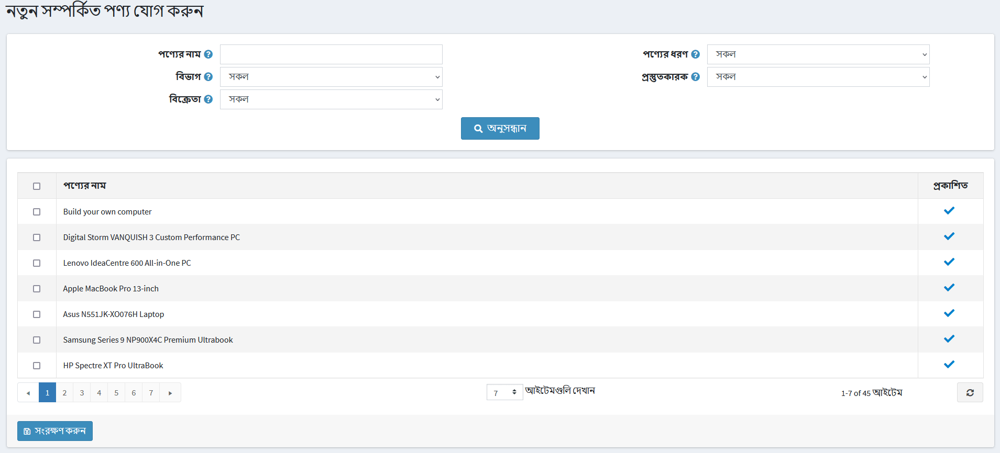
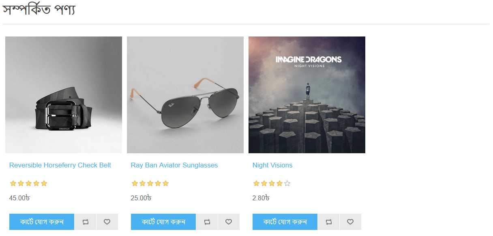

# ক্রস বিক্রয় এবং সম্পর্কিত পণ্য

"ক্রস-সেলস" এবং "রিলেটেড প্রোডাক্টস" হল নপকমার্স- এ মার্কেটিং টুল যা আপনার গ্রাহকদের তাদের শপিং আচরণের উপর ভিত্তি করে তাদের পছন্দসই অতিরিক্ত পণ্য অফার করতে ব্যবহার করা যেতে পারে (কার্টে নির্দিষ্ট পণ্য দেখা এবং যুক্ত করা)। এটি আপনার জন্য কিছু পণ্য আপ-সেল করার একটি ভাল সুযোগ। আপনি একই সাথে এই দুটি সরঞ্জাম ব্যবহার করতে পারেন।

প্রোডাক্ট এডিট পেজে প্রোডাক্ট তৈরি বা এডিট করার সময় আপনি ক্রস সেলস এবং সংশ্লিষ্ট প্রোডাক্ট সেট আপ করতে পারেন। **ক্যাটালগ → পণ্য** এ যান, একটি পণ্য নির্বাচন করুন এবং **সম্পাদনা করুন** ক্লিক করুন। *ক্রস সেলস* এবং *সম্পর্কিত পণ্য* প্যানেলগুলি সন্ধান করুন।

> [!NOTE]
>
> ক্রস-সেল এবং সংশ্লিষ্ট পণ্য যোগ করার আগে আপনাকে পণ্যটি সংরক্ষণ করতে হবে।

## ক্রস-সেলস

"ক্রস-সেল প্রোডাক্টস" বিকল্পটি অতিরিক্ত পণ্য বিক্রির সুযোগ প্রদান করে যা সাধারণত নির্বাচিত পণ্যের সাথে কেনা হয়, তবে, আপনি আপনার ক্যাটালগ থেকে যেকোনো পণ্য যোগ করতে পারেন এমনকি কার্টে পণ্যটির পরিপূরক নয়। ক্রস বিক্রয় চেকআউট পৃষ্ঠার নীচে প্রদর্শিত হয়। উদাহরণস্বরূপ, যখন আপনার গ্রাহক একটি CPU কিনছেন, তখন তার একটি মনিটর এবং অন্য কিছু প্রয়োজন হতে পারে। আপনি একটি পণ্যে সীমাহীন সংখ্যক ক্রস-সেল পণ্য যোগ করতে পারেন।

### নতুন ক্রস-সেল যোগ করা

**নতুন ক্রস-সেল পণ্য যোগ করুন** ক্লিক করুন এবং ক্যাটালগ থেকে পণ্য/গুলি নির্বাচন করুন। আপনি নিম্নোক্ত মানদণ্ড ব্যবহার করতে পারেন: **পণ্যের নাম**, **বিভাগ**, **বিক্রেতা**, **দোকান**, **পণ্যের ধরন** এবং **প্রস্তুতকারক** একটি পণ্য সহজে খুঁজে পেতে।

আপনি ক্রস-সেল প্রোডাক্ট বেছে নেওয়ার পরে এবং সেভ করার পর, চেকআউট পৃষ্ঠায় ক্রস-সেল কিভাবে প্রদর্শিত হবে তা পরীক্ষা করতে পারেন:

## সংশ্লিষ্ট পণ্য

রিলেটেড প্রোডাক্টস অপশন আপনার গ্রাহকদের সাথে নির্বাচিত পণ্যের সাথে অন্যান্য পণ্যের বিজ্ঞাপন ও বিক্রির সুযোগ প্রদান করে। এই পণ্যগুলি পণ্যের বিবরণ পৃষ্ঠায় নির্বাচিত পণ্যের নীচে প্রদর্শিত হয়। আপনি একটি পণ্যের সাথে সীমাহীন সংখ্যক সম্পর্কিত পণ্য যুক্ত করতে পারেন।

### নতুন সম্পর্কিত পণ্য যোগ করা

**নতুন সম্পর্কিত পণ্য যোগ করুন** ক্লিক করুন এবং ক্যাটালগ থেকে পণ্য/গুলি নির্বাচন করুন। আপনি নিম্নোক্ত মানদণ্ড ব্যবহার করতে পারেন: **পণ্যের নাম**, **বিভাগ**, **বিক্রেতা**, **দোকান**, **পণ্যের ধরন** এবং **প্রস্তুতকারক** একটি পণ্য সহজে খুঁজে পেতে।

আপনি সম্পর্কিত পণ্য চয়ন করার পরে এবং এটি সংরক্ষণ করার পরে, আপনি পণ্যের বিবরণ পৃষ্ঠায় সম্পর্কিত পণ্যগুলি কীভাবে প্রদর্শিত হবে তা পরীক্ষা করতে পারেন:

## See also

- [পণ্য যোগ করা](xref:bn/running-your-store/catalog/products/add-products)
- [স্তরের মূল্য](xref:bn/running-your-store/promotional-tools/tier-prices)

## টিউটোরিয়াল

- [নপকমার্স- এ ক্রস-সেলস বোঝা](https://www.youtube.com/watch?v=J_6OlVarIFc)
- [সম্পর্কিত পণ্য ব্যবস্থাপনা](https://www.youtube.com/watch?v=FGuozvhyqYE&t=6s)
