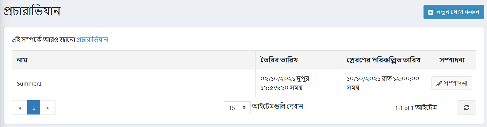
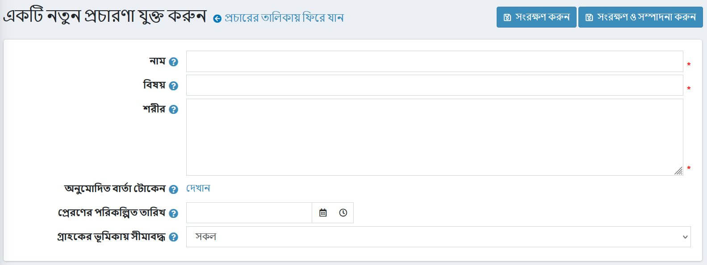
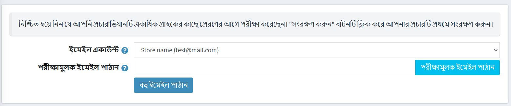
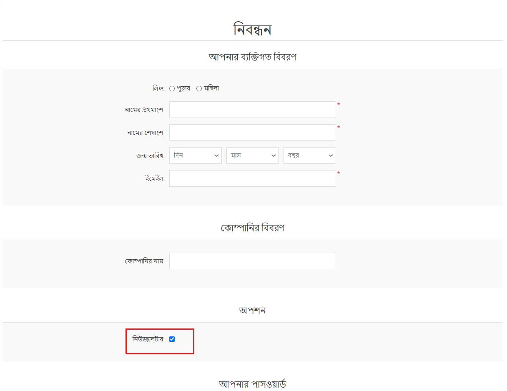
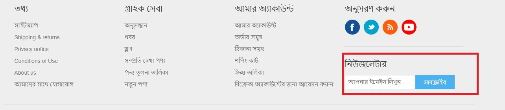
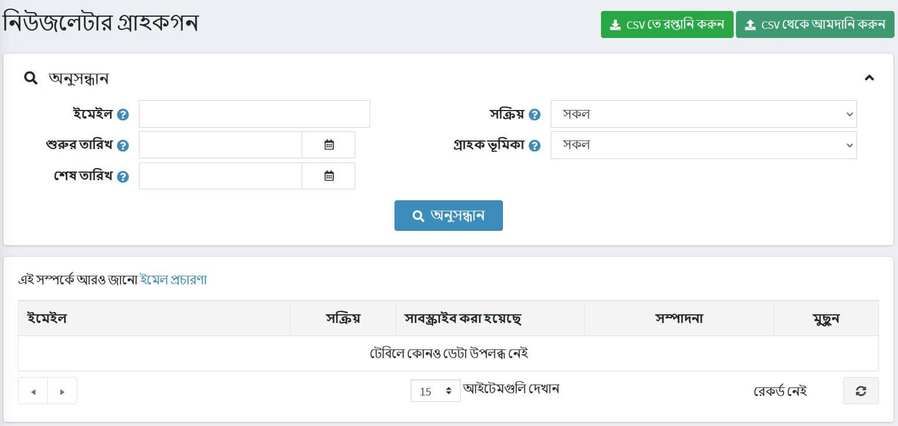

---
title: ইমেল প্রচারণা
uid: bn/running-your-store/promotional-tools/email-campaigns
author: git.AndreiMaz
contributors: git.MDRashedKhanMenon
---

# ইমেল প্রচারণা

নিবন্ধনের সময়, একজন গ্রাহক আপনার দোকান থেকে নিউজলেটার পাওয়ার জন্য *নিউজলেটার* বিকল্পটি নির্বাচন করতে পারেন। অথবা ফুটার (ডিফল্ট ক্লিন নপকমার্স থিমে) ফর্ম ব্যবহার করে ইদানীং একটি নিউজলেটার সাবস্ক্রাইব করা সম্ভব। ইমেইল সাবস্ক্রাইবার পূরণের অন্য উপায় হল একটি বহিরাগত সিএসভি ফাইল থেকে নপকমার্স-এ গ্রাহকদের তালিকা আমদানি করা। পাশাপাশি আপনি নপকমার্স থেকে বহিরাগত সিএসভি ফাইলে গ্রাহকদের তালিকা রপ্তানি করতে পারেন।

নীচের [নিউজলেটার গ্রাহক](#newsletter-subscribers) বিভাগে নিউজলেটার গ্রাহকদের কীভাবে পরিচালনা করবেন তা দেখুন।

কোন অতিরিক্ত বিপণন কার্যক্রম ছাড়াই সহজে এবং দ্রুত লক্ষ্য দর্শকদের কাছে পৌঁছানোর জন্য ইমেল প্রচারাভিযান তৈরি করতে আপনার গ্রাহকদের তালিকা ব্যবহার করুন। প্রচারাভিযান একটি কোম্পানির প্রতি আস্থা এবং আনুগত্য প্রচার করতে সাহায্য করে এবং বিক্রয় বাড়ায়।

ইমেইল মার্কেটিং ক্যাম্পেইনের বেশ কয়েকটি উদাহরণ রয়েছে যা আপনি আপনার দোকানের জন্য ব্যবহার করতে পারেন: একটি স্বাগত ইমেল দিয়ে শুরু করুন যা সাবস্ক্রিপশনের জন্য ধন্যবাদ, নিয়মিত ঘোষণা পাঠান, আপনার কোম্পানীর খবর, ভবিষ্যতের ক্রয়ের জন্য কুপন এবং আরও অনেক কিছু।

> [!NOTE]
> 
> ডিফল্টরূপে কোন প্রচারাভিযান নেই, তাই আপনি আপনার নিজস্ব মার্কেটিং কৌশল অনুসরণ করার জন্য সেগুলিকে শুরু থেকেই তৈরি করতে পারেন।

প্রচারাভিযান পরিচালনা করতে **প্রচার → প্রচারাভিযান** এ যান।

## একটি নতুন ইমেল প্রচারণা যোগ করুন

একটি নতুন প্রচারণা তৈরি করতে **নতুন যোগ করুন** ক্লিক করুন।

নিম্নলিখিত প্রচারাভিযানের বিবরণ সংজ্ঞায়িত করুন:

- প্রচারাভিযান **নাম**.
- ক্যাম্পেইনের **বিষয়**।
- আপনি যে ইমেইলটি পাঠাতে চান তার **বডি** টেক্সট লিখুন।
- **অনুমোদিত বার্তা টোকেনগুলিতে** আপনি অনুমোদিত বার্তা টোকেনগুলির তালিকা দেখতে পারেন যা আপনি আপনার ইমেল প্রচারাভিযানে ব্যবহার করতে পারেন। **দেখান** এ ক্লিক করলে আপনি তাদের সব দেখতে পাবেন।
- **পাঠানোর পরিকল্পিত তারিখ** এবং সময় লিখুন।
- **লিমিটেড থেকে স্টোর** ড্রপডাউন তালিকা থেকে, যে স্টোরটি গ্রাহকরা এই ইমেলটি পাবেন সেগুলি নির্বাচন করুন।
- **সীমিত থেকে গ্রাহকের ভূমিকা** ড্রপডাউন তালিকা, গ্রাহকদের ভূমিকা নির্বাচন করুন যারা এই ইমেলটি পাবেন।

আপনার প্রচারাভিযানটি পাঠানোর জন্য **সংরক্ষণ করুন** বা **সংরক্ষণ করুন এবং সম্পাদনা চালিয়ে যান** ক্লিক করুন।

## ক্যাম্পেইন পাঠান

ক্যাম্পেইন সেভ করার সময় আপনি প্রেক্ষাগৃহে নতুন নতুন পিলিশ দেখতে পাবেন:

> [!NOTE]
>
> একাধিক গ্রাহকের কাছে পাঠানোর আগে নিশ্চিত হয়ে নিন যে আপনি ক্যাম্পেইনটি পরীক্ষা করেছেন।

প্রথমে সবকিছু ঠিকঠাক হয়েছে কিনা তা পরীক্ষা করার জন্য একটি পরীক্ষার ইমেইল পাঠান। এটি করার জন্য **ইমেইল একাউন্ট** নির্বাচন করুন যা ক্যাম্পেইন পাঠাতে ব্যবহৃত হবে। [ইমেল অ্যাকাউন্ট](xref:bn/getting-start/email-accounts) বিভাগে কিভাবে একটি ইমেইল অ্যাকাউন্ট তৈরি করবেন তা দেখুন।

তারপর আপনার ইমেল ঠিকানাটি প্রবেশ করুন **পরীক্ষার ইমেইল পাঠান** ফিল্ডে এবং **পরীক্ষার ইমেইল পাঠান** ক্লিক করুন।

সবকিছু ঠিকঠাক আছে কিনা তা নিশ্চিত করার পর **সেন্ড ম্যাস ইমেল** বাটন ব্যবহার করে গ্রাহকদের কাছে আপনার ক্যাম্পেইন পাঠান।

## নিউজলেটার গ্রাহক

নিবন্ধনের সময়, একজন গ্রাহক আপনার দোকান থেকে একটি নিউজলেটার পাওয়ার জন্য *নিউজলেটার* বিকল্পটি নির্বাচন করতে পারেন:

অথবা ফুটার (ডিফল্ট ক্লিন নপকমার্স থিমে) ফর্ম ব্যবহার করে ইদানীং একটি নিউজলেটার সাবস্ক্রাইব করা সম্ভব:

ইমেইল সাবস্ক্রাইবার পূরণের অন্য উপায় হল একটি বহিরাগত সিএসভি ফাইল থেকে নপকমার্স-এ গ্রাহকদের তালিকা আমদানি করা। পাশাপাশি আপনি নপকমার্স থেকে বহিরাগত সিএসভি ফাইলে গ্রাহকদের তালিকা রপ্তানি করতে পারেন।

নিউজলেটার গ্রাহকদের রপ্তানি/আমদানি করতে **প্রোমোশন → নিউজলেটার সাবস্ক্রাইবার** এ যান।

আপনি সিএসভি ফরম্যাটে গ্রাহকদের তালিকা আমদানি করতে **সিএসভি থেকে আমদানি করুন** ক্লিক করতে পারেন। নিশ্চিত করুন যে সিএসভি ফাইলের প্রতিটি লাইন নিম্নলিখিত বিন্যাসে রয়েছে: email_address, is_active, store_id (store_id প্যারামিটার ঐচ্ছিক)। উদাহরণস্বরূপ, `test@test.com, true`। আপনি বিদ্যমান গ্রাহক তালিকা রপ্তানি করতে **সিএসভি- এ রপ্তানি করুন** ক্লিক করতে পারেন।

## গ্রাহকদের জন্য অনুসন্ধান

*নিউজলেটার সাবস্ক্রাইবার* পৃষ্ঠায় আপনি অনুসন্ধানের জন্য নিম্নলিখিত ক্ষেত্রগুলি ব্যবহার করে নির্দিষ্ট গ্রাহক খুঁজে পেতে পারেন:
- খুঁজে পেতে গ্রাহকের **ইমেইল** লিখুন, অথবা সিস্টেমে নিবন্ধিত সমস্ত নিউজলেটার গ্রাহকদের লোড করার জন্য এই ক্ষেত্রটি খালি রাখুন।
- কোন গ্রাহক সাবস্ক্রাইব করার সময় **শুরু তারিখ** এবং **শেষ তারিখ** উল্লেখ করুন।
- **সক্রিয়** ড্রপডাউন তালিকা থেকে,*সক্রিয়* এবং*সক্রিয় নয়* গ্রাহক বা লোড*সব*এর মধ্যে বেছে নিন।
- **স্টোর** ড্রপডাউন তালিকা থেকে, দোকানটি বেছে নিন।
- **গ্রাহক ভূমিকা** ড্রপডাউন তালিকা থেকে, গ্রাহকের ভূমিকা নির্বাচন করুন।

**অনুসন্ধান** ক্লিক করুন।

## টিউটোরিয়াল

- [নপকমার্স-এ প্রচারাভিযান পরিচালনা করা](https://youtu.be/iW2m8LQyyWM)