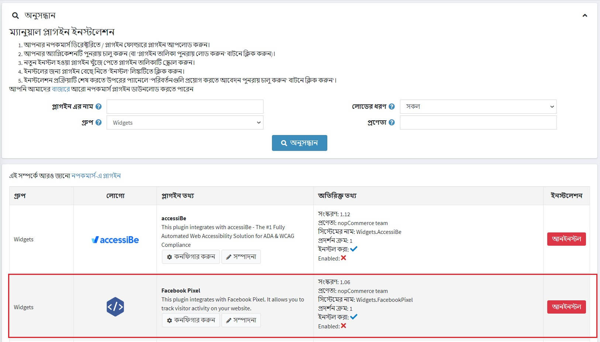
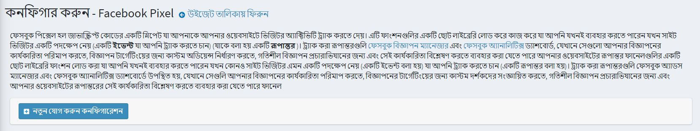
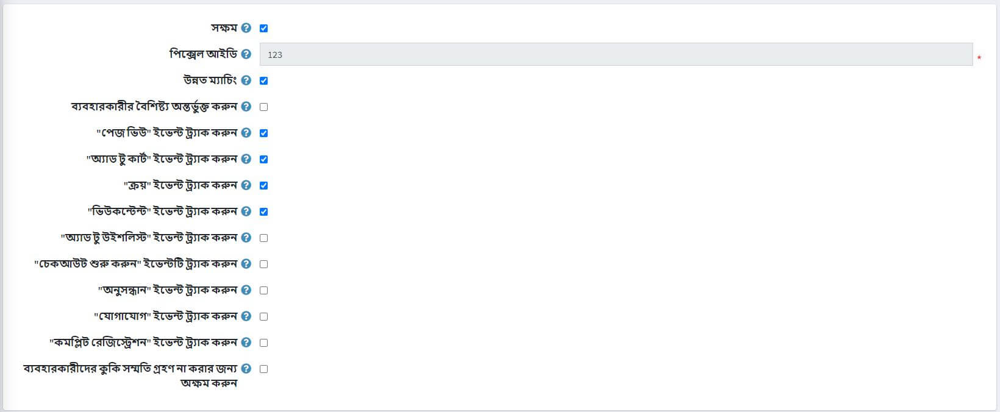
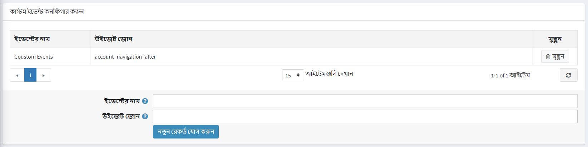

# ফেসবুক পিক্সেল প্লাগইন

এই বিভাগে বর্ণনা করা হয়েছে কিভাবে আপনার দোকানে ফেসবুক পিক্সেলকে সংহত করা যায়।

## ফেসবুক পিক্সেল কি

ফেসবুক পিক্সেল আপনাকে আপনার স্টোরের গৃহীত পদক্ষেপ সম্পর্কে তথ্য পেতে দেয় যাতে আপনার ফেসবুক বিজ্ঞাপন আপনার শ্রোতাদের জন্য আরও প্রাসঙ্গিক হয়। ফেসবুক পিক্সেল আপনাকে আপনার দোকানে আসা লোকদের আচরণ বুঝতে সাহায্য করে এবং কোন বিজ্ঞাপন কৌশল আপনার ব্যবসার লক্ষ্যে পৌঁছানোর জন্য সবচেয়ে ভালো কাজ করে।

ট্র্যাক করা রূপান্তরগুলি [ফেসবুক বিজ্ঞাপন ম্যানেজার](https://www.facebook.com/adsmanager) এবং [ফেসবুক অ্যানালিটিক্স](https://business.facebook.com/analytics) ড্যাশবোর্ডে প্রদর্শিত হয়, যেখানে সেগুলি ব্যবহার করা যায় আপনার বিজ্ঞাপনের কার্যকারিতা পরিমাপ করা, বিজ্ঞাপনের টার্গেটিংয়ের জন্য কাস্টম দর্শকদের সংজ্ঞায়িত করা, গতিশীল বিজ্ঞাপন প্রচারের জন্য এবং আপনার ওয়েবসাইটের রূপান্তর ফানেলের কার্যকারিতা বিশ্লেষণ করা।

## ফেসবুক পিক্সেল প্লাগইন কি করে

NopCommerce এর জন্য ফেসবুক পিক্সেল প্লাগইন জাভাস্ক্রিপ্ট কোডের একটি স্নিপেট পেস্ট করে যা আপনাকে আপনার ওয়েবসাইটে ভিজিটর অ্যাক্টিভিটি ট্র্যাক করতে দেয়। এটি ফাংশনের একটি ছোট লাইব্রেরি লোড করে কাজ করে যা ব্যবহার করা হয় যখনই কোন গ্রাহক কোন পদক্ষেপ নেয়।

## প্লাগইনটি ইনস্টল করুন এবং সক্ষম করুন

ফেসবুক পিক্সেল প্লাগইন একটি আউট অফ দ্য বক্স নপকমার্স প্লাগইন। আপনি এটি এখানে খুঁজে পেতে পারেন: **কনফিগারেশন → স্থানীয় প্লাগইন**। প্লাগইনটি দ্রুত খুঁজে পেতে সার্চ প্যানেলে **গ্রুপ** ফিল্ড ব্যবহার করুন *উইজেট* টাইপ দ্বারা প্লাগইনগুলি ফিল্টার করুন:

প্লাগইনটি ইনস্টল করুন যদি এটি আনইনস্টল হয় তবে **ইনস্টল করুন** বোতামটি ব্যবহার করুন। তারপরে **সম্পাদনা** বাটনে ক্লিক করে এটি সক্ষম করুন। আপনি এই ক্ষেত্রে *এডিট প্লাগইন ডিটেইলস* উইন্ডো দেখতে পাবেন। **সক্ষম হয়েছে** চেকবক্স ব্যবহার করে প্লাগইনটি সক্ষম হিসাবে চিহ্নিত করুন এবং **সংরক্ষণ** বাটনে ক্লিক করুন।

## কিভাবে প্লাগইন কনফিগার করতে হয়

১ **কনফিগার করুন** বাটনে ক্লিক করুন। আপনি দেখতে পাবেন *কনফিগার করুন - ফেসবুক পিক্সেল* পৃষ্ঠা উইন্ডো:

১. **নতুন কনফিগারেশন যোগ করুন** বাটনে ক্লিক করুন।
১. প্লাগইন সেট আপ করতে নিম্নলিখিত ফর্মটি পূরণ করুন:

* এই ফেসবুক পিক্সেল কনফিগারেশনটি সক্ষম করতে **সক্ষম** চেকবক্সে টিক দিন।
* আপনার **পিক্সেল আইডি** লিখুন যা আপনি [বিজ্ঞাপন ম্যানেজার → ইভেন্ট ম্যানেজার](https://business.facebook.com/events_manager) এ খুঁজে পেতে পারেন। যদি আপনি একটি পিক্সেল তৈরি না করেন, [এই নির্দেশাবলী অনুসরণ করুন](https://www.facebook.com/business/help/952192354843755) একটি তৈরি করতে - আপনার যা দরকার তা হল পিক্সেলের আইডি।
* **অ্যাডভান্সড ম্যাচিং**: টিক দিলে ভিজিটরের কিছু ডেটা (হ্যাশেড ফরম্যাটে) ফেসবুক পিক্সেল সংগ্রহ করবে। আপনি যদি ইভেন্ট ম্যানেজার ব্যবহার করে স্বয়ংক্রিয়ভাবে উন্নত ম্যাচিং বাস্তবায়ন করেন, তাহলে এই সেটিংটি আনচেক করুন।
* **ব্যবহারকারীর বৈশিষ্ট্যগুলি অন্তর্ভুক্ত করুন**: *ব্যবহারকারীর বৈশিষ্ট্য*, ব্যবহারকারীর তথ্য, একটি পিক্সেলে অন্তর্ভুক্ত করার জন্য চেক করুন। তারপর আপনি ফেসবুক অ্যানালিটিক্স ব্যবহারকারীর বৈশিষ্ট্য এর অধীনে ফেসবুক অ্যানালিটিক্স ড্যাশবোর্ডে ব্যবহারকারীর বৈশিষ্ট্য দেখতে পারেন।

পরবর্তী আপনি ইভেন্টের তালিকা দেখতে পাবেন। স্ট্যান্ডার্ড ইভেন্টগুলি পূর্বনির্ধারিত ভিজিটর অ্যাকশন যা সাধারণ, রূপান্তর-সম্পর্কিত ক্রিয়াকলাপগুলির সাথে সামঞ্জস্যপূর্ণ, যেমন একটি পণ্য অনুসন্ধান করা, পণ্য দেখা বা পণ্য কেনা।

* **ট্র্যাক "পেজ ভিউ" ইভেন্ট**: ট্র্যাকিং স্ট্যান্ডার্ড ইভেন্ট সক্ষম করার জন্য চেক করুন, যখন একজন ব্যক্তি ওয়েবসাইটের পৃষ্ঠায় অবতরণ করে।
* **"কার্টে যোগ করুন" ইভেন্টটি ট্র্যাক করুন**: শপিং কার্টে যখন কোন পণ্য যোগ করা হয়, তখন ট্র্যাকিং স্ট্যান্ডার্ড ইভেন্ট সক্ষম করতে চেক করুন।
* **ট্র্যাক "ক্রয়" ইভেন্ট**: ট্র্যাকিং স্ট্যান্ডার্ড ইভেন্ট সক্ষম করার জন্য চেক করুন, যখন একটি অর্ডার দেওয়া হয়।
* **ট্র্যাক "ভিউকন্টেন্ট" ইভেন্ট**: ট্র্যাকিং স্ট্যান্ডার্ড ইভেন্ট সক্ষম করার জন্য চেক করুন, যখন একজন ব্যক্তি একটি পণ্য বিবরণ পৃষ্ঠায় অবতরণ করে।
* **ট্র্যাক "চাহিদাপত্রে যোগ করা" ইভেন্ট**: ট্র্যাকিং স্ট্যান্ডার্ড ইভেন্ট সক্ষম করার জন্য চেক করুন, যখন একটি পণ্য উইশলিস্টে যোগ করা হয়।
* **ট্র্যাক "ইনিশিয়েট চেকআউট" ইভেন্ট**: ট্র্যাকিং স্ট্যান্ডার্ড ইভেন্ট সক্ষম করার জন্য চেক করুন, যখন একজন ব্যক্তি চেকআউট প্রবাহ সম্পন্ন করার আগে চেকআউট প্রবাহে প্রবেশ করে।
* **ট্র্যাক "সার্চ" ইভেন্ট**: ট্র্যাকিং স্ট্যান্ডার্ড ইভেন্ট সক্ষম করার জন্য চেক করুন, যখন একটি অনুসন্ধান করা হয়।
* **ট্র্যাক "যোগাযোগ" ইভেন্ট**: ট্র্যাকিং স্ট্যান্ডার্ড ইভেন্ট সক্ষম করার জন্য চেক করুন, যখন একজন ব্যক্তি ব্যক্তি আমাদের সাথে যোগাযোগের ফর্মের মাধ্যমে একটি প্রশ্ন জমা দেয়।
* **ট্র্যাক "সম্পূর্ণ নিবন্ধন" ইভেন্ট**: একটি নিবন্ধন ফর্ম সম্পন্ন হলে, ট্র্যাকিং স্ট্যান্ডার্ড ইভেন্ট সক্ষম করতে চেক করুন।

> [!NOTE]
>
> একটি অতিরিক্ত প্যারামিটার হিসাবে, কিছু ইভেন্টের মধ্যে রয়েছে পণ্য এসকেইউ বা পণ্য সমন্বয় এসকেইউ; নিশ্চিত করুন যে সেগুলি আপনার ক্যাটালগে সঠিকভাবে পূরণ করা হয়েছে।

* **ব্যবহারকারীদের কুকি সম্মতি গ্রহণ না করার জন্য নিষ্ক্রিয় করুন**: ব্যবহারকারীদের কুকি সম্মতি গ্রহণ না করার জন্য ফেসবুক পিক্সেল নিষ্ক্রিয় করার জন্য পরীক্ষা করুন। আপনি যদি এমন দেশগুলিতে ব্যবসা পরিচালনা করেন যা সাধারণ ডেটা সুরক্ষা নিয়ন্ত্রণ (জিডিপিআর) সাপেক্ষে হয় তবে আপনি এটি চাইতে পারেন। ব্যবহারকারীদের জন্য কুকি সম্মতি প্রদর্শনের জন্য আপনাকে **কনফিগারেশন → সেটিংস → সাধারণ সেটিংস** পৃষ্ঠায় **ইউ কুকি আইন সতর্কতা প্রদর্শন করুন** সেটিং সক্রিয় করতে হবে।

> [!NOTE]
>
> সাধারণ ডেটা সুরক্ষা প্রবিধান (জিডিপিআর) ২৫ মে, ২০১৮ থেকে কার্যকর হয়েছে এবং ইউরোপ জুড়ে ধারাবাহিক ডেটা সুরক্ষা বিধি তৈরি করে। যেসব ব্যবসা ফেসবুক কোম্পানির সাথে বিজ্ঞাপন দেয় তারা আজকের মতোই ফেসবুক প্ল্যাটফর্ম এবং সমাধান ব্যবহার করতে পারে।

## কাস্টম ইভেন্ট কনফিগার করুন

> [!NOTE]
>
> আপনি ইতিমধ্যে তৈরি এবং বর্তমান কনফিগারেশন সংরক্ষণ করার পরেই আপনি এই প্যানেলটি দেখতে পাবেন!

যদি পূর্বনির্ধারিত স্ট্যান্ডার্ড ইভেন্টগুলি আপনার প্রয়োজনের জন্য উপযুক্ত না হয়, আপনি আপনার নিজস্ব কাস্টম ইভেন্টগুলি ট্র্যাক করতে পারেন, যা বিজ্ঞাপন অপ্টিমাইজেশনের জন্য কাস্টম দর্শকদের সংজ্ঞায়িত করতেও ব্যবহার করা যেতে পারে।
আপনি তাদের নিচে কনফিগার করতে পারেন। নাম উল্লেখ করুন এবং উইজেট অঞ্চল নির্বাচন করুন যেখানে কাস্টম ইভেন্ট ট্র্যাক করা হবে। আপনার কাস্টম ইভেন্টের জন্য কোন জোনটি ব্যবহার করতে হবে তা যদি আপনি না জানেন তবে আপনি আমাদের [ফোরাম](https://www.nopcommerce.com/boards) এ এটি সম্পর্কে জিজ্ঞাসা করতে পারেন।

## আরো দেখুন

[ফেসবুক পিক্সেল কোন ডেটা সংগ্রহ করে?](https://developers.facebook.com/docs/facebook-pixel/support#pixelcollect)
