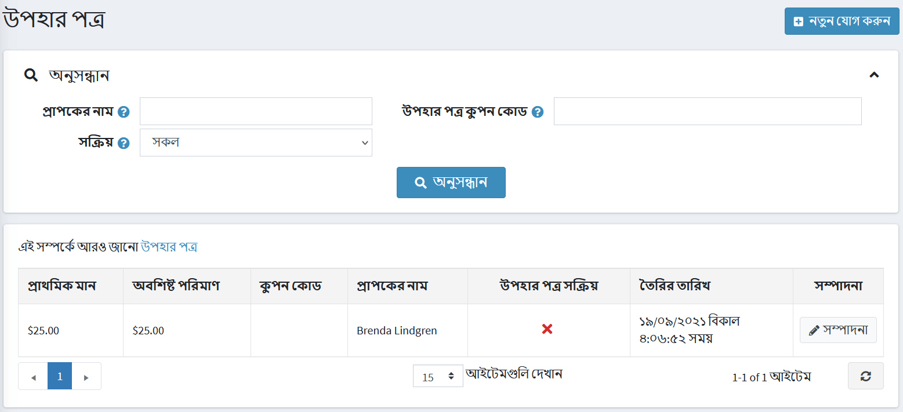
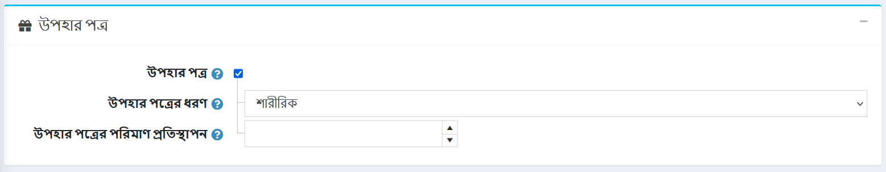
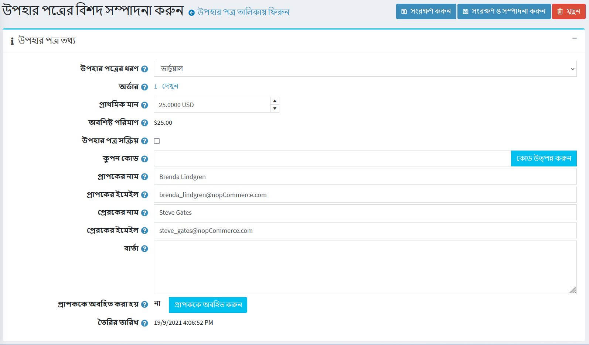
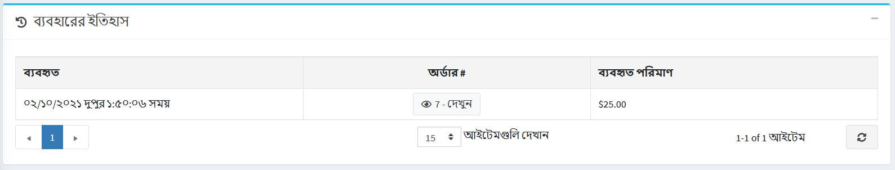
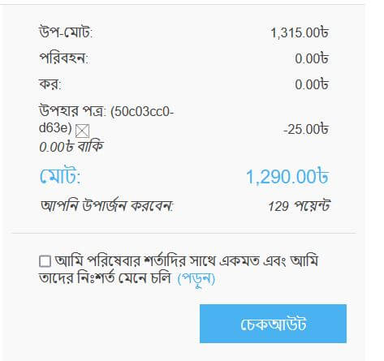

# উপহার কার্ড

নপকমার্স-এ, আপনার অন্যান্য ধরণের পণ্যের মধ্যে উপহার কার্ড বিক্রির সুযোগ রয়েছে।

গিফট কার্ড একটি ভালো মার্কেটিং টুল, যা আপনাকে আরও বেশি গ্রাহকদের কাছে পৌঁছাতে এবং অতিরিক্ত ক্রয়কে উদ্দীপিত করতে সক্ষম করে। উপহার কার্ড একটি অত্যন্ত লক্ষ্যযুক্ত যন্ত্র, কারণ রিসিভার অবশ্যই সেগুলি ব্যবহার করতে অনুপ্রাণিত হয়, কারণ এটি তাদের কাছে ব্যক্তিগত প্রস্তাবের মতো।

## একটি নতুন উপহার কার্ড যোগ করুন

**ক্যাটালগ → পণ্য → নতুন যোগ করুন→ উপহার কার্ড** প্যানেলে পণ্য তৈরি করার সময় আপনি **উপহার কার্ড** চেকবক্সে টিক দিয়ে একটি পণ্যকে উপহার কার্ড হিসাবে সংজ্ঞায়িত করে উপহার কার্ড পণ্য তৈরি করতে পারেন।

এই প্যানেলে আপনাকে **উপহার কার্ডের ধরন**: *ভার্চুয়াল* বা *শারীরিক* নির্দিষ্ট করতে হবে।

> [!WARNING]
>
> "লাইভ" দোকানে উপহার কার্ডের ধরন এক থেকে অন্যের মধ্যে পরিবর্তন করার সুপারিশ করা হয় না।

## একটি উপহার কার্ড সক্রিয় করা

গ্রাহকরা গিফট কার্ড পণ্য দিয়ে কেনাকাটা শেষ করার পরে, আপনি **বিক্রয় → উপহার কার্ড** এ সমস্ত কেনা উপহার কার্ডের তালিকা অনুসন্ধান এবং দেখতে পারেন।

উপহার কার্ডের বিবরণ দেখতে **সম্পাদনা করুন** বোতামে ক্লিক করুন। *উপহার কার্ডের বিবরণ সম্পাদনা করুন* উইন্ডো প্রদর্শিত হবে:

গিফট কার্ডটি সক্রিয় করতে আপনাকে **উপহার কার্ড সক্রিয় কি** চেকবক্সে টিক দিতে হবে। তারপর **কুপন কোড** জেনারেট করুন।

> [!NOTE]
>
> অর্ডার শেষ করার পর স্বয়ংক্রিয়ভাবে একটি উপহার কার্ড সক্রিয় করার জন্য **কনফিগারেশন → সেটিংস → অর্ডার সেটিংস** পৃষ্ঠায় যান। *উপহার কার্ড* প্যানেল খুঁজুন এবং একটি অর্ডার শেষ করার পর **উপহার কার্ড সক্রিয় করুন** চেকবক্সে টিক দিন। এই ক্ষেত্রে **কুপন কোড** স্বয়ংক্রিয়ভাবে উৎপন্ন হবে।
> লক্ষ্য করুন যে এই পৃষ্ঠায় উপহার কার্ড সক্রিয়করণ সম্পর্কিত অন্যান্য সেটিংস রয়েছে।

আপনি নিম্নলিখিত উপহার কার্ড তথ্য সংজ্ঞায়িত করতে পারেন:

- **উপহার কার্ডের ধরন থেকে** নির্বাচন করুন যে এটি *ভার্চুয়াল*বা *শারীরিক*।
- **অর্ডার** ক্ষেত্রের পাশে, উপহার কার্ডটি যে অর্ডারে কেনা হয়েছিল তা দেখতে **দেখুন** ক্লিক করুন।
- **প্রাথমিক মান** ক্ষেত্রে, প্রয়োজন হলে কার্ডের প্রাথমিক মান সম্পাদনা করুন।
- **অবশিষ্ট পরিমাণ** ক্ষেত্র এই উপহার কার্ডের অবশিষ্ট পরিমাণ দেখতে দেয়।
- **উপহার কার্ড সক্রিয়** ক্ষেত্র নির্ধারণ করে যে এই কার্ডটি সক্রিয় করা হয়েছে এবং ব্যবহার করা যাবে।
- **কুপন কোড** ক্ষেত্র উপহার কার্ড কুপন কোড (চেকআউটের সময় ব্যবহৃত) উপস্থাপন করে।
- প্রয়োজনে, **প্রাপকদের নাম**, **প্রাপকের ইমেল** (যদি উপহার কার্ডের ধরন*ভার্চুয়াল*হয়), **প্রেরকের নাম** এবং **প্রেরকের ইমেল** (যদি উপহার কার্ডের ধরন প্রাসঙ্গিক ক্ষেত্রে *ভার্চুয়াল*)।
- **বার্তা** এলাকায় একটি ঐচ্ছিক বার্তা লিখুন।
- **বিজ্ঞপ্তি প্রাপক** ক্লিক করুন। উপহার কার্ডের বিবরণ সম্বলিত একটি ইমেল প্রাপকের ইমেইলে পাঠানো হবে। এই বোতামটি শুধুমাত্র ভার্চুয়াল উপহার কার্ড কার্ডের জন্য প্রাসঙ্গিক এবং শারীরিক উপহার কার্ড নয়।

## ব্যবহারের ইতিহাস

*ব্যবহারের ইতিহাস* প্যানেলে আপনি এই অর্ডারগুলির তালিকা দেখতে পারেন এই উপহার কার্ডের কুপন ব্যবহার করা হয়েছিল। উপহার কার্ড সক্রিয় হওয়ার পরে এবং প্রেরক একটি কুপন কোড পেয়েছেন, তিনি চেকআউটের সময় এটি ব্যবহার করতে পারেন।

## উপহার কার্ড ব্যবহার করা

পাবলিক স্টোরে একটি উপহার কার্ড ব্যবহার করা হয় শপিং কার্ট পৃষ্ঠায় বাক্সে সিরিয়াল নম্বর প্রবেশ করে।

> [!NOTE]
>
> আপনি শপিং কার্ট পৃষ্ঠায় উপহার কার্ড বাক্সটি অক্ষম করতে পারেন **উপহার কার্ড বাক্স দেখান** চেকবক্সটি **কনফিগারেশন → সেটিংস → শপিং কার্ট সেটিংস** পৃষ্ঠায় (*সাধারণ* প্যানেল)।

আপনি আপনার গ্রাহকদের উপহার কার্ডের ব্যালেন চেক করার অনুমতি দিতে পারেন। এটি করার জন্য **গ্রাহকদের উপহার কার্ডের ব্যালেন্স চেক করার অনুমতি দিন** **কনফিগারেশন → সেটিংস → শপিং কার্ট সেটিংস** পৃষ্ঠায় (*সাধারণ*প্যানেল) চেকবক্স।

> [!NOTE]
>
> এই বৈশিষ্ট্যটির জন্য ক্যাপচা সক্ষম করা প্রয়োজন কারণ এটি সম্ভাব্য নিরাপদ নয় এবং ব্রুটফোর্স প্রতিরোধ ও জটিল করার জন্য ক্যাপচা প্রয়োজন। ক্যাপচা সক্রিয় করতে **কনফিগারেশন → সেটিংস → সাধারণ সেটিংস** পৃষ্ঠায় যান এবং*ক্যাপচা*প্যানেলে **ক্যাপচা সক্ষম** চেকবক্সে টিক দিন। ক্যাপচা কিভাবে সেট আপ করতে হয় তা জানতে [নিরাপত্তা সেটিংস-ক্যাপচা](xref:bn/getting-start/advanced-configuration/security-settings#captcha) বিভাগটি দেখুন।

## আরো দেখুন

- [পণ্য যোগ করা](xref:bn/running-your-store/catalog/products/add-products)
- [উপহার কার্ড পরিচালনার জন্য ইউটিউব টিউটোরিয়াল](https://www.youtube.com/watch?v=4SJ7uBZGas0&index=4&list=PLnL_aDfmRHwsbhj621A-RFb1KnzeFxYz4)
