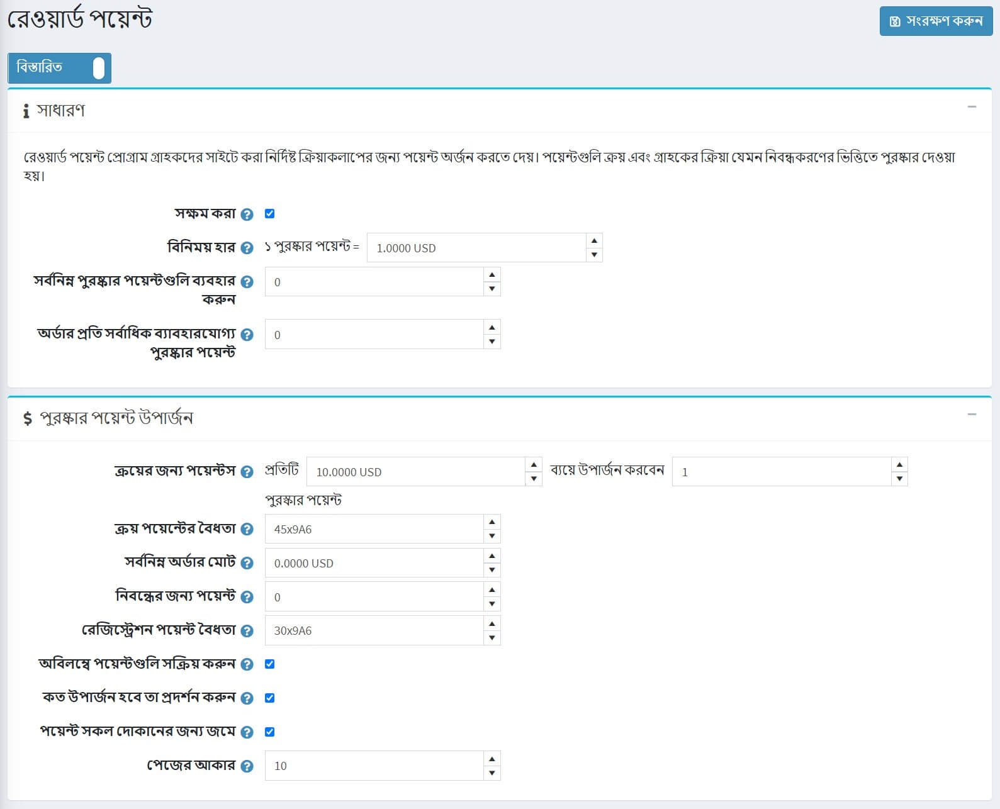
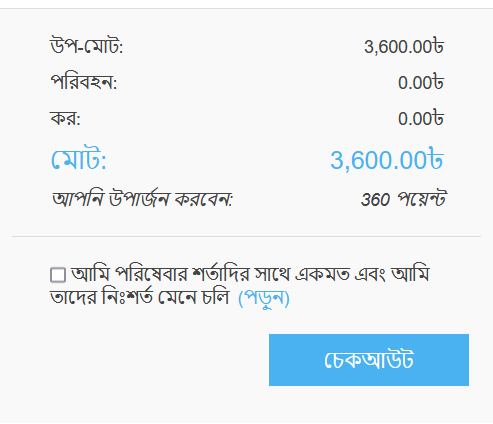
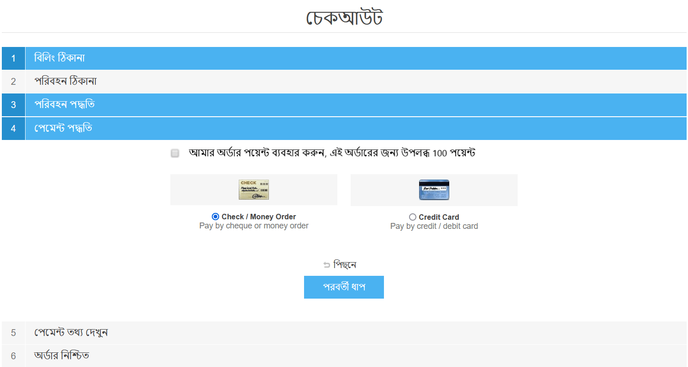

# পুরস্কার পয়েন্ট

"রিওয়ার্ড পয়েন্ট" কার্যকারিতা আপনাকে গ্রাহকের অভিজ্ঞতা উন্নত করতে এবং গ্রাহকের আনুগত্য বৃদ্ধির জন্য আনুগত্য প্রোগ্রাম তৈরি এবং বাস্তবায়ন করতে সক্ষম করে। "রিওয়ার্ড পয়েন্ট" প্রোগ্রাম গ্রাহকদের নিবন্ধন এবং কেনাকাটা করার মতো নির্দিষ্ট ক্রিয়াকলাপের জন্য পয়েন্ট অর্জন করতে দেয়।

পুরস্কার পয়েন্টগুলি পেমেন্ট পদ্ধতিগুলির মধ্যে একটি হিসাবে ব্যবহার করা যেতে পারে। এই বিকল্পটি চেকআউটের পেমেন্ট পদ্ধতি এলাকায় প্রদর্শিত হয়। বিনিময়যোগ্য পুরস্কার পয়েন্টগুলি অন্যান্য পেমেন্ট বিকল্প যেমন ক্রেডিট কার্ড, উপহার কার্ড এবং আরও অনেক কিছুর সাথে ব্যবহার করা যেতে পারে।

পয়েন্টগুলি বাতিল করা যেতে পারে যদি কোনও গ্রাহক অর্ডার বাতিল করে বা ফেরতের অনুরোধ পাঠায়।

## পুরস্কার পয়েন্ট পরিচালনা

পুরস্কার পয়েন্ট প্রোগ্রাম পরিচালনা করতে যান **কনফিগারেশন → সেটিংস → পুরস্কার পয়েন্ট**। এই পৃষ্ঠাটি দুটি মোডে উপলব্ধ: *মৌলিক* এবং *উন্নত *।

এই পৃষ্ঠাটি মাল্টি-স্টোর কনফিগারেশন সক্ষম করে, এর অর্থ হল যে একই সেটিংস সমস্ত স্টোরের জন্য সংজ্ঞায়িত করা যেতে পারে, অথবা স্টোর থেকে স্টোরের মধ্যে আলাদা হতে পারে। আপনি যদি একটি নির্দিষ্ট দোকানের জন্য সেটিংস পরিচালনা করতে চান, মাল্টি-স্টোর কনফিগারেশন ড্রপ-ডাউন তালিকা থেকে তার নামটি চয়ন করুন এবং তাদের জন্য কাস্টম মান নির্ধারণ করতে বাম পাশে সমস্ত প্রয়োজনীয় চেকবক্সে টিক দিন। আরও তথ্যের জন্য [মাল্টি-স্টোর](xref:bn/getting-start/advanced-configuration/multi-store) পড়ুন।

আপনার পুরস্কার বিন্দু প্রোগ্রাম সেট আপ করতে, এই সেটিংস সংজ্ঞায়িত করুন:

## সাধারণ
- পুরষ্কার পয়েন্ট প্রোগ্রাম সক্রিয় করতে, **সক্ষম** চেকবক্সে টিক দিন।
- **বিনিময় হার** ক্ষেত্রের মধ্যে, পুরস্কার পয়েন্ট বিনিময় হার নির্দিষ্ট করুন। (১ পয়েন্ট - $ ১ ইত্যাদি)।
- **ক্ষুদ্রতম পুরষ্কার পয়েন্ট ব্যবহার করার জন্য** ক্ষেত্রের মধ্যে, গ্রাহকদের তাদের পুরস্কার পয়েন্টগুলি ব্যবহার করার আগে প্রয়োজনীয় সর্বনিম্ন পরিমাণ পুরষ্কার পয়েন্ট লিখুন। ০ লিখুন, যদি আপনার এই সেটিংটি সংজ্ঞায়িত করার প্রয়োজন না হয়।
- যদি আপনি নির্দিষ্ট করেন **সর্বোচ্চ অর্ডার পয়েন্ট প্রতি অর্ডার ব্যবহার করার জন্য** ক্ষেত্রের গ্রাহকরা প্রতি অর্ডারে X এর বেশি পুরস্কার পয়েন্ট ব্যবহার করতে পারবে না। আপনি যদি এই সেটিংটি ব্যবহার করতে না চান তাহলে ০ তে সেট করুন।

## পুরস্কার পয়েন্ট অর্জন
- **ক্রয়ের জন্য পয়েন্ট** ক্ষেত্রের মধ্যে, ক্রয়ের জন্য প্রদত্ত পয়েন্টের সংখ্যা উল্লেখ করুন।
- **কেনাকাটার পয়েন্ট বৈধতা** ক্ষেত্রের মধ্যে, ক্রয়ের জন্য প্রদত্ত পয়েন্টগুলি বৈধ হবে এমন দিনের সংখ্যা নির্দিষ্ট করুন।
- **ন্যূনতম অর্ডার মোট** ক্ষেত্রের মধ্যে, ক্রয়ের জন্য পয়েন্ট দেওয়ার জন্য সর্বনিম্ন অর্ডার মোট (শিপিং খরচ বাদে) উল্লেখ করুন।
- **নিবন্ধনের জন্য পয়েন্ট** ক্ষেত্রের মধ্যে, গ্রাহক নিবন্ধনের জন্য প্রদত্ত পয়েন্টের সংখ্যা উল্লেখ করুন।
- **রেজিস্ট্রেশন পয়েন্টের বৈধতা** ফিল্ডে, নিবন্ধনের জন্য প্রদত্ত পয়েন্টগুলি কখন বৈধ হবে তার সংখ্যা নির্দিষ্ট করুন।
- **অ্যাক্টিভেট পয়েন্ট অবিলম্বে** চেকবক্সে টিক দিন যদি আপনি চান গ্রাহকরা উপার্জন পয়েন্টগুলি উপার্জনের পরেই ব্যবহার করতে সক্ষম হবেন। আপনি যদি এই চেকবক্সটি চেক না করেন তবে আরও একটি বিকল্প উপস্থিত হবে:
- **রিওয়ার্ড পয়েন্ট অ্যাক্টিভেশন** চেকবক্সে নির্দিষ্ট সময়কাল (দিন/ঘন্টার সংখ্যা) উল্লেখ করুন যার পরে পুরস্কার পয়েন্ট সক্রিয় করা হবে।
- কতগুলি উপার্জন করা হবে তা প্রদর্শন করুন ** আপনার গ্রাহকদের কত পয়েন্ট অর্জন করা হবে তা দেখানোর জন্য চেকবক্সে টিক দিন। এটি চেকআউট পৃষ্ঠায় দৃশ্যমান হবে।
- সমস্ত দোকানের জন্য সমস্ত পয়েন্ট এক ভারসাম্যে জমা করার জন্য **সব দোকানের জন্য জমা করা পয়েন্ট** চেকবক্সে টিক দিন যাতে সেগুলি যে কোনও দোকানে ব্যবহার করা যায়।
- **পৃষ্ঠার আকার** ক্ষেত্রের মধ্যে *আমার অ্যাকাউন্ট* পৃষ্ঠায় পুরস্কার পয়েন্টের ইতিহাসের জন্য পৃষ্ঠার আকার সেট করুন

**সেভ** ক্লিক করুন।

> [!NOTE]
>
> পুরষ্কার পয়েন্ট শুধুমাত্র নিবন্ধিত ব্যবহারকারীদের জন্য প্রয়োগ করা হয়।

যখন চেকআউট করার সময় একজন গ্রাহক পুরস্কার পয়েন্ট ব্যবহার করে তখন এটি এরকম দেখাচ্ছে:

## আরো দেখুন

- [ম্যানেজিং রিওয়ার্ড পয়েন্ট টিউটোরিয়াল](https://www.youtube.com/watch?v=lE4-xDUKkd0&index=14&list=PLnL_aDfmRHwsbhj621A-RFb1KnzeFxYz4)
