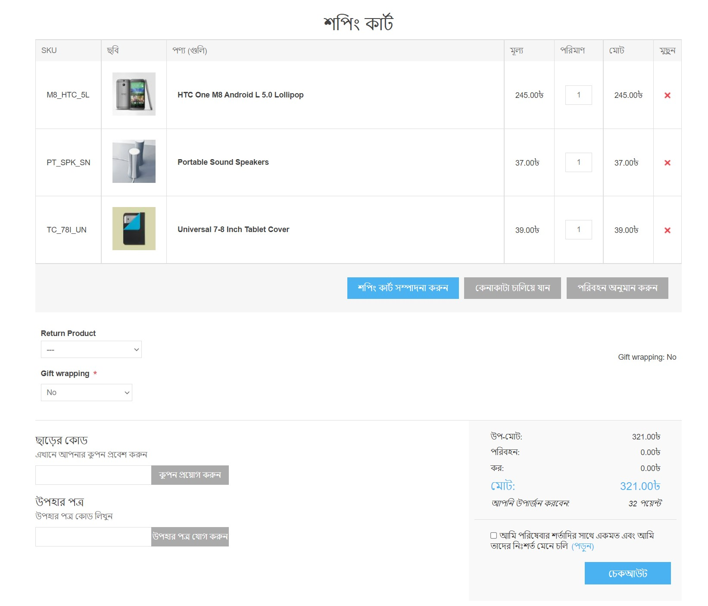
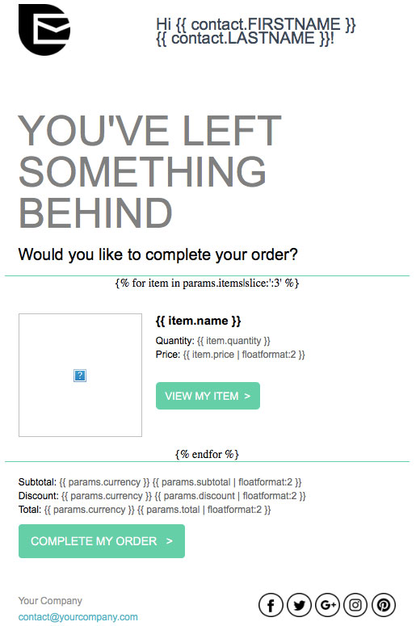

# পরিত্যক্ত কার্টগুলি পুনরুদ্ধার করুন

এই টিউটোরিয়ালে, আপনি শিখবেন কিভাবে পরিত্যক্ত কার্ট ইমেইল তৈরি করতে হয় এবং হারানো বিক্রয় পুনরুদ্ধারের জন্য কিভাবে ওয়ার্কফ্লো সেট আপ করতে হয়। আপনি কোন নপকমার্স-এ অর্ডার ডেটা সেন্ডিনব্লু প্ল্যাটফর্মের সাথে সামঞ্জস্যপূর্ণ তাও শিখবেন।

## শুরু করার আগে

আপনি নিম্নলিখিত প্রয়োজন হবে:
* সেন্ডিনব্লু অ্যাকাউন্টের শংসাপত্র। যদি আপনার না থাকে, [বিনামূল্যে সাইন আপ করুন](https://app.sendinblue.com/account/register/?utm_source=nopcommerce_plugin&utm_medium=plugin&utm_campaign=module_link)।
*নিশ্চিত করুন যে সেন্ডিনব্লু এর [নতুন টেমপ্লেট ল্যাঙ্গুয়েজ](https://help.sendinblue.com/hc/en-us/articles/360000659260?utm_source=nopcommerce_plugin&utm_medium=plugin&utm_campaign=module_link) চালু আছে।
* এই ধাপগুলি অনুসরণ করুন (xref: bn/running-your-store/promotional-tools/sendinblue-integration/set-up-sendinblue-plugin) সেন্ডিনব্লু প্লাগইন সেট আপ করতে।

## একটি পরিত্যক্ত কার্ট ইমেল টেমপ্লেট তৈরি করুন

প্রথমে আপনার সেন্ডিনব্লু অ্যাকাউন্টে লগ ইন করুন তারপর অটোমেশন প্ল্যাটফর্ম> [ইমেইল টেমপ্লেট](https://my.sendinblue.com/camp/lists/template?utm_source=nopcommerce_plugin&utm_medium=plugin&utm_campaign=module_link) এ যান। উপরের ডানদিকে **নতুন টেমপ্লেট** বাটনে ক্লিক করুন।

ইমেল টেমপ্লেটটি বিভিন্ন ধরণের ডেটা দিয়ে ব্যক্তিগতকৃত করা যেতে পারে:

* [আপনার সেন্ডিনব্লু তালিকায় সংরক্ষিত যোগাযোগের বৈশিষ্ট্য](#personalize-your-email-with-contact-attributes)
* [পরিত্যক্ত আইটেমের বিবরণ](#personalize-your-email-with-the-abandoned-items-details)
* [পরিত্যক্ত কার্ট বিবরণ](#personalize-your-email-with-the-abandoned-cart-details)

### যোগাযোগের বৈশিষ্ট্যগুলির সাথে আপনার ইমেল ব্যক্তিগতকৃত করুন

আসুন শুরু করি [যোগাযোগের বৈশিষ্ট্যগুলির সাথে ব্যক্তিগতকরণ](https://help.sendinblue.com/hc/en-us/articles/360001008200?utm_source=nopcommerce_plugin&utm_medium=plugin&utm_campaign=module_link)।

নীচের উদাহরণে, আমরা একটি ব্যক্তিগতকরণ অন্তর্ভুক্ত করেছি:

* {{contact.FIRSTNAME}} ব্যবহার করে প্রাপকের প্রথম নাম
* {{contact.LASTNAME}} ব্যবহার করে প্রাপকের শেষ নাম

> [!NOTE]
> প্রথম নাম এবং শেষ নাম আপনার সেন্ডিনব্লু অ্যাকাউন্টে বিদ্যমান বৈশিষ্ট্য থাকা উচিত।

এখন আসুন ইমেল টেমপ্লেটকে অর্ডার ভেরিয়েবলের সাথে ব্যক্তিগতকৃত করি যেমন পিছনে থাকা আইটেমগুলির নাম, তাদের ছবি, মূল্য ইত্যাদি করার জন্য, আমরা *নতুন টেমপ্লেট ভাষা* ব্যবহার করব [একটি গতিশীল তালিকা সন্নিবেশ করানোর জন্য](https://help.sendinblue.com/hc/en-us/articles/360000887379-Inserting-a-dynamic-list-in-the-Drag-Drop-editor-NEW-?utm_source=nopcommerce_plugin&utm_medium=plugin&utm_campaign=module_link) সাহায্য।

### পরিত্যক্ত আইটেমের বিবরণ সহ আপনার ইমেল ব্যক্তিগতকৃত করুন

আপনার সেন্ডিনব্লু টেমপ্লেট বিষয়বস্তুর মধ্যে একটি গতিশীল তালিকা থেকে নিম্নলিখিত ভেরিয়েবলগুলি সরাসরি অন্তর্ভুক্ত করা যেতে পারে:

| আইটেম তথ্য | আপনার টেমপ্লেটে এই স্থানধারকটি সন্নিবেশ করান |
| ------------- | ------------- |
| নাম | {{item.name}} |
| এসকেইউ | {{item.sku}} |
| বিভাগ | {{item.category}} |
| আইডি | {{item.id}} |
| আইটেম বৈচিত্রের আইডি | {{item.variant_id}} |
| আইটেমের ভিন্নতার নাম | {{item.variant_name}} |
| মূল্য | {{item.price}} |
| পরিমাণ | {{item.quantity}} |
| কেনা আইটেমের স্টোরফ্রন্ট লিঙ্ক | {{item.url}} |
| ছবি | {{item.image}} |

*ড্র্যাগ অ্যান্ড ড্রপ এডিটর* এ, আপনার পছন্দসই ব্লকটি নির্বাচন করুন যা পরিত্যক্ত আইটেমগুলি প্রদর্শন করবে।

১। ডিজাইন ব্লকের সেটিংস সম্পাদনা করতে **পেন্সিল আইকন** এ ক্লিক করুন।

২। **গতিশীল তালিকা** বিকল্পটি সক্ষম করুন।

৩। **প্যারামিটার** ফিল্ডে, 'আইটেমস' লিখুন।

৪। **পরিবর্তনশীল** ক্ষেত্রের মধ্যে, `আইটেম` লিখুন।

৫। প্রদর্শিত আইটেমের সংখ্যার সীমা নির্ধারণ করুন। উদাহরণস্বরূপ, যদি কার্টে 5 টি আইটেম অবশিষ্ট থাকে এবং আপনি ৩ টি সীমা হিসাবে সেট করেন তবে কেবল ৩ টি আইটেম ইমেইলে দেখানো হবে।

এখন আপনার ইমেইল টেমপ্লেটে ভেরিয়েবল যোগ করুন। উপরের উদাহরণে, আমরা যোগ করেছি:
* `{{item.name}}` - আইটেমের নাম
* `{{item.quantity}}` - - আইটেমের পরিমাণ
* `{{item.price | floatformat: 2}} ` - আইটেমের দাম

আইটেমের লিঙ্ক যোগ করতে, **কল-টু-অ্যাকশন (সিটিএ)** বাটন নির্বাচন করুন। ডান সাইডবারে, *লিঙ্ক* এর অধীনে, `{{item.url}} টাইপ করুন।

আইটেমের ছবি যোগ করতে, ছবিটি নির্বাচন করুন। ডান সাইডবারে, *ইমেজ সোর্স* এর অধীনে, *ইউআরএল থেকে* নির্বাচন করুন তারপর `{{item.image}} টাইপ করুন।

একবার আপনার নকশা সম্পন্ন হলে, সবুজ **সংরক্ষণ করুন এবং ছেড়ে যান** বোতামে ক্লিক করুন। তারপর **সংরক্ষণ করুন এবং সক্রিয় করুন** বাটনে ক্লিক করুন।

### পরিত্যক্ত কার্টের বিবরণ সহ আপনার ইমেল ব্যক্তিগতকৃত করুন

নিম্নোক্ত ভেরিয়েবলগুলি সরাসরি আপনার সেন্ডিনব্লু টেমপ্লেট বিষয়বস্তুর মধ্যে অন্তর্ভুক্ত করা যেতে পারে:

| কার্টের বিবরণ | এই স্থানধারক সন্নিবেশ করান |
| ------------- | ------------- |
| সম্বন্ধ | {{params.affiliation}} |
| মুদ্রা | {{params.currency}} |
| ছাড় | {{params.discount}} |
| শিপিং | {{params.shipping}} |
| উপ -মোট | {{params.subtotal}} |
| কর | {{params.tax}} |
| করের আগে মোট | {{params.tax}} |
| মোট | {{params.total_before_tax}} |
| কার্টের লিঙ্ক | {{params.url}} |

> [!NOTE]
> সেশনটি কোথা থেকে খোলা হয়েছে তার উপর ভিত্তি করে কার্ট পৃষ্ঠার লিঙ্কে প্রদর্শিত আইটেমগুলি ভিন্ন হবে। উদাহরণস্বরূপ, ধরা যাক একজন গ্রাহক তাদের ল্যাপটপ থেকে ব্রাউজ করছেন। যদি তারা তাদের ফোন থেকে পরিত্যক্ত কার্ট ইমেইলে ক্লিক করে, এটি তাদের পরিত্যক্ত কার্ট দেখাবে না।

*ড্র্যাগ অ্যান্ড ড্রপ এডিটর* এ, আপনার পছন্দসই ব্লকটি নির্বাচন করুন যা পরিত্যক্ত কার্টের তথ্য প্রদর্শন করবে তারপর আপনার পছন্দসই অর্ডার ভেরিয়েবল যোগ করুন।

আমরা [ভাসা বিন্যাস](https://help.sendinblue.com/hc/en-us/articles/360000268730?utm_source=nopcommerce_plugin&utm_medium=plugin&utm_campaign=module_link#numbers) ব্যবহার করে সংখ্যা বিন্যাস করার সুপারিশ করি। নীচের উদাহরণে, আমরা যোগ করেছি:

* {{params.currency}} ` - পরিত্যক্ত কার্টের মুদ্রা
* {{{params.subtotal | floatformat: 2}} ` - পরিত্যক্ত কার্টের উপ -মোট
* {{{params.discount | floatformat: 2}} ` - পরিত্যক্ত কার্টের ছাড়
* `{{params.total | floatformat: 2}} ` - পরিত্যক্ত কার্টের মোট

পরিত্যক্ত কার্টের লিঙ্ক যোগ করতে, **কল-টু-অ্যাকশন (সিটিএ)** বোতামটি নির্বাচন করুন। ডান সাইডবারে, *লিঙ্ক* এর অধীনে, `{{params.url}}` টাইপ করুন।

আপনার নকশা সম্পূর্ণ হলে, সবুজ **সংরক্ষণ করুন এবং ছেড়ে যান** বাটনে ক্লিক করুন। তারপর **সংরক্ষণ করুন এবং সক্রিয় করুন** বাটনে ক্লিক করুন।

## পরিত্যক্ত কার্ট ওয়ার্কফ্লো তৈরি করা

> [!NOTE]
> একটি গ্রাহককে তার ইমেইল ঠিকানা দ্বারা চিহ্নিত করতে হবে কর্মপ্রবাহকে ট্রিগার করার জন্য, যেমন একজন গ্রাহককে আপনার নপকমার্স দোকানে তাদের অ্যাকাউন্টে লগ ইন করতে হবে অথবা চেকআউটের সময় তাদের ইমেল ঠিকানা ইনপুট করতে হবে।

আপনার Sendinblue অ্যাকাউন্টের [অটোমেশন](https://automation.sendinblue.com/?utm_source=nopcommerce_plugin&utm_medium=plugin&utm_campaign=module_link) ট্যাবে যান।

**+একটি নতুন ওয়ার্কফ্লো তৈরি করুন** এ ক্লিক করুন, তারপর **বিস্তারিত পরিত্যক্ত কার্ট** নির্বাচন করুন এবং ধাপগুলো অনুসরণ করুন।

*একটি ইমেল পাঠান* ধাপে, ড্রপডাউন তালিকা থেকে আপনি যে ইমেল টেমপ্লেটটি তৈরি করেছেন এবং সক্রিয় করেছেন তা নির্বাচন করুন।

যখন আপনার ওয়ার্কফ্লো সম্পূর্ণ হয়, সেভ এবং অ্যাক্টিভেট করতে **সম্পন্ন** এ ক্লিক করুন।

ওয়ার্কফ্লো তৈরিতে আপনাকে সাহায্য করার জন্য নির্দ্বিধায় এই টিউটোরিয়ালগুলি পড়ুন:
* [পরিত্যক্ত কার্ট পুনরুদ্ধার: স্বয়ংক্রিয়ভাবে ইমেল পাঠান (ধাপ 3)](https://help.sendinblue.com/hc/en-us/articles/360002761299?utm_source=nopcommerce_plugin&utm_medium=plugin&utm_campaign=module_link)

## উদাহরণ

ধরা যাক যে গ্রাহক জিন ব্লু jean.blue@sendinblue.com আপনার দোকান পরিদর্শন করেছে কিন্তু নিচের ৩ টি আইটেম কার্টে রেখে গেছে।

আপনার টেমপ্লেটটি দেখতে এইরকম হবে:

জিন ব্লু কর্তৃক প্রাপ্ত ইমেলটি দেখতে এরকম হবে:

## আরো জানুন
* [অর্ডার কনফার্মেশন ইমেইল পাঠান](xref:bn/running-your-store/promotional-tools/sendinblue-integration/send-an-order-confirmation-email)